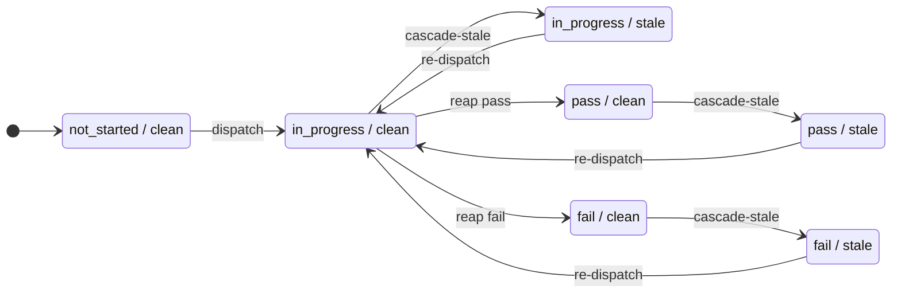
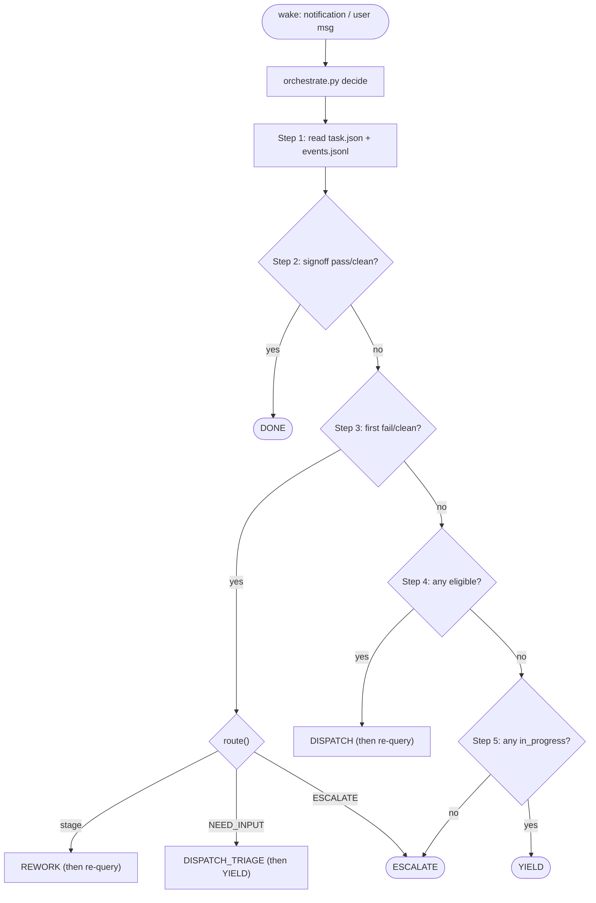
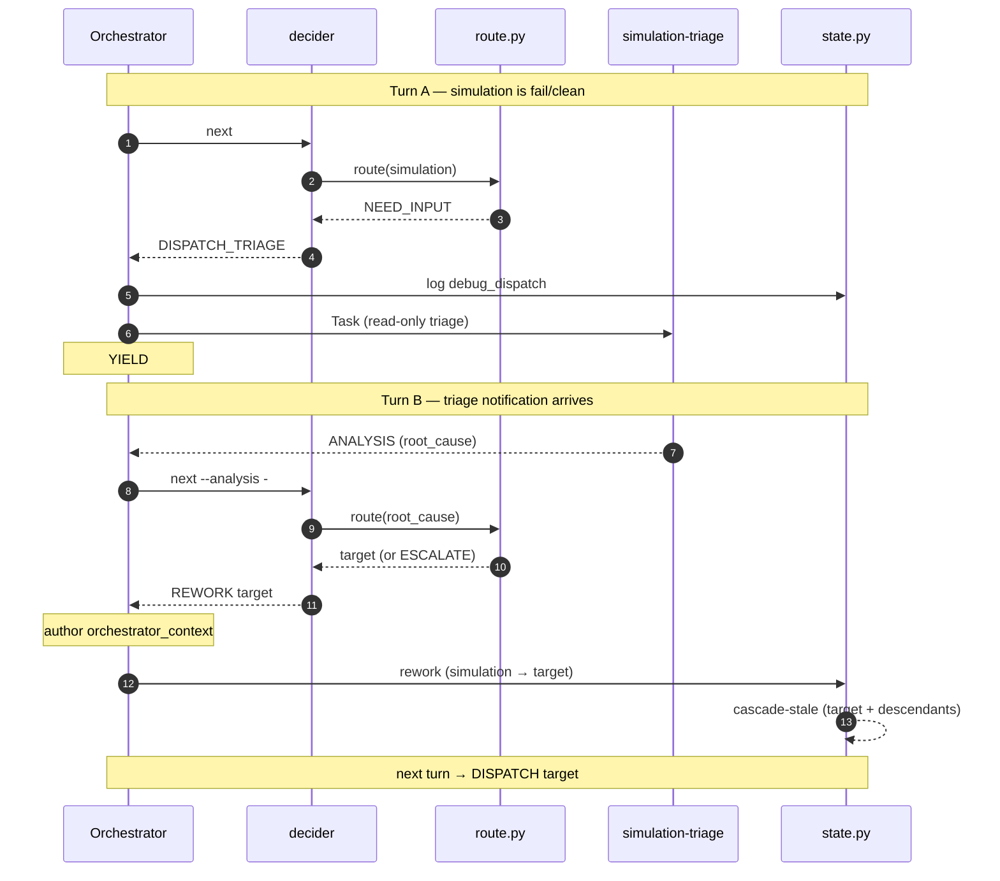

# VeriPower Architecture

> Design rationale and contracts for VeriPower's stage-gated, event-sourced agent pipeline.

---

## Contents

- [Glossary](#glossary)
- [1. Why VeriPower](#1-why-veripower)
- [2. System model](#2-system-model)
- [3. Pipeline DAG](#3-pipeline-dag)
- [4. State model](#4-state-model)
- [5. Orchestrator decision loop](#5-orchestrator-decision-loop)
- [6. Subagent contracts](#6-subagent-contracts)
- [7. Workspace layout](#7-workspace-layout)

---

## Glossary

Core coined terms, each defined once here and elaborated in the linked section. Localized contracts (per-stage `result.json` fields, CLI flags, the routing table) are not duplicated in this document — they live in their owning schema / `--help` / `route.py`.

| **Term** | **One-line meaning** |
|---|---|
| **Orchestrator** | The `design-flow` agent in the main conversation; the only role that calls `state.py`, dispatches `Task()`s, and talks to the user. (§2.3) |
| **decider** | `orchestrate.py decide` — reads on-disk state and returns exactly one action per call; the Orchestrator is its thin executor. (§5) |
| **main-thread-loaded** | A stage loaded via `Skill()` in the Orchestrator's own thread instead of via `Task()` — `specification`, `simulation-plan`, `rtl-design`, `simulation`. (§2.2) |
| **Level-1 sub-Task** | A `Task()` a main-thread skill dispatches for intra-stage fan-out. Level-2 (a sub-Task dispatching a further `Task()`) is forbidden — the audit boundary. (§2.2, §6.3.1) |
| **reap** | Closing an in-flight run with `state.py reap` (normally no `--outcome`), letting `cmd_reap` derive the outcome from the run's `result.json`. How every dispatch finishes and how a crashed run is repaired. (§5.1) |
| **promote** | The per-entry hardlink merge from `runs/<N>/` to the canonical stage dir, run by `cmd_reap` on pass *and* fail. Idempotent. (§7.2) |
| **cascade-stale** | BFS that sets every `pass`/`fail`/`in_progress` descendant of a just-passed or rework-targeted stage to `stale`. (§4.4) |
| **status × freshness** | A stage's two independent attributes: `status ∈ {not_started, in_progress, pass, fail}`, `freshness ∈ {clean, stale}`. (§4.2) |
| **in-flight / run** | `run` (= `current_run`) is the monotonically increasing dispatch number; `in_flight[]` lists runs not yet reaped. (§4.3) |
| **determinism boundary** | The split everything hangs off: judgment in the Orchestrator, state in `state.py`, deterministic computation in sibling scripts (`route.py`, `orchestrate.py`, `convergence`). (§2.4) |

---

## 1. Why VeriPower

VeriPower separates the deterministic state machine from the LLM Orchestrator: routing errors cannot corrupt completed work, because `state.py` never forgets. That separation is load-bearing, not incidental — every architectural decision in this document hangs off it.

Three commitments make it work; each is elaborated where it lives:

- **A deterministic core owns all state.** `state.py` owns stage state, prerequisite checks, cascade-stale, and event appends; the Orchestrator owns only judgment (rework, escalation, context-authoring), and the deterministic computations it acts on live in sibling scripts it executes — the *determinism boundary* (§2.4).
- **Concurrency falls out of topology.** Each stage carries `status × freshness`, and DAG prerequisites drive cascade-stale; the `distinct in-flight ≤ 2` cap emerges from the DAG, not from policy (§3.2).
- **The event log is tamper-evident.** `events.jsonl` is the audit truth and `task.json` a rebuildable projection; the Orchestrator may author only 2 of the 7 event types, so every AI routing decision is on the record (§4.5).

VeriPower is not a service: no daemon, no DB, no HTTP — disk files are the database. It is not vendor-locked: skills are swappable at the `SKILL_OF` dispatch seam. It is not a one-shot agent: the flow tolerates multi-hour rework storms where stages fail, cascade-stale dependents, and retry across Orchestrator passes.

## 2. System model

### 2.1 Three-layer architecture

The Orchestrator agent decides; `state.py` and skills execute; disk persists.

```
┌────────────────────────────────────────────────────────────────────────────────────┐
│             Orchestrator Agent  ( veripower:design-flow )                          │
│  main conversation; forward dispatch / rework routing / convergence /              │
│  escalation / user collaboration                                                   │
└──┬───────────────────────────┬────────────────────────────────┬────────────────────┘
   │ Bash                      │ Skill()                        │ Task()
   │ state.py + route.py CLI   │ veripower:specification        │ general-purpose
   │                           │ veripower:simulation-plan      │ (the 5 Task stages)
   │                           │ veripower:rtl-design           │
   │                           │ veripower:simulation           │
   │                           │ (main-thread loaded)           │
   ▼                           ▼                                ▼
┌────────────────────┐  ┌──────────────────────────────┐  ┌──────────────────────────┐
│ Deterministic core │  │  Main-thread skill           │  │  Stage / Debug Subagent  │
│ (Python)           │  │  (runs in Orchestrator's     │  │  (isolated context)      │
│                    │  │   main thread)               │  │                          │
│ state.py:          │  │                              │  │  Stage: executes stage   │
│   state + 8 cmds   │  │  specification:              │  │    → writes result.json  │
│ orchestrate.py:    │  │    fan-out → design.md       │  │  Debug: read-only triage │
│  decide → action   │  │    design.md / manifest.json │  │    → returns ANALYSIS    │
│ route.py:          │  │    SDC / SGDC / result.json  │  │                          │
│   rework target    │  │  simulation-plan:            │  │  Must NOT call state.py  │
│                    │  │    plan generation +         │  │  or make routing calls   │
│                    │  │    review loop               │  │  (see §6.1 for full)     │
│                    │  │  rtl-design:                 │  │                          │
│                    │  │    per-child RTL fan-out     │  │                          │
│                    │  │  simulation:                 │  │                          │
│                    │  │    env → smoke gate → verify │  │                          │
└──────────┬─────────┘  └──────────────────────────────┘  └──────────────────────────┘
           │ reads/writes
           ▼
┌────────────────────────────────────────────────────────────────────────────────────┐
│                              asic/<module>/                                        │
│                                                                                    │
│   task.json                          stage state snapshot                          │
│   events.jsonl                       append-only event log                         │
│   Design/<stage>/result.json         specification / rtl-design / lint-cdc /       │
│                                      synthesis / timing-analysis                   │
│   Verification/<stage>/result.json   simulation-plan / simulation /                │
│                                      power-analysis                                │
│   frontend-signoff/result.json       frontend-signoff stage output                 │
└────────────────────────────────────────────────────────────────────────────────────┘
```

The three dispatch paths from the Orchestrator:

- **Bash** → `state.py` CLI (8 commands: `init`, `status`, `dispatch`, `reap`, `rework`, `invalidate-stage`, `convergence`, `log`), `orchestrate.py decide` (returns one action per call; see §5), the `topology.py` DAG SSoT (`PREREQ_OF`, `eligible()`), and the `route.py` rework-router (pure target selection; composed inside `orchestrate.py`; see §5.4)
- **Skill()** → main-thread skills (`specification`, `simulation-plan`, `rtl-design`, and `simulation`)
- **Task()** → stage subagents and the debug subagent

### 2.2 Main-thread-loaded stages

`veripower:specification`, `veripower:simulation-plan`, `veripower:rtl-design`, and `veripower:simulation` are the only four stages NOT dispatched via `Task()` — all four load in the Orchestrator's main thread via `Skill()`. A `Task()` subagent can neither interact with the user mid-run nor dispatch further `Task()`s, and each of these four needs one of those two capabilities.

> **Contract:** A `Task()` subagent may not dispatch another `Task()` — Level-2 dispatch is forbidden (the audit boundary). A stage that must fan out Level-1 sub-Tasks therefore cannot run as a Task subagent; main-thread loading is the *only* way to hold fan-out dispatch authority while preserving that boundary. `specification` / `rtl-design` / `simulation` are main-thread for fan-out authority; `simulation-plan` is main-thread for multi-turn user dialogue, plus a single Level-1 plan-adequacy review dispatch (Step 4).

The per-stage trigger:

- **specification** — consumes a frozen, approved `brainstorm.md`; a fan-out dispatcher (decompose + per-child sub-Task waves around a partition gate) plus three main-thread gate scripts: `derive_child_ports.py` (pre-gate, feeds the partition-gate summary; no body read), `check_coverage.py` (pre-gate, verdict feeds the design.md approval gate), `derive_constraints.py` (post-gate, derives the complete SDC/SGDC from the approved §1.6 + §1.4.1 tables). NOT main-thread for brainstorm dialogue — that moved to the pre-pipeline `brainstorm` skill.
- **simulation-plan** — multi-turn plan-review dialogue with the user; it also self-dispatches a single Level-1 plan-adequacy review sub-Task (Step 4 / §6.3.1).
- **rtl-design** — fan-out only, no dialogue: one Level-1 sub-Task per child (`N = len(manifest.children[])`, including the top-integration child; no N==1 exemption), then a finalize sub-Task.
- **simulation** — fan-out only, no dialogue: two sequential sub-Task waves sharing one stage `{workdir}` — an `env-child` (bootstrap + fill scaffold + compile + smoke) → a deterministic main-thread smoke gate → a `verify-child` (regress + coverage). Shape closest to `specification`'s two-wave-around-a-gate; dispatch class identical to `rtl-design`'s.

For these four stages the Orchestrator still calls `state.py dispatch/reap/log` and reads canonical `result.json` for failure routing (§5.4, not reap — reap reads nothing; §5.1); only the stage-level `Task()` is absent from its tool history.

> **Red Flag:** If `Skill(veripower:lint-cdc|synthesis|timing-analysis|power-analysis|frontend-signoff)` appears in the Orchestrator's tool history, it is a bug — those five stages must dispatch via `Task()`.

**Pre-pipeline `brainstorm` skill (not orchestrator-dispatched).** The heavy D0–D7 requirements dialogue runs in a separate `brainstorm` skill in its own session — it is NOT one of the four main-thread stages above and is never dispatched by the Orchestrator. It produces the approved `asic/<module>/brainstorm.md` (module root) that the pipeline starts from; it writes no `result.json` and calls no `state.py`. See §3 for the DAG entry precondition.

### 2.3 Role responsibilities

| **Role** | **Carrier** | **Responsibilities** | **Capability boundaries** |
|---|---|---|---|
| **Orchestrator agent** | `design-flow` skill, main conversation | Forward dispatch, rework routing (acting on `route.py`'s target selection), convergence judgment, escalation, user collaboration; also acts as the main-thread executor for `specification` / `simulation-plan` / `rtl-design` / `simulation` stages | The only role that may call `state.py`, use the Task tool, and interact with the user |
| **Main-thread skill** | `veripower:specification`, `veripower:simulation-plan`, `veripower:rtl-design`, or `veripower:simulation`, loaded via Orchestrator's `Skill()` call | Self-driven work in the Orchestrator's thread: `specification` runs two sub-Task waves (decompose + per-child) plus main-thread scripts and two path-handoff gates (no D0–D7 dialogue — that moved to the pre-pipeline `brainstorm` skill); `simulation-plan` runs the multi-turn plan-review dialogue; `rtl-design` runs no dialogue but holds Level-1 fan-out dispatch authority (§2.2); `simulation` likewise runs no dialogue and holds Level-1 fan-out dispatch authority — two sequential sub-Task waves (env-build → smoke gate → verify, §2.2). Each writes its own artifacts + `result.json`. | `simulation-plan` may interact with the user across turns; `specification` additionally interacts at its two path-handoff gates; `specification` / `rtl-design` / `simulation` may dispatch Level-1 sub-Tasks; `simulation-plan` may dispatch a single Level-1 review sub-Task (§6.3.1). Other boundaries same as Stage subagent (no `state.py`, no routing). Contract held by SKILL.md prose discipline, not tool gating. |
| **Stage subagent** | The five Task-dispatched stage skills (`lint-cdc` / `synthesis` / `timing-analysis` / `power-analysis` / `frontend-signoff`), dispatched via Task tool | Execute one stage: read upstream → do the work → write `result.json` → return STATUS line | Must NOT call `state.py` or make routing decisions (full 5-item list in §6.1) |
| **Debug subagent** | `simulation-triage` skill, dispatched via Task tool | Read-only root-cause analysis on simulation failures; returns a two-tier ANALYSIS (a routing JSON block — `root_cause`/`analysis_state` — plus a prose analysis section) | Modifies no state — never edits `task.json`, `result.json`, RTL, or tests |
| **`state.py`** | Python CLI | State transitions, prerequisite validation, cascade-stale propagation, event-log appends, context collection; best-effort async subagent transcript mirroring (telemetry side-effect on `cmd_reap`, see §6.6) | Contains no routing logic and makes no judgments |
| **`route.py`** | Python CLI (sibling of `state.py`) | Pure deterministic rework-target selection — maps a failure's closed-enum fields to a target / `ESCALATE` / `NEED_INPUT` | Holds no state; inputs are CLI scalar flags (`--guideline`, `--by-target-rtl`, and on the simulation path `--root-cause`/`--analysis-state`) plus an optionally passed `result.json`. The Orchestrator reads its JSON output and acts on `decision`. Makes no state transitions. |

### 2.4 Core design principles

- **Judgment in the Orchestrator, state in Python, deterministic computation in sibling scripts** — the *determinism boundary*. The Orchestrator makes the judgment calls (escalation, rework-context); `state.py` maintains the state facts; deterministic decision-support that is neither — convergence counting (`cmd_convergence`), rework-target selection (`route.py`), and the full control-loop decision (`orchestrate.py decide`) — lives in scripts the Orchestrator executes. No mixing across the three. The *enforceable* capability boundary (who may call `state.py` / `Task()` / the user) is the §2.3 role table.
- **Decision boundary = tool boundary.** Every Orchestrator decision is pushed down to `orchestrate.py decide`; the Orchestrator is a thin executor that does nothing between `state.py` calls except invoke the decider. Its verifiable loop form — *two consecutive `state.py` calls with no decider call between them is a bug* — lives in §5.5.
- **Files are the database.** `task.json` is the snapshot, `events.jsonl` is the audit log, `result.json` files are stage outputs. No intermediate cache, no service-side store.
- **Compaction-safe resume.** Because files are the database, a mid-session context compaction (or a process crash) is survivable: the Orchestrator and every subagent resume losslessly from disk alone, with no load-bearing information held only in the conversation. Durable truth is on disk — `task.json`, `events.jsonl`, `result.json` per stage. The Orchestrator holds **zero durable control state** between turns — every turn re-derives the next action from disk via `orchestrate.py decide`. The only conversation-resident state is the `orchestrator_context` hint authored at a `REWORK` and consumed at the target's `DISPATCH` within the same turn — **re-derivable, not durable** (and once passed to `cmd_dispatch` it is disk-backed as `orchestrator-context.md`); see §5.
- **One-way communication.** Orchestrator → prompt → subagent → `result.json` + STATUS. No subagent-initiated callback into the Orchestrator; no subagent-to-subagent communication.
- **Context isolation.** Subagents receive a fresh prompt; they inherit no history from the parent session. All required inputs are passed explicitly via file paths or prompt fields.

## 3. Pipeline DAG

VeriPower's frontend pipeline has 9 fixed stages connected by a DAG of prerequisites; rework propagates via cascade-stale.

```
[specification] → [simulation-plan] → [rtl-design]
                                            │
                          ┌─────────────────┴──────────────────┐
                          ↓                                    ↓
                     [lint-cdc]                          [simulation]
                          │                                    │
                          ↓                                    │
                     [synthesis]                               │
                          │                                    │
                          ↓                                    │
                  [timing-analysis]                            │
                          │                                    │
                          └─────────────────┬──────────────────┘
                                            ↓
                                    [power-analysis]
                                            │
                                            ↓
                                    [frontend-signoff]
```

**DAG entry precondition.** The flow starts from an approved module-root `brainstorm.md` (`asic/<module>/brainstorm.md`), produced by the pre-pipeline `brainstorm` skill (§2.2). It is a pre-pipeline input, NOT a DAG stage — `specification`'s prerequisite column stays `—` and `topology.py`'s `PREREQ_OF` is unchanged at 9 stages.

### 3.1 Canonical DAG table

| **Stage** | **Prerequisite(s)** | **Skill** | **Typical artifact location** |
|---|---|---|---|
| specification | — | `veripower:specification` (main-thread) | `Design/specification/` (design.md / manifest.json / coverage.json / `<child>`.md / constraints/`<TOP>`.{sdc,sgdc}) |
| simulation-plan | specification | `veripower:simulation-plan` (main-thread) | `Verification/simulation-plan/` (verification-plan.md / scaffold-specification.json) |
| rtl-design | simulation-plan | `veripower:rtl-design` (main-thread) | `Design/rtl-design/` (*.v / *.sv / filelist) |
| lint-cdc | rtl-design | `veripower:lint-cdc` | `Design/lint-cdc/` (SpyGlass reports) |
| synthesis | lint-cdc | `veripower:synthesis` | `Design/synthesis/` (netlist, *.ddc, reports) |
| timing-analysis | synthesis | `veripower:timing-analysis` | `Design/timing-analysis/` (slack, constraint reports) |
| simulation | rtl-design | `veripower:simulation` (main-thread) | `Verification/simulation/` (UVM env / regression reports / logs) |
| power-analysis | timing-analysis + simulation | `veripower:power-analysis` | `Verification/power-analysis/` (GLS simv / saif/`<id>`.saif / scaffold/power_tests/ / averaged power reports) |
| frontend-signoff | power-analysis | `veripower:frontend-signoff` | `frontend-signoff/` (checklist, traceability reports) |

Forward dispatch follows the priority order `specification → simulation-plan → rtl-design → lint-cdc → synthesis → timing-analysis → simulation → power-analysis → frontend-signoff` (matches `topology.py`'s `FORWARD_PRIORITY`). Rework legality: `target_stage` must be a DAG ancestor of `failed_stage` — enforced by `state.py`'s `cmd_rework`.

`frontend-signoff`'s prereq column reads `power-analysis` alone — lint-cdc is *not* listed explicitly because it blocks signoff transitively via `lint-cdc → synthesis → timing-analysis → power-analysis`. The DAG enforces the blocking structurally; the prereq table avoids redundant edges.

### 3.2 Three-phase form

| **Phase** | **Stages** | **Main-thread vs Task** | **Concurrency cap** |
|---|---|---|---|
| 1 (serial) | specification → simulation-plan → rtl-design | all three are main-thread; `rtl-design` always dispatches `N = len(manifest.children[])` Level-1 sub-Tasks via `Task()` (one per child incl. the top-integration child), then a finalize sub-Task | distinct in-flight ≤ 1 |
| 2 (dual-chain parallel) | `{lint-cdc → synthesis → timing-analysis}` ‖ `{simulation}` | chain 1 is Task subagents; `simulation` is a main-thread sub-orchestrator dispatching its own intra-stage sub-Tasks (env-build → smoke gate → verify) | distinct in-flight ≤ 2 |
| 3 (merge) | power-analysis → frontend-signoff | all Task subagents | 1 |

**Fan-out sub-Tasks are intra-stage and state.py-invisible.** When `specification`, `simulation-plan`, `rtl-design`, or `simulation` dispatches Level-1 sub-Tasks (per-child work for the producers; the plan-adequacy reviewer for `simulation-plan`; env-build / verify waves for `simulation`), those sub-Tasks run inside the main-thread skill's own execution window; they do not write `task.json`, do not append events, and do not appear in `state.py`'s in-flight bookkeeping. They therefore **do not count against** the `distinct in-flight ≤ 2` DAG-topology property — that property applies only to stage-level dispatches tracked by `state.py`. See §6.3 for the dispatch privilege carve-out.

**`distinct in-flight ≤ 2` is determined by DAG topology, not policy.** Phase 2 has two chains (`{lint-cdc → synthesis → timing-analysis}` and `{simulation}`); each chain is internally serial. Worst case: any one of `{lint-cdc, synthesis, timing-analysis}` is in-flight on chain 1 while `simulation` is in-flight on chain 2 — distinct *stages* = 2. `simulation` occupies a single stage slot on chain 2 regardless of how many intra-stage sub-Tasks it has in flight (those are state.py-invisible, per the paragraph above), so promoting it to a main-thread sub-orchestrator does not change this bound. Phase 3 is a single serial chain: power-analysis requires both timing-analysis and simulation to be complete before it becomes eligible; frontend-signoff waits for power-analysis to pass; distinct = 1. Same-stage multi-run shares a single distinct-stage slot (only `simulation` realistically does this); the physical Task count may briefly exceed 2 but the distinct-stage count stays ≤ 2.

> **Contract:** The Orchestrator writes no concurrency cap. `distinct in-flight ≤ 2` is guaranteed by DAG topology, not enforced by policy. This section is its home — the mentions in §1 and §5.2 refer here.

### 3.3 Forward dispatch and rework

**Forward dispatch.** Priority order matches `state.py`'s `FORWARD_PRIORITY`. Each turn, the Orchestrator dispatches all eligible stages (implicit parallelism). `eligible(stage)` requires: all prereqs are `pass/clean`; the stage itself is NOT in `in_progress/clean`, `pass/clean`, or `fail/clean` (i.e., `not_started/clean`, `*/stale`, and `in_progress/stale` are all re-dispatchable — the last legalizes same-stage multi-run under cascade hits).

**Rework.** Not bounded by DAG order — the Orchestrator may rework to any ancestor stage based on failure semantics. The single constraint: `target_stage` must be a DAG ancestor of `failed_stage` (enforced by `state.py`). A rework sets `target_stage` to `stale` and cascades all descendants' `pass / fail / in_progress` states to `stale`; `in_progress` runs are NOT killed — they finish naturally and are discarded by `cmd_reap`.

Typical rework closures:

- **simulation failure** → `simulation-triage` debug subagent → rework to `rtl-design` / `specification` / `simulation-plan`.
- **PPA failure**: synthesis judges area/timing_slack; power-analysis judges power_mw; timing-analysis judges setup/hold. Any of these fails → the decider routes it (convergence-based, via `route.py`; see §5), returning `REWORK`/`ESCALATE` for the Orchestrator to execute. For power-analysis tooling failures (GLS errors, SAIF missing), the subagent writes `failures[].{phase, category, error_summary}`; `route.py` maps `category` to the upstream DAG target (see §5.4 and `framework/scripts/route.py`).

## 4. State model

### 4.1 Persisted files

All state lives under `asic/<module>/`:

| **File** | **Role** | **Writer** |
|---|---|---|
| `task.json` | Stage state snapshot (status × freshness) | `state.py` |
| `events.jsonl` | Append-only event log | `state.py` |
| `asic/<module>/brainstorm.md` | Brainstorm finalization (single upstream for design.md; pipeline input) | Pre-pipeline `brainstorm` skill (own session) |
| `Design/specification/result.json` | specification stage output (includes design.md / SDC / SGDC refs) | Orchestrator main thread (specification skill) |
| `Design/rtl-design/result.json` | rtl-design stage output | Orchestrator main thread (rtl-design skill) |
| `Design/<stage>/result.json` | Stage output (lint-cdc / synthesis / timing-analysis) | Stage subagent |
| `Verification/simulation-plan/result.json` | simulation-plan stage output | Orchestrator main thread (simulation-plan skill) |
| `Verification/simulation/result.json` | simulation stage output | Orchestrator main thread (simulation skill) |
| `Verification/power-analysis/result.json` | power-analysis stage output (merged GLS + PT-PX) | Stage subagent |
| `frontend-signoff/result.json` | frontend-signoff stage output | Stage subagent |

### 4.2 Stage state: two-dimensional

Each stage carries two independent attributes — `status ∈ {not_started, in_progress, pass, fail}` and `freshness ∈ {clean, stale}`. The legal combinations:

| **status/freshness** | **Meaning** |
|---|---|
| `not_started/clean` | Not yet run |
| `in_progress/clean` | Currently executing (its prereqs are still `pass/clean`) |
| `in_progress/stale` | Still running, but its prereqs have been rework-modified — when this run completes, `cmd_reap` routes it through the discard branch; eligibility allows re-dispatch (same-stage multi-run, physically isolated by `current_run`) |
| `pass/clean` | Passed and inputs unchanged |
| `pass/stale` | Previously passed, but an upstream change makes it require re-run |
| `fail/clean` | Failed, awaiting rework decision |
| `fail/stale` | Failed before and upstream changed (continuing to fail is meaningless; should restart from an eligible upstream); or a `_non_success_finalize` derivative state when canonical holds fail |

`in_progress/stale` is the inevitable consequence of cascade-stale hitting a running stage during dual-chain parallel execution — rework does NOT block, kill Tasks, or wait for exit.

**Stage lifecycle.** The combinations above move through these transitions:



Edge labels are the trigger only; conditions live in the prose. A stale state re-dispatches once its prereqs are `pass/clean` again; `cascade-stale` fires when an upstream stage re-passes or a rework targets this stage or an ancestor; `in_progress/stale`'s original run is discarded (not promoted) at reap. Non-success reaps (`blocked` / `invalid` / `discarded`) clear the run without a terminal status (§5.1) and are omitted above. The `in_progress/clean → in_progress/stale → re-dispatch` path is what makes dual-chain rework non-blocking (§4.4).

### 4.3 task.json per-stage fields

Beyond `status` and `freshness`, each stage carries:

| **Field** | **Type** | **Meaning** |
|---|---|---|
| `current_run` | `int \| null` | Monotonically increasing run number; incremented on each `dispatch`. `null` if never started. |
| `in_flight` | `array` | Currently-uncompleted dispatch list, elements `{run: int}`. Same-stage multi-run coexists here (only `simulation` realistically does this). |

### 4.4 Cascade-stale propagation

When a stage transitions to `pass`, or is rework-targeted (set to `stale`), `state.py` BFS-walks its descendants and sets every `pass / fail / in_progress` descendant to `stale` (`not_started` descendants are untouched). `in_progress` becoming `stale` is what makes dual-chain parallel rework non-blocking — running downstream gets legitimized as `in_progress/stale`, its original run will be auto-discarded by `cmd_reap`.

### 4.5 Event types

`events.jsonl` has **7 event types**, each validated by its own JSON Schema at `framework/references/schemas/events/<type>.schema.json`; `append_event` validates at write time.

| **type** | **Writer** | **Trigger** | **Key body fields** |
|---|---|---|---|
| `dispatch` | `state.py` (auto) | `dispatch` command | `stage`, `mode ∈ {forward, rework}`, `run`, `workdir` |
| `outcome` | `state.py` (auto) | `reap` command | `stage`, `run`, `result_status`, `reason?` |
| `cascade` | `state.py` (auto) | `reap` / `rework` trigger cascade | `source_stage`, `staled[]` |
| `rework_decision` | `state.py` (auto) | `rework` command | `failed_stage`, `target_stage`, `reason`, `run` (failed_stage's current_run, mandatory) |
| `invalidate` | `state.py` (auto) | `invalidate-stage` command | `stage`, `reason` |
| `debug_dispatch` | Orchestrator (`log`) | dispatching `simulation-triage` | `module`, `failure_phase?` |
| `escalation` | Orchestrator (`log`) | Orchestrator gives up | `reason_code`, `reason` |

`outcome.result_status` is a **6-value enum**. `pass` / `fail` / `blocked` are resolved at reap by `cmd_reap` from the run's `result.json` (or forced via an explicit `reap --outcome`); `invalid` (schema-failing `result.json`), `discarded` (runs superseded by rework or cascade-stale), and `promote_failed` (canonical hardlink merge fails) are always internally derived by `state.py`. The `discarded` sub-cases and their `reason_code` text format are a `state.py` implementation detail — the projection (§4.6) treats all four sub-cases identically. All events carry UTC ISO8601 timestamps.

`cmd_log` whitelist: the Orchestrator may write only **2 of the 7 event types** via `cmd_log` — `debug_dispatch`, `escalation`. The other 5 (`dispatch`, `outcome`, `cascade`, `rework_decision`, `invalidate`) are produced as side-effects of `state.py` state transitions and are **rejected** if injected externally via `cmd_log`. This prevents the audit log from being forged through agent prompts.

**Naming invariant.** An orchestration operation carries one root across its `state.py` command and the decider's action — `dispatch`/`DISPATCH`, `reap`/`REAP`, `rework`/`REWORK`. Events are named for what they record, so an event root may legitimately differ from the command that emits it (the `reap` command writes the `outcome` event). The rule is: one operation → one command-and-action word, never a prose-only synonym bridging a command to a differently-named concept (the failure mode the `next`→`decide` rename retired).

### 4.6 Write-order invariant

All `state.py` state-mutating commands (`cmd_init`, `cmd_dispatch`, `cmd_reap`, `cmd_rework`) follow a 3-phase pattern:

1. **Validate + compute** (in-memory edits on a task copy, including pure-functional `_compute_cascade()` for the staled list; no disk writes).
2. **Event-first**: one or more `append_event(...)` calls.
3. **State-after**: a single `write_task(module, task_final)` to persist.

**Why this order:** `events.jsonl` is the audit truth. If a crash occurs between step 2 and step 3, the events already record the full intent, and `task.json` can be reconstructed from them (the projection contract below). The reverse order does not work — `write_task` before `append_event` would leave a state-events mismatch on crash.

**The projection contract.** `task.json` is the *projection* of `events.jsonl` — a pure function of the event log that reads only events, never `task.json`, which is what makes "events are truth" verifiable rather than a slogan. On the forward path it is exact: a `dispatch` sets the stage `in_progress/clean` and records the run; an `outcome` sets `pass`/`fail` and clears the run; a `cascade` stales `pass`/`fail`/`in_progress` descendants; `rework_decision` carries no state of its own (its effect lands via the following `cascade`). The non-success terminal states (`blocked`/`invalid`/`discarded`/`promote_failed`) are *not* reproducible from events alone — their finalization is `state.py` behavior, and an operator reconciling a crashed `task.json` derives those from canonical. So the projection is an exact inverse for clean histories and a recovery starting point otherwise — a reference definition, not shipped code.

**Promote sits between validation and the success-path compute.** `cmd_reap` validates first (in-flight check, schema, prereq freshness, self-freshness) on every path. Non-success outcomes (`blocked`, `invalid`, `prereq_changed`, `stage_staled_during_run`) then diverge into `_non_success_finalize`, which runs its own compute-events-state and exits — promote is never called on these paths. Only `pass` and `fail` outcomes continue past validation; they call `promote()` (per-entry hardlink merge from `runs/<N>/` to canonical), then run the compute-events-state sequence. This disk write before the event is intentional — the promote outcome (success vs `promote_failed`) determines which compute branch runs at all. Crash recovery still holds because promote is idempotent (§7.2): that idempotency is what lets event-first / state-after survive a crash that interrupts promote.

### 4.7 Schema validation invariant

Each `result.json` validates against `framework/references/schemas/envelope.schema.json` (cross-stage envelope: `stage` / `module` / `produced_at` / `status` / `artifacts` / `stage_specific`) plus a per-stage schema at `skills/<stage>/references/result.schema.json`. Each event validates against `framework/references/schemas/events/<type>.schema.json` (7 schemas, one per type). Validation runs at `cmd_reap` (for `result.json`) and `append_event` (for every event); per-field semantics live in each schema's `description` strings.

## 5. Orchestrator decision loop

The Orchestrator is structured as 1 setup block plus a thin executor loop driven by `orchestrate.py decide`. Control flow follows a turn discipline: each user message or task-notification triggers exactly one turn, ending with `YIELD`, `DONE`, or `ESCALATE`. The Claude Code harness re-enters the loop when the next notification arrives.

Persistent state lives on disk (`task.json`, `events.jsonl`, `result.json` per stage); the loop is therefore **compaction-safe** (§2.4). What that requires of the loop specifically: every field rendered into a subagent prompt originates from `state.py`'s on-disk artifacts (the *disk-sourced payload* commitment; per-field detail in §5.3), so conversation-history state reaches a subagent only through the disk-backed `--orchestrator-context` channel at `cmd_dispatch`. The only transient planning state is the read-only `simulation-triage` `ANALYSIS` and the dispatch context composed from it — held in conversation until injected at the next `cmd_dispatch`, then persisted as `orchestrator-context.md`. Both are re-derivable: if a compaction discards them mid-failure, the next turn calls `orchestrate.py decide`, finds the stage still `fail/clean`, and re-dispatches the read-only, idempotent `simulation-triage` before re-composing the context. The durable routing outcome (the `rework_decision` target+reason, or the escalation reason) is already on disk once decided, so at worst a compaction repeats one triage, never loses a decision. A subagent compacted or crashed mid-run is likewise stage-granular-lossless: its missing or half-written `result.json` is caught at reap (§5.1) and the stage re-runs from its on-disk inputs.

### 5.1 Setup and reap

Reap runs in two regimes:

- **Session-start reap (once per session).** When the Orchestrator first attaches to a module, it runs (1) `state.py init --module <M>` (idempotent — creates `asic/<M>/task.json` if missing), (2) `state.py status --module <M>` to obtain the current stage snapshot, (3) reap for every stage in `task.json`'s `in_flight[]` list (described below). This is the crash-recovery regime: if the Orchestrator died mid-turn, any `outcome` event left unwritten is repaired now before new dispatch.
- **Wake-turn reap (every notification).** When a backgrounded `Task()` writes its STATUS line, the Claude Code harness injects a `<task-notification>`. The Orchestrator runs reap for the (stage, run) bound to that notification before re-entering the main loop. This is the steady-state regime — every dispatched run completes through a wake-turn reap.

**Reap mechanics** (both regimes): for each `in_flight` `(stage, run)`, the Orchestrator normally calls `state.py reap --stage <S> --run <N>` with NO `--outcome` — it does not read `result.json`. `cmd_reap` reads the run's own `result.json` and derives the outcome: well-formed `status ∈ {pass,fail}` → that outcome; missing / unparseable / non-object / malformed `status` → `blocked`; present but schema-invalid → `invalid` (§4.7). The sole exception: a run the Orchestrator itself detects as cascade-stale, which it completes with an explicit `--outcome blocked` (the Step 5 stale branch in `skills/design-flow/SKILL.md`).

### 5.2 Executor loop (per turn)

The Orchestrator calls `orchestrate.py decide --module <M> [--wake <stage>:<run>] [--analysis -]` and executes exactly the one action it returns, looping until the action is `YIELD`, `DONE`, or `ESCALATE`. The decider encodes the following decision steps; the prose below remains the authoritative contract.



The leaf actions encode what follows: `REWORK` and `DISPATCH` re-query `decide` (the re-query loop — several failures or dispatches resolve in one turn); `DISPATCH_TRIAGE` ends the turn at `YIELD`. The prose steps below are the authoritative contract for each box.

**Step 1: Read state.** The decider reads `task.json` + `events.jsonl` in-process (`read_task` / `read_events`, plus the relevant `result.json` and any piped `--analysis` payload) — it does not shell out to `state.py status`. The resulting snapshot is the single source of truth for all decisions in this call.

**Step 2: Terminate if done.** If `frontend-signoff` has `status=pass` and `freshness=clean` → return `DONE`.

**Step 3: Handle first failure.** Scan stages by `FORWARD_PRIORITY`. Find the first stage with `status=fail` and `freshness=clean`. If any exists, route it through `route.py` (composing convergence + result inputs) and return the appropriate action (`REWORK`, `DISPATCH_TRIAGE`, or `ESCALATE`). Invariant: **one failure per decider (`decide`) call; several may resolve in one turn via the re-query loop** — when the rework target is a common ancestor of multiple `fail/clean` stages, cascade turns them `fail/stale` on the first REWORK, so subsequent re-queries see no further failures.

**Step 4: Forward dispatch.** For each stage that is `eligible(stage)` by `FORWARD_PRIORITY` order, return `DISPATCH`. `eligible` requires: all DAG prerequisites are `pass/clean`; the stage itself is not `in_progress/clean`, `pass/clean`, or `fail/clean`. Invariant: distinct in-flight stages ≤ 2 emerges from DAG topology (see §3.2) — the Orchestrator writes no explicit cap.

**Step 5: Yield or escalate.** If any stage is `in_progress` → return `YIELD`. If no stage is in-flight and no forward progress is possible → return `ESCALATE`.

The loop is harness-driven. When a background `Task()` writes its final STATUS line, the Claude Code harness injects a `<task-notification>` into the conversation and re-enters the Orchestrator, which calls `orchestrate.py decide --wake <stage>:<run>` to reap and continue.

### 5.3 Executing a `DISPATCH` / `REWORK` action

The decider returns the *decision*; the Orchestrator (the executor) issues the effects it cannot — `state.py` mutations, `Skill()`/`Task()`, and the one judgment (rework-context authoring).

**`DISPATCH <stage>`** (the action carries `kind ∈ {main-thread, task}` and, for synthesis/power-analysis, `ppa_targets`). Call `state.py dispatch --module <M> --stage <stage>` (piping `--orchestrator-context -` when the Orchestrator authored context for this stage at a preceding `REWORK`). On `ok:false` (eligibility shifted between the decider's scan and this write), log the skip and re-query. The response carries `run`, `workdir`, `mode`, `skill`, `upstream_results`, and optionally `rework_trigger` / `orchestrator_context_path`. Then branch on `kind`:
- **main-thread** (`specification` / `simulation-plan` / `rtl-design` / `simulation`) → `Skill(veripower:<skill>)` in the current Orchestrator context (the skill drives the sub-design / env→verify fan-out or multi-turn dialogue, then writes its `result.json`); the Orchestrator calls `cmd_reap` once when the skill exits (synchronous).
- **task** (the other 5) → `Task(subagent_type="general-purpose", prompt=<rendered + ppa_targets>, run_in_background=True)`. The Orchestrator does NOT block — completion is reaped on the wake turn.

The `ppa_targets` for synthesis / power-analysis are **computed by the decider** (`_ppa_targets`: it reads `specification/result.json` and filters by `dim` — `{area_um2, timing_slack_ns}` for synthesis, `{power_mw}` for power-analysis — see §9.3 of the spec) and returned *in the `DISPATCH` action*. The Orchestrator therefore performs **no `result.json` read of its own**, preserving the "no full-file read by Orchestrator" invariant.

**`REWORK`.** The Orchestrator authors the `orchestrator_context` (the one judgment — reasoned hints that help the target, never file dumps or info already in the target's inputs), then `state.py rework --failed-stage <f> --target-stage <t> --reason <≤200 chars>`. The cascade stales the target + its DAG-downstream (including the just-failed stage). The next `orchestrate.py decide` returns `DISPATCH <target>`, at which point the authored context is piped via `--orchestrator-context`. (`orchestrator_context` is per-dispatch ephemeral — it does not persist to a later dispatch of the same stage.)

### 5.4 Failure routing (inside the decider)

All deterministic rework-target selection lives in `framework/scripts/route.py` — a pure sibling script; `state.py` stays routing-free. `orchestrate.py decide` composes `route.py` in-process: it gathers the structured inputs a failure exposes, calls `route()`, and returns the appropriate action. It restates none of the category / failure_kind / fixed-target / root_cause maps — `route.py` is their sole home (`tests/unit/test_route.py` is the exhaustive behavioral spec; `tests/contracts/test_routing_table_consistency.py` guards it against schema drift).

Control flow inside the decider (Step 3):

1. `convergence(events, failed_stage)` (pure fn, in-process) supplies `guideline` and `by_target["rtl-design"]`.
2. Call `route()` *early* with cheap inputs (on-disk `result.json` for the PPA / lint-cdc / simulation-plan classes; nothing extra for simulation / frontend-signoff), so a failure that will escalate never burns a triage dispatch.
3. Act on `decision`:
   - `ESCALATE` → return `ESCALATE` action (reason = `route.py`'s `reason_hint` or the canonical `fail_reason`, verbatim). Covers `must_escalate`, `failure_kind=infra`, terminal `frontend-signoff`, and `tooling` failures with no upstream target.
   - `NEED_INPUT` (realistically only `simulation`, which needs the triage `root_cause`) → return `DISPATCH_TRIAGE`. The Orchestrator logs the `debug_dispatch` event, dispatches the `simulation-triage` debug subagent, and ends the turn (`YIELD`). Next turn, the Orchestrator passes `--analysis -` with the triage ANALYSIS JSON to the decider; `route()` is called with `--root-cause`/`--analysis-state`. A `skipped` analysis or a `simulation` root_cause yields `ESCALATE`; otherwise the root_cause maps to a `REWORK` target.
   - `<stage>` → return `REWORK` action. The Orchestrator calls `state.py rework --failed-stage <f> --target-stage <decision>` with a ≤200-char reason. For `simulation`, the Orchestrator also authors the per-dispatch `orchestrator_context` for the target — the one judgment step that stays LLM-side (§6.5).

`route.py` consumes only closed-enum / integer inputs (`failed_stage`, `failure_kind`, `failures[0].category`, `root_cause`, `analysis_state`, `guideline`, `by_target`), all produced upstream by stage subagents, `simulation-triage`, or `state.py`. For the exact `category → target` map and rule identifiers, see `framework/scripts/route.py` and `tests/unit/test_route.py`.

The `NEED_INPUT` path is the loop's only cross-turn handshake — a `simulation-triage` round-trip spanning two turns:



### 5.5 Architectural commitments embedded in this loop

> **Contract:** Every `state.py` call is bracketed by exactly one `orchestrate.py decide` call. Two consecutive `state.py` calls with no decider call between them means the tool boundary is wrong, or the Orchestrator is doing work that should have been pushed down. This is the verifiable form of the *decision boundary = tool boundary* principle (§2.4).

- `cmd_dispatch` is the single source of eligibility truth. The decider's `eligible()` predicate is informational only; `cmd_dispatch` re-checks state at write time and returns `ok:false` if eligibility shifted between the scan and the actual write.
- `cmd_reap --run <N>` is mandatory for every dispatched run. Runs are addressable by number; the same stage may have multiple concurrent runs (the DAG legalizes this for `simulation` under cascade-stale — see §4.2).
- `convergence(events, stage)` returns a two-valued guideline (`continue` / `must_escalate`); the decider's `route()` call decides whether to escalate. `state.py` issues no mandates.
- The decider handles at most one `fail/clean` stage per call (Step 3). Several failures may resolve in one turn via the re-query loop; multiple independent failures accumulate across turns — this is intentional, not a limitation.
- `state.py`'s argparse output is the **single authoritative source for the CLI surface** — flag signatures, return JSON shapes, outcome enums, error cases. No parallel reference document is maintained; run `python3 framework/scripts/state.py [<cmd>] --help` to consult it.

### 5.6 Validation doctrine

VeriPower produces two kinds of structured outputs that go through different validation regimes:

**Verdict outputs** (routing inputs to the deterministic core) — `result.json` (stage outcomes), event payloads (event-log entries): validated by `state.py` at write time (`cmd_reap` schema-validates `result.json`; `append_event` validates every event). These are the values that determine routing; incorrect values corrupt the state machine. Validation is mandatory, centralized, and rejects-and-fails the run on error.

**Descriptive/advisory artifact outputs** (advisory content for downstream context) — the simulation-triage `ANALYSIS` block, the simulation-plan verification scaffold: these inform routing but are NOT themselves `state.py` inputs. They are validated by producer self-gates (`skills/simulation-triage/scripts/simtriage/__main__.py`, `skills/simulation-plan/scripts/simplan/__main__.py`). The producer fixes-and-retries on failure before emitting. The Orchestrator consumes the validated payload; `state.py` does not see it.

Neither naive unification works: centralizing ANALYSIS validation in `state.py` would add routing logic to a pure-state tool; deferring `result.json` validation to the producer would let a bad `result.json` corrupt `task.json`. The three validation loci are therefore:

| Locus | What | Mechanism |
|---|---|---|
| `state.py cmd_reap` | `result.json` envelope + per-stage schema | Mandatory; run lands `invalid` on failure |
| `state.py append_event` | every event payload | Mandatory; command errors on failure |
| `skills/<stage>/scripts/validate_*.py` | skill's own descriptive artifact | Producer self-gate; fix-and-retry before emit |

### 5.7 Gate taxonomy

Every stage decides its own `result.json` `status` through a gate. The gate a stage carries follows one question — *is the stage's output correctness deterministically computable from its inputs?* — which sorts the nine stages into three classes:

| Class | Stages | Gate mechanism |
|---|---|---|
| **authoring** | specification, simulation-plan, rtl-design, simulation | Mechanizable structure is checked by a deterministic script (`check_coverage.py`, `check_rtl_conformance.py`, `validate_scaffold.py`, `validate_sim_exit.py`); the residual — faithful/complete realization of upstream intent — is judged by an **LLM intent-realization review** emitting a promoted `*-review.json`, reduced to a verdict by `validate_*_review.py`. |
| **computation** | lint-cdc, synthesis, timing-analysis, power-analysis | The EDA tool is the oracle — a **deterministic report parser** (`synthesis_rpt_parser.py` / `timing_rpt_parser.py` / `power_rpt_parser.py` / `collect_report.py`) owns the pass/fail verdict; never judged by eye. |
| **aggregation** | frontend-signoff | A **deterministic aggregator** (`aggregate_signoff.py`) gates on upstream-envelope status + evidence reachability and authors the envelope (§6.2). |

**LLM review-gate contract** (the four authoring gates — specification, simulation-plan, rtl-design's semantic gate, simulation's conformance gate). Each emits one `*-review.json` with a fixed envelope: `schema_version` / `stage` / `module` / a reviewed-subjects array / `verdict ∈ {ok, concerns}` / `has_critical` / `findings[]`, with `findings[].severity ∈ {critical, important, minor}`. Each finding carries a dimension classifier partitioned into **one or more gating** dimensions and an **advisory must-acknowledge** dimension, plus an `unavailable` sentinel; the per-stage gating/advisory dimension enums live in the four `*-review.schema.json` (their SSoT). When a whole review cannot run, the stage emits a single `unavailable` finding (`gate=clear`), surfaced as must-acknowledge, never silently passed. A `validate_*_review.py` script owns the `dimension × severity` reduction to `gate ∈ {trip, clear}` and never overrides `gate=trip` to pass; specification, simulation-plan, and rtl-design record the gate-verdict object in `result.json` `stage_specific` (`spec_gate` / `plan_adequacy_gate` / `semantic_gate`), while simulation records `failure_phase` + the gating findings. The `*-review.json` is promoted to canonical.

**Two axes fix a gate's gating strength and its closure.**

| Axis | Value | Effect |
|---|---|---|
| **Evidence-frame availability** | a dimension judged against an upstream reference frame (e.g. faithfulness/conformance vs brainstorm + pinned encoding; coverage vs spec blocks) | objective → **hard-gates** |
| | a dimension with no reference frame (e.g. soundness, adequacy, over-engineering) | subjective → **advisory must-acknowledge**, never auto-gates |
| **Human-in-the-loop** | stage has a review-loop (specification, simulation-plan) | trip **blocks in place**: blocks `status=pass`, surfaces to the loop, offers a human waiver; no `status=fail`, no route-out |
| | stage has none (rtl-design, simulation) | trip **fails out**: `status=fail` + standard failure routing (§5.4) — rtl-design tags each finding's `fix_locus` (§6.3.1); simulation sets `failure_phase` for triage |

A review-gate verdict is intra-stage and introduces no orchestration edge: block-in-place trips close at the stage's human loop; fail-out trips reuse the failure routing of §5.4. The reduced verdict folded into `result.json` is a verdict output; the `*-review.json` is an advisory artifact — the two validation regimes of §5.6.

## 6. Subagent contracts

Subagents are dispatched via Claude Code's Task tool with fresh context, a restricted prompt, and a per-dispatch workdir. VeriPower defines three contract families: (1) **Stage subagent** — the five Task-dispatched DAG stages lint-cdc, synthesis, timing-analysis, power-analysis, and frontend-signoff; (2) **Main-thread skill** — specification, simulation-plan, rtl-design, and simulation (see §2.2 for why they are loaded directly in the Orchestrator's thread rather than via Task — specification / rtl-design / simulation for fan-out dispatch authority, simulation-plan for user dialogue and a single Level-1 plan-adequacy review dispatch (§6.3.1)); (3) **Debug subagent** — simulation-triage. The shared prompt template is `framework/references/prompts/stage-subagent.md.tpl`. Its prose forbidden-actions list is the actual enforcement mechanism — NOT tool gating; `allowed-tools` in SKILL.md frontmatter is declarative only and has been removed from all skills.

### 6.1 Stage subagent

**MUST do:**

1. Call `Skill(<veripower:stage-skill>)` and follow its guidance.
2. Write all artifacts inside the prompt-injected `{workdir}` (i.e., `<area>/<stage>/runs/<N>/`, determined by `_RESULT_DIR × current_run`).
3. End the response with a single line `STATUS: DONE` or `STATUS: BLOCKED <reason>`. The two branches have different result.json obligations:
   - **`STATUS: DONE`** — Write an envelope-conformant `result.json`, validated against `framework/references/schemas/envelope.schema.json` and the per-stage `result.schema.json`. `status` must be `"pass"` or `"fail"`. `artifacts[].path` is relative to `{workdir}` root. The Orchestrator's reap calls `cmd_reap --stage S --run N` (no `--outcome`); `cmd_reap` reads `result.json.status` itself and derives `pass|fail`.
   - **`STATUS: BLOCKED <reason>`** — `result.json` is NOT required (the subagent is self-acknowledging that it cannot proceed). The Orchestrator's reap calls the same `cmd_reap --stage S --run N`; a missing/corrupt `result.json` is derived as `blocked` by `cmd_reap`.

**MUST NOT do** (injected into every Task prompt as the forbidden-actions list; not enforced via tool gating):

1. Call `state.py` — state transitions belong to the Orchestrator.
2. Re-dispatch any subagent.
3. Write outside `{workdir}` — including the canonical path `<area>/<stage>/`. Subagents always and only write `runs/<N>/`; promotion to canonical is done by `cmd_reap` on both pass and fail paths.
4. Touch other modules' workspaces.
5. Make any routing decision.

### 6.2 `failure_kind` envelope obligation

Stage subagents for `synthesis`, `power-analysis`, and `timing-analysis` carry an additional envelope obligation. When `result.json.status == "fail"`, `stage_specific.failure_kind` is required, with enum `{infra, tooling, ppa}`. Other stages do NOT carry this obligation — their failure schemas use `fail_reason` and, optionally, `violations[]`.

| **`failure_kind`** | **Required when fail comes from** |
|---|---|
| `infra` | Upstream artifact missing, license unavailable, bootstrap failed — the tool was not invoked or could not start. |
| `tooling` | Tool ran but produced errors (synthesis: DC error; power-analysis: GLS or PTPX error; timing-analysis: PT error). For power-analysis only, the subagent **may also populate** `stage_specific.failures[]` (optional per schema on `status=fail`; required only on `status=pass`) with entries carrying `phase`, `category`, and `error_summary`. `route.py` consumes `failures[0].category` to select the power-analysis tooling rework target; when `failures[]` is absent it escalates. synthesis and timing-analysis define no `failures[]`, so their `tooling` failures always escalate (see `framework/scripts/route.py`). |
| `ppa` | Tool ran successfully but a PPA gate was exceeded (synthesis: area or timing_slack; power-analysis: power_mw; timing-analysis: setup or hold). `ppa_actual` / `violations[]` carry the numbers. |

The decider's failure-routing (`_handle_failure` inside `orchestrate.py`) passes `failure_kind` to `route.py`, which selects the rework target (see §5.4 and `framework/scripts/route.py`). Subagents emitting an absent or wrong-enum value fail schema validation at `cmd_reap`, and the run lands as `status=invalid`, not `fail`.

**Script-authored envelope (frontend-signoff).** One further per-stage envelope carve-out: `frontend-signoff`'s `result.json` is produced by its `aggregate_signoff.py` (gate + envelope in one deterministic pass), not hand-authored by the subagent — it is the pipeline's only script-authored envelope. It is validated by the same `cmd_reap` schema check as every other stage (a malformed envelope lands as `status=invalid`, never reaching the pipeline as a `fail`). The generic "write an envelope-conformant `result.json`" obligation (§6.1 #3) is satisfied unchanged; only the author differs.

### 6.3 Main-thread skill

`veripower:specification`, `veripower:simulation-plan`, `veripower:rtl-design`, and `veripower:simulation` only (see §2.2 for why they do not dispatch via Task at the stage level).

Their contract is the same as Stage subagent — **no `state.py`, no routing, no DAG awareness** — with two additional permissions:

- May interact with the user across turns. `simulation-plan` runs the multi-turn plan-review loop; `specification` interacts only at its two path-handoff approval gates (the heavy D0–D7 brainstorm dialogue moved to the pre-pipeline `brainstorm` skill, §2.2). `rtl-design` and `simulation` do not require dialogue; each claims main-thread loading solely for fan-out dispatch authority (§2.2). `simulation-plan`, while loaded primarily for its multi-turn dialogue, additionally holds a scoped Level-1 review dispatch privilege (Step 4, §6.3.1). Task subagents cannot interact with the user.
- Has access to the main agent's full tool set. The contract is held by SKILL.md prose discipline, not tool gating.

The Orchestrator loads the skill via `Skill(veripower:specification|simulation-plan|rtl-design|simulation)`, not `Task()`. It calls `cmd_reap` exactly once when the skill exits — intermediate dialogue iterations and intra-stage fan-out sub-Tasks are skill-internal scratch state and never enter the event log.

#### 6.3.1 Fan-out dispatch privilege

Fan-out main-thread skills (`specification`, `rtl-design`, `simulation` — and `simulation-plan`, scoped to a single review sub-Task) may dispatch Level-1 sub-Task subagents via `Task(run_in_background=True)` — the producers fan out one sub-Task per child, `simulation` dispatches its env-build and verify waves. Sub-Tasks MUST NOT dispatch further Task subagents (Level-2 forbidden — the audit boundary, §2.2). `simulation-plan` self-dispatches a single Level-1 plan-adequacy review sub-Task (Step 4) — not a per-child fan-out; the sub-Task MUST NOT dispatch further (Level-2 forbidden). Its prior consumer-script "must not call Task tool" iron rule is superseded by this scoped review-dispatch privilege.

**Sub-Task `STATUS: BLOCKED` carve-out**: a dispatched sub-Task may end with last-line `STATUS: BLOCKED <reason>` as a **harness-level signal**. This is **distinct from envelope `result.json.status=blocked`** which the envelope schema enum forbids. The dispatching main-thread skill handles BLOCKED by writing `result.json` `status=fail` + `fail_reason` listing failed children; subsequent rework cycles can re-dispatch only failed children via the trigger-driven receiver-side analysis protocol.

**rtl-design wave structure.** rtl-design's fan-out is no longer a single wave: Step 4 adds a
deterministic conformance gate (`check_rtl_conformance`, spec↔RTL presence) whose failures run a
**bounded (≤2 rounds) body-blind self-converge loop** — the main thread holds only the verdict and
re-dispatches the failing children (intra-stage fan-out; skill-internal scratch, never event-logged;
the repeated dispatch→reap-on-wake is the same primitive `simulation`'s two waves use), falling back to
`status=fail` on bound exhaustion. On every clean-gate finalize it then dispatches a **gating semantic review wave** (one sub-Task per
child) whose aggregated `semantic-review.json` is promoted and **gates `status`**: a `{missing,
wrong-behavior}` finding at `critical`/`important` trips the gate, failing the stage out (locus-tagged via
the reviewer-assigned `fix_locus`) to the operator — gate-then-route-out, with no in-skill autofix
(deferred). This refines §6.3's pure-dispatcher / operator-driven stance (stated in
`skills/rtl-design/SKILL.md` failure-routing): rtl-design escalates upstream-locus failures and
semantic-gate trips, but self-converges authoring-locus (conformance presence) ones.

### 6.4 Debug subagent

`simulation-triage` only — the sole debug-class subagent.

- **Input:** the failed simulation's `Verification/simulation/result.json`, UVM logs, and coverage data — all read-only material.
- **Output:** a two-tier ANALYSIS — a routing block (`root_cause`/`analysis_state`, schema-validated) plus a prose analysis section (clustering is a reasoning method that produces the `## Findings` narrative and a single `root_cause`, not a serialized sorted-candidates array).
- **Side effects:** none. Does NOT edit `task.json`, write `result.json`, or touch RTL / tests / simulation infrastructure.

`simulation-triage` self-validates its ANALYSIS via `scripts/simtriage/__main__.py` (the `validate-analysis` producer self-gate — see §5.6 validation doctrine) before emitting. The Orchestrator extracts `root_cause` from the validated ANALYSIS, passes it to `route.py` inside `orchestrate.py decide` to select the `target_stage` (see §5.4), and the decider returns a `REWORK` action which the Orchestrator executes via `state.py rework`.

### 6.5 `orchestrator_context` injection field

The dispatcher option `state.py dispatch --orchestrator-context FILE_OR_-` writes an Orchestrator-supplied free-form markdown file to `<workdir>/orchestrator-context.md` (per-dispatch lifetime; never promoted to canonical, never listed in `result.json.artifacts`). When `cmd_dispatch` returns `orchestrator_context_path`, the subagent prompt template includes `Orchestrator context: <path>` and the subagent reads the sibling file on demand for additional fix-scope hints. This is how the Orchestrator passes failure-analysis context back into a rework dispatch without polluting the canonical contract.

### 6.6 Async subagent transcript mirroring

Async-dispatched Task subagents (`run_in_background=True`, used by all five Task-dispatched Stage subagents — `rtl-design` and `simulation` are main-thread, see §6.6.1; their intra-stage sub-Task transcripts are covered in §6.6.2) produce a JSONL transcript at `/tmp/claude-*/<workdir-encoded>/tasks/<agent_id>.output`. This path is owned and garbage-collected by Claude Code at session end, so without mirroring, the transcript is permanently lost — leaving downstream analysis (external eval harnesses extracting per-stage tool counts, errors, or rework triggers) unable to attribute behavior to async stages.

When the Orchestrator's Step 5 reap calls `state.py reap` with `--subagent-output-file <output-file-tag-value>` (the value carried by the `<task-notification>` `<output-file>` tag), `state.py` best-effort mirrors the transcript to:

```
<workdir>/.subagent_traces/<stage>-<agent_id>.output
```

where `<workdir>` is the canonical per-run dir `asic/<module>/<area>/<stage>/runs/<N>/`. The mirror happens early in `cmd_reap` (after `repair_partial_promote_if_needed`, before any branch decision), so `stale_dispatch` / `superseded_run` / `promote_failed` paths all preserve trace.

**Best-effort semantics** — missing source / `None` / empty arg / `OSError` on copy each return `None` silently (with a stderr log on OSError); the reap path is never aborted by trace-mirror failures. Sync-dispatched main-thread stages produce no stage-level transcript to mirror (§6.6.1).

**This is a deliberate side-effect extension of `state.py`** — `state.py` otherwise owns only state transitions / event-log appends. The mirror lives in `state.py` (not a separate tool) because it must execute atomically with `cmd_reap`'s reap path and share `<workdir>` derivation; the side-effect is single-direction (write-only to disk, no state-machine read-back) and explicitly out of the routing / decision boundary.

**Output interface for external tooling** — the file naming convention `<stage>-<agent_id>.output` (keyed by the nine DAG stage names) and the directory name `.subagent_traces/` constitute a stable interface that external analysis tooling may consume. Renaming or relocating either is a breaking change — coordinate with any downstream consumer before changing it.

#### 6.6.1 Sync-stage main-thread skills: rtl-design and simulation

`rtl-design` and `simulation` are each loaded via `Skill(veripower:<skill>)` and run in the Orchestrator's main thread. As sync-dispatched main-thread skills (like `specification` and `simulation-plan`), neither produces a *stage-level* async transcript at `/tmp/claude-*/<workdir-encoded>/tasks/<agent_id>.output`. The stage-keyed `<workdir>/.subagent_traces/rtl-design-<agent_id>.output` / `simulation-<agent_id>.output` files are not written by `state.py:_mirror_subagent_trace`.

New runs therefore emit no stage-keyed `rtl-design-<agent_id>.output` / `simulation-<agent_id>.output` trace. External tooling should read `rtl-design` / `simulation` stage-level facts from their `result.json` envelope rather than from per-agent trace files.

#### 6.6.2 Fan-out sub-Task trace (not a DAG stage)

Sub-Tasks dispatched by `specification` / `rtl-design` / `simulation` for intra-stage work (the producers fan out one sub-Task per child; `simulation` dispatches its env-build and verify waves) ARE async Task subagents and DO produce per-agent transcripts in the harness `/tmp` area. However, those transcripts are intra-stage workers — they do not correspond to a DAG stage, so they fall outside the stage-level trace interface and are not extracted as per-stage facts.

If per-sub-Task visibility is later wanted, an extended naming convention beyond the stage-level scheme will be required (e.g., `<workdir>/.subagent_traces/<parent_stage>-fanout-<child>-<agent_id>.output`). Sub-Task analytics remains future work.

## 7. Workspace layout

Each module's working state lives under `asic/<module>/`, created by `state.py init`. Each stage directory uses a **dual-layer structure**: a canonical view plus a `runs/<N>/` working area.

### 7.1 Per-module workspace tree

```
asic/<module>/
├── task.json                  # snapshot
├── events.jsonl               # audit log (append-only, 7 event types)
├── brainstorm.md              # pre-pipeline input (module root; written by the brainstorm skill, frozen for the run)
├── Design/
│   ├── specification/
│   │   ├── result.json                  # canonical (post-promote)
│   │   ├── design.md / manifest.json / coverage.json / <child>.md  # canonical hardlinks
│   │   ├── constraints/<TOP>.{sdc,sgdc}  # canonical hardlinks (specification owns SDC/SGDC;
│   │   │                                 #   downstream stages read from here)
│   │   └── runs/<N>/                     # specification skill writes here:
│   │       ├── result.json               #   design.md / manifest.json / coverage.json / <child>.md /
│   │       └── ...                       #   constraints/<TOP>.sdc / .sgdc / result.json
│   │                                     # promote merges runs/<N>/* per-entry into the canonical view above
│   ├── rtl-design/
│   │   ├── result.json
│   │   ├── *.v / *.sv / filelist.txt    # canonical hardlinks
│   │   └── runs/<N>/                     # each dispatch creates a new run
│   ├── lint-cdc/                  { result.json + runs/<N>/ }
│   ├── synthesis/                 { result.json + runs/<N>/ (incl. *.ddc / reports) }
│   └── timing-analysis/           { result.json + runs/<N>/ (slack / constraint reports) }
├── Verification/
│   ├── simulation-plan/           { result.json + runs/<N>/ (verification-plan.md / scaffold-spec / ...) }
│   ├── simulation/                { result.json + runs/<N>/ (UVM TB / regression) }
│   └── power-analysis/            { result.json + runs/<N>/ (GLS simv / saif/<id>.saif /
│                                    scaffold/power_tests/ / averaged power reports) }
└── frontend-signoff/              { result.json + runs/<N>/ (checklist / traceability) }
```

### 7.2 Canonical view + runs/\<N\>/ + promote

**Subagents always write to `runs/<N>/`** (the workdir from `cmd_dispatch`); they never write to canonical paths directly. After a run completes (on either `pass` OR `fail`), `cmd_reap` invokes `promote()`: it builds a `.promote-tmp/` directory and per-entry hardlinks `runs/<N>/*` to the canonical `<area>/<stage>/` directory. Canonical files share an inode with the most recent promoted run. This means the canonical view always reflects the latest completed run (whether pass or fail), and downstream stages reading canonical paths see the freshest content.

> **Contract:** Promote is idempotent. If `cmd_reap` crashes mid-promote, the next dispatch (after reap) re-enters the same branch, rewrites the hardlinks to the same inodes (a no-op), and lands exactly one `outcome` event. This is what lets the event-first / state-after invariant (§4.6) survive a crash mid-promote — the audit log records "this run completed" cleanly, regardless of how many crashed attempts preceded it.

### 7.3 Disk management

By default, `runs/<N>/` directories persist (each rework or re-dispatch creates a new run, so disk usage grows monotonically without manual pruning). `state.py` does not provide a prune command; users may manually `rm -rf <stage>/runs/<N>/` after frontend-signoff passes or when debugging completes — canonical files survive because of hardlinks.
