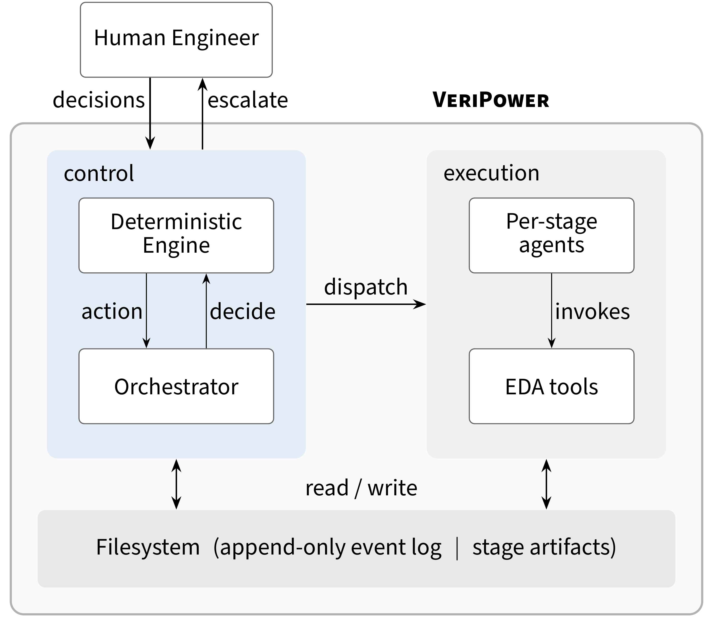
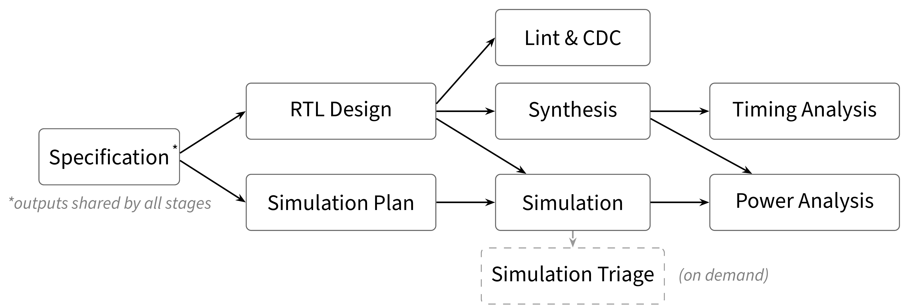

# VeriPower Architecture

> How VeriPower organizes agent-driven chip design, and why it's built this way.

---

## 1. Overview

VeriPower is a chip front-end design and verification system that ships as a
[Claude Code](https://docs.anthropic.com/en/docs/claude-code) plugin. It takes
an LLM coding agent through eight stages, from a natural-language spec all the
way to power analysis, on commercial EDA tools (SpyGlass, Design Compiler,
PrimeTime, VCS+UVM).

The whole system is built around one idea. A deterministic kernel owns every
fact about the design flow. It knows which verification conclusions still hold,
what got invalidated by a change, what should run next, and who's responsible
for fixing a failure. LLM agents and human engineers both sit outside this
kernel. They can propose work and propose judgments, but they can't alter
what's been recorded. The kernel is the only thing that writes to the event
log, and no agent prompt can inject or change a record.

<p align="center">
  
</p>

The **Orchestrator** is the `design-flow` skill running in the main
conversation. It asks the kernel for one action, carries it out, then asks
again. It holds nothing between queries and makes no routing decisions on its
own.

The **Deterministic kernel** (`framework/scripts/`) records events, derives
status, computes the dependency graph, schedules work, and checks whether an
attribution is legal. Everything it does is pure computation over the event log
and what's on disk.

The **Filesystem** is the only persistence layer. An append-only event log
(`events.jsonl`) plus whatever artifacts each stage produces. No database, no
daemon, no HTTP.

Stage agents don't talk to the orchestrator or to each other. Each one gets a
structured handoff written to disk by the kernel, not a natural-language
summary of the orchestrator's context, and writes its results back to disk.

---

## 2. The Pipeline

Eight rules make up the flow. A ninth, simulation triage, is a diagnostic that
analyzes simulation failures without recording a verification conclusion of its
own.

| Rule | What it does | Oracle | Grade |
|---|---|---|---|
| specification | Generates structured design docs, sub-designs, and timing constraints from a natural-language brainstorm | spec-review (LLM) | proposed |
| simulation-plan | Maps every specified behavior to a testpoint, produces the verification plan and TB scaffold | plan-review (LLM) | proposed |
| rtl-design | Generates RTL from the specification | semantic-review (LLM) | proposed |
| lint-cdc | SpyGlass lint and CDC checks | spyglass ruleset | tool |
| synthesis | Design Compiler synthesis | dc-shell | tool |
| timing-analysis | PrimeTime timing analysis | pt-shell | tool |
| simulation | Builds and runs UVM testbench against the RTL | tb-refmodel (LLM) | proposed |
| power-analysis | PrimeTime power analysis | pt-shell | tool |
| simulation-triage | Root-cause analysis for simulation failures | n/a | n/a |

### Dependency graph

The graph comes from each rule's declared input and output artifact globs in
`rules.py`. If one rule's outputs match another's inputs, there's an edge.
Nothing else maintains the graph, so it can't disagree with what rules actually
read and write.

<p align="center">
  
</p>

*\*Specification's outputs (constraints, PPA targets, interface declarations)
are also consumed directly by lint-cdc, synthesis, simulation, and
power-analysis. Simulation-plan's outputs (sequences, power scenarios) are
consumed by power-analysis. These edges are omitted from the diagram for
clarity.*

Concurrency falls out naturally. Rules with no artifact edge between them can
run at the same time. Lint-cdc and simulation, for instance, share nothing and
regularly run in parallel. You can inspect the live graph yourself:

```bash
python3 -c "import sys; sys.path.insert(0,'framework/scripts'); import rules
for r in rules.FORWARD_PRIORITY: print(r, sorted(rules.input_producers(r)))"
```

### The 4 + 4 symmetry

Look at the Oracle column. The four tool-graded rules all deal with structural
and physical correctness (lint, synthesis, timing, power). Their oracles, the
EDA tool rulesets and constraint decks, existed before the design under test
did. The tool can't share the design's mistakes.

The four proposed-graded rules all deal with intent and functional correctness
(specification, verification plan, RTL, simulation). There's no independent
oracle for these, because function *is* intent, and intent stays
underdetermined until someone settles it. That's where human judgment comes in
(§5).

---

## 3. State and Proofs

### The event log

A module's entire state lives in one append-only file, `events.jsonl`. There's
no status snapshot. Whether a stage is done, stale, failed, or still running
gets computed from the log against disk every time you ask. The kernel is the
only writer, and every record is schema-validated before it lands.

The orchestrator carries nothing between turns. If a context window gets
compacted or the process crashes, the next `decide` call just re-derives the
right action from disk. No recovery protocol needed.

### Proofs

When a rule completes, the kernel records a **proof**. That's a verdict (pass
or fail) bound to content fingerprints of every input consumed, every output
produced, and the oracle that judged the run.

Validity is not stored anywhere. It's recomputed as a query. A proof holds
right now only if the verdict was pass, every recorded fingerprint for inputs
and outputs still matches what's on disk, and the oracle hasn't been retracted.
All three have to hold.

Say you edit one line of RTL. Next time anything checks the log, lint-cdc's,
synthesis's, and simulation's input fingerprints won't match anymore. Three
proofs go invalid at once. Nobody marks anything stale. Staleness is just the
absence of a matching fingerprint. Meanwhile specification and simulation-plan
are fine, because their inputs don't include RTL.

You can also query impact before making a change. Ask the kernel which
currently-valid proofs would break if a given file changed, so that when you
skip a stage, the decision rests on a graph computation, not a guess.

---

## 4. Failure and Repair

### A direct attribution

Synthesis reports a timing violation. It read Design Compiler's QoR report,
decided the critical path is too long in the RTL, and names rtl-design as the
rule that must fix it.

The kernel checks whether that's legal. Is rtl-design inside synthesis's
transitive dependency closure? It is (rtl-design produces RTL, synthesis
consumes it), so the attribution stands.

Next round, the kernel dispatches rtl-design with the failed synthesis run as
context. The RTL agent reads the timing report and shortens the critical path.
Now the RTL outputs have different fingerprints, so lint-cdc, synthesis, and
simulation all lose their proofs. The kernel re-verifies them in dependency
order. Everything passes. Done.

### A failure that needs investigation

Simulation fails, but it can't tell whether the bug is in the RTL, the
specification, or the testbench reference model. It doesn't name anyone.

The kernel sees an unattributed simulation failure. Simulation's rule points to
`simulation-triage` as its diagnostic, so the kernel dispatches triage. The
triage agent goes into the failed run's directory (UVM logs, FSDB waveforms,
coverage data), reads the spec and reference model, and if the evidence isn't
conclusive, builds a controlled experiment in its own workspace to nail down
the cause.

Triage finds that a clock-domain relationship was declared wrong in the spec.
The kernel confirms specification is inside simulation's dependency closure,
records the diagnosis, and routes the failure there.

Specification fixes the declaration. Downstream constraints change with it. The
kernel figures out which proofs are now invalid and re-verifies the affected
chain.

### How attribution works

The failing stage names who needs to act. The kernel's only job is to check
that the name is legal, meaning it sits inside the failing rule's transitive
dependency closure. There's no fixed table of labels. A closed set could only
cover failure modes someone thought of ahead of time, and where a symptom shows
up is not necessarily where its cause lives.

Three situations escalate to a human: the stage names nobody, names itself
(meaning it's tried everything it can), or names something outside its closure.
When that happens, the escalation comes with the candidates and the evidence,
not just a request for help.

If multiple failures point to the same rule, they get bundled into one
dispatch. Lint-cdc and synthesis both blaming rtl-design won't make it run
twice.

---

## 5. The Trust Boundary

### Two kinds of oracle

A tool-graded oracle is independent of the design it judges. SpyGlass's lint
rules existed before any RTL was written. The tool and the artifact can't share
the same mistake, so the verdict is authoritative.

A proposed-graded oracle is different. An LLM-authored review or reference
model comes from the same information the artifact was built from. If the LLM
misunderstands a spec requirement, it can produce RTL and a reference model
that agree with each other while both being wrong. Tests pass, nothing gets
flagged. This, silent false green, is worse than any explicit failure because
nobody's attention gets called to it.

### Verification independence

Design and verification both start from the specification, then they split.
The design path produces RTL. The verification path produces the test
environment, and everything on that path (plan, scaffold, sequences, reference
model) derives from the specification, not from the RTL. Simulation does
consume RTL as a declared input, but only as the compiled DUT. The reference
model that actually judges the simulation is built from the spec's behavioral
requirements, not by reading RTL source.

Every specified behavior gets mapped to a testpoint through structured artifact
handoffs between simulation-plan and simulation, so nothing gets dropped by
omission. After each simulation round, an independent conformance review checks
what the tests actually exercised against what the specification asked for.
This catches both missing checks and checks that test the wrong thing.

### From proposed to human

A human can endorse a proposed oracle through **pin**, which raises its grade
to human. The endorsement is anchored to a fingerprint of the oracle's content
at that moment. If the oracle gets regenerated and the content changes, the
endorsement goes away on its own. Nobody has to remember to revoke it.
**Reopen** is the explicit withdrawal, and it invalidates every proof that
depended on the endorsed oracle.

### Signoff

Closing a module demands everything at once. Every proof currently valid. Every
oracle at tool or human grade. No input file on disk that showed up after the
proof was recorded without being verified. The pipeline can iterate just fine
under proposed oracles, but it can't close under them.

The human has four named acts: endorse an oracle (`pin`), withdraw one
(`reopen`), state an attribution (`diagnose`), close the module (`signoff`).
Everything else is computed.

---

## 6. Limits

**Declared inputs aren't enforced.** A rule says what it reads, but nothing
actually stops it from reading other files. If it does, the dependency graph is
wrong in the dangerous direction, where a proof that should have gone invalid
didn't. The signoff gate partially makes up for this by re-checking
declarations against disk for new inputs, but it's not a full fix.

**Signoff is not correctness.** It's closure over a declared set of
obligations. That list is hand-written in the rule registry, not derived from
language semantics. Signoff is only as credible as the list is complete.

**The system lowers the cost of each human judgment, not the count.** How often
someone needs to step in depends on what the LLM can handle. The architecture
makes each judgment reusable and durable, but it can't replace the judgment
itself.

---

## Key Terms

| Term | Meaning |
|---|---|
| **proof** | A verification conclusion tied to exact input versions, output versions, and an oracle. Validity gets recomputed every time it's queried. |
| **oracle** | What a proof was judged against. Could be an EDA tool's ruleset or an LLM-authored review or reference model. |
| **grade** | How much you can trust an oracle. **tool** means authoritative. **proposed** means an LLM assessed its own work (good enough to iterate on, not enough for signoff). **human** means a person endorsed a proposed oracle via pin. |
| **pin** / **reopen** | How humans grant and withdraw trust in a proposed oracle. A pin is anchored to the oracle content's fingerprint, so if the content changes, the pin lapses. |
| **rule** | One unit of work the kernel schedules, with declared inputs, outputs, proof, and oracle. The dependency graph falls out of these declarations. |
| **projection** | Per-rule status (valid, stale, failed, blocked, in-flight, or missing) computed from the event log and disk on demand. Never stored. |
