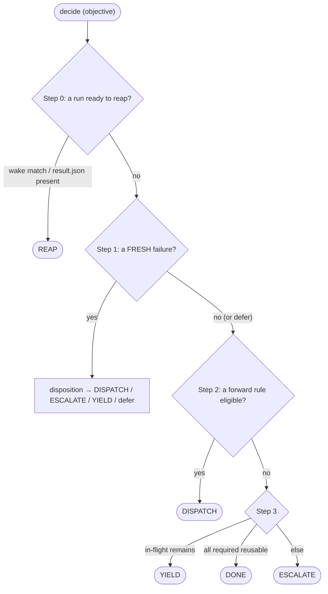

# VeriPower Architecture

> Design rationale and contracts for VeriPower's stage-gated, event-sourced agent pipeline.

---

## Contents

- [Glossary](#glossary)
- [1. Why VeriPower](#1-why-veripower)
- [2. System model](#2-system-model)
- [3. Rule registry and the derived dependency graph](#3-rule-registry-and-the-derived-dependency-graph)
- [4. State model: the event log](#4-state-model-the-event-log)
- [5. Scheduler decision loop](#5-scheduler-decision-loop)
- [6. Subagent contracts](#6-subagent-contracts)
- [7. Workspace layout](#7-workspace-layout)

---

## Glossary

Core coined terms, each defined once here and elaborated in the linked section. Localized contracts (per-stage `result.json` fields, CLI flags) are not duplicated in this document — they live in their owning schema / `--help`.

| **Term** | **One-line meaning** |
|---|---|
| **Orchestrator** | The `design-flow` agent in the main conversation; the only role that calls `kernel.py`, dispatches `Task()`s, and talks to the user. (§2.4) |
| **kernel** | `python3 framework/scripts/kernel.py` — the sole writer of `events.jsonl` and the sole decider. Its verbs are the whole state/decision surface. (§2.2) |
| **decide / scheduler** | `kernel.py decide` (implemented in `schedule.py`) — reads the event log + disk and returns exactly one action per call; the Orchestrator is its thin executor. (§5) |
| **rule** | One kernel-scheduled unit of work, defined in `rules.py:RULES`. Eight pipeline rules plus `simulation-triage`. The dependency graph is *derived* from rules' input/output selectors, not declared separately. (§3) |
| **proof** | The pass/fail assertion a proof-producing rule records at reap: `{name, verdict, inputs, oracle, evidence}`, embedded in its `outcome` event. (§4.4) |
| **proof validity** | A *query* — not a stored flag. A proof is valid *now* iff its verdict is `pass`, its recorded input and output fingerprints still match disk, and its oracle was not reopened since. Staleness is recomputed on every read. (§4.4) |
| **oracle & grade** | The judge that decided a proof, `(ref, grade)` with `grade ∈ {tool, human, proposed}`. A tool oracle is authoritative; a `proposed` (LLM-authored) oracle can be ratcheted to `human` only by a `pin`. (§4.5) |
| **objective** | The goal a `decide` call is scheduling toward: `delivery`, `repair`, or `signoff`. It picks the required-proof set. (§5.1) |
| **disposition** | The scheduler's decision for one *fresh* failure: auto-rebuild, triage, or escalate — gated by the reliability of any diagnosis attached to it. (§5.3) |
| **reap** | Closing an in-flight run with `kernel.py reap` (no verdict flag): `cmd_reap` reads the run's `result.json`, promotes artifacts, and appends the `outcome` (and, for triage, a `diagnosis`). (§5.6) |
| **promote** | The per-entry hardlink merge from `runs/<N>/` to the canonical stage dir, run by `cmd_reap` on pass *and* fail. Idempotent. (§7.2) |
| **projection** | The per-rule status cell (`valid / stale / failed / blocked / in-flight / missing`) `facts.projection` computes purely from the event log + disk. Replaces any stored status snapshot. (§4.6) |

---

## 1. Why VeriPower

VeriPower separates a deterministic scheduling core from the LLM Orchestrator: a routing mistake cannot corrupt completed work, because the record of what happened is an append-only event log the LLM can never rewrite, and "is this result still good?" is recomputed from that log against disk every time it is asked. That separation is load-bearing, not incidental — every architectural decision in this document hangs off it.

Three commitments make it work; each is elaborated where it lives:

- **The event log is the only durable state.** `asic/<module>/events.jsonl` is the sole persisted state file. There is *no* status snapshot: whether a stage is done, stale, failed, or in-flight is *derived* on demand from the log by comparing recorded content fingerprints against disk (§4). `kernel.py` is the only writer of the log, and every event is schema-validated at write time, so the audit trail cannot be forged through an agent prompt.
- **Validity is a query, not a stored bit.** A stage's output is trusted only while a *proof* it recorded still holds — its inputs and outputs unchanged, its oracle un-reopened (§4.4). Edit an upstream file and every proof whose fingerprints no longer match silently becomes invalid on the next query; nothing has to remember to mark it stale. Freshness therefore falls out of content, not out of bookkeeping.
- **The dependency graph is derived, not declared.** A rule names the artifact globs it consumes and produces; the producer→consumer graph is computed from those selectors (`rules.producer_of`), so there is no second DAG structure to drift out of sync with what stages actually read and write (§3).

VeriPower is not a service: no daemon, no DB, no HTTP — disk files are the database. It is not vendor-locked: skills are swappable at the `rules.RULES[...].skill` dispatch seam. It is not a one-shot agent: the flow tolerates multi-hour repair storms where stages fail, their fixes rebuild upstream producers, and dependent proofs re-verify across many Orchestrator turns.

## 2. System model

### 2.1 Three-layer architecture

The Orchestrator agent decides; `kernel.py` and the skills execute; disk persists.

```
┌────────────────────────────────────────────────────────────────────────────────────┐
│             Orchestrator Agent  ( veripower:design-flow )                          │
│  main conversation; forward dispatch / repair routing /                            │
│  escalation / user collaboration                                                   │
└──┬───────────────────────────┬────────────────────────────────┬────────────────────┘
   │ Bash                      │ Skill()                        │ Task()
   │ kernel.py CLI             │ veripower:specification        │ general-purpose
   │                           │ veripower:simulation-plan      │ (the 4 task rules +
   │                           │ veripower:rtl-design           │  simulation-triage)
   │                           │ veripower:simulation           │
   │                           │ (main-thread loaded)           │
   ▼                           ▼                                ▼
┌────────────────────┐  ┌──────────────────────────────┐  ┌───────────────────────────────┐
│ Deterministic core │  │  Main-thread skill           │  │  Stage / Debug Subagent       │
│ (Python)           │  │  (runs in Orchestrator's     │  │  (isolated context)           │
│  kernel.py:        │  │   main thread)               │  │                               │
│   10 verbs; sole   │  │                              │  │  Stage: executes rule         │
│   writer of the    │  │  specification / sim-plan /  │  │    → writes result.json       │
│   event log        │  │  rtl-design / simulation:    │  │  Debug (triage): canon. RO,   │
│  schedule.py:      │  │    self-driven fan-out /     │  │    scratch RW builder         │
│   decide → action  │  │    dialogue → result.json    │  │    → result.json (+ diag)     │
│  facts / rules /   │  │                              │  │  Must NOT call kernel.py      │
│  schedule / store  │  │                              │  │  or dispatch anything         │
└──────────┬─────────┘  └──────────────────────────────┘  └───────────────────────────────┘
           │ reads/writes
           ▼
┌────────────────────────────────────────────────────────────────────────────────────┐
│                              asic/<module>/                                        │
│                                                                                    │
│   events.jsonl                       the ONLY durable state (append-only log)      │
│   Design/<rule>/result.json          specification / rtl-design / lint-cdc /       │
│                                      synthesis / timing-analysis                   │
│   Verification/<rule>/result.json    simulation-plan / simulation / power-analysis │
│   (status is DERIVED from events.jsonl + disk fingerprints — never stored)         │
└────────────────────────────────────────────────────────────────────────────────────┘
```

The three dispatch paths from the Orchestrator:

- **Bash** → the `kernel.py` CLI (verbs in §4.2 / §5). It composes the other framework scripts in-process; the Orchestrator never invokes them directly.
- **Skill()** → the four main-thread skills (`specification`, `simulation-plan`, `rtl-design`, `simulation`).
- **Task()** → the four task-dispatched stage subagents and the `simulation-triage` debug subagent.

### 2.2 The kernel surface

`framework/scripts/` is one deterministic core split into five bare-importable, single-responsibility modules plus the CLI. `kernel.py` is the only entry point the Orchestrator calls; it imports the rest.

| Module | Responsibility |
|---|---|
| `kernel.py` | The CLI and the **sole writer** of `events.jsonl`. Ten verbs: `decide`, `dispatch`, `reap`, `diagnose`, `escalate`, `pin`, `reopen`, `signoff`, `status`, `consequences`. Every verb prints a JSON envelope. |
| `rules.py` | The rule registry (`RULES`) — the SSoT for what the kernel schedules and the *source* of the dependency graph (§3). Also `FORWARD_PRIORITY`, `PIPELINE_INPUTS`, `ADVISORY_ORDER`, and the derivation helpers `producer_of` / `input_producers` / `input_closure` / `sort_prereqs`. Dependency-light leaf. |
| `facts.py` | Event-log I/O (`read_events` / `append_event`, schema-validating), content fingerprints (`fingerprint`), and the freshness queries built on them — `proof_valid`, `input_available`, `projection`, plus the strictest of them, `signoff_gate` / `signed_off` (§5.5). Owns nothing mutable; everything is computed from the log + disk. |
| `schedule.py` | The scheduler: `decide(objective) → exactly one action`. Pure over (disk, log, args); composes `facts.signoff_gate`. Owns the objective→required-proof map and the fresh-failure disposition, including the legality check on a failure's self-named `fix_owner`. |
| `store.py` | Filesystem artifact-lifecycle helpers: dispatch-time `write_dispatch` (writes `<workdir>/dispatch.json`) and `carry_self` (copies the author's own previous canonical products into the fresh workdir), reap-time `promote`. Imported by `kernel.py`; never invoked directly. |

The event schemas at `framework/references/schemas/events/<type>.schema.json` (7 of them, §4.2) and the result envelope at `framework/references/schemas/envelope.schema.json` complete the core.

> **Black-box discipline.** The Orchestrator invokes `kernel.py` by its documented command lines (flags via `<verb> --help`, each verb prints a JSON envelope) and never reads the framework scripts' source. On a non-zero exit or an `ok:false` envelope it follows the documented failure protocol (fix the objective, escalate the `ok:false`), never patches around it.

### 2.3 Main-thread-loaded stages and the pre-pipeline brainstorm

`veripower:specification`, `veripower:simulation-plan`, `veripower:rtl-design`, and `veripower:simulation` are the only four rules NOT dispatched via `Task()` — all four load in the Orchestrator's main thread via `Skill()`. A `Task()` subagent can neither interact with the user mid-run nor dispatch further `Task()`s, and each of these four needs one of those two capabilities.

> **Contract:** A `Task()` subagent may not dispatch another `Task()` — Level-2 dispatch is forbidden (the audit boundary). A rule that must fan out Level-1 sub-Tasks therefore cannot run as a Task subagent; main-thread loading is the *only* way to hold fan-out dispatch authority while preserving that boundary. `specification` / `rtl-design` / `simulation` are main-thread for fan-out authority; `simulation-plan` is main-thread for multi-turn user dialogue, plus a single Level-1 plan-adequacy review dispatch.

The `execution` field on each `Rule` (`"main-thread"` or `"task"`) is what the Orchestrator branches on — never a hardcoded stage list. The per-rule trigger:

- **specification** — consumes a frozen, approved `brainstorm.md`; a fan-out dispatcher (decompose + per-child sub-Task waves around a partition gate) plus its main-thread `spec` CLI gate verbs. NOT main-thread for brainstorm dialogue — that moved to the pre-pipeline `brainstorm` skill.
- **simulation-plan** — multi-turn plan-review dialogue with the user; also self-dispatches a single Level-1 plan-adequacy review sub-Task (Step 4 / §6.3.1).
- **rtl-design** — fan-out only, no dialogue: one Level-1 sub-Task per child, a no-cap conformance-gate self-converge loop (exit: child-BLOCKED / convergence), a gating semantic-review wave, then a finalize sub-Task.
- **simulation** — fan-out only, no dialogue: every round is homogeneous (the kernel's `carry_self` has already carried the previous round's TB into the workdir before dispatch, or the workdir is genuinely empty on a first run — the skill never branches on which). Wave 1 dispatches the env-build child, then runs the smoke gate, the LLM conformance review-gate (re-judged every round, never skipped), and the verify child (Wave 2).

> **Red Flag:** If `Skill(veripower:lint-cdc|synthesis|timing-analysis|power-analysis)` appears in the Orchestrator's tool history, it is a bug — those four rules must dispatch via `Task()`.

**Pre-pipeline `brainstorm` skill (not kernel-dispatched).** The heavy D0–D7 requirements dialogue runs in a separate `brainstorm` skill in its own session — it is NOT one of the four main-thread stages above and is never dispatched by the Orchestrator. It produces the approved `asic/<module>/brainstorm.md` (module root) that the pipeline starts from; it writes no `result.json` and calls no `kernel.py`. `brainstorm.md` is the pipeline's sole external input — `rules.PIPELINE_INPUTS` — needing only to exist and be `Status: approved` (the Orchestrator's session-start gate) for `specification` to become schedulable.

### 2.4 Role responsibilities

| **Role** | **Carrier** | **Responsibilities** | **Capability boundaries** |
|---|---|---|---|
| **Orchestrator agent** | `design-flow` skill, main conversation | Execute the one action each `decide` returns; propose `pin` / `reopen` / human `diagnose` on explicit user intent; escalate; collaborate with the user. Authors no per-dispatch content: it passes the action's coordinates through and the kernel resolves them (§5.6). Also acts as the main-thread executor for the four main-thread rules. | The only role that may call `kernel.py`, use the Task tool, and interact with the user. Authors NO event by hand — every event is written by `kernel.py`. |
| **Main-thread skill** | one of the four main-thread rules, loaded via `Skill()` | Self-driven work in the Orchestrator's thread: sub-Task fan-out (producers, simulation), multi-turn dialogue (simulation-plan), or a single review dispatch. Each writes its own artifacts + `result.json`. | May dispatch Level-1 sub-Tasks (producers / simulation) or interact with the user (simulation-plan; specification at its two path-handoff gates). No `kernel.py`, no routing. Held by SKILL.md prose discipline, not tool gating. |
| **Stage subagent** | the four Task-dispatched rules (`lint-cdc` / `synthesis` / `timing-analysis` / `power-analysis`) | Execute one rule: read upstream → do the work → write `result.json` → return a STATUS line | Must NOT call `kernel.py` or make routing decisions (§6.1) |
| **Debug subagent** | `simulation-triage`, dispatched via Task | Graduated (L1 log+code+FSDB reasoning → L2 controlled experiment) root-cause analysis on a simulation failure; its target run and upstream (spec/RTL/plan) are injected at dispatch via `dispatch.json` (`sim_run` names the target run directory), `proof=None` so it is dispatchable even when upstream proofs are invalid; writes a `result.json` whose `stage_specific` carries the attribution the kernel turns into a `diagnosis` at reap (§6.4) | Canonical read-only, scratch-writable under its own workdir; never edits any other rule's `result.json`, RTL, or tests; NOT idempotent (a repeat re-runs L2) |
| **`kernel.py`** | Python CLI | State transitions (as events), scheduling, proof derivation, promote | Contains the scheduling logic but makes no *judgment*: it never mints a human diagnosis. |

### 2.5 Core design principles

- **Judgment in the Orchestrator, state and scheduling in the kernel** — the determinism boundary. The Orchestrator makes exactly one kind of judgment call: whether to propose a `pin` / `reopen` / human `diagnose` (all on explicit user intent). Everything else — what to run next, whether a proof is valid, where a failure routes — is computed by `kernel.py decide`. The Orchestrator is a thin executor: it calls `decide`, executes the one returned action, and loops.
- **Decision boundary = tool boundary.** Every scheduling decision is pushed down to `decide`. Its verifiable form: *two consecutive state-mutating kernel calls with no `decide` between them is a bug.*
- **Files are the database.** `events.jsonl` is the durable log; `result.json` files are stage outputs; everything else (status, freshness, in-flight) is a pure function of those. No intermediate cache, no service-side store. The `.fingerprint-cache.json` under a module is a pure mtime/size speed cache — never a fact source.
- **Compaction-safe resume.** Because files are the database and the Orchestrator holds *zero* durable control state between turns, a mid-session context compaction or process crash is survivable: every turn re-derives the next action from disk via `decide`. It holds no conversation-resident state at all: the one thing it carries between turns, the current `objective`, is a single enum re-derivable from the action it just executed.
- **One-way communication + context isolation.** Orchestrator → prompt → subagent → `result.json` + STATUS. No subagent-initiated callback, no subagent-to-subagent communication; subagents inherit no parent history and receive all inputs as explicit file paths.

**The trust boundary — proposed vs. authoritative oracles.** VeriPower runs LLM-authored judges (a spec-intent review, a plan-adequacy review, an RTL semantic review, a TB refmodel) alongside deterministic EDA-tool oracles. The two are not equally trustworthy, and the kernel encodes that: an oracle carries a `grade` (§4.5). A `tool`-graded oracle (SpyGlass, DC, PT) is authoritative on its own. A `proposed`-graded oracle is an LLM proposing its own correctness — trusted enough to gate a normal *delivery* build, but NOT enough to close *signoff*. The only way a proposed oracle earns authoritative (`human`) trust is a human `kernel.py pin`, which records the oracle content's current fingerprint; the grade upgrades to `human` only while that exact content is unchanged, and drops back to `proposed` the moment the content drifts or the pin is `reopen`ed (§4.5). `pin`, `reopen`, and `signoff` are therefore **ask-gated judgment verbs**: the Orchestrator proposes them only on explicit human intent, and the harness permission gate prompts the user on every call. This is the seam where a human, and only a human, converts an LLM's self-assessment into signoff-grade trust — per-oracle with `pin`, and for the module as a whole with `signoff` (§5.5).

## 3. Rule registry and the derived dependency graph

`rules.py:RULES` is the single SSoT for what the kernel schedules. One `Rule` = one kernel-scheduled unit. There is no separately-maintained stage DAG: the producer→consumer graph is *derived* from each rule's artifact selectors.

### 3.1 The `Rule` record

Each rule is a frozen dataclass:

| Field | Meaning |
|---|---|
| `name` / `stage` / `skill` | Identity and the `veripower:<skill>` dispatched to run it. |
| `execution` | `"task"` or `"main-thread"` — the dispatch class (§2.3). |
| `workdir_root` | Module-relative canonical directory (e.g. `Design/specification`); runs land in `<workdir_root>/runs/<N>/`. |
| `inputs` | Named groups of module-relative canonical-path *globs* the rule consumes. |
| `outputs` | Module-relative (workdir-root-prefixed) globs the rule produces — the source of the dependency graph. |
| `proof` | The proof name a proof-producing rule records at reap (`None` for `simulation-triage`). |
| `oracle` | `(ref, grade)` — the judge and its trust grade (§4.5). |
| `oracle_selector` | For a `proposed` oracle, the workdir-relative glob whose content a `pin` fingerprints. |
| `params` | Free params the rule expects (e.g. `simulation-triage`'s `sim_run`). |
| `carry` | Self-product globs `store.carry_self` copies into a fresh workdir at dispatch (§5.6/§7.2), minus `no_carry`; empty for a rule with no self-carry (a pure transformer). |
| `no_carry` | Globs excluded from `carry` — e.g. a per-round review record that must be re-derived fresh every round rather than carried forward. |

### 3.2 The eight pipeline rules

`FORWARD_PRIORITY` fixes the tie-break order when several rules are eligible: `specification → simulation-plan → rtl-design → lint-cdc → synthesis → timing-analysis → simulation → power-analysis`. `simulation-triage` is a ninth rule, not in that order — it is dispatched only as a failure disposition (§5.3).

| **Rule** | **Consumes (input producers)** | **Skill** | **Oracle (grade)** | **Canonical dir** |
|---|---|---|---|---|
| specification | `brainstorm.md` (external) | `veripower:specification` (main-thread) | spec-review (proposed) | `Design/specification/` |
| simulation-plan | specification | `veripower:simulation-plan` (main-thread) | plan-review (proposed) | `Verification/simulation-plan/` |
| rtl-design | specification | `veripower:rtl-design` (main-thread) | semantic-review (proposed) | `Design/rtl-design/` |
| lint-cdc | rtl-design, specification (SGDC seed) | `veripower:lint-cdc` | spyglass-ruleset (tool) | `Design/lint-cdc/` |
| synthesis | rtl-design, specification (SDC + `ppa.json`) | `veripower:synthesis` | dc-shell (tool) | `Design/synthesis/` |
| timing-analysis | synthesis | `veripower:timing-analysis` | pt-shell (tool) | `Design/timing-analysis/` |
| simulation | rtl-design, simulation-plan | `veripower:simulation` (main-thread) | tb-refmodel (proposed) | `Verification/simulation/` |
| power-analysis | synthesis, simulation, simulation-plan, specification (`ppa.json`) | `veripower:power-analysis` | pt-shell (tool) | `Verification/power-analysis/` |

The producer→consumer edges above are exactly `rules.input_producers(rule)` — computed by matching each input glob against every rule's output globs (`producer_of`). Drawn out, they form the pipeline:

```
[specification] → [simulation-plan] → [rtl-design]
                                            │
                          ┌─────────────────┴──────────────────┐
                          ↓                                    ↓
                     [lint-cdc]                          [simulation]
                          │                                    │
                          ↓                                    │
                     [synthesis]                               │
                          │                                    │
                          ↓                                    │
                  [timing-analysis]                            │
                          │                                    │
                          └─────────────────┬──────────────────┘
                                            ↓
                                    [power-analysis]
```

Implicit parallelism falls out of this graph: `decide` dispatches one rule per call and re-queries, so any rules whose inputs are all available run concurrently. In the middle of the pipeline that is the dual chain `{lint-cdc → synthesis → timing-analysis}` alongside `{simulation}` — at most two distinct rules in flight — with `power-analysis` merging both. The Orchestrator writes no concurrency cap; it emerges from where the derived edges do and do not exist.

### 3.3 Three graph queries, three distinct jobs

The derivation helpers on `rules.py` compute three different things from the same selectors, and keeping them distinct is a load-bearing invariant:

- **`input_producers(rule)`** — direct producers of the rule's input globs (one hop, self excluded). The dependency graph's edges.
- **`input_closure(rule)`** — the *transitive* closure of those producers. Used for two freshness/legality checks: a failure is "fresh" only if every proof in its input closure is currently valid (§5.3), and a human diagnosis's `fix_owner` must be a producer inside the subject proof's input closure (`kernel diagnose` rejects it otherwise, §5.3). Artifact edges only — `ADVISORY_ORDER` is excluded by construction.
- **`sort_prereqs(rule)` = `input_producers(rule) ∪ ADVISORY_ORDER[rule]`** — ordering-only. `ADVISORY_ORDER` (`synthesis` after `lint-cdc`; `power-analysis` after `timing-analysis`) adds *sequencing* edges that are not data dependencies: synthesis does not consume lint's reports, but we want lint to clear first. `sort_prereqs` is consumed by *exactly one* place — the delivery no-overtake gate in `decide` step 2 (§5.2). It must never enter a freshness or proof-validity computation, or an advisory sequencing hint would masquerade as a data dependency.

> **Contract:** `ADVISORY_ORDER` / `sort_prereqs` influence *scheduling order under delivery only*. `input_producers` / `input_closure` (artifact edges) are the sole basis of proof validity, input availability, and failure freshness. The two never cross.

### 3.4 Constraints and the SGDC clock-domain declaration

`specification`'s `derive-constraints` verb emits the complete constraint set the downstream tool stages read: `Design/specification/constraints/<TOP>.sdc` (consumed by `synthesis`) and `<TOP>.sgdc` (the seed `lint-cdc` consumes). Both are derived from the approved §1.4.1 clock tables and the §1.6 clock Relationship block, so the constraints are an authoritative projection of the spec rather than hand-maintained.

Asynchronous clock relationships are carried differently in each format because the tools accept different syntax. The SDC uses the standard `set_clock_groups -asynchronous` construct. The SGDC cannot: SpyGlass `vL-2016.06` rejects `set_clock_groups` outright (`SGDCSTX_002 Unknown SGDC command`). The SGDC-native form the generator emits instead is a per-clock domain declaration — `clock -name <c> -period <p> -edge {…} -domain <D>` — where all `primary`/`synchronous-related` clocks share one domain name and each `async` clock gets its own distinct domain. This declaration's role is to make the spec's §1.6 Relationship **explicit and authoritative** in the SGDC, rather than leaving domain partitioning to the tool's defaults. This behavior is empirically pinned by the manually-run EDA regression at `tests/eda/f1-sgdc-clock-group/`, which on `vL-2016.06` flags an unsynchronized single-flop crossing under rule id `Ac_unsync01` (policy `clock-reset`, goal `cdc/cdc_verify_struct`) — the rule id `lint-cdc`'s rule-family table records as a crossing-class defect. (On that version, separately-named clocks already default to separate domains, so the declaration's value is that the domain partition is *spec-driven and explicit*, not tool-inferred; see the fixture's README for the scoped measurement.)

## 4. State model: the event log

### 4.1 `events.jsonl` is the only durable state

Everything under `asic/<module>/` that matters to the kernel is derived from one append-only file: `events.jsonl`. There is no `task.json`, no status snapshot, no freshness field. `facts.read_events` parses it (tolerating a truncated final line); `facts.append_event` is the only writer, and it is reached only through `kernel.py`. Each append validates the record against the event's JSON Schema *before* writing, so a malformed event is a hard error, never a written line.

Because the log is the state, in-flight is derived too: `facts.in_flight` = every `dispatch` with no matching `outcome` (keyed by `(rule, run)`). Crash recovery is thus intrinsic — a run whose executor died left a `dispatch` with no `outcome`, so it still shows in-flight and `decide` will reap it (§5.6).

### 4.2 The seven event types

`events.jsonl` carries **7 event types**, each validated by `framework/references/schemas/events/<type>.schema.json`. `kernel.py` is the sole writer of all seven — there is no channel by which an agent prompt can inject a raw event.

| **type** | **Written by (verb)** | **Purpose / key fields** |
|---|---|---|
| `dispatch` | auto (`dispatch`) | Opens a run: `rule`, `run`, `workdir`, `params` (the rule's declared params), `objective`, `diagnosis_refs`, `caused_by` (the `[rule, run]` failures a rework answers), and — for proof-producing rules only — the consumed `inputs` version table (the sole source of `proof.inputs`). |
| `outcome` | auto (`reap`) | Closes a run: `verdict ∈ {pass, fail, blocked}`, the produced `outputs` version table (incl. the canonical `result.json`), `proofs[]`, `tool_versions`, optional `reason` (the blocked sub-class). |
| `diagnosis` | auto for triage (`reap`); human via `diagnose` | A failure attribution. Required (per `diagnosis.schema.json`): `id`, `subject {proof, outcome_run}`, `attribution`, `evidence`, `source ∈ {triage, human}`. Optional: `fix_owner`, `fix_locus`, `confidence`, `supersedes`; `provenance` (the bare identity that vouches) and `reason` (the reasoning, carried verbatim into the fix owner's `dispatch.json`) both required for `human`, enforced by `diagnose`. |
| `pin` | `pin` | Ratchets a `proposed` oracle toward `human`: `oracle_ref`, `content_fingerprint` (recorded at pin time), `provenance`, `reason`. |
| `reopen` | `reopen` | Retires a pin: `pin_ref`, `reason`. Invalidates any proof whose oracle was reopened after it landed (§4.4). |
| `signoff` | `signoff` | Closes signoff: `provenance`, `reason`. Written only if `facts.signoff_gate` is clear (§5.5). Carries no fingerprint and is never retired — validity is re-derived live by `facts.signed_off`. |
| `escalation` | `escalate` | Records that the flow handed a decision to the user: `reason`, `open_question`, optional `candidates`. |

`dispatch` / `outcome` are pure side-effects of running work. The triage `diagnosis` is derived at reap from the triage run's `result.json` (§5.3). The other five verbs (`diagnose`-human, `pin`, `reopen`, `signoff`, `escalate`) carry the Orchestrator's/user's judgment — but they still go through `kernel.py`, which validates and (for `diagnose`/`pin`) enforces structural correlates the schema alone cannot express (§5.3, §4.5). All events carry a UTC ISO8601 `ts` written first in the record.

### 4.3 Content fingerprints

Freshness is decided by comparing content, so the atom of the whole model is a content fingerprint. `facts.fingerprint(path)`:

- **file** → `sha256:<hex>` of its bytes;
- **directory** → `merkle:<hex>` over a sorted walk (each entry's relpath + kind + file-hash / symlink-target);
- **symlink** → hashed by its target *string*, not followed;
- **missing / unreadable** → the sentinel `UNKNOWN`.

`facts.versions_match(recorded, current)` is true only when both are known and equal — `UNKNOWN` never matches anything, so an absent or unreadable artifact is *conservatively stale*, never falsely fresh. `fingerprint_cached` adds an mtime/size cache for speed only; it is never a fact source (a symlink or directory bypasses the cache to avoid a false-fresh hit).

### 4.4 Proof validity is a query

A proof-producing rule records a `proof` inside its `outcome` event at reap: `{name, verdict, inputs, oracle, evidence}`. `inputs` is the version table of everything the run consumed (from the `dispatch` event); `outputs` (on the outcome) is the version table of everything it produced. A proof is not a stored "valid" bit — `facts.proof_valid(module, proof)` recomputes it on every call. It is valid *now* iff **all four** conditions hold:

1. **Verdict** — the latest outcome carrying this proof has `verdict == pass`.
2. **Inputs unchanged** — every recorded input fingerprint still matches disk.
3. **Oracle un-reopened** — no `reopen` of this proof's `oracle.ref` appears at or after the proof's position in the log.
4. **Outputs unchanged** — every recorded output fingerprint (including the canonical `result.json` itself) still matches disk.

The consequence: editing any file a proof touched — an input, an output, or the result envelope — silently invalidates that proof on the next query, and transitively any downstream proof that consumed it. Nothing has to *mark* anything stale; staleness is the absence of a still-matching fingerprint. `kernel.py consequences --paths <p…>` makes this queryable ahead of time: a read-only what-if that reports, for each path, which currently-valid proofs would flip to invalid if that path's content changed.

**Input availability** (`facts.input_available`) is the dispatch-time counterpart: a consumer's input glob is available iff it is the external `brainstorm.md` (need only exist), OR its producer never ran (true cold start — forward scheduling will run the producer first), OR the producer's latest outcome recorded a matching, still-fresh output AND that producer's proof is currently valid. A producer that has run but matches nothing (recorded or on disk) is genuinely absent → unavailable (the conservative direction — never dispatch a consumer against a silently missing input).

### 4.5 Oracle grades and pins

Each proof's `oracle` is `(ref, grade)`. The grade is *derived at reap* by `kernel._graded`:

- A rule whose registered oracle grade is `tool` (SpyGlass / DC / PT) always records `tool` — the EDA tool is authoritative.
- A rule whose registered grade is `proposed` (an LLM-authored judge) records `proposed` **unless** a *live* `pin` for its `oracle_ref` recorded a `content_fingerprint` equal to the oracle content's *current* fingerprint — in which case it records `human`.

A pin is **live** iff no `reopen` naming its `oracle_ref` appears after it in event order (membership tracked per-event, so `pin → reopen → pin` correctly yields a live pin again). The oracle content a pin fingerprints is the rule's `oracle_selector` glob (e.g. `simulation`'s `tb/uvm/refmodel/*` — the pin endorses the *judge* itself, which survives runs; when the LLM regenerates the refmodel, the content fingerprint diverges and the grade drops back to `proposed` at the next reap). An unreadable oracle content (`UNKNOWN`) never inherits trust.

This is the machinery behind the trust boundary (§2.5): `pin`/`reopen` are the only levers that move a judge across the proposed↔human line, they are ask-gated, and the ratchet is content-anchored so trust cannot silently outlive the thing it was granted for.

### 4.6 The projection

`facts.projection` renders the per-rule status the `kernel.py status` verb prints — computed entirely from the log + disk, replacing any stored snapshot. Each rule's cell is one of:

| Cell | Meaning |
|---|---|
| `in-flight` | a `dispatch` with no matching `outcome`. |
| `missing` | no outcome yet. |
| `blocked` | latest outcome `verdict == blocked`. |
| `failed` | latest outcome `verdict == fail`. |
| `valid` | latest outcome passed and `proof_valid` holds now. |
| `stale` | latest outcome passed but `proof_valid` is false now (an input/output/oracle changed under it). |

Signoff gets no cell — it is not a stage. `kernel.py status` renders it alongside the cells as a separate `signed_off` boolean, per the §5.5 predicate: a human `signoff` event exists **and** every stage proof is currently valid. A signoff is only as good as the proofs beneath it.

### 4.7 Result envelope and schema validation

Each `result.json` validates against the shared envelope (`framework/references/schemas/envelope.schema.json`: `stage` / `module` / `produced_at` / `status` / `artifacts` / `stage_specific`) plus the rule's per-stage schema at `skills/<skill>/references/result.schema.json` (which `$ref`s the envelope). `kernel._derive_verdict` runs this validation at reap: a well-formed `status ∈ {pass, fail}` becomes that verdict; a missing, unparseable, non-object, malformed-status, or schema-violating envelope becomes `blocked` (with the sub-class in the outcome's `reason`). It then checks **temporal integrity**: a `produced_at` predating this run's own `dispatch` event (compared against the dispatch `ts` floored to whole seconds — skill finalizers stamp second-resolution) means the envelope was carried in, not authored by this run's executor, and is derived `blocked` / `stale_result` (an unparseable `produced_at` is `blocked` / `produced_at_unparseable`); it never mints an outcome verdict, so a stale copy can never be whitewashed into the ledger by a bare reap. `facts.validate_result` is read-only and returns infrastructure failures (a missing/corrupt schema) as a violation message too — the conservative direction is always "not proven valid", never a silent pass.

## 5. Scheduler decision loop

The Orchestrator runs one deterministic step per turn:

```
loop:
  a = kernel.py decide --module <M> --objective <obj> [--wake <rule>:<run>]
  execute(a)                       # a.action ∈ {DISPATCH, REAP, YIELD, DONE, ESCALATE}
  if a.action in {YIELD, DONE, ESCALATE}: end turn
```

`decide` is pure over (disk, log, args) and returns exactly one action as a JSON object. The Orchestrator executes it and re-queries; `DISPATCH` and `REAP` loop, the other three end the turn. The Claude Code harness re-enters when the next `<task-notification>` arrives, at which point the Orchestrator passes `--wake <rule>:<run>` (and re-passes it on every re-query that turn).

### 5.1 Objectives select the required-proof set

The `objective` the Orchestrator carries as a session value picks what `decide` schedules toward (`schedule.required_proofs`):

- **`delivery`** (default) — forward-build the whole DAG (all eight proofs).
- **`signoff`** (only on explicit user request) — the *same* eight proofs, but it arms the signoff gate at `DONE` (§5.5). The proof set is identical to `delivery`'s by design: signoff is a higher bar over the same proofs, not more of them.
- **`repair`** — the single latest-failing rule's proof. The Orchestrator switches to `repair` when a `delivery` `decide` returns an auto-rebuild `DISPATCH` (one carrying a non-empty `caused_by`), narrowing subsequent `decide`s to rebuilding just the closure that re-verifies the failing proof, then switches back to `delivery` when `repair` returns `DONE`.

### 5.2 The five actions and the decision steps

`decide` walks these steps and returns the first action that fires:



- **Step 0 — reap first.** If `--wake <rule>:<run>` names an in-flight run → `REAP` it. Otherwise, if any in-flight run's workdir already holds a `result.json` (a completed but un-reaped run), reap the earliest by `FORWARD_PRIORITY`. Reaping before deciding keeps the log current.
- **Step 1 — fresh-failure disposition.** For each rule in `FORWARD_PRIORITY` whose latest outcome is a `fail` *and* that failure is *fresh* (§5.3), run `_disposition`. The earliest fresh failure wins; a `_defer_to_forward` result falls through to step 2.
- **Step 2 — forward dispatch.** Compute the required proofs not currently reusable, expand them to the *rebuild closure* (walk `input_producers` of any unavailable input so a repair rebuilds the right upstream first), and dispatch the earliest candidate by `FORWARD_PRIORITY` that is not in-flight and whose inputs are available. Under `delivery` only, a candidate is additionally held back unless all of its `sort_prereqs` proofs are valid — the no-overtake gate (§3.3).
- **Step 3 — settle.** If work is in flight → `YIELD` (returning the `in_flight[]` view). Else if every required proof is reusable → `DONE`. Else → `ESCALATE` ("no eligible rule, none in-flight, not done").

`cmd_dispatch` is the single source of eligibility truth: it re-checks the in-flight premise and input availability *at write time*, returning `ok:false` if eligibility shifted between the scan and the write. The signoff gate is not among those checks — signoff is not dispatchable, so there is no dispatch to gate. Its anti-bypass duty moved to `cmd_signoff`, which runs the gate itself rather than trusting a prior `decide`: the verb is the gate's only surface, so an out-of-band `kernel.py signoff` cannot mint a signoff the gate refused (§5.5).

### 5.3 Fresh-failure disposition and the reliability gate

A failure is only actionable while it is *fresh* (`schedule._fail_is_fresh`): its fail proof must be fresh in every respect except its verdict — `facts.proof_fresh_except_verdict`, conditions 2/3/4 of §4.4 exactly as the pass path applies them, so a reopened oracle invalidates a fail verdict on the same anchor and with the same live-pin exception it invalidates a pass one — **and** every proof in its transitive `input_closure` currently valid. If the closure has a stale or missing proof, the upstream is still settling, so the failure is *stale* and defers to forward re-verification rather than being routed. (This uses artifact edges only — `sort_prereqs`/`ADVISORY_ORDER` never enter it.)

For a fresh failure, `_disposition` chooses one of three dispositions:

1. **A diagnosis is attached.** `_active_diagnoses` collects every non-superseded `diagnosis` whose `subject` matches this failure's `(proof, outcome_run)`. If the latest is **reliable** → auto-rebuild: `DISPATCH` its `fix_owner` (under `repair`), merging the `id`s of *every* reliable diagnosis across all fresh failures that share that `fix_owner` into `diagnosis_refs`, and their `(rule, run)` coordinates into `caused_by` (so a multi-cause fix names them all — none silently dropped, and the merge is a union the kernel resolves, not an instruction to whoever writes the dispatch). If the `fix_owner`'s inputs are unavailable, defer to forward. If the latest diagnosis is **not** reliable → `ESCALATE`, citing the diagnoses as candidates for the user.
   - **Reliability gate** (`_reliable`): a diagnosis is reliable iff it has a `fix_owner` **and** (`source == human`, OR `confidence == high` and its `attribution` does not point at the failed rule's own judge). A self-pointing diagnosis (no `fix_owner` — the attribution blames the oracle side) can never auto-rebuild: there is no rebuild target, so it always escalates. This is the gate that stops a low-confidence or oracle-blaming guess from silently rebuilding an upstream stage.
2. **No diagnosis, and the failure is `simulation`.** The failure is ambiguous (a sim fail could be RTL, plan, or spec) → `DISPATCH simulation-triage` with `params.sim_run = <failed run>` (unless triage is already in-flight → `YIELD`). Triage runs, and at *its* reap the kernel derives the diagnosis (below); the next `decide` sees it and re-enters disposition case 1.
3. **No diagnosis, self-describing failure.** The failing envelope names its own `stage_specific.fix_owner` (no diagnosis event needed). A legal naming whose inputs are available → auto-rebuild `DISPATCH`; inputs unavailable → defer to forward; naming nobody, naming itself, or naming outside its input closure → escalate (§5.4).

**Triage's diagnosis at reap** (`kernel._derive_triage`). `simulation-triage` has no proof; it writes a `result.json` whose `stage_specific` carries `analysis_state`, `skipped_reason`, `root_cause`, `confidence`, `advisory`. At reap: `analysis_state != "complete"` → the outcome is `blocked` and no diagnosis is emitted (the sim failure stays ambiguous; the next round re-dispatches triage). Otherwise the kernel appends a `diagnosis` (`source: triage`) whose `attribution` is the `root_cause` and whose `fix_owner` is that same `root_cause` when it names a rule inside `simulation`'s input closure. A self-pointing attribution (`root_cause == simulation`) is outside that closure by construction, so `fix_owner` is omitted and the disposition escalates it. `confidence` lands as recorded; the reliability gate, not the reap, decides whether it auto-routes.

### 5.4 Failure attribution

**The failing stage names who must act; the kernel only checks that the naming is legal.** On `status == "fail"` an envelope may carry `stage_specific.fix_owner`: a rule name, written by the party that just read the raw tool output. There is no table, and deliberately no enum — a closed set of labels can only express what was enumerated before the failure existed, and the symptom's location is not the cause's (a missing SGDC declaration is reported at the RTL line that used the undeclared object while the fix belongs in the SGDC, which no rule-name lookup can adjudicate).

The three dispositions are conditions over that one field, not a map:

- **Named nobody.** The stage read its own failure and still cannot attribute it, so a human decides. The one exception is `simulation`, which has a deeper analyzer behind it: its unattributed failure dispatches `simulation-triage` (graduated L1 log/code reasoning, then an L2 controlled experiment), whose reap mints the diagnosis.
- **Named itself.** A defect the stage could fix from here is fixed *within* its run — `rtl-design` re-dispatches a child, `lint-cdc` adds a waiver — so it never arrives as a failure at all. Naming itself therefore means the in-stage remedy is exhausted, and an auto-rebuild would dispatch the failing rule at itself.
- **Named a rule in its input closure** (`rules.input_closure`, the derived graph — the same check `kernel.py diagnose` applies to a human attribution). Inputs available → auto-rebuild `DISPATCH`; unavailable → defer to forward. A name outside the closure means the stage blamed something it does not consume; that escalates.

Every fresh failure naming the same owner is merged into one dispatch, so a co-failing stage is never silently dropped (§3.3).

**What this costs and why.** A stage-authored attribution is not gated on confidence, so `schedule._reliable` — which reads diagnosis fields — does not see it. Two things replace that gate, both stronger than what a table offered: the closure check is machine-enforced, where an unconditional `ppa → rtl-design` mapping was checked by nothing at all; and the `fail_reason` justifying the naming sits in the same envelope, so an attribution has an author and an audit trail, which a table's default value does not.

### 5.5 Signoff closure

Closing signoff is the strictest gate in the system (`facts.signoff_gate`). **Every** stage proof must:

1. be currently valid (§4.4) — which itself requires every recorded input and output fingerprint to be known and match disk, so no proof carrying an `UNKNOWN` recorded version can be valid,
2. carry an oracle grade of `tool` or `human` — a `proposed` oracle blocks signoff ("pin it"), and
3. have no out-of-band **added** input: a file on disk that matches the rule's input selectors but is absent from the proof's recorded inputs was never verified by any run. Edits and deletes of recorded files already invalidate the proof (§4.4); an add escapes the recorded-set checks, so the gate re-globs the selectors here — the daily delivery/repair path keeps the cheap recorded-set check.

The gate iterates `FORWARD_PRIORITY` in order so the reason it returns is deterministic. Failure surfaces two ways, per caller: `decide --objective signoff` wraps it as an `ESCALATE` naming the offending proof (typically "pin the proposed oracle" — a human `pin`, §2.5); `kernel.py signoff` wraps it as an `ok:false`. This is where the trust boundary bites: a pipeline can *deliver* on LLM-proposed oracles, but it cannot *sign off* until a human has pinned each proposed judge to `human` grade.

**Signoff is an act, not a stage.** The gate decides only *admissibility*; closing signoff is a human calling `kernel.py signoff --provenance … --reason …`, the third ask-gated judgment verb beside `pin`/`reopen` (§2.5). It runs the gate itself rather than trusting a prior `decide`, because the verb is the gate's only bypass surface — no caller, in-loop or out, can mint a signoff the gate refused. A module is **signed off** iff that event exists *and* every stage proof is currently valid (`facts.signed_off`) — the second conjunct re-derived live, so a proof going stale afterwards drops the signoff with no ceremony. There is deliberately no `unsign` verb: `reopen` invalidates its proof (§4.4 condition 3), which drops the conjunct.

Under `objective=signoff` the required proof set is **identical to `delivery`'s** — signoff does not demand more proofs, it demands the same proofs clear a higher bar. That bar is the gate, applied at `decide`'s `DONE` point (§5.2 step 3); without it the objective would be a `delivery` alias reporting success with the trust boundary never consulted. `DONE` under `signoff` therefore means "the gate is clear, go stamp", and the Orchestrator proposes the verb.

**The gate answers whether; `facts.signoff_basis` answers what.** Admissibility is not the same question as "which proposition am I taking on", and a transfer of responsibility only holds if the person can see the second one. So both surfaces that reach the human carry a **basis** — one row per proof, in `FORWARD_PRIORITY` order: its oracle `ref` and *live* `grade`, the `pinned_fingerprint` when that grade is `human` (a pin names a content fingerprint; "graded human" alone does not say endorsed *what*), the `tool_versions` recorded at reap, and the input paths the verdict was about. `decide --objective signoff` attaches it to `DONE`, `kernel.py signoff` returns it with the landed act, and an `ESCALATE` carries none — nothing is being endorsed when the gate blocks. Every field is already in `events.jsonl`; this is a projection, not new state. Note the asymmetry it exposes: `tool_versions` is the reap-time *environment*, while the version the tool's own report states lives in that stage's `result.json` — two homes of unequal strength, and the basis shows the weaker one.

### 5.6 Dispatch, reap, and `dispatch.json`

**Dispatch.** `kernel.py dispatch --rule <r> --objective <o> [--caused-by <rule>:<run> …] [--diagnosis-refs …] [--params <json>]` re-checks dispatchability, records the `dispatch` event (allocating `run = prior runs + 1` and creating `runs/<N>/`), and returns `{ok, rule, run, workdir, skill, execution}`. For proof-producing rules it snapshots the consumed `inputs` version table into the event (the sole source of `proof.inputs`). Before returning, dispatch performs two workdir-population sub-steps — the dispatch-time dual of promote's place in reap:

- **`store.carry_self`** — for a rule with a non-empty `Rule.carry` — copies the author's own previous canonical products (per `Rule.carry`, minus `Rule.no_carry`) into the fresh workdir, so a rework or incremental round starts from its own last output rather than empty. Copy (`copy2`), not hardlink: canonical shares inodes with the producing run, and a hardlink would let the author corrupt both. A no-op on a genuine first run (no canonical yet) or for a rule with no `Rule.carry` (pure transformers).
- **`store.write_dispatch`** writes `<workdir>/dispatch.json`, the one thing the kernel tells a run about itself (below).

The Orchestrator branches on the returned `execution`: `main-thread` → `Skill(veripower:<skill>)` (synchronous; the next `decide` reaps it); `task` → `Task(subagent_type="general-purpose", run_in_background=True, prompt=<rendered template>)` (async; reaped on a later wake). Every dispatch renders the same prompt: what a round is about lives in `dispatch.json`, not in the prompt, which is why there is no per-dispatch template slot to fill and no "mode" a renderer could get wrong.

**`dispatch.json`.** Four keys, and a key is written only when it carries something — `inputs` always, the other three when non-empty. The test for admitting a field is whether the executor could derive it itself; each of these it cannot.

- **`inputs`** = `{key: producer-canonical-stage-root}`, absolute. Each declared input resolves to exactly one producer's stage root (or, for a rule with a `sim_run` param, that specific target run directory); `PIPELINE_INPUTS` resolve to the module root. The executor reads canonical directly at that location — read-only, never a staged copy — and never constructs a cross-stage path itself.
- **`scope`** = module-relative paths, or `<file>:<line>` anchors, that narrow this round: `facts.stale_inputs` (which recorded inputs drifted from disk, the drift that invalidated the proof and triggered this re-dispatch) unioned with the `fix_locus` of every diagnosis in `--diagnosis-refs`. Both live in the event log, which no skill reads.
- **`caused_by`** = the *per-run* `result.json` of each failure this rework answers, resolved from `--caused-by <rule>:<run>`. Per-run, not canonical: `runs/<N>/` persists (§7.3) while canonical is overwritten by the next run of that stage, so a later run cannot move the evidence a rework was dispatched against. This is how a triage analysis reaches its fix owner — as the envelope itself at a kernel-given path, never as a copy.
- **`reasons`** = the `reason` of each `--diagnosis-refs` diagnosis whose `source` is `human`, verbatim. A human may know something that is on no disk; that is the one thing this file carries which is not already a file.

A dangling `--caused-by` or an unknown `--diagnosis-refs` is rejected before a run is allocated: the first would hand the executor a path it cannot open, the second would drop that diagnosis's locus and reasoning silently, which is the loss §3.3 forbids.

**The Orchestrator authors no per-dispatch content, and needs none.** At dispatch time every fact it could state is already a file on disk that the target reads — the failing envelope, the diagnoses, `ppa.json`. So it has no content channel: it passes coordinates (`--caused-by`, `--diagnosis-refs`) and the kernel resolves them to paths. A paraphrase of a machine-authored envelope could only lose or distort it, and `scope`'s completeness would become a matter of whoever wrote the prose rather than a union the kernel computes. PPA targets travel by file only: `specification` emits `Design/specification/ppa.json`, and `synthesis`, `power-analysis`, and `rtl-design` each read it at their own injected specification location. The kernel injects no PPA field into any prompt.

**Reap.** `kernel.py reap --rule <r> --run <n>` takes no verdict flag — `cmd_reap` derives everything (§4.7), including the temporal-integrity check: a `result.json` whose `produced_at` predates this run's dispatch is a carried-in stale envelope and is derived `blocked` / `stale_result` (§4.7). It derives the `(verdict, reason, proofs, diagnosis)` 4-tuple, `store.promote`s the produced artifacts into canonical on `pass` *and* `fail` (never on `blocked`), fingerprints the actual promote set into the outcome's `outputs`, appends the `outcome`, and — for a completed triage — appends the derived `diagnosis`. Promote is idempotent (§7.2), so a crash mid-promote is repaired by the next reap.

**Crash recovery folds into the loop.** There is no separate init or recovery phase: the first `dispatch` creates the log; a completed-but-unreaped run is picked up by `decide` step 0. A run whose executor died *without* writing `result.json` stays in-flight and surfaces in `YIELD`'s `in_flight[]` view as `has_result: false`; the Orchestrator, after confirming the executor is dead, issues an explicit `reap` that derives `blocked`, unblocking the ledger for re-routing (the Dead-in-flight rule in `skills/design-flow/SKILL.md`).

## 6. Subagent contracts

Subagents are dispatched via the Task tool with fresh context, a restricted prompt, and a per-dispatch workdir. Three contract families: (1) **Stage subagent** — the four Task-dispatched rules; (2) **Main-thread skill** — the four `Skill()`-loaded rules (§2.3); (3) **Debug subagent** — `simulation-triage`. The shared prompt template is `framework/references/prompts/stage-subagent.md.tpl`; its forbidden-actions prose is the enforcement mechanism — `allowed-tools` frontmatter is not used.

### 6.1 Stage subagent

**MUST:**

1. Call `Skill(<veripower:rule-skill>)` and follow its guidance.
2. Read any upstream input at the absolute location `{workdir}/dispatch.json`'s `inputs` table names for it (canonical, read-only) — never construct a module-relative path or otherwise self-navigate to another stage's output.
3. Write all artifacts inside the prompt-injected `{workdir}` (i.e. `<workdir_root>/runs/<N>/`).
4. End with a single line `STATUS: DONE` or `STATUS: BLOCKED <reason>`.
   - **`STATUS: DONE`** — write an envelope-conformant `result.json` with `status ∈ {pass, fail}` and `artifacts[].path` relative to `{workdir}`; the Orchestrator's `reap` derives pass/fail from it.
   - **`STATUS: BLOCKED <reason>`** — `result.json` not required; a missing/corrupt one is derived as `blocked` at reap.

**MUST NOT:** call `kernel.py`; re-dispatch any subagent; write outside `{workdir}` (including the canonical dir — promotion is the kernel's job); touch other modules; make any routing decision.

### 6.2 `failure_kind` envelope obligation

`synthesis`, `power-analysis`, and `timing-analysis` carry one extra obligation: on `status == "fail"`, `stage_specific.failure_kind ∈ {infra, tooling, ppa}` is required. It describes what KIND of failure this was, for the human and the fix owner reading the envelope; it selects no target (§5.4 does that from `fix_owner`). An absent or wrong-enum `failure_kind` fails schema validation at reap and lands `blocked`, never `fail`.

### 6.3 Main-thread skill

The four `Skill()`-loaded rules share the stage-subagent contract — **no `kernel.py`, no routing, no DAG awareness** — plus two permissions: they may interact with the user across turns (`simulation-plan`'s plan loop; `specification`'s two path-handoff gates), and they may dispatch Level-1 sub-Tasks. The Orchestrator loads them via `Skill()` and calls `reap` exactly once when the skill exits; intermediate dialogue and intra-stage fan-out are skill-internal scratch and never enter the log.

#### 6.3.1 Fan-out dispatch privilege

`specification` / `rtl-design` / `simulation` fan out Level-1 sub-Tasks (one per child for the producers; the env-build and verify children for `simulation`); `simulation-plan` self-dispatches a single Level-1 plan-adequacy review sub-Task. Sub-Tasks MUST NOT dispatch further (Level-2 forbidden — the audit boundary). These sub-Tasks run inside the main-thread skill's window: they append no events and are invisible to the kernel's in-flight bookkeeping. A sub-Task may end `STATUS: BLOCKED` as a harness signal (distinct from the envelope's forbidden `status=blocked`); the dispatching skill turns that into a `result.json` `status=fail` listing the failed children, so a later repair can re-dispatch only those.

`rtl-design` additionally runs a conformance-gate self-converge loop (re-dispatching failing children on the deterministic `rtl check-conformance` verdict until it passes or a re-dispatched child `BLOCKED`s — no round cap; exit is child-BLOCKED / convergence) and, on a clean gate, a gating semantic-review wave whose promoted `semantic-review.json` gates `status`. A `{missing, wrong-behavior}` finding at `critical`/`important` is dispositioned by locus: an `rtl`-locus defect self-converges in-stage (reusing the 4.3 mechanic — reduced-fan-out re-dispatch of the flagged children with the semantic findings as fix scope, then re-run the gate; no round cap, exit is child-BLOCKED / convergence), while a `spec`-locus defect (or an exhausted rtl-locus round that `BLOCKED`s) fails the stage out, carrying `semantic_gate.{loci.spec, spec_confidence}` so the kernel routes it upstream to `specification` (high confidence) or escalates (otherwise).

**Unified gating contract for proposed-oracle LLM-review gates.** The four fresh-skeptical-reviewer gates — `specification` Step-7 semantic, `rtl-design` 4.4 semantic, `simulation` conformance, and `simulation-plan` Step-4 adequacy — disposition a trip by whether the stage has an in-stage user loop. Stages that do (`specification`, `simulation-plan`) block in place and hand the trip to the user. Stages that do not (`rtl-design`, `simulation` — fan-out only) run an autofix loop: the reviewer re-judges every round, the fixer exits on its own `BLOCKED` verdict, and an exhausted loop fails out. A self-locus defect drives the autofix loop; an upstream-locus defect fails out to the kernel's repair route, naming `specification` as the `fix_owner` its envelope carries. The gate's own `loci` and `spec_confidence` stay in the envelope as the account behind that naming, for the reader who asks why.

### 6.4 Debug subagent — `simulation-triage`

`simulation-triage` is the sole debug-class rule and the pipeline's authoritative, graduated root-cause analyzer for simulation failures. It is an ordinary Task rule in the kernel: dispatched with `params.sim_run`, it flows through the same `dispatch → reap` path as any stage, and its `result.json` (the `stage_specific` analysis block) is the artifact the kernel turns into a `diagnosis` at reap (§5.3) — the attribution reaches the scheduler as an event, never as a side-channel file pointer.

- **Input:** the Orchestrator passes `{module, sim_run}` as dispatch params; at dispatch the kernel resolves `sim_run` and every declared input (`design`, `rtl`, `plan`) to their absolute canonical stage roots and writes them to `{workdir}/dispatch.json` (`store.write_dispatch`). Triage reads everything from those injected locations — never self-navigates a module-relative path: the failed simulation's `result.json` and its full `runs/<sim_run>/` (UVM logs, coverage/KDB, and — for a failing test — the full-hierarchy `<test_id>.fsdb`), the spec, RTL, and the simulation-plan scaffold/refmodel.
- **Method (L1 → L2, cheapest sufficient tier wins):** **L1** reasons over the failure evidence plus spec and refmodel, reinforced by querying the failing run's own FSDB waveform (`fsdbreport`), degrading gracefully to log+code reasoning if the FSDB is missing. **L2** (only when L1 leaves an uncertain conjecture) runs a *controlled experiment* — chosen stimulus the real run never drove, an isolation micro-harness, or a golden model kept consistent with the UVM refmodel — never editing canonical RTL. Iteration is bounded by a budget.
- **Output:** a `result.json` whose `stage_specific` carries the routing tier (`analysis_state`, `root_cause`, the gating `confidence`) and an advisory tier (`level`, a waveform-/experiment-backed `fix_direction`, `findings[]`, evidence). At reap the kernel derives the `diagnosis` from these fields.
- **Authority — confidence-gated:** `confidence` is gating, not advisory. Only a `high`-confidence, non-self-pointing diagnosis auto-routes (via the reliability gate, §5.3); `medium`/`low` escalate to the operator.
- **Side effects:** writes only under its own workdir; never edits any other rule's `result.json`, RTL, TB, spec, or plan. NOT read-only (L2 builds) and NOT idempotent (a repeat re-runs L2); a leaf — no fan-out.

## 7. Workspace layout

Each module's working state lives under `asic/<module>/`. Each rule's canonical directory uses a **dual-layer structure**: a canonical view plus a `runs/<N>/` working area.

### 7.1 Per-module workspace tree

```
asic/<module>/
├── events.jsonl               # the ONLY durable state (append-only, 7 event types)
├── .fingerprint-cache.json    # pure mtime/size speed cache — never a fact source
├── brainstorm.md              # pre-pipeline external input (module root; written by the brainstorm skill)
├── Design/
│   ├── specification/
│   │   ├── result.json                     # canonical (post-promote)
│   │   ├── design.md / manifest.json / ppa.json / <child>.md
│   │   ├── spec-review/                    # promoted proposed-oracle artifact (per-child .md + decisions.md)
│   │   ├── constraints/<TOP>.{sdc,sgdc}     # specification owns these; downstream reads here
│   │   └── runs/<N>/                        # each dispatch writes here; promote merges into canonical
│   ├── rtl-design/           { result.json + *.v / rtl-files.json / constraint-annotations.json / semantic-review.json + runs/<N>/ }
│   ├── lint-cdc/             { result.json + reports / *-violations.json / scripts/{constraints.sgdc,waiver.tcl} + runs/<N>/ }
│   ├── synthesis/            { result.json + out/*_syn.{v,sdc,sdf} / reports/qor.rpt + runs/<N>/ }
│   └── timing-analysis/      { result.json + timing-report.txt + runs/<N>/ }
└── Verification/
│   ├── simulation-plan/      { result.json + verification-plan.md / tb-scaffold.json / sequences.json / power-scenarios.json / plan-review/*.md + runs/<N>/ }
│   ├── simulation/           { result.json + env.sh / rtl_filelist.f / tb/uvm/* / case-results-summary.md /
│   │                           conformance-review.json + runs/<N>/ (<test_id>.fsdb per failing test — gc-on-pass, §7.3) }
│   ├── simulation-triage/    { result.json + runs/<sim_run>/ (analysis; L2: experiment/) — proof=None }
│   └── power-analysis/       { result.json + reports_ptpx/*/power_hier.rpt + runs/<N>/ }
```

There is no `task.json` — status is derived from `events.jsonl` on demand (§4).

### 7.2 Canonical view + `runs/<N>/` + promote

Subagents always write to `runs/<N>/` (the workdir from `dispatch`); they never write canonical paths. After a run completes on `pass` OR `fail`, `cmd_reap` calls `store.promote`: it builds a `.promote-tmp/` view of `result.json` + every `artifacts[]` entry (all hardlinks; artifact paths are containment-checked so a bypassed-validation producer can never link outside `runs/<N>/`), then per-entry `rename`s each into the canonical directory (removing any stale same-name target first), then best-effort deletes canonical entries no longer in the new view. Canonical files therefore share an inode with the latest promoted run, and downstream rules reading canonical paths always see the freshest completed content.

> **Contract:** Promote is idempotent. A crash mid-promote may leave a stale `.promote-tmp/`; the next reap that promotes this stage re-runs `promote()`, which clears any leftover `.promote-tmp/` before starting and rebuilds the same hardlinks (a no-op), landing exactly one `outcome`. This is what lets the append-only log survive a crash mid-promote.

> **Contract (room-birth hygiene):** A run's workdir is born **without adjudication artifacts**: `result.json` and the judged review records are never seeded into a fresh room, so a workdir `result.json` exists iff this run's executor authored it — and reap enforces the temporal half mechanically (`produced_at` predating the run's dispatch → `blocked` / `stale_result`, §4.7). Carrying prior *products* forward (the minimal-edit baseline) is the kernel's act at dispatch, before the skill runs: `store.carry_self` copies the author's own previous canonical products (per `Rule.carry`, minus `Rule.no_carry`) into the fresh workdir (§5.6) — copy, not hardlink, so the author edits without touching canonical. Every producer rule's judged review record (`spec-review/*.md`, `plan-review/*.md`, `semantic-review.json`, `conformance-review.json`) sits in its own `no_carry` set: never carried, always re-derived fresh each round, uniformly across rules — there is no per-rule exception. What remains skill-internal, now that the kernel has already carried products in, is *scope* — which part of the carried-in products this round's edit touches: the union of `dispatch.json`'s `scope` and what its `caused_by` envelopes attribute, and with neither key present, a decision on the workdir itself. A workdir already holding the skill's own prior products is a re-verify, so it re-derives its gate and rewrites nothing; a bare one is a genuine first run, so it authors the full artifact. That last distinction is load-bearing: regenerating an LLM-authored artifact on a re-verify would change the oracle's content, drop its pin to `proposed`, and put a human's next pin on freshly generated text rather than the reviewed one (§5.5).

### 7.3 Disk management

`runs/<N>/` directories persist by default (each dispatch creates a new run, so disk usage grows monotonically); there is no prune verb — a user may manually `rm -rf <rule>/runs/<N>/` after signoff, and canonical files survive via hardlinks. One artifact class breaks default-persist: a failing test's `<test_id>.fsdb` is auto-deleted inline mid-regress the moment that test resolves `PASS`, bounding retained FSDBs to a run's failing minority. That bound is per-run only — a repair storm respinning the same failure across many runs accumulates one retained FSDB per failing run, pruned only by the same manual/run-level cleanup.

Self-carry (`store.carry_self`, §5.6/§7.2) reads from canonical — the GC'd clean product set, parent of `runs/` — never from `runs/<N-1>/` directly, so this section's `runs/` retention policy is unaffected by it.
