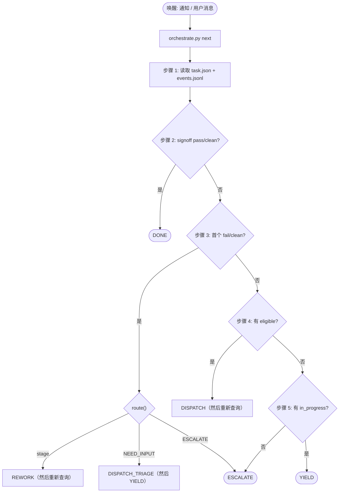

# VeriPower 架构

> VeriPower 阶段门控、事件溯源的代理流水线——设计原理与契约。

---

## 目录

- [术语表](#术语表)
- [1. 为什么选择 VeriPower](#1-为什么选择-veripower)
- [2. 系统模型](#2-系统模型)
- [3. 流水线 DAG](#3-流水线-dag)
- [4. 状态模型](#4-状态模型)
- [5. Orchestrator 决策循环](#5-orchestrator-决策循环)
- [6. 子代理契约](#6-子代理契约)
- [7. 工作空间布局](#7-工作空间布局)

---

## 术语表

核心自创术语，每个在此定义一次并在链接章节中详细阐述。各阶段专属契约（各阶段的 `result.json` 字段、CLI 标志、路由表）不在本文档中重复——它们存在于各自的 schema / `--help` / `route.py` 中。

| **术语** | **英文原意** | **中文说明** |
|---|---|---|
| **Orchestrator** | The `design-flow` agent in the main conversation; the only role that calls `state.py`, dispatches `Task()`s, and talks to the user. (§2.3) | 编排器。主会话中的 `design-flow` 代理；唯一可以调用 `state.py`、调度 `Task()` 并与用户交互的角色。 |
| **reducer** | `orchestrate.py next` — reads on-disk state and returns exactly one action per call; the Orchestrator is its thin executor. (§5) | 归约器。`orchestrate.py next`——读取磁盘状态，每次调用返回恰好一个动作；Orchestrator 是其薄执行器。 |
| **main-thread-loaded** | A stage loaded via `Skill()` in the Orchestrator's own thread instead of via `Task()` — `specification`, `simulation-plan`, `rtl-design`, `simulation`. (§2.2) | 主线程加载。通过 `Skill()` 在 Orchestrator 自身线程中加载的阶段，而非通过 `Task()` 调度——`specification`、`simulation-plan`、`rtl-design`、`simulation`。 |
| **Level-1 sub-Task** | A `Task()` a main-thread skill dispatches for intra-stage fan-out. Level-2 (a sub-Task dispatching a further `Task()`) is forbidden — the audit boundary. (§2.2, §6.3.1) | 一级子 Task。主线程技能为阶段内扇出而调度的 `Task()`。二级（子 Task 再调度 `Task()`）被禁止——这是审计边界。 |
| **reap** | Closing an in-flight run with `state.py complete` (normally no `--outcome`), letting `cmd_complete` derive the outcome from the run's `result.json`. How every dispatch finishes and how a crashed run is repaired. (§5.1) | 收割。用 `state.py complete`（通常无 `--outcome`）关闭一个运行中的 run，由 `cmd_complete` 从 run 的 `result.json` 推导结果。每次调度的结束方式和崩溃 run 的修复方式。 |
| **promote** | The per-entry hardlink merge from `runs/<N>/` to the canonical stage dir, run by `cmd_complete` on pass *and* fail. Idempotent. (§7.2) | 提升。从 `runs/<N>/` 到规范阶段目录的逐条目硬链接合并，由 `cmd_complete` 在 pass 和 fail 时均执行。幂等。 |
| **cascade-stale** | BFS that sets every `pass`/`fail`/`in_progress` descendant of a just-passed or rework-targeted stage to `stale`. (§4.4) | 级联失效。BFS 将一个刚通过或被指定为返工目标的阶段的每个 `pass`/`fail`/`in_progress` 后继设为 `stale`。 |
| **status × freshness** | A stage's two independent attributes: `status ∈ {not_started, in_progress, pass, fail}`, `freshness ∈ {clean, stale}`. (§4.2) | 状态×新鲜度。每个阶段的两个独立属性。 |
| **in-flight / run** | `run` (= `current_run`) is the monotonically increasing dispatch number; `in_flight[]` lists runs not yet reaped. (§4.3) | 运行中 / run。`run`（即 `current_run`）是单调递增的调度编号；`in_flight[]` 列出尚未收割的 run。 |
| **determinism boundary** | The split everything hangs off: judgment in the Orchestrator, state in `state.py`, deterministic computation in sibling scripts (`route.py`, `orchestrate.py`, `convergence`). (§2.4) | 确定性边界。一切赖以支撑的划分：判断在 Orchestrator 中，状态在 `state.py` 中，确定性计算在同级脚本中（`route.py`、`orchestrate.py`、`convergence`）。 |

---

## 1. 为什么选择 VeriPower

VeriPower 将确定性状态机与 LLM Orchestrator 分离：路由错误无法损坏已完成的工作，因为 `state.py` 永远不会遗忘。这种分离是结构性的，而非附带的——本文档中的每个架构决策都建立在此之上。

三个承诺使其可行；每个承诺在其所在位置详细阐述：

- **确定性核心掌管所有状态。** `state.py` 拥有阶段状态、前置条件检查、cascade-stale 和事件追加；Orchestrator 仅拥有判断（返工、升级、上下文编写），其所依赖的确定性计算位于它所执行的同级脚本中——即 *determinism boundary*（§2.4）。
- **并发由拓扑自然产生。** 每个阶段携带 `status × freshness`，DAG 前置条件驱动 cascade-stale；`distinct in-flight ≤ 2` 的上限由 DAG 产生，而非策略规定（§3.2）。
- **事件日志是防篡改的。** `events.jsonl` 是审计真相，`task.json` 是可重建的投影；Orchestrator 只能编写 8 种事件类型中的 3 种，因此每个 AI 路由决策都在记录中（§4.5）。

VeriPower 不是一个服务：没有守护进程、没有数据库、没有 HTTP——磁盘文件就是数据库。它不绑定供应商：技能在 `SKILL_OF` 调度接合点可替换。它不是一个一次性代理：流程容忍数小时的返工风暴，其中阶段失败、cascade-stale 波及依赖、跨 Orchestrator 轮次重试。

## 2. 系统模型

### 2.1 三层架构

Orchestrator 代理做决策；`state.py` 和技能执行；磁盘持久化。

```
┌────────────────────────────────────────────────────────────────────────────────────┐
│             Orchestrator Agent  ( veripower:design-flow )                          │
│  main conversation; forward dispatch / rework routing / convergence /              │
│  escalation / user collaboration                                                   │
└──┬───────────────────────────┬────────────────────────────────┬────────────────────┘
   │ Bash                      │ Skill()                        │ Task()
   │ state.py + route.py CLI   │ veripower:specification        │ general-purpose
   │                           │ veripower:simulation-plan      │ (the 5 Task stages)
   │                           │ veripower:rtl-design           │
   │                           │ veripower:simulation           │
   │                           │ (main-thread loaded)           │
   ▼                           ▼                                ▼
┌────────────────────┐  ┌──────────────────────────────┐  ┌──────────────────────────┐
│ Deterministic core │  │  Main-thread skill           │  │  Stage / Debug Subagent  │
│ (Python)           │  │  (runs in Orchestrator's     │  │  (isolated context)      │
│                    │  │   main thread)               │  │                          │
│ state.py:          │  │                              │  │  Stage: executes stage   │
│   state + 8 cmds   │  │  specification:              │  │    → writes result.json  │
│ orchestrate.py:    │  │    fan-out → design.md       │  │  Debug: read-only triage │
│   next (reducer)   │  │    design.md / manifest.json │  │    → returns ANALYSIS    │
│ route.py:          │  │    SDC / SGDC / result.json  │  │                          │
│   rework target    │  │  simulation-plan:            │  │  Must NOT call state.py  │
│                    │  │    plan generation +         │  │  or make routing calls   │
│                    │  │    review loop               │  │  (see §6.1 for full)     │
│                    │  │  rtl-design:                 │  │                          │
│                    │  │    per-child RTL fan-out     │  │                          │
│                    │  │  simulation:                 │  │                          │
│                    │  │    env → smoke gate → verify │  │                          │
└──────────┬─────────┘  └──────────────────────────────┘  └──────────────────────────┘
           │ reads/writes
           ▼
┌────────────────────────────────────────────────────────────────────────────────────┐
│                              asic/<module>/                                        │
│                                                                                    │
│   task.json                          stage state snapshot                          │
│   events.jsonl                       append-only event log                         │
│   Design/<stage>/result.json         specification / rtl-design / lint-cdc /       │
│                                      synthesis / timing-analysis                   │
│   Verification/<stage>/result.json   simulation-plan / simulation /                │
│                                      power-analysis                                │
│   frontend-signoff/result.json       frontend-signoff stage output                 │
└────────────────────────────────────────────────────────────────────────────────────┘
```

Orchestrator 的三条调度路径：

- **Bash** → `state.py` CLI（8 条命令：`init`、`status`、`start`、`complete`、`rework`、`invalidate-stage`、`convergence`、`log`）；
  `orchestrate.py next` reducer（每次调用返回一个动作；见 §5）；
  `topology.py` DAG 单一真相源（`PREREQ_OF`、`eligible()`）；
  `route.py` 返工路由器（纯目标选择；组合在 `orchestrate.py` 内部；见 §5.4）
- **Skill()** → 主线程技能（`specification`、`simulation-plan`、`rtl-design` 和 `simulation`）
- **Task()** → 阶段子代理和调试子代理

### 2.2 main-thread-loaded 的阶段

`veripower:specification`、`veripower:simulation-plan`、`veripower:rtl-design` 和 `veripower:simulation` 是仅有的四个不通过 `Task()` 调度的阶段——这四个阶段均通过 `Skill()` 在 Orchestrator 的主线程中加载。`Task()` 子代理既不能在中途与用户交互，也不能进一步调度 `Task()`，而这四个阶段各需其中一种能力。

> **契约：** `Task()` 子代理不得调度另一个 `Task()`——禁止二级调度（审计边界）。因此，需要扇出一级子 Task 的阶段不能作为 Task 子代理运行； main-thread-loaded 是保持该边界的同时拥有扇出调度权限的*唯一*方式。`specification` / `rtl-design` / `simulation` 为 main-thread-loaded 以获取扇出权限；`simulation-plan` 为 main-thread-loaded 以支持多轮用户对话。

各阶段的触发条件：

- **specification** — 消费一个已冻结、已批准的 `brainstorm.md`；一个扇出调度器（分解 + 围绕分区门控的按子模块子 Task 波次）加上三个主线程门控脚本：`derive_child_ports.py`（门前，输入分区门控摘要；不读取正文）、`check_coverage.py`（门前，裁决输入 design.md 批准门控）、`derive_constraints.py`（门后，从已批准的 §1.6 + §1.4.1 表推导完整的 SDC/SGDC）。不是因为头脑风暴对话而 main-thread-loaded——该对话已移至流水线前的 `brainstorm` 技能。
- **simulation-plan** — 与用户的多轮计划审查对话（其 main-thread-loaded 的唯一原因）。
- **rtl-design** — 仅扇出，无对话：每个子模块一个一级子 Task（`N = len(manifest.children[])`，包括顶层集成子模块；无 N==1 豁免），然后一个最终化子 Task。
- **simulation** — 仅扇出，无对话：共享一个阶段 `{workdir}` 的两个顺序子 Task 波次——`env-child`（引导 + 填充脚手架 + 编译 + 冒烟）→ 一个确定性的主线程冒烟门控 → `verify-child`（回归 + 覆盖）。形态最接近 `specification` 的两波围绕门控；调度类别与 `rtl-design` 相同。

对于这四个阶段，Orchestrator 仍然调用 `state.py start/complete/log` 并读取规范的 `result.json` 以进行失败路由（§5.4，非 reap——reap 不读取任何内容；§5.1）；只是其工具历史中没有阶段级的 `Task()`。

> **红旗：** 如果 `Skill(veripower:lint-cdc|synthesis|timing-analysis|power-analysis|frontend-signoff)` 出现在 Orchestrator 的工具历史中，这是一个 bug——这五个阶段必须通过 `Task()` 调度。

**流水线前的 `brainstorm` 技能（非 Orchestrator 调度）。** 繁重的 D0–D7 需求对话在单独的会话中运行，作为一个独立的 `brainstorm` 技能——它不属于上述四个主线程阶段，且永不被 Orchestrator 调度。它产生流水线起始的已批准 `asic/<module>/brainstorm.md`（模块根目录）；不写 `result.json`，不调用 `state.py`。DAG 入口前置条件见 §3。

### 2.3 角色职责

| **角色** | **载体** | **职责** | **能力边界** |
|---|---|---|---|
| **Orchestrator 代理** | `design-flow` 技能，主会话 | 前向调度、返工路由（依据 `route.py` 的目标选择）、收敛判断、升级、用户协作；同时作为 `specification` / `simulation-plan` / `rtl-design` / `simulation` 阶段的主线程执行器 | 唯一可以调用 `state.py`、使用 Task 工具并与用户交互的角色 |
| **主线程技能** | `veripower:specification`、`veripower:simulation-plan`、`veripower:rtl-design` 或 `veripower:simulation`，通过 Orchestrator 的 `Skill()` 加载 | 在 Orchestrator 线程中的自驱动工作：`specification` 运行两个子 Task 波次（分解 + 按子模块）加上主线程脚本和两个路径交接门控（无 D0–D7 对话——已移至流水线前的 `brainstorm` 技能）；`simulation-plan` 运行多轮计划审查对话；`rtl-design` 无对话但持有一级扇出调度权限（§2.2）；`simulation` 同样无对话且持有一级扇出调度权限——两个顺序子 Task 波次（环境构建 → 冒烟门控 → 验证，§2.2）。每个技能写入自身产物 + `result.json`。 | `simulation-plan` 可跨轮次与用户交互；`specification` 额外在其两个路径交接门控处进行交互；`specification` / `rtl-design` / `simulation` 可调度一级子 Task（§6.3.1）。其他边界与阶段子代理相同（无 `state.py`、无路由）。契约由 SKILL.md 散文纪律持有，而非工具门控。 |
| **阶段子代理** | 五个通过 Task 调度的阶段技能（`lint-cdc` / `synthesis` / `timing-analysis` / `power-analysis` / `frontend-signoff`），通过 Task 工具调度 | 执行一个阶段：读取上游 → 完成工作 → 写入 `result.json` → 返回 STATUS 行 | 不得调用 `state.py` 或做路由决策（完整 5 项清单见 §6.1） |
| **调试子代理** | `simulation-triage` 技能，通过 Task 工具调度 | 对仿真失败进行只读根因分析；返回两层 ANALYSIS（一个路由 JSON 块——`root_cause`/`analysis_state`——加上一个散文分析部分） | 不修改任何状态——绝不编辑 `task.json`、`result.json`、RTL 或测试 |
| **`state.py`** | Python CLI | 状态转换、前置条件验证、 cascade-stale 传播、事件日志追加、上下文收集；尽力而为的异步子代理转录镜像（`cmd_complete` 上的遥测副作用，见 §6.6） | 不包含路由逻辑，不做判断 |
| **`route.py`** | Python CLI（`state.py` 的同级脚本） | 纯确定性返工目标选择——将失败的封闭枚举字段映射到目标 / `ESCALATE` / `NEED_INPUT` | 无状态持有；输入是 CLI 标量标志（`--guideline`、`--by-target-rtl`，在仿真路径上还有 `--root-cause`/`--analysis-state`）加上可选传入的 `result.json`。Orchestrator 读取其 JSON 输出并按 `decision` 行动。不执行状态转换。 |

### 2.4 核心设计原则

- **判断在 Orchestrator 中，状态在 Python 中，确定性计算在同级脚本中**——*determinism boundary*。Orchestrator 做出判断调用（升级、返工上下文）；`state.py` 维护状态事实；既非判断亦非状态的确定性决策支持——收敛计数（`cmd_convergence`）、返工目标选择（`route.py`）以及完整的控制循环决策（`orchestrate.py next` reducer）——存在于 Orchestrator 执行的脚本中。三者不可混淆。*可执行*的能力边界（谁可以调用 `state.py` / `Task()` / 用户）是 §2.3 的角色表。
- **决策边界 = 工具边界。** 每个 Orchestrator 决策都下推到 `orchestrate.py next` reducer；Orchestrator 是一个轻量执行器，在 `state.py` 调用之间除了调用 reducer 之外不做任何事。其可验证的循环形式——*两次连续的 `state.py` 调用之间没有 reducer 调用即为 bug*——见 §5.5。
- **文件即数据库。** `task.json` 是快照，`events.jsonl` 是审计日志，`result.json` 文件是阶段输出。无中间缓存，无服务端存储。
- **压缩安全恢复。** 因为文件即数据库，会话中的上下文压缩（或进程崩溃）是可幸存的：Orchestrator 和每个子代理都仅从磁盘无损恢复，没有任何仅存于对话中的关键信息。持久真相在磁盘上——`task.json`、`events.jsonl`、各阶段的 `result.json`。Orchestrator 在轮次之间**不持有任何持久控制状态**——每个轮次均通过 `orchestrate.py next` 从磁盘重新推导下一个动作。唯一的会话驻留状态是在 `REWORK` 时编写并在目标的 `DISPATCH` 时于同一轮次内消费的 `orchestrator_context` 提示——**可重新推导，非持久**（一旦传递给 `cmd_start`，它就以 `orchestrator-context.md` 的形式得到磁盘备份）；见 §5。
- **单向通信。** Orchestrator → 提示 → 子代理 → `result.json` + STATUS。没有子代理发起的对 Orchestrator 的回调；没有子代理之间的通信。
- **上下文隔离。** 子代理接收全新提示；它们不继承父会话的历史。所有必需输入通过文件路径或提示字段显式传递。

## 3. 流水线 DAG

VeriPower 的前端流水线有 9 个固定阶段，由前置条件的 DAG 连接；返工通过 cascade-stale 传播。

```
[specification] → [simulation-plan] → [rtl-design]
                                            │
                          ┌─────────────────┴──────────────────┐
                          ↓                                    ↓
                     [lint-cdc]                          [simulation]
                          │                                    │
                          ↓                                    │
                     [synthesis]                               │
                          │                                    │
                          ↓                                    │
                  [timing-analysis]                            │
                          │                                    │
                          └─────────────────┬──────────────────┘
                                            ↓
                                    [power-analysis]
                                            │
                                            ↓
                                    [frontend-signoff]
```

**DAG 入口前置条件。** 流程从一个已批准的模块根目录下的 `brainstorm.md`（`asic/<module>/brainstorm.md`）开始，由流水线前的 `brainstorm` 技能（§2.2）产生。它是流水线前的输入，而非 DAG 阶段——`specification` 的前置条件列保持 `—`，`topology.py` 的 `PREREQ_OF` 保持 9 个阶段不变。

### 3.1 规范 DAG 表

| **阶段** | **前置条件** | **技能** | **典型产物位置** |
|---|---|---|---|
| specification | — | `veripower:specification`（主线程） | `Design/specification/`（design.md / manifest.json / coverage.json / `<child>`.md / constraints/`<TOP>`.{sdc,sgdc}） |
| simulation-plan | specification | `veripower:simulation-plan`（主线程） | `Verification/simulation-plan/`（verification-plan.md / scaffold-specification.json） |
| rtl-design | simulation-plan | `veripower:rtl-design`（主线程） | `Design/rtl-design/`（*.v / *.sv / filelist） |
| lint-cdc | rtl-design | `veripower:lint-cdc` | `Design/lint-cdc/`（SpyGlass 报告） |
| synthesis | lint-cdc | `veripower:synthesis` | `Design/synthesis/`（网表、*.ddc、报告） |
| timing-analysis | synthesis | `veripower:timing-analysis` | `Design/timing-analysis/`（slack、约束报告） |
| simulation | rtl-design | `veripower:simulation`（主线程） | `Verification/simulation/`（UVM 环境 / 回归报告 / 日志 / VCD） |
| power-analysis | timing-analysis + simulation | `veripower:power-analysis` | `Verification/power-analysis/`（GLS simv / saif/`<id>`.saif / scaffold/power_tests/ / 平均功耗报告） |
| frontend-signoff | power-analysis | `veripower:frontend-signoff` | `frontend-signoff/`（检查清单、可追溯性报告） |

前向调度遵循优先级顺序 `specification → simulation-plan → rtl-design → lint-cdc → synthesis → timing-analysis → simulation → power-analysis → frontend-signoff`（与 `topology.py` 的 `FORWARD_PRIORITY` 一致）。返工合法性：`target_stage` 必须是 `failed_stage` 的 DAG 祖先——由 `state.py` 的 `cmd_rework` 强制执行。

`frontend-signoff` 的前置条件列仅写 `power-analysis`——lint-cdc 未显式列出，因为它通过 `lint-cdc → synthesis → timing-analysis → power-analysis` 的传递依赖阻塞 signoff。DAG 在结构上强制执行阻塞关系；前置条件表避免冗余边。

### 3.2 三阶段形态

| **阶段组** | **包含阶段** | **主线程 vs Task** | **并发上限** |
|---|---|---|---|
| 1（串行） | specification → simulation-plan → rtl-design | 三者均为主线程；`rtl-design` 总是通过 `Task()` 调度 `N = len(manifest.children[])` 个一级子 Task（每个子模块一个，含顶层集成子模块），然后一个最终化子 Task | distinct in-flight ≤ 1 |
| 2（双链并行） | `{lint-cdc → synthesis → timing-analysis}` ‖ `{simulation}` | 链 1 为 Task 子代理；`simulation` 是 main-thread sub-orchestrator，调度其自身的阶段内子 Task（环境构建 → 冒烟门控 → 验证） | distinct in-flight ≤ 2 |
| 3（汇合） | power-analysis → frontend-signoff | 全部为 Task 子代理 | 1 |

**扇出子 Task 是阶段内部且对 state.py 不可见的。** 当 `specification`、`rtl-design` 或 `simulation` 调度一级子 Task 时（生产者的按子模块工作；simulation 的环境构建 / 验证波次），这些子 Task 在主线程技能自身的执行窗口中运行；它们不写 `task.json`，不追加事件，不出现在 `state.py` 的 in-flight 记账中。因此它们**不计入** `distinct in-flight ≤ 2` 的 DAG 拓扑属性——该属性仅适用于 `state.py` 跟踪的阶段级调度。见 §6.3 了解调度权限例外。

**`distinct in-flight ≤ 2` 由 DAG 拓扑决定，而非策略。** 阶段组 2 有两条链（`{lint-cdc → synthesis → timing-analysis}` 和 `{simulation}`）；每条链内部串行。最坏情况：`{lint-cdc, synthesis, timing-analysis}` 中任意一个在链 1 上 in-flight，同时 `simulation` 在链 2 上 in-flight——distinct *stages* = 2。`simulation` 在链 2 上占用一个阶段槽位，无论其有多少阶段内子 Task 在运行（这些对 state.py 不可见，见上段），因此将其提升为 main-thread sub-orchestrator 不会改变此上限。阶段组 3 是单条串行链：power-analysis 要求 timing-analysis 和 simulation 都完成后才变为 eligible；frontend-signoff 等待 power-analysis 通过；distinct = 1。同阶段多 run 共享一个 distinct-stage 槽位（实际上只有 `simulation` 会这样做）；物理 Task 数量可能短暂超过 2，但 distinct-stage 数量保持 ≤ 2。

> **契约：** Orchestrator 不写并发上限。`distinct in-flight ≤ 2` 由 DAG 拓扑保证，不由策略强制执行。本节是其归属——§1 和 §5.2 中的提及引用于此。

### 3.3 前向调度与返工

**前向调度。** 优先级顺序与 `state.py` 的 `FORWARD_PRIORITY` 一致。每个轮次，Orchestrator 调度所有 eligible 的阶段（隐式并行）。`eligible(stage)` 要求：所有 DAG 前置条件为 `pass/clean`；阶段本身不是 `in_progress/clean`、`pass/clean` 或 `fail/clean`（即 `not_started/clean`、`*/stale` 和 `in_progress/stale` 均可重新调度——最后一种情况合法化了 cascade 命中下的同阶段多 run）。

**返工。** 不受 DAG 顺序约束——Orchestrator 可以基于失败语义返工到任意祖先阶段。唯一约束：`target_stage` 必须是 `failed_stage` 的 DAG 祖先（由 `state.py` 强制执行）。返工将 `target_stage` 设为 `stale` 并级联所有后代的 `pass / fail / in_progress` 状态为 `stale`；`in_progress` 的 run 不会被杀死——它们自然完成并由 `cmd_complete` 丢弃。

典型的返工处理闭环：

- **simulation 失败** → `simulation-triage` 调试子代理 → 返工到 `rtl-design` / `specification` / `simulation-plan`。
- **PPA 失败**：synthesis 判断 area/timing_slack；power-analysis 判断 power_mw；timing-analysis 判断 setup/hold。任一失败 → reducer 进行路由（基于收敛，通过 `route.py`；见 §5），返回 `REWORK`/`ESCALATE` 供 Orchestrator 执行。对于 power-analysis 工具故障（GLS 错误、SAIF 缺失），子代理写入 `failures[].{phase, category, error_summary}`；`route.py` 将 `category` 映射到上游 DAG 目标（见 §5.4 和 `framework/scripts/route.py`）。

## 4. 状态模型

### 4.1 持久化文件

所有状态位于 `asic/<module>/` 下：

| **文件** | **角色** | **写入者** |
|---|---|---|
| `task.json` | 阶段状态快照（status × freshness） | `state.py` |
| `events.jsonl` | 仅追加事件日志 | `state.py` |
| `asic/<module>/brainstorm.md` | 头脑风暴最终版（design.md 的唯一上游；流水线输入） | 流水线前 `brainstorm` 技能（独立会话） |
| `Design/specification/result.json` | specification 阶段输出（含 design.md / SDC / SGDC 引用） | Orchestrator 主线程（specification 技能） |
| `Design/rtl-design/result.json` | rtl-design 阶段输出 | Orchestrator 主线程（rtl-design 技能） |
| `Design/<stage>/result.json` | 阶段输出（lint-cdc / synthesis / timing-analysis） | 阶段子代理 |
| `Verification/simulation-plan/result.json` | simulation-plan 阶段输出 | Orchestrator 主线程（simulation-plan 技能） |
| `Verification/simulation/result.json` | simulation 阶段输出 | Orchestrator 主线程（simulation 技能） |
| `Verification/power-analysis/result.json` | power-analysis 阶段输出（合并的 GLS + PT-PX） | 阶段子代理 |
| `frontend-signoff/result.json` | frontend-signoff 阶段输出 | 阶段子代理 |

### 4.2 阶段状态：二维

每个阶段携带两个独立属性——`status ∈ {not_started, in_progress, pass, fail}` 和 `freshness ∈ {clean, stale}`。合法组合：

| **status/freshness** | **含义** |
|---|---|
| `not_started/clean` | 尚未运行 |
| `in_progress/clean` | 当前正在执行（其前置条件仍为 `pass/clean`） |
| `in_progress/stale` | 仍在运行，但其前置条件已被返工修改——当此 run 完成时，`cmd_complete` 将其路由到丢弃分支；eligibility 允许重新调度（同阶段多 run，由 `current_run` 物理隔离） |
| `pass/clean` | 已通过且输入未变 |
| `pass/stale` | 先前已通过，但上游变更使其需要重新运行 |
| `fail/clean` | 已失败，等待返工决策 |
| `fail/stale` | 之前已失败且上游已变更（继续失败无意义；应从 eligible 的上游重新开始）；或当规范 hardlink 失败时的 `_non_success_finalize` 派生状态 |

`in_progress/stale` 是双链并行执行期间 cascade-stale 波及运行中阶段的必然结果——返工不阻塞、不杀死 Task、不等待退出。

**阶段生命周期。** 上述组合通过以下转换移动：


边标签仅为触发条件；条件细节存在于正文中。stale 状态在其前置条件再次变为 `pass/clean` 后重新调度；当上游阶段重新通过或返工目标为当前阶段或其祖先时触发 `cascade-stale`；`in_progress/stale` 的原始 run 在 reap 时被丢弃（不 promote）。非成功 reap（`blocked` / `invalid` / `discarded`）清除 run 而不进入终止状态（§5.1），在上图中省略。`in_progress/clean → in_progress/stale → 重新调度` 路径使双链返工变为非阻塞（§4.4）。

### 4.3 task.json 各阶段字段

除 `status` 和 `freshness` 外，每个阶段还携带：

| **字段** | **类型** | **含义** |
|---|---|---|
| `current_run` | `int \| null` | 单调递增的 run 编号；每次 `start` 时递增。若从未启动则为 `null`。 |
| `in_flight` | `array` | 当前未完成的调度列表，元素为 `{run: int}`。同阶段多 run 共存于此（实际上只有 `simulation` 会这样做）。 |

### 4.4 Cascade-stale 传播

当某阶段转换到 `pass` 或被指定为返工目标（设为 `stale`）时，`state.py` BFS 遍历其后代并将每个 `pass / fail / in_progress` 后代设为 `stale`（`not_started` 后代不受影响）。`in_progress` 变为 `stale` 使双链并行返工变为非阻塞——正在运行的下游被合法化为 `in_progress/stale`，其原始 run 将被 `cmd_complete` 自动丢弃。

### 4.5 事件类型

`events.jsonl` 有 **8 种事件类型**，每种由其自身的 JSON Schema 在 `framework/references/schemas/events/<type>.schema.json` 中验证；`append_event` 在写入时验证。

| **type** | **写入者** | **触发条件** | **关键正文字段** |
|---|---|---|---|
| `dispatch` | `state.py`（自动） | `start` 命令 | `stage`、`mode ∈ {forward, rework}`、`run`、`workdir` |
| `outcome` | `state.py`（自动） | `complete` 命令 | `stage`、`run`、`result_status`、`reason?` |
| `cascade` | `state.py`（自动） | `complete` / `rework` 触发级联 | `source_stage`、`staled[]` |
| `rework_decision` | `state.py`（自动） | `rework` 命令 | `failed_stage`、`target_stage`、`reason`、`run`（failed_stage 的 current_run，必填） |
| `invalidate` | `state.py`（自动） | `invalidate-stage` 命令 | `stage`、`reason` |
| `debug_dispatch` | Orchestrator（`log`） | 调度 `simulation-triage` | `module`、`failure_phase?` |
| `debug_result` | Orchestrator（`log`） | （当前未发出——验证已移至 `simulation-triage` 的生产者自检门控；schema 保留以供向前兼容） | `validation ∈ {ok, error}`、`root_cause?` |
| `escalation` | Orchestrator（`log`） | Orchestrator 放弃 | `reason_code`、`reason` |

`outcome.result_status` 是一个 **6 值枚举**。`pass` / `fail` / `blocked` 在 reap 时由 `cmd_complete` 从 run 的 `result.json` 解析（或通过显式的 `complete --outcome` 强制指定）；`invalid`（schema 不合规的 `result.json`）、`discarded`（被返工或 cascade-stale 取代的 run）和 `promote_failed`（规范 hardlink 合并失败）始终由 `state.py` 内部推导。`discarded` 的子情况及 `reason_code` 文本格式为 `state.py` 的实现细节——投影（§4.6）将所有四个子情况同等对待。所有事件携带 UTC ISO8601 时间戳。

`cmd_log` 白名单：Orchestrator 只能通过 `cmd_log` 编写 **8 种事件类型中的 3 种**——`debug_dispatch`、`debug_result`、`escalation`。其他 5 种（`dispatch`、`outcome`、`cascade`、`rework_decision`、`invalidate`）作为 `state.py` 状态转换的副作用产生，若通过 `cmd_log` 外部注入则被**拒绝**。这防止审计日志通过代理提示被伪造。

### 4.6 写入顺序不变量

所有 `state.py` 状态变更命令（`cmd_init`、`cmd_start`、`cmd_complete`、`cmd_rework`）遵循三阶段模式：

1. **验证 + 计算**（对 task 副本进行内存中编辑，包括用于 staled 列表的纯函数 `_compute_cascade()`；无磁盘写入）。
2. **事件优先**：一个或多个 `append_event(...)` 调用。
3. **状态在后**：单次 `write_task(module, task_final)` 持久化。

**此顺序的原因：** `events.jsonl` 是审计真相。如果崩溃发生在步骤 2 和步骤 3 之间，事件已记录完整意图，`task.json` 可以从中重建（下方的投影契约）。反向顺序不奏效——在 `append_event` 之前 `write_task` 会在崩溃时留下状态-事件不匹配。

**投影契约。** `task.json` 是 `events.jsonl` 的*投影*——事件日志的纯函数，仅读取事件，从不读取 `task.json`，这使得"事件即真相"可验证而非口号。在正向路径上它是精确的：`dispatch` 设置阶段为 `in_progress/clean` 并记录 run；`outcome` 设置 `pass`/`fail` 并清除 run；`cascade` 将 `pass`/`fail`/`in_progress` 后代设为 stale；`rework_decision` 自身不携带状态（其效果通过后续的 `cascade` 落地）。非成功终止状态（`blocked`/`invalid`/`discarded`/`promote_failed`）*不能*仅从事件重现——它们的最终化是 `state.py` 行为，重建崩溃后 `task.json` 的操作者从规范状态推导它们。因此投影对于干净历史是精确逆函数，对于其他情况是恢复起点——一个参考定义，而非交付代码。

**Promote 位于验证与成功路径计算之间。** `cmd_complete` 在每个路径上首先验证（in-flight 检查、schema、前置条件新鲜度、自身新鲜度）。非成功结果（`blocked`、`invalid`、`prereq_changed`、`stage_staled_during_run`）随后分支到 `_non_success_finalize`，执行自身的计算-事件-状态并退出——promote 在这些路径上永不被调用。只有 `pass` 和 `fail` 结果在验证后继续；它们调用 `promote()`（从 `runs/<N>/` 到规范的逐条目硬链接合并），然后运行计算-事件-状态序列。此磁盘写入在事件之前是有意为之——promote 结果（成功 vs `promote_failed`）决定运行哪个计算分支。崩溃恢复仍然成立，因为 promote 是幂等的（§7.2）：该幂等性使事件优先/状态在后能在中断 promote 的崩溃中幸存。

### 4.7 Schema 验证不变量

每个 `result.json` 验证 `framework/references/schemas/envelope.schema.json`（跨阶段信封：`stage` / `module` / `produced_at` / `status` / `artifacts` / `stage_specific`）加上 `skills/<stage>/references/result.schema.json` 中的各阶段 schema。每个事件验证 `framework/references/schemas/events/<type>.schema.json`（8 个 schema，每个类型一个）。验证在 `cmd_complete`（对 `result.json`）和 `append_event`（对每个事件）时运行；各字段语义存在于每个 schema 的 `description` 字符串中。

## 5. Orchestrator 决策循环

Orchestrator 结构为一个设置块加上由 `orchestrate.py next` reducer 驱动的轻量执行器循环。控制流遵循轮次纪律：每个用户消息或 task-notification 触发恰好一个轮次，以 `YIELD`、`DONE` 或 `ESCALATE` 结束。当收到下一个通知时，Claude Code 框架重新进入循环。

持久状态驻留在磁盘上（`task.json`、`events.jsonl`、各阶段的 `result.json`）；因此循环是**压缩安全**的（§2.4）。这对循环的具体要求：渲染到子代理提示中的每个字段都源自 `state.py` 的磁盘产物（*disk-sourced payload* 承诺；逐字段细节见 §5.3），因此会话历史状态仅通过 `cmd_start` 时的磁盘备份 `--orchestrator-context` 通道到达子代理。唯一的瞬态规划状态是只读的 `simulation-triage` `ANALYSIS` 以及从中组合的调度上下文——在对话中持有直到在下一个 `cmd_start` 注入，然后持久化为 `orchestrator-context.md`。两者都是可重新推导的：如果压缩在中途丢弃它们，下一个轮次调用 `orchestrate.py next`，发现阶段仍为 `fail/clean`，并重新调度只读、幂等的 `simulation-triage`，然后重新组合上下文。持久的返工结果（`rework_decision` 目标+原因，或升级原因）一旦决定就在磁盘上，因此最坏情况下压缩重复一次分诊，永不会丢失决策。中途被压缩或崩溃的子代理同样是阶段粒度无损的：其缺失或半写的 `result.json` 在 reap 时被捕获（§5.1），阶段从其磁盘输入重新运行。

### 5.1 设置与 reap

reap 在两种模式下运行：

- **会话启动 reap（每个会话一次）。** 当 Orchestrator 首次附着到模块时，它运行 (1) `state.py init --module <M>`（幂等——若缺失则创建 `asic/<M>/task.json`），(2) `state.py status --module <M>` 获取当前阶段快照，(3) 对 `task.json` 的 `in_flight[]` 列表中的每个阶段执行 reap （如下所述）。这是崩溃恢复模式：如果 Orchestrator 在中途挂掉，任何未写入的 `outcome` 事件在新调度之前在此修复。
- **唤醒轮次 reap（每个通知）。** 当后台 `Task()` 写入其 STATUS 行时，Claude Code 框架注入 `<task-notification>`。Orchestrator 在重新进入主循环之前对该通知绑定的 (stage, run) 执行 reap。这是稳态模式——每个调度的 run 通过唤醒轮次 reap 完成。

**reap 机制**（两种模式通用）：对于每个 `in_flight` 的 `(stage, run)`，Orchestrator 通常调用 `state.py complete --stage <S> --run <N>` 且**不带** `--outcome`——它不读取 `result.json`。`cmd_complete` 读取 run 自身的 `result.json` 并推导结果：格式良好的 `status ∈ {pass,fail}` → 对应结果；缺失 / 不可解析 / 非对象 / 格式错误的 `status` → `blocked`；存在但 schema 无效 → `invalid`（§4.7）。唯一例外：Orchestrator 自身检测到 cascade-stale 的 run，使用显式的 `--outcome blocked` 完成（`skills/design-flow/SKILL.md` 中的 Step 5 stale 分支）。

### 5.2 执行器循环（每轮次）

Orchestrator 调用 `orchestrate.py next --module <M> [--wake <stage>:<run>] [--analysis -]` 并恰好执行其返回的一个动作，循环直到动作为 `YIELD`、`DONE` 或 `ESCALATE`。 reducer 编码了以下决策步骤；下方散文仍然是权威契约。



叶动作决定了后续行为：`REWORK` 和 `DISPATCH` 重新查询 `next`（重新查询循环——若干失败或调度在一个轮次中解决）；`DISPATCH_TRIAGE` 在 `YIELD` 处结束轮次。下方散文步骤是每个方框的权威契约。

**步骤 1：读取状态。** reducer 在进程中读取 `task.json` + `events.jsonl`（`read_task` / `read_events`，加上相关的 `result.json` 和任何管道传入的 `--analysis` 负载）——它不通过 shell 调用 `state.py status`。生成的快照是本次调用中所有决策的唯一真相源。

**步骤 2：若完成则终止。** 若 `frontend-signoff` 的 `status=pass` 且 `freshness=clean` → 返回 `DONE`。

**步骤 3：处理首个失败。** 按 `FORWARD_PRIORITY` 扫描阶段。找到首个 `status=fail` 且 `freshness=clean` 的阶段。若存在，通过 `route.py` 进行路由（组合收敛 + 结果输入）并返回适当动作（`REWORK`、`DISPATCH_TRIAGE` 或 `ESCALATE`）。不变量：**每次 reducer （`next`）调用处理一个失败；多个失败可通过重新查询循环在一个轮次中解决**——当返工目标是多个 `fail/clean` 阶段的公共祖先时，级联在首次 REWORK 时将其变为 `fail/stale`，因此后续重新查询不会看到更多失败。

**步骤 4：前向调度。** 对每个按 `FORWARD_PRIORITY` 顺序 `eligible(stage)` 的阶段，返回 `DISPATCH`。`eligible` 要求：所有 DAG 前置条件为 `pass/clean`；阶段本身不是 `in_progress/clean`、`pass/clean` 或 `fail/clean`。不变量：distinct in-flight stages ≤ 2 由 DAG 拓扑自然产生（见 §3.2）——Orchestrator 不写显式上限。

**步骤 5：YIELD 或升级。** 若任何阶段为 `in_progress` → 返回 `YIELD`。若无阶段在运行且无法前进 → 返回 `ESCALATE`。

循环是框架驱动的。当后台 `Task()` 写入其最终 STATUS 行时，Claude Code 框架在对话中注入 `<task-notification>` 并重新进入 Orchestrator，由后者调用 `orchestrate.py next --wake <stage>:<run>` 进行 reap 并继续。

### 5.3 执行 `DISPATCH` / `REWORK` 动作

reducer 返回*决策*；Orchestrator（执行器）发出其无法发出的效果——`state.py` 变更、`Skill()`/`Task()` 以及唯一的判断（返工上下文编写）。

**`DISPATCH <stage>`**（动作携带 `kind ∈ {main-thread, task}`，对于 synthesis/power-analysis 还携带 `ppa_targets`）。调用 `state.py start --module <M> --stage <stage>`（当 Orchestrator 在前一个 `REWORK` 时为该阶段编写了上下文时，管道传入 `--orchestrator-context -`）。若 `ok:false`（eligibility 在 reducer 扫描和本次写入之间发生变化），记录跳过并重新查询。响应携带 `run`、`workdir`、`mode`、`skill`、`upstream_results`，可选地还有 `rework_trigger` / `orchestrator_context_path`。然后按 `kind` 分支：
- **main-thread**（`specification` / `simulation-plan` / `rtl-design` / `simulation`）→ 在当前 Orchestrator 上下文中执行 `Skill(veripower:<skill>)`（技能驱动子设计 / 环境→验证扇出或多轮对话，然后写入其 `result.json`）；Orchestrator 在技能退出时调用 `cmd_complete` 一次（同步）。
- **task**（其他 5 个）→ `Task(subagent_type="general-purpose", prompt=<渲染 + ppa_targets>, run_in_background=True)`。Orchestrator 不阻塞——完成时在唤醒轮次上 reap。

synthesis / power-analysis 的 `ppa_targets` 由**reducer 计算**（`_ppa_targets`：读取 `specification/result.json` 并按 `dim` 过滤——synthesis 为 `{area_um2, timing_slack_ns}`，power-analysis 为 `{power_mw}`——见规范 §9.3）并在 *`DISPATCH` 动作中*返回。因此 Orchestrator **不执行自身的 `result.json` 读取**，保持"Orchestrator 不读取完整文件"的不变量。

**`REWORK`。** Orchestrator 编写 `orchestrator_context`（唯一的判断——帮助目标的有理有据的提示，绝非文件转储或目标输入中已有的信息），然后 `state.py rework --failed-stage <f> --target-stage <t> --reason <≤200 字符>`。级联将目标 + 其 DAG 下游（包括刚刚失败的阶段）设为 stale。下一个 `orchestrate.py next` 返回 `DISPATCH <target>`，此时编写的上下文通过 `--orchestrator-context` 管道传入。（`orchestrator_context` 是每次调度的临时数据——不会持久化到同一阶段的后续调度。）

### 5.4 失败路由（reducer 内部）

所有确定性返工目标选择存在于 `framework/scripts/route.py`——一个纯同级脚本；`state.py` 保持无路由。`orchestrate.py next` reducer 在进程中组合 `route.py`：收集失败暴露的结构化输入，调用 `route()`，并返回适当的动作。它不重述任何 category / failure_kind / fixed-target / root_cause 映射——`route.py` 是其唯一归属（`tests/unit/test_route.py` 是详尽的规范；`tests/contracts/test_routing_table_consistency.py` 守卫其与 schema 漂移的一致性）。

reducer 内部控制流（步骤 3）：

1. `convergence(events, failed_stage)`（纯函数，进程内）提供 `guideline` 和 `by_target["rtl-design"]`。
2. 使用轻量输入*提前*调用 `route()`（PPA / lint-cdc / simulation-plan 类使用磁盘上的 `result.json`；simulation / frontend-signoff 无额外输入），因此注定升级的失败不会消耗分诊调度。
3. 按 `decision` 行动：
   - `ESCALATE` → 返回 `ESCALATE` 动作（reason = `route.py` 的 `reason_hint` 或规范的 `fail_reason`，逐字）。覆盖 `must_escalate`、`failure_kind=infra`、终止 `frontend-signoff` 以及无上游目标的 `tooling` 失败。
   - `NEED_INPUT`（实际上仅 `simulation`，需要分诊 `root_cause`）→ 返回 `DISPATCH_TRIAGE`。Orchestrator 记录 `debug_dispatch` 事件，调度 `simulation-triage` 调试子代理，并结束轮次（`YIELD`）。下一轮次，Orchestrator 向 reducer 传递 `--analysis -` 及分诊 ANALYSIS JSON；`route()` 以 `--root-cause`/`--analysis-state` 被调用。`skipped` 分析或 `simulation` root_cause 产生 `ESCALATE`；否则 root_cause 映射到 `REWORK` 目标。
   - `<stage>` → 返回 `REWORK` 动作。Orchestrator 调用 `state.py rework --failed-stage <f> --target-stage <decision>` 并附带 ≤200 字符的原因。对于 `simulation`，Orchestrator 还为目标编写每次调度的 `orchestrator_context`——唯一留在 LLM 侧的判断步骤（§6.5）。

`route.py` 仅消费封闭枚举 / 整数输入（`failed_stage`、`failure_kind`、`failures[0].category`、`root_cause`、`analysis_state`、`guideline`、`by_target`），全部由上游的阶段子代理、`simulation-triage` 或 `state.py` 产生。确切的 `category → target` 映射和规则标识符见 `framework/scripts/route.py` 和 `tests/unit/test_route.py`。

`NEED_INPUT` 路径是循环中唯一跨轮次的握手——跨越两个轮次的 `simulation-triage` 往返：


### 5.5 嵌入此循环的架构承诺

> **契约：** 每个 `state.py` 调用恰好由一个 `orchestrate.py next` 调用包裹。两次连续的 `state.py` 调用之间没有 reducer 调用意味着工具边界错误，或 Orchestrator 正在做本应下推的工作。这是*决策边界 = 工具边界*原则的可验证形式（§2.4）。

- `cmd_start` 是 eligibility 真相的唯一来源。reducer 的 `eligible()` 谓词仅为信息性；`cmd_start` 在写入时重新检查状态并在 eligibility 在扫描与实际写入之间发生变化时返回 `ok:false`。
- `cmd_complete --run <N>` 对每次调度的 run 都是强制的。Run 按编号寻址；同一阶段可能有多个并发 run（DAG 在 cascade-stale 下对 `simulation` 合法化此行为——见 §4.2）。
- `convergence(events, stage)` 返回两个值的 guideline（`continue` / `must_escalate`）；reducer 的 `route()` 调用决定是否升级。`state.py` 不发出指令。
- reducer 每次调用最多处理一个 `fail/clean` 阶段（步骤 3）。多个失败可通过重新查询循环在一个轮次中解决；多个独立失败跨轮次累积——这是有意设计，不是限制。
- `state.py` 的 argparse 输出是 **CLI 表面的唯一权威来源**——标志签名、返回 JSON 形状、结果枚举、错误情况。不维护并行参考文档；运行 `python3 framework/scripts/state.py [<cmd>] --help` 进行查阅。

### 5.6 验证体系

VeriPower 产生两类结构化输出，经历不同的验证机制：

**裁决输出**（确定性核心的路由输入）——`result.json`（阶段结果）、事件负载（事件日志条目）：由 `state.py` 在写入时验证（`cmd_complete` schema 验证 `result.json`；`append_event` 验证每个事件）。这些值决定路由；不正确的值损坏状态机。验证是强制的、集中的，并在错误时拒绝并使 run 失败。

**描述性/咨询性产物输出**（下游上下文的咨询内容）——simulation-triage `ANALYSIS` 块、simulation-plan 验证脚手架：这些通知路由但自身不是 `state.py` 输入。它们由生产者自检门控验证（`skills/simulation-triage/scripts/validate_analysis.py`、`skills/simulation-plan/scripts/validate_scaffold.py`）。生产者在失败时修复并重试后才发出。Orchestrator 消费已验证的负载；`state.py` 不接触。

两种朴素统一均不奏效：将 ANALYSIS 验证集中在 `state.py` 会向纯状态工具添加路由逻辑；将 `result.json` 验证推迟到生产者会让坏的 `result.json` 损坏 `task.json`。三个验证点因此为：

| 点 | 对象 | 机制 |
|---|---|---|
| `state.py cmd_complete` | `result.json` 信封 + 各阶段 schema | 强制；失败时 run 落地为 `invalid` |
| `state.py append_event` | 每个事件负载 | 强制；失败时命令报错 |
| `skills/<stage>/scripts/validate_*.py` | 技能自身的描述性产物 | 生产者自检门控；发出前修复并重试 |

## 6. 子代理契约

子代理通过 Claude Code 的 Task 工具以全新上下文、受限提示和每次调度的 workdir 进行调度。VeriPower 定义了三类契约：(1) **阶段子代理**——五个 Task 调度的 DAG 阶段 lint-cdc、synthesis、timing-analysis、power-analysis 和 frontend-signoff；(2) **主线程技能**——specification、simulation-plan、rtl-design 和 simulation（为何通过 `Skill()` 而非 `Task()` 在 Orchestrator 线程中加载——见 §2.2：specification / rtl-design / simulation 为扇出调度权限，simulation-plan 为用户对话）；(3) **调试子代理**——simulation-triage。共享提示模板为 `framework/references/prompts/stage-subagent.md.tpl`。其散文禁止动作列表是实际的执行机制——而非工具门控；SKILL.md frontmatter 中的 `allowed-tools` 仅为声明性，已从所有技能中移除。

### 6.1 阶段子代理

**必须做：**

1. 调用 `Skill(<veripower:stage-skill>)` 并遵循其指导。
2. 在提示中注入的 `{workdir}` 内编写所有产物（即 `<area>/<stage>/runs/<N>/`，由 `_RESULT_DIR × current_run` 确定）。
3. 以单行 `STATUS: DONE` 或 `STATUS: BLOCKED <reason>` 结束响应。两个分支有不同的 result.json 义务：
   - **`STATUS: DONE`**——编写符合信封规范的 `result.json`，验证 `framework/references/schemas/envelope.schema.json` 和各阶段的 `result.schema.json`。`status` 必须为 `"pass"` 或 `"fail"`。`artifacts[].path` 相对于 `{workdir}` 根。Orchestrator 的 reap 调用 `cmd_complete --stage S --run N`（无 `--outcome`）；`cmd_complete` 自行读取 `result.json.status` 并推导 `pass|fail`。
   - **`STATUS: BLOCKED <reason>`**——`result.json` 非必需（子代理自认无法继续）。Orchestrator 的 reap 调用相同的 `cmd_complete --stage S --run N`；缺失/损坏的 `result.json` 由 `cmd_complete` 推导为 `blocked`。

**不得做**（注入每个 Task 提示作为禁止动作列表；不通过工具门控执行）：

1. 调用 `state.py`——状态转换属于 Orchestrator。
2. 重新调度任何子代理。
3. 在 `{workdir}` 之外写入——包括规范路径 `<area>/<stage>/`。子代理始终且仅写入 `runs/<N>/`； promote 到规范由 `cmd_complete` 在 pass 和 fail 路径均执行。
4. 触碰其他模块的工作空间。
5. 做任何路由决策。

### 6.2 `failure_kind` 信封义务

`synthesis`、`power-analysis` 和 `timing-analysis` 的阶段子代理承担额外的信封义务。当 `result.json.status == "fail"` 时，`stage_specific.failure_kind` 为必需，枚举为 `{infra, tooling, ppa}`。其他阶段不承担此义务——其失败 schema 使用 `fail_reason`，可选地还有 `violations[]`。

| **`failure_kind`** | **当失败来源于以下情况时必需** |
|---|---|
| `infra` | 上游产物缺失、许可证不可用、引导失败——工具未被调用或无法启动。 |
| `tooling` | 工具运行但产生错误（synthesis：DC 错误；power-analysis：GLS 或 PTPX 错误；timing-analysis：PT 错误）。仅对 power-analysis，子代理**还可填充** `stage_specific.failures[]`（schema 中 `status=fail` 时可选；`status=pass` 时必需），条目携带 `phase`、`category` 和 `error_summary`。`route.py` 消费 `failures[0].category` 选择 power-analysis 工具故障的返工目标；当 `failures[]` 缺失时升级。synthesis 和 timing-analysis 不定义 `failures[]`，因此其 `tooling` 失败始终升级（见 `framework/scripts/route.py`）。 |
| `ppa` | 工具成功运行但 PPA 门控被超越（synthesis：area 或 timing_slack；power-analysis：power_mw；timing-analysis：setup 或 hold）。`ppa_actual` / `violations[]` 携带数字。 |

reducer 的失败路由（`orchestrate.py` 内部的 `_handle_failure`）将 `failure_kind` 传递给 `route.py`，由后者选择返工目标（见 §5.4 和 `framework/scripts/route.py`）。发出缺失或错误枚举值的子代理在 `cmd_complete` 时 schema 验证失败，run 落地为 `status=invalid`，而非 `fail`。

**脚本编写的信封（frontend-signoff）。** 一个额外的各阶段信封例外：`frontend-signoff` 的 `result.json` 由其 `aggregate_signoff.py` 产生（门控 + 信封在一次确定性遍历中完成），非子代理手工编写——它是流水线中唯一脚本编写的信封。它由与其他每个阶段相同的 `cmd_complete` schema 检查验证（格式错误的信封落地为 `status=invalid`，永远不会作为 `fail` 进入流水线）。通用的"编写信封规范的 `result.json`"义务（§6.1 #3）不变地被满足；仅编写者不同。

### 6.3 主线程技能

仅 `veripower:specification`、`veripower:simulation-plan`、`veripower:rtl-design` 和 `veripower:simulation`（为何不在阶段层面通过 Task 调度——见 §2.2）。

其契约与阶段子代理相同——**无 `state.py`、无路由、无 DAG 感知**——另有两条额外权限：

- 可跨轮次与用户交互。`simulation-plan` 运行多轮计划审查循环；`specification` 仅在其两个路径交接批准门控处进行交互（繁重的 D0–D7 头脑风暴对话已移至流水线前的 `brainstorm` 技能，§2.2）。`rtl-design` 和 `simulation` 不需要对话；各自仅因扇出调度权限而要求 main-thread-loaded（§2.2）。Task 子代理不能与用户交互。
- 可访问主代理的完整工具集。契约由 SKILL.md 散文纪律持有，而非工具门控。

Orchestrator 通过 `Skill(veripower:specification|simulation-plan|rtl-design|simulation)` 加载技能，而非 `Task()`。它在技能退出时恰好调用 `cmd_complete` 一次——中间的对话迭代和阶段内扇出子 Task 是技能内部的临时状态，永不进入事件日志。

#### 6.3.1 扇出调度权限

扇出型主线程技能（`specification`、`rtl-design`、`simulation`）可通过 `Task(run_in_background=True)` 调度一级子 Task 子代理——生产者对每个子模块扇出一个子 Task，`simulation` 调度其环境构建和验证波次。子 Task 不得调度进一步的 Task 子代理（禁止二级——审计边界，§2.2）。`simulation-plan` 属于消费者脚本类且不扇出；其铁律"不得调用 Task 工具"不变。

**子 Task `STATUS: BLOCKED` 例外**：调度的子 Task 可以以最后一行 `STATUS: BLOCKED <reason>` 结束，作为**框架级信号**。这**区别于信封 `result.json.status=blocked`**（信封 schema 枚举禁止该值）。调度方主线程技能通过写入 `result.json` `status=fail` + `fail_reason` 列出失败子模块来处理 BLOCKED；后续返工循环可通过触发驱动的接收方分析协议仅重新调度失败子模块。

**rtl-design 波次结构。** rtl-design 的扇出不再是单波次：步骤 4 添加了一个
确定性合规门控（`check_rtl_conformance`，spec↔RTL 存在性检查），其失败运行一个
**有界（≤2 轮）的体盲自收敛循环**——主线程仅持有裁决并重新调度失败子模块（阶段内扇出；技能内部临时数据，绝不进入事件日志；
重复的 dispatch→yield→reap 是 `simulation` 两波次使用的相同原语），在边界耗尽时退回到
`status=fail`。在每次干净门控最终化后，它调度一个**咨询性语义审查波次**（每个子模块一个子 Task），
其聚合的 `semantic-review.json` 被 promote 但**绝不门控 `status`**。这细化了 §6.3 的纯调度器 /
操作者驱动立场（在 `skills/rtl-design/SKILL.md` 失败路由中声明）：rtl-design 升级上游定位的失败但
自收敛编写定位（合规）的失败。

### 6.4 调试子代理

仅 `simulation-triage`——唯一的调试类子代理。

- **输入：** 失败 simulation 的 `Verification/simulation/result.json`、UVM 日志和覆盖数据——全部为只读材料。
- **输出：** 两层 ANALYSIS——一个路由块（`root_cause`/`analysis_state`，schema 验证）加上一个散文分析部分（聚类是产生 `## Findings` 叙述和单个 `root_cause` 的推理方法，而非序列化的排序候选数组）。
- **副作用：** 无。不编辑 `task.json`、不写 `result.json`、不触碰 RTL / 测试 / 仿真基础设施。

`simulation-triage` 在发出前通过 `scripts/validate_analysis.py` 自验证其 ANALYSIS（生产者自检门控——见 §5.6 验证体系）。Orchestrator 从已验证的 ANALYSIS 中提取 `root_cause`，在 `orchestrate.py next` reducer 内传递给 `route.py` 以选择 `target_stage`（见 §5.4）， reducer 返回 `REWORK` 动作，Orchestrator 通过 `state.py rework` 执行。

### 6.5 `orchestrator_context` 注入字段

调度器选项 `state.py start --orchestrator-context FILE_OR_-` 将 Orchestrator 提供的自由格式 markdown 文件写入 `<workdir>/orchestrator-context.md`（每次调度生命周期；永不被 promote 到规范，永不出现在 `result.json.artifacts` 中）。当 `cmd_start` 返回 `orchestrator_context_path` 时，子代理提示模板包含 `Orchestrator context: <path>`，子代理按需读取同级文件以获取额外的修复范围提示。Orchestrator 以此方式将失败分析上下文传回返工调度，而不污染规范契约。

### 6.6 异步子代理转录镜像

异步调度的 Task 子代理（`run_in_background=True`，用于所有五个 Task 调度的阶段子代理——`rtl-design` 和 `simulation` 为主线程，不产生*阶段级*异步转录，见 §6.6.1；其阶段内子 Task 转录在 §6.6.2 中覆盖）在 `/tmp/claude-*/<workdir-encoded>/tasks/<agent_id>.output` 产生 JSONL 转录。此路径由 Claude Code 拥有并在会话结束时垃圾回收，因此若无镜像，转录将永久丢失——使下游分析（提取各阶段工具计数、错误或返工触发条件的外部评估框架）无法将行为归因于异步阶段。

当 Orchestrator 的步骤 5 reap 调用 `state.py complete` 并附带 `--subagent-output-file <output-file-tag-value>`（该值由 `<task-notification>` 的 `<output-file>` 标签携带）时，`state.py` 尽力将转录镜像到：

```
<workdir>/.subagent_traces/<stage>-<agent_id>.output
```

其中 `<workdir>` 是每次 run 的规范目录 `asic/<module>/<area>/<stage>/runs/<N>/`。镜像发生在 `cmd_complete` 早期（在 `repair_partial_promote_if_needed` 之后，在任何分支决策之前），因此 `stale_dispatch` / `superseded_run` / `promote_failed` 路径均保留追踪。

**尽力而为语义**——缺失源 / `None` / 空参数 / 复制时的 `OSError` 各自静默返回 `None`（OSError 时附带 stderr 日志）； reap 路径永不被追踪镜像失败中止。同步调度的阶段（`specification`、`simulation-plan`、`rtl-design`、`simulation`——见 §6.6.1）不产生*阶段级*异步转录；因此阶段键控的 `<stage>-<agent_id>.output` 镜像永不为它们写入。其阶段内子 Task 转录是另一回事（§6.6.2）。

**这是 `state.py` 的有意副作用扩展**——`state.py` 原本仅拥有状态转换 / 事件日志追加。镜像驻留在 `state.py` 中（而非独立工具），因为它必须与 `cmd_complete` 的 reap 路径原子执行并共享 `<workdir>` 推导；副作用是单向的（仅写入磁盘，无状态机回读），并明确在路由 / 决策边界之外。

**外部工具的输出接口**——文件命名约定 `<stage>-<agent_id>.output`（以九个 DAG 阶段名称为键）和目录名 `.subagent_traces/` 构成外部分析工具可消费的稳定接口。重命名或重新定位任一都是破坏性变更——在更改之前与任何下游消费者协调。

#### 6.6.1 同步阶段主线程技能：rtl-design 和 simulation

`rtl-design` 和 `simulation` 各自通过 `Skill(veripower:<skill>)` 加载并在 Orchestrator 的主线程中运行。作为同步调度的主线程技能（与 `specification` 和 `simulation-plan` 一样），两者均不在 `/tmp/claude-*/<workdir-encoded>/tasks/<agent_id>.output` 产生*阶段级*异步转录。阶段键控的 `<workdir>/.subagent_traces/rtl-design-<agent_id>.output` / `simulation-<agent_id>.output` 文件不由 `state.py:_mirror_subagent_trace` 写入。

因此新 run 不发出阶段键控的 `rtl-design-<agent_id>.output` / `simulation-<agent_id>.output` 追踪；仅先前将这些阶段运行为 Task 子代理的模块可能仍携带此类文件。外部工具应从 `result.json` 信封读取 `rtl-design` / `simulation` 阶段级事实，而非从各代理追踪文件。

#### 6.6.2 扇出子 Task 追踪（非 DAG 阶段）

由 `specification` / `rtl-design` / `simulation` 为阶段内工作调度的子 Task（生产者对每个子模块扇出一个子 Task；`simulation` 调度其环境构建和验证波次）是异步 Task 子代理，在框架 `/tmp` 区域产生各代理转录。然而，这些转录是阶段内工作者——它们不对应 DAG 阶段，因此落在阶段级追踪接口之外，不被提取为各阶段事实。

若后续需要各子 Task 可见性，需要超越阶段级方案的扩展命名约定（例如 `<workdir>/.subagent_traces/<parent_stage>-fanout-<child>-<agent_id>.output`）。子 Task 分析仍为未来工作。

## 7. 工作空间布局

每个模块的工作状态位于 `asic/<module>/` 下，由 `state.py init` 创建。每个阶段目录使用**双层结构**：一个规范视图加上一个 `runs/<N>/` 工作区域。

### 7.1 各模块工作空间树

```
asic/<module>/
├── task.json                  # 快照
├── events.jsonl               # 审计日志（仅追加，8 种事件类型）
├── brainstorm.md              # 流水线前输入（模块根目录；由 brainstorm 技能编写，运行期间冻结）
├── Design/
│   ├── specification/
│   │   ├── result.json                  # 规范（promote 后）
│   │   ├── design.md / manifest.json / coverage.json / <child>.md  # 规范 hardlink
│   │   ├── constraints/<TOP>.{sdc,sgdc}  # 规范 hardlink（specification 拥有 SDC/SGDC；
│   │   │                                 #   下游阶段从此处读取）
│   │   └── runs/<N>/                     # specification 技能写入此处：
│   │       ├── result.json               #   design.md / manifest.json / coverage.json / <child>.md /
│   │       └── ...                       #   constraints/<TOP>.sdc / .sgdc / result.json
│   │                                     # promote 将 runs/<N>/* 逐条目合并到上方规范视图
│   ├── rtl-design/
│   │   ├── result.json
│   │   ├── *.v / *.sv / filelist.txt    # 规范 hardlink
│   │   └── runs/<N>/                     # 每次调度创建新 run
│   ├── lint-cdc/                  { result.json + runs/<N>/ }
│   ├── synthesis/                 { result.json + runs/<N>/（含 *.ddc / 报告） }
│   └── timing-analysis/           { result.json + runs/<N>/（slack / 约束报告） }
├── Verification/
│   ├── simulation-plan/           { result.json + runs/<N>/（verification-plan.md / scaffold-spec / ...） }
│   ├── simulation/                { result.json + runs/<N>/（UVM TB / 回归） }
│   └── power-analysis/            { result.json + runs/<N>/（GLS simv / saif/<id>.saif /
│                                    scaffold/power_tests/ / 平均功耗报告） }
└── frontend-signoff/              { result.json + runs/<N>/（检查清单 / 可追溯性） }
```

### 7.2 规范视图 + runs/\<N\>/ + promote

**子代理始终写入 `runs/<N>/`**（来自 `cmd_start` 的 workdir）；它们绝不直接写入规范路径。在 run 完成后（无论是 `pass` 还是 `fail`），`cmd_complete` 调用 `promote()`：构建 `.promote-tmp/` 目录并将 `runs/<N>/*` 逐条目硬链接到规范 `<area>/<stage>/` 目录。规范文件与最近 promote 的 run 共享 inode。这意味着规范视图始终反映最近完成的 run（无论 pass 还是 fail），下游阶段读取规范路径时看到最新内容。

> **契约：** Promote 是幂等的。若 `cmd_complete` 在 promote 中途崩溃，下次调度（reap 后）重新进入同一分支，将 hardlink 重新写入相同 inode（无操作），并恰好落地一个 `outcome` 事件。这使事件优先/状态在不变量（§4.6）能在中断 promote 的崩溃中幸存——审计日志干净地记录"此 run 已完成"，无论之前有多少次崩溃尝试。

### 7.3 磁盘管理

默认情况下，`runs/<N>/` 目录持久化（每次返工或重新调度创建新 run，因此在无手动修剪的情况下磁盘使用单调增长）。`state.py` 不提供 prune 命令；用户可在 frontend-signoff 通过后或调试完成时手动 `rm -rf <stage>/runs/<N>/`——规范文件因 hardlink 而幸存。

> 翻译自 `ARCHITECTURE.md` @ `6ee1a53`。如有歧义，以英文原版为准。
