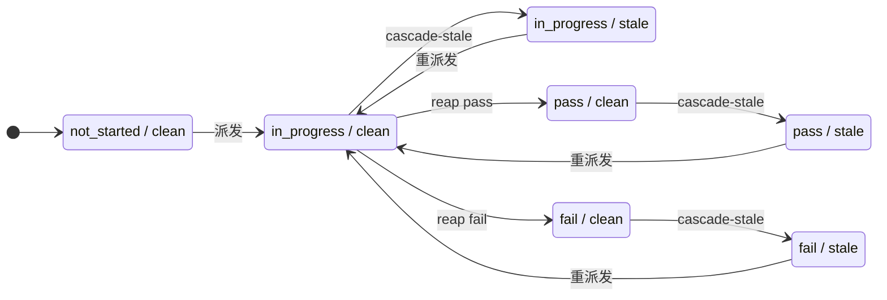
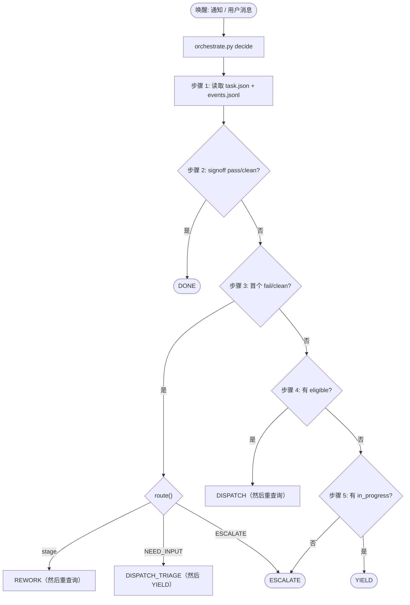
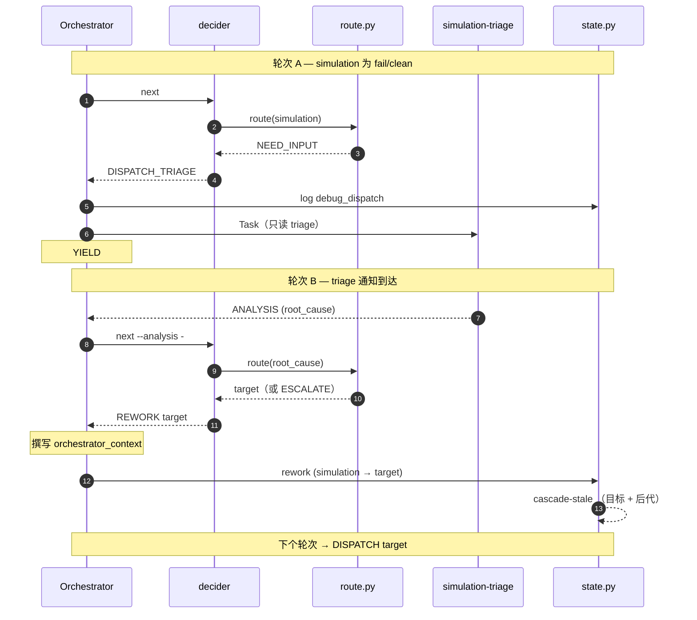

# VeriPower 架构

> 阶段门控、事件溯源的 Agent 流水线——设计原理与契约。

---

## 目录

- [术语表](#术语表)
- [1. 为什么选 VeriPower](#1-为什么选-veripower)
- [2. 系统模型](#2-系统模型)
- [3. 流水线 DAG](#3-流水线-dag)
- [4. 状态模型](#4-状态模型)
- [5. Orchestrator 决策循环](#5-orchestrator-决策循环)
- [6. 子 Agent 契约](#6-子-agent-契约)
- [7. 工作空间布局](#7-工作空间布局)

---

## 术语表

以下术语在全文中以固定含义使用，此处集中定义，链接节给出完整上下文。各阶段自身的契约（`result.json` 字段、CLI 标志、路由表）不在本文档中展开——见各自 schema / `--help` / `route.py`。

| **术语** | **说明** |
|---|---|
| **Orchestrator**（编排器） | 主会话中的 `design-flow` Agent；系统中唯一有权调用 `state.py`、派发 `Task()`、与用户交互的角色（§2.3）。 |
| **decider**（决策器） | 即 `orchestrate.py decide`——读取磁盘状态，每次调用返回恰好一个动作；Orchestrator 是其薄执行器（§5）。 |
| **main-thread-loaded**（主线程加载） | 指通过 `Skill()` 在 Orchestrator 自身线程中加载的阶段——`specification`、`simulation-plan`、`rtl-design`、`simulation`——区别于通过 `Task()` 派发的阶段（§2.2）。 |
| **Level-1 sub-Task**（一级子 Task） | 主线程技能为阶段内扇出而派发的 `Task()`。二级（子 Task 再派发 `Task()`）被禁止——即审计边界（§2.2, §6.3.1）。 |
| **reap**（收割） | 以 `state.py reap`（通常不带 `--outcome`）结束一个在途 run，由 `cmd_reap` 自行从该 run 的 `result.json` 推导结果。既是每次派发的正常收尾，也是崩溃 run 的修复路径（§5.1）。 |
| **promote**（提升） | 将 `runs/<N>/` 下的文件逐条目硬链接到规范阶段目录，`cmd_reap` 在 pass 和 fail 两种路径上均执行，幂等（§7.2）。 |
| **cascade-stale**（级联失效） | BFS 遍历：当某个阶段通过或被指定为返工目标时，将其所有 `pass`/`fail`/`in_progress` 后继标记为 `stale`（§4.4）。 |
| **status × freshness**（状态×新鲜度） | 每个阶段的两个独立属性：`status ∈ {not_started, in_progress, pass, fail}`，`freshness ∈ {clean, stale}`（§4.2）。 |
| **in-flight / run**（在途 / run） | `run`（即 `current_run`）是单调递增的派发编号；`in_flight[]` 列出尚未收割的 run（§4.3）。 |
| **determinism boundary**（确定性边界） | 系统赖以成立的划分：判断归 Orchestrator，状态归 `state.py`，确定性计算归同级脚本（`route.py`、`orchestrate.py`、`convergence`）（§2.4）。 |

---

## 1. 为什么选 VeriPower

VeriPower 把确定性状态机和 LLM Orchestrator 分开：路由错误不会污染已完成的工作，因为 `state.py` 永远不会忘。这个分离不是锦上添花，而是承重墙——本文档的每一项架构决策都立在它上面。

三条设计原则撑起整个系统，每条在各自章节展开：

- **确定性核心掌管全部状态。** `state.py` 持有阶段状态、前置检查、cascade-stale 和事件追加；Orchestrator 只管判断（返工、升级、上下文撰写），它做判断所依据的确定性计算都在它执行的那些同级脚本里——这就是 *determinism boundary*（§2.4）。
- **并发从拓扑自然得出。** 每个阶段自带 `status × freshness`，DAG 前置关系驱动 cascade-stale；`distinct in-flight ≤ 2` 是拓扑属性，不是拍脑袋定的上限（§3.2）。
- **事件日志不可篡改。** `events.jsonl` 是审计真相，`task.json` 只是可重建的投影；Orchestrator 只能写 7 类事件中的 2 类，每一次 AI 路由决策都落在纸面上（§4.5）。

VeriPower 不是服务：没有 daemon、没有数据库、没有 HTTP——磁盘文件就是数据库。不绑供应商：skills 在 `SKILL_OF` 这个派发接缝处可替换。不是跑一次就完的 Agent：它扛得住数小时的返工风暴——阶段失败、cascade-stale 塌及下游、跨 Orchestrator 轮次重来。

## 2. 系统模型

### 2.1 三层架构

Orchestrator Agent 做决策；`state.py` 和 skills 负责执行；磁盘负责持久。

```
┌────────────────────────────────────────────────────────────────────────────────────┐
│             Orchestrator Agent  ( veripower:design-flow )                          │
│  main conversation; forward dispatch / rework routing / convergence /              │
│  escalation / user collaboration                                                   │
└──┬───────────────────────────┬────────────────────────────────┬────────────────────┘
   │ Bash                      │ Skill()                        │ Task()
   │ state.py + route.py CLI   │ veripower:specification        │ general-purpose
   │                           │ veripower:simulation-plan      │ (the 5 Task stages)
   │                           │ veripower:rtl-design           │
   │                           │ veripower:simulation           │
   │                           │ (main-thread loaded)           │
   ▼                           ▼                                ▼
┌────────────────────┐  ┌──────────────────────────────┐  ┌──────────────────────────┐
│ Deterministic core │  │  Main-thread skill           │  │  Stage / Debug Subagent  │
│ (Python)           │  │  (runs in Orchestrator's     │  │  (isolated context)      │
│                    │  │   main thread)               │  │                          │
│ state.py:          │  │                              │  │  Stage: executes stage   │
│   state + 8 cmds   │  │  specification:              │  │    → writes result.json  │
│ orchestrate.py:    │  │    fan-out → design.md       │  │  Debug: read-only triage │
│  decide → action   │  │    design.md / manifest.json │  │    → returns ANALYSIS    │
│ route.py:          │  │    SDC / SGDC / result.json  │  │                          │
│   rework target    │  │  simulation-plan:            │  │  Must NOT call state.py  │
│                    │  │    plan generation +         │  │  or make routing calls   │
│                    │  │    review loop               │  │  (see §6.1 for full)     │
│                    │  │  rtl-design:                 │  │                          │
│                    │  │    per-child RTL fan-out     │  │                          │
│                    │  │  simulation:                 │  │                          │
│                    │  │    env → smoke gate → verify │  │                          │
└──────────┬─────────┘  └──────────────────────────────┘  └──────────────────────────┘
           │ reads/writes
           ▼
┌────────────────────────────────────────────────────────────────────────────────────┐
│                              asic/<module>/                                        │
│                                                                                    │
│   task.json                          stage state snapshot                          │
│   events.jsonl                       append-only event log                         │
│   Design/<stage>/result.json         specification / rtl-design / lint-cdc /       │
│                                      synthesis / timing-analysis                   │
│   Verification/<stage>/result.json   simulation-plan / simulation /                │
│                                      power-analysis                                │
│   frontend-signoff/result.json       frontend-signoff stage output                 │
└────────────────────────────────────────────────────────────────────────────────────┘
```

Orchestrator 的三条派发路径：

- **Bash** → `state.py` CLI（8 条命令：`init`、`status`、`dispatch`、`reap`、`rework`、`invalidate-stage`、`convergence`、`log`）；`orchestrate.py decide`（每次调用返回一个动作，见 §5）；`topology.py`——DAG 的单一真相源（`PREREQ_OF`、`eligible()`）；`route.py`——返工路由器（纯目标选择，组合在 `orchestrate.py` 内部，见 §5.4）。
- **Skill()** → 四个主线程 skills（`specification`、`simulation-plan`、`rtl-design`、`simulation`）。
- **Task()** → 阶段子 Agent 和调试子 Agent。

### 2.2 哪些阶段走主线程加载

`veripower:specification`、`veripower:simulation-plan`、`veripower:rtl-design`、`veripower:simulation`——只有这四个阶段不通过 `Task()` 派发，而是由 Orchestrator 以 `Skill()` 在主线程中直接加载。原因很直接：`Task()` 子 Agent 既不能在中途与用户交互，也不能再派发 `Task()`，而这四个阶段各需其中一项能力。

> **契约：** `Task()` 子 Agent 不准再派发 `Task()`——禁止二级派发（审计边界）。因此，需要扇出一级子 Task 的阶段不可能作为 Task 子 Agent 运行；走主线程加载是保有扇出派发权同时又守住这条边界的*唯一*方式。`specification` / `rtl-design` / `simulation` 走主线程是因为需要扇出派发权；`simulation-plan` 走主线程是因为需要多轮用户对话，外加一次一级 plan-adequacy 审查派发（Step 4）。

各阶段触发条件：

- **specification** — 消费已冻结、已批准的 `brainstorm.md`；内含一个扇出派发器（分解 + 围绕分区门的按 child 的 sub-Task 波次），外加 `spec` CLI 的三个主线程门控动词：`derive-ports`（门前，为分区门提供摘要；不读正文）、`check-coverage`（门前，其裁决喂给 design.md 批准门）、`derive-constraints`（门后，从已批准的 §1.6 + §1.4.1 表推导完整 SDC/SGDC）。不是因为头脑风暴对话才走主线程——那个对话已前移到流水线外的 `brainstorm` skill。
- **simulation-plan** — 与用户的多轮计划审查对话；它还自派发一次一级 plan-adequacy 审查 sub-Task（Step 4 / §6.3.1）。
- **rtl-design** — 只扇出，无对话：每个 child 派一个一级子 Task（`N = len(manifest.children[])`，含顶层集成 child；不存在 N==1 豁免），末尾再加一个 finalize 子 Task。
- **simulation** — 只扇出，无对话：Wave 1 派发 env-build child（首次 run / patch 路径）或 freeze child（freeze 路径）；非 freeze run 再运行 smoke gate、LLM conformance review-gate（Step 4）和 verify child（Wave 2）。env-build child 有两条子分支：`first-run`（从零 bootstrap）和 `patch`（以 `sim copy-baseline --mode patch` 播种后再进行定点 delta 编辑）。在增量重跑中，若计划不变且基线 TB 有效，simulation 可**冻结（freeze）**先前 run 的 TB——将其复制进新的 `runs/<N>/`（run 隔离 §7.2 保持：仍只写 `runs/<N>/`），并针对变更后的 RTL 重新编译，而非重新创作。分支由 `sim classify-delta` 动词确定性选择；freeze 物化由 `sim copy-baseline --mode freeze` 动词执行。**非 freeze run 时，**形态最接近 `specification` 的"两波夹一门"；派发类别与 `rtl-design` 一致。

对这四个阶段，Orchestrator 照样调 `state.py dispatch/reap/log`，照样读规范的 `result.json` 做失败路由（§5.4；reap 不读任何文件，见 §5.1）；差别仅在于它的工具历史里没有阶段级的 `Task()` 调用。

> **警告：** 如果 `Skill(veripower:lint-cdc|synthesis|timing-analysis|power-analysis|frontend-signoff)` 出现在 Orchestrator 的工具历史中，这是个 bug——那五个阶段必须走 `Task()` 派发。

**流水线前的 `brainstorm` skill（不由 Orchestrator 派发）。** 重量级 D0–D7 需求对话在自己的独立会话中运行，是一个单独的 `brainstorm` skill——不属于上述四个主线程阶段，Orchestrator 永远不派发它。它产出流水线启动所需的已批准 `asic/<module>/brainstorm.md`（模块根目录）；不写 `result.json`，不调 `state.py`。DAG 入口前置条件见 §3。

### 2.3 角色职责

| **角色** | **载体** | **职责** | **能力边界** |
|---|---|---|---|
| **Orchestrator Agent** | `design-flow` skill，主会话 | 前向派发、返工路由（执行 `route.py` 选出的目标）、收敛判断、升级、用户协作；同时作为 `specification` / `simulation-plan` / `rtl-design` / `simulation` 四个阶段的主线程执行器 | 系统中唯一有权调用 `state.py`、使用 Task 工具、与用户交互的角色 |
| **主线程 skill** | `veripower:specification`、`veripower:simulation-plan`、`veripower:rtl-design` 或 `veripower:simulation`，由 Orchestrator 通过 `Skill()` 加载 | 在 Orchestrator 线程中自驱动工作：`specification` 跑两波 sub-Task（分解 + 按 child）加主线程脚本和两次路径交接门（D0–D7 对话已前移到流水线外的 `brainstorm` skill）；`simulation-plan` 跑多轮计划审查对话并自派发一次一级 plan-adequacy 审查 sub-Task；`rtl-design` 无对话但持有一级扇出派发权（§2.2）；`simulation` 同样无对话且持有一级扇出派发权——Wave 1 派发 env-build child（首次 run / patch）或 freeze child（freeze）；非 freeze run 再运行 smoke gate、LLM conformance review-gate（Step 4）和 verify child（§2.2）。各自写入自己的产物和 `result.json`。 | `simulation-plan` 可跨轮次与用户交互；`specification` 额外在两次路径交接门处交互；`specification` / `rtl-design` / `simulation`（及 `simulation-plan`，限单次审查 sub-Task）可派发一级 sub-Task（§6.3.1）。其余边界与阶段子 Agent 相同（禁 `state.py`、禁路由）。契约靠 SKILL.md 中的条文纪律约束，不靠工具门控。 |
| **阶段子 Agent** | 五个以 Task 方式派发的阶段 skills（`lint-cdc` / `synthesis` / `timing-analysis` / `power-analysis` / `frontend-signoff`），通过 Task 工具派发 | 执行单个阶段：读上游 → 做工作 → 写 `result.json` → 返回 STATUS 行 | 不准调 `state.py`，不准做路由决策（完整 5 条清单见 §6.1） |
| **调试子 Agent** | `simulation-triage` skill，通过 Task 工具派发 | 对仿真失败做只读根因分析；返回两层 ANALYSIS（路由 JSON 块——`root_cause`/`analysis_state`——加散文分析） | 不修改任何状态——绝不碰 `task.json`、`result.json`、RTL 或测试代码 |
| **`state.py`** | Python CLI | 状态转换、前置校验、cascade-stale 传播、事件日志追加、上下文收集；尽力而为的异步子 Agent 转录镜像（`cmd_reap` 时的遥测副作用，见 §6.6） | 不含路由逻辑，不做判断 |
| **`route.py`** | Python CLI（`state.py` 的同级脚本） | 纯确定性返工目标选择——将失败的封闭枚举字段映射为目标 / `ESCALATE` / `NEED_INPUT` | 不持有状态；输入为 CLI 标量标志（`--guideline`、`--by-target-rtl`，仿真路径上还有 `--root-cause`/`--analysis-state`）外加可选传入的 `result.json`。Orchestrator 读取其 JSON 输出，按 `decision` 字段行动。不做状态转换。 |

### 2.4 核心设计原则

- **判断归 Orchestrator，状态归 Python，确定性计算归同级脚本**——即 *determinism boundary*。Orchestrator 做判断（升级、返工上下文）；`state.py` 维护状态事实；既非判断也非状态的确定性决策支持——收敛计数（`cmd_convergence`）、返工目标选择（`route.py`）、完整控制循环决策（`orchestrate.py decide`）——放在 Orchestrator 所执行的脚本中。三者各司其职，互不侵入。*可执行*的能力边界（谁能调 `state.py` / `Task()` / 用户）见 §2.3 角色表。
- **决策边界 = 工具边界。** Orchestrator 的每个决策都下推到 `orchestrate.py decide`；Orchestrator 自身只是薄执行器，在两次 `state.py` 调用之间除了调 decider 什么也不做。可验证的循环形式——*两次连续 `state.py` 调用中间没有 decider 调用就是 bug*——见 §5.5。
- **文件即数据库。** `task.json` 是快照，`events.jsonl` 是审计日志，`result.json` 文件是阶段产出。没有中间缓存，没有服务端存储。
- **压缩安全可恢复。** 因为文件即数据库，会话中途的上下文压缩（或进程崩溃）是可存活的：Orchestrator 和每个子 Agent 都单凭磁盘就能无损恢复，不存在只活在对话里的关键信息。持久真相在磁盘上——`task.json`、`events.jsonl`、各阶段的 `result.json`。Orchestrator 在轮次间**不持有任何持久控制状态**——每个轮次都通过 `orchestrate.py decide` 从磁盘重新推导下一步。唯一例外是会话驻留的 `orchestrator_context` 提示：在 `REWORK` 时撰写，同一轮次内 `DISPATCH` 时消费——**可重推导，非持久**（且一旦传给 `cmd_dispatch` 即落盘为 `orchestrator-context.md`）；见 §5。
- **单向通信。** Orchestrator → prompt → 子 Agent → `result.json` + STATUS。子 Agent 不能回调 Orchestrator；子 Agent 之间不能通信。
- **上下文隔离。** 子 Agent 收到的是全新 prompt；不继承父会话的任何历史。所有必要输入通过文件路径或 prompt 字段显式传递。

## 3. 流水线 DAG

VeriPower 前端流水线共 9 个固定阶段，由 DAG 前置关系连接；返工通过 cascade-stale 向下传播。

```
[specification] → [simulation-plan] → [rtl-design]
                                            │
                          ┌─────────────────┴──────────────────┐
                          ↓                                    ↓
                     [lint-cdc]                          [simulation]
                          │                                    │
                          ↓                                    │
                     [synthesis]                               │
                          │                                    │
                          ↓                                    │
                  [timing-analysis]                            │
                          │                                    │
                          └─────────────────┬──────────────────┘
                                            ↓
                                    [power-analysis]
                                            │
                                            ↓
                                    [frontend-signoff]
```

**DAG 入口前置条件。** 流水线从已批准的模块根 `brainstorm.md`（`asic/<module>/brainstorm.md`）启动，该文件由流水线前的 `brainstorm` skill 产出（§2.2）。它是流水线外输入，不算 DAG 阶段——`specification` 的前置列仍为 `—`，`topology.py` 的 `PREREQ_OF` 仍是 9 个阶段。

### 3.1 规范 DAG 表

| **阶段** | **前置** | **Skill** | **典型产物位置** |
|---|---|---|---|
| specification | — | `veripower:specification`（主线程） | `Design/specification/`（design.md / manifest.json / coverage.json / `<child>`.md / constraints/`<TOP>`.{sdc,sgdc}） |
| simulation-plan | specification | `veripower:simulation-plan`（主线程） | `Verification/simulation-plan/`（verification-plan.md / scaffold-specification.json） |
| rtl-design | simulation-plan | `veripower:rtl-design`（主线程） | `Design/rtl-design/`（*.v / *.sv / filelist） |
| lint-cdc | rtl-design | `veripower:lint-cdc` | `Design/lint-cdc/`（SpyGlass 报告） |
| synthesis | lint-cdc | `veripower:synthesis` | `Design/synthesis/`（网表、*.ddc、报告） |
| timing-analysis | synthesis | `veripower:timing-analysis` | `Design/timing-analysis/`（slack、约束报告） |
| simulation | rtl-design | `veripower:simulation`（主线程） | `Verification/simulation/`（UVM 环境 / 回归报告 / 日志） |
| power-analysis | timing-analysis + simulation | `veripower:power-analysis` | `Verification/power-analysis/`（GLS simv / saif/`<id>`.saif / scaffold/power_tests/ / 平均功耗报告） |
| frontend-signoff | power-analysis | `veripower:frontend-signoff` | `frontend-signoff/`（检查清单、可追溯性报告） |

前向派发按优先级顺序 `specification → simulation-plan → rtl-design → lint-cdc → synthesis → timing-analysis → simulation → power-analysis → frontend-signoff`（与 `topology.py` 的 `FORWARD_PRIORITY` 一致）。返工合法性：`target_stage` 必须是 `failed_stage` 的 DAG 祖先——`state.py` 的 `cmd_rework` 负责执行此约束。

`frontend-signoff` 的前置列只写 `power-analysis`——lint-cdc 不显式列出，因为它经 `lint-cdc → synthesis → timing-analysis → power-analysis` 传递阻塞了 signoff。DAG 在结构上保证阻塞关系；前置表避免冗余边。

### 3.2 三阶段形态

| **阶段组** | **所含阶段** | **主线程 vs Task** | **并发上限** |
|---|---|---|---|
| 1（串行） | specification → simulation-plan → rtl-design | 三者均走主线程；`rtl-design` 始终通过 `Task()` 派发 `N = len(manifest.children[])` 个一级子 Task（每个 child 一个，含顶层集成 child），末尾一个 finalize 子 Task | distinct in-flight ≤ 1 |
| 2（双链并行） | `{lint-cdc → synthesis → timing-analysis}` ‖ `{simulation}` | 链 1 为 Task 子 Agent；`simulation` 是主线程 sub-orchestrator，自行派发阶段内子 Task（Wave 1：env-build child 或 freeze child；非 freeze：smoke gate → conformance gate → verify child） | distinct in-flight ≤ 2 |
| 3（汇合） | power-analysis → frontend-signoff | 全为 Task 子 Agent | 1 |

**扇出子 Task 是阶段内行为，对 state.py 不可见。** `specification`、`rtl-design` 或 `simulation` 派发一级子 Task 时（生产者的 per-child 工作；simulation 的 env-build child 或 freeze child，以及非 freeze run 时的 verify child），这些子 Task 在主线程 skill 自身的执行窗口内运行；不写 `task.json`，不追加事件，不出现在 `state.py` 的 in-flight 记账里。因此它们**不计入** `distinct in-flight ≤ 2` 这个 DAG 拓扑属性——该属性仅适用于 `state.py` 跟踪的阶段级派发。派发权限例外详见 §6.3。

**`distinct in-flight ≤ 2` 是拓扑性质，不是拍脑袋定的策略。** 阶段组 2 含两条链（`{lint-cdc → synthesis → timing-analysis}` 和 `{simulation}`）；每条链内部串行。最坏情况：`{lint-cdc, synthesis, timing-analysis}` 中任意一个在链 1 上 in-flight，同时 `simulation` 在链 2 上 in-flight——distinct *stages* = 2。`simulation` 在链 2 上只占一个阶段槽位，不论它内部有多少子 Task 在飞（那些对 state.py 透明，见上段），所以把它提升为 main-thread sub-orchestrator 不改变这个上限。阶段组 3 是单条串行链：power-analysis 要求 timing-analysis 和 simulation 都完成才 eligible；frontend-signoff 等 power-analysis 通过；distinct = 1。同阶段多 run 共享一个 distinct-stage 槽位（实践中只有 `simulation` 会出现）；物理 Task 数可能短暂超过 2，但 distinct-stage 数守 ≤ 2。

> **契约：** Orchestrator 不写并发上限。`distinct in-flight ≤ 2` 是 DAG 拓扑的推论，不是靠策略守出来的。本节是其唯一定义处——§1 和 §5.2 中的引用均指向这里。

### 3.3 前向派发与返工

**前向派发。** 优先级顺序同 `state.py` 的 `FORWARD_PRIORITY`。每个轮次，Orchestrator 对所有 eligible 的阶段一次派发（隐式并行）。`eligible(stage)` 的条件：全部 DAG 前置为 `pass/clean`；阶段自身不是 `in_progress/clean`、`pass/clean` 或 `fail/clean`（即 `not_started/clean`、`*/stale` 和 `in_progress/stale` 均可重派发——最后一种情况使 cascade 命中下的同阶段多 run 合法化）。

**返工。** 不受 DAG 顺序约束——Orchestrator 可依据失败语义返工到任意祖先阶段。唯一硬约束：`target_stage` 必须是 `failed_stage` 的 DAG 祖先（`state.py` 执行）。返工将 `target_stage` 标为 `stale`，级联将其所有后代的 `pass / fail / in_progress` 标为 `stale`；已 `in_progress` 的 run 不杀——任其自然完成，`cmd_reap` 收割时丢弃。

典型返工闭环：

- **simulation 失败** → `simulation-triage` 调试子 Agent → 返工到 `rtl-design` / `specification` / `simulation-plan`。
- **PPA 失败**：synthesis 判 area/timing_slack；power-analysis 判 power_mw；timing-analysis 判 setup/hold。任一不达标 → decider 走 `route.py` 路由（基于收敛；见 §5），返回 `REWORK`/`ESCALATE` 由 Orchestrator 执行。power-analysis 的工具故障（GLS 错误、SAIF 缺失）由子 Agent 写入 `failures[].{phase, category, error_summary}`；`route.py` 将 `category` 映射到上游 DAG 目标（见 §5.4 和 `framework/scripts/route.py`）。

## 4. 状态模型

### 4.1 持久化文件

全部状态位于 `asic/<module>/` 下：

| **文件** | **用途** | **写入者** |
|---|---|---|
| `task.json` | 阶段状态快照（status × freshness） | `state.py` |
| `events.jsonl` | 追加式事件日志 | `state.py` |
| `asic/<module>/brainstorm.md` | 头脑风暴定稿（design.md 的唯一上游；流水线输入） | 流水线前 `brainstorm` skill（独立会话） |
| `Design/specification/result.json` | specification 阶段输出（含 design.md / SDC / SGDC 引用） | Orchestrator 主线程（specification skill） |
| `Design/rtl-design/result.json` | rtl-design 阶段输出 | Orchestrator 主线程（rtl-design skill） |
| `Design/<stage>/result.json` | 阶段输出（lint-cdc / synthesis / timing-analysis） | 阶段子 Agent |
| `Verification/simulation-plan/result.json` | simulation-plan 阶段输出 | Orchestrator 主线程（simulation-plan skill） |
| `Verification/simulation/result.json` | simulation 阶段输出 | Orchestrator 主线程（simulation skill） |
| `Verification/power-analysis/result.json` | power-analysis 阶段输出（合并 GLS + PT-PX） | 阶段子 Agent |
| `frontend-signoff/result.json` | frontend-signoff 阶段输出 | 阶段子 Agent |

### 4.2 阶段状态：二维

每个阶段有两个独立属性——`status ∈ {not_started, in_progress, pass, fail}` 和 `freshness ∈ {clean, stale}`。合法组合：

| **status/freshness** | **含义** |
|---|---|
| `not_started/clean` | 尚未运行 |
| `in_progress/clean` | 正在执行（其前置仍为 `pass/clean`） |
| `in_progress/stale` | 仍在运行，但其前置已被返工修改——此 run 完成时 `cmd_reap` 将其走丢弃分支；eligibility 允许重派发（同阶段多 run，由 `current_run` 物理隔离） |
| `pass/clean` | 已通过，输入未变 |
| `pass/stale` | 曾经通过，但上游变更要求重跑 |
| `fail/clean` | 已失败，等待返工决策 |
| `fail/stale` | 曾经失败且上游已变（继续失败无意义；应从 eligible 上游重来）；或规范 hardlink 失败时的 `_non_success_finalize` 衍生状态 |

`in_progress/stale` 是双链并行执行中 cascade-stale 命中运行中阶段的自然结果——返工从不阻塞、从不杀 Task、从不等待退出。

**阶段生命周期。** 上述状态通过以下迁移连接：



边上标的是触发条件，精确条件见正文。stale 状态在其前置恢复 `pass/clean` 后重派发；`cascade-stale` 在上游阶段重通过或本阶段（或其祖先）被指定为返工目标时触发；`in_progress/stale` 的原始 run 在 reap 时丢弃（不 promote）。非成功 reap（`blocked` / `invalid` / `discarded`）清 run 而不进入终止状态（§5.1），图中省略。`in_progress/clean → in_progress/stale → 重派发` 这条路径正是双链返工非阻塞的原因（§4.4）。

### 4.3 task.json 的 per-stage 字段

除 `status` 和 `freshness` 外，每个阶段还携带：

| **字段** | **类型** | **含义** |
|---|---|---|
| `current_run` | `int \| null` | 单调递增的 run 编号；每次 `dispatch` 自增。从未启动则为 `null`。 |
| `in_flight` | `array` | 当前未完成的派发列表，元素为 `{run: int}`。同阶段多 run 共存于此（只有 `simulation` 实际出现）。 |

### 4.4 Cascade-stale 传播

当某阶段转为 `pass`，或被指定为返工目标（标 `stale`），`state.py` BFS 遍历其后继，将每个 `pass / fail / in_progress` 后继标为 `stale`（`not_started` 后继不动）。`in_progress` 变 `stale` 正是双链并行返工非阻塞的关键——运行中的下游被合法化为 `in_progress/stale`，其原始 run 将由 `cmd_reap` 自动丢弃。

### 4.5 事件类型

`events.jsonl` 包含 **7 类事件**，每类由 `framework/references/schemas/events/<type>.schema.json` 中对应的 JSON Schema 校验；`append_event` 在写入时校验。

| **type** | **写入者** | **触发条件** | **关键正文字段** |
|---|---|---|---|
| `dispatch` | `state.py`（自动） | `dispatch` 命令 | `stage`、`mode ∈ {forward, rework}`、`run`、`workdir` |
| `outcome` | `state.py`（自动） | `reap` 命令 | `stage`、`run`、`result_status`、`reason?` |
| `cascade` | `state.py`（自动） | `reap` / `rework` 触发级联 | `source_stage`、`staled[]` |
| `rework_decision` | `state.py`（自动） | `rework` 命令 | `failed_stage`、`target_stage`、`reason`、`run`（failed_stage 的 current_run，必填） |
| `invalidate` | `state.py`（自动） | `invalidate-stage` 命令 | `stage`、`reason` |
| `debug_dispatch` | Orchestrator（`log`） | 派发 `simulation-triage` | `module`、`failure_phase?` |
| `escalation` | Orchestrator（`log`） | Orchestrator 放弃 | `reason_code`、`reason` |

`outcome.result_status` 是 **6 值枚举**。`pass` / `fail` / `blocked` 在 reap 时由 `cmd_reap` 从 run 的 `result.json` 解析（或通过显式 `reap --outcome` 强制指定）；`invalid`（schema 不合规的 `result.json`）、`discarded`（被返工或 cascade-stale 取代的 run）和 `promote_failed`（规范 hardlink 合并失败）始终由 `state.py` 内部推导。`discarded` 的子情形及其 `reason_code` 文本格式属于 `state.py` 实现细节——投影（§4.6）对四种子情形一视同仁。全部事件携带 UTC ISO8601 时间戳。

`cmd_log` 白名单：Orchestrator 只能通过 `cmd_log` 写 **7 类事件中的 2 类**——`debug_dispatch`、`escalation`。其余 5 类（`dispatch`、`outcome`、`cascade`、`rework_decision`、`invalidate`）作为 `state.py` 状态转换的副作用产生，若通过 `cmd_log` 外部注入将被**拒绝**。这杜绝了通过 Agent prompt 伪造审计日志的可能。

**命名不变量。** 一个编排操作在它的 `state.py` 命令与 decider 动作上只用一个词根——`dispatch`/`DISPATCH`、`reap`/`REAP`、`rework`/`REWORK`。事件按其所记录的内容命名，因此事件词根可以与发出它的命令不同（`reap` 命令写 `outcome` 事件）。规则是：一个操作 → 一个「命令+动作」词，绝不用 prose-only 同义词把命令桥接到一个异名概念（即 `next`→`decide` 改名所消除的那种失败模式）。

### 4.6 写入顺序不变量

`state.py` 所有状态变更命令（`cmd_init`、`cmd_dispatch`、`cmd_reap`、`cmd_rework`）遵循三阶段模式：

1. **校验 + 计算**（在 task 副本上做内存编辑，包括用于 staled 列表的纯函数 `_compute_cascade()`；不落盘）。
2. **事件先行**：一次或多次 `append_event(...)` 调用。
3. **状态后置**：单次 `write_task(module, task_final)` 落盘。

**如此排序的原因：** `events.jsonl` 是审计真相。若崩溃发生在步骤 2 与步骤 3 之间，事件已记录了完整意图，`task.json` 可从中重建（见下方投影契约）。反向顺序不行——`write_task` 在 `append_event` 之前，崩溃时留下的是状态与事件不匹配。

**投影契约。** `task.json` 是 `events.jsonl` 的*投影*——即事件日志的纯函数，只读事件，绝不读 `task.json`。这正是"事件即真相"的可验证基础，不只是一句口号。在正向路径上它是精确的：`dispatch` 将阶段设为 `in_progress/clean` 并记录 run；`outcome` 设 `pass`/`fail` 并清 run；`cascade` 将 `pass`/`fail`/`in_progress` 后代标 stale；`rework_decision` 自身不携带状态（其效果通过后续 `cascade` 落地）。非成功终止状态（`blocked`/`invalid`/`discarded`/`promote_failed`）*不能*仅从事件重现——它们的最终化是 `state.py` 行为，重建崩溃后 `task.json` 的操作者从规范状态推导它们。因此投影对于干净历史是精确逆映射，其他情况则是恢复起点——此为参考定义，非交付代码。

**Promote 在验证与成功路径计算之间。** `cmd_reap` 在任何路径上都先做验证（in-flight 检查、schema、前置新鲜度、自身新鲜度）。非成功结果（`blocked`、`invalid`、`prereq_changed`、`stage_staled_during_run`）随后分支到 `_non_success_finalize`，走自己的计算-事件-状态序列并退出——promote 在这些路径上永不被调用。只有 `pass` 和 `fail` 结果在验证后继续；它们调用 `promote()`（从 `runs/<N>/` 到规范的逐条目硬链接合并），然后走计算-事件-状态序列。事件之前的这次磁盘写入是有意设计的——promote 的结果（成功 vs `promote_failed`）决定走哪个计算分支。崩溃恢复仍成立，因为 promote 是幂等的（§7.2）：正是该幂等性让事件先行/状态后置能在 promote 中途崩溃时存活。

### 4.7 Schema 校验不变量

每个 `result.json` 须经 `framework/references/schemas/envelope.schema.json`（跨阶段信封：`stage` / `module` / `produced_at` / `status` / `artifacts` / `stage_specific`）加上 `skills/<stage>/references/result.schema.json` 中对应阶段的 schema 校验。每个事件须经 `framework/references/schemas/events/<type>.schema.json`（8 个 schema，每类一个）校验。校验时机：`cmd_reap`（对 `result.json`）和 `append_event`（对每个事件）；各字段语义见各自 schema 的 `description` 字符串。

## 5. Orchestrator 决策循环

Orchestrator 的结构：一个初始化块 + 由 `orchestrate.py decide` 驱动的薄执行器循环。控制流遵循轮次纪律：每个用户消息或 task-notification 恰好触发一个轮次，以 `YIELD`、`DONE` 或 `ESCALATE` 结束。收到下个通知时 Claude Code 框架重新进入循环。

持久状态在磁盘上（`task.json`、`events.jsonl`、各阶段的 `result.json`），因此循环是**压缩安全**的（§2.4）。这对循环的具体要求是：喂给子 Agent prompt 的每个字段都来自 `state.py` 的磁盘产物（*disk-sourced payload* 承诺；逐字段细节见 §5.3），会话历史信息只能通过 `cmd_dispatch` 时落盘的 `--orchestrator-context` 通道送达子 Agent。唯一的瞬态规划状态是只读的 `simulation-triage` `ANALYSIS` 以及由它拼出的派发上下文——在对话中持有，到下一次 `cmd_dispatch` 时注入，然后落盘为 `orchestrator-context.md`。二者均可重推导：若压缩在中途丢弃了它们，下个轮次 `orchestrate.py decide` 发现阶段仍为 `fail/clean`，重派发只读且幂等的 `simulation-triage`，然后重新拼出上下文。持久的返工结果（`rework_decision` 目标+原因，或升级原因）一经决定就在磁盘上，最坏情况不过是压缩导致多跑一次 triage——决策永远不会丢。子 Agent 在中途被压缩或崩溃同样是阶段粒度无损的：缺失或半写的 `result.json` 在 reap 时被捕获（§5.1），阶段从磁盘输入重跑。

### 5.1 初始化与 reap

reap 在两种机制下运行：

- **会话启动 reap（每会话一次）。** Orchestrator 首次附着模块时：先跑 `state.py init --module <M>`（幂等——若 `asic/<M>/task.json` 不存在则创建），然后 `state.py status --module <M>` 得到当前阶段快照，最后对 `task.json` 中 `in_flight[]` 所列的每个阶段执行 reap（机制见下）。这是崩溃恢复路径：若 Orchestrator 在上次中途挂掉，任何未写入的 `outcome` 事件在新派发前在此修复。
- **唤醒轮次 reap（每次通知）。** 当后台 `Task()` 写出其 STATUS 行，Claude Code 框架注入 `<task-notification>`。Orchestrator 在重入主循环前，对该通知绑定的 (stage, run) 执行 reap。这是稳态路径——每个派发的 run 通过唤醒轮次 reap 收尾。

**reap 机制**（两种机制共用）：对每个 `in_flight` 的 `(stage, run)`，Orchestrator 一般调用 `state.py reap --stage <S> --run <N>` 且**不带** `--outcome`——它不自己读 `result.json`。`cmd_reap` 读该 run 自己的 `result.json` 推导结果：格式完好、`status ∈ {pass,fail}` → 对应结果；缺失 / 不可解析 / 非对象 / `status` 格式错 → `blocked`；存在但 schema 无效 → `invalid`（§4.7）。唯一例外：Orchestrator 自己检测到 cascade-stale 的 run，用显式 `--outcome blocked` 完成（`skills/design-flow/SKILL.md` Step 5 stale 分支）。

### 5.2 执行器循环（per turn）

Orchestrator 调用 `orchestrate.py decide --module <M> [--wake <stage>:<run>] [--analysis -]` 并恰好执行其返回的那一个动作，循环直到动作为 `YIELD`、`DONE` 或 `ESCALATE`。decider 编码了以下决策步骤；下方正文为权威契约。



叶动作的后继行为：`REWORK` 和 `DISPATCH` 后重查询 `decide`（重查询循环——若干失败或派发在一个轮次内解决）；`DISPATCH_TRIAGE` 在 `YIELD` 处结束轮次。下方正文按步骤给出权威契约。

**步骤 1：读状态。** decider 在进程内读 `task.json` + `events.jsonl`（`read_task` / `read_events`，外加相关 `result.json` 和管道传入的 `--analysis` 负载）——不通过 shell 调 `state.py status`。由此得到的快照是本次调用全部决策的唯一真相源。

**步骤 2：完工即止。** 若 `frontend-signoff` 的 `status=pass` 且 `freshness=clean` → 返回 `DONE`。

**步骤 3：处理首个失败。** 按 `FORWARD_PRIORITY` 扫描。找到首个 `status=fail` 且 `freshness=clean` 的阶段。若存在，经 `route.py` 路由（组合收敛 + 结果输入），返回对应动作（`REWORK`、`DISPATCH_TRIAGE` 或 `ESCALATE`）。不变量：**一次 decider（`decide`）调用只处理一个失败；多个失败可在同一轮次通过重查询循环解决**——若返工目标是多个 `fail/clean` 阶段的公共祖先，首轮 REWORK 的级联就会将它们全部标为 `fail/stale`，后续重查询不会再看到失败。

**步骤 4：前向派发。** 对每个按 `FORWARD_PRIORITY` 顺序 `eligible(stage)` 的阶段，返回 `DISPATCH`。`eligible` 条件：全部 DAG 前置为 `pass/clean`；阶段自身不是 `in_progress/clean`、`pass/clean` 或 `fail/clean`。不变量：distinct in-flight stages ≤ 2 是 DAG 拓扑的自然推论（见 §3.2）——Orchestrator 不写显式上限。

**步骤 5：Yield 或升级。** 任一阶段为 `in_progress` → `YIELD`。无阶段在飞且无路可走 → `ESCALATE`。

循环是 harness 驱动的。后台 `Task()` 写出最终 STATUS 行时，Claude Code 框架在对话中注入 `<task-notification>` 并重入 Orchestrator，后者调 `orchestrate.py decide --wake <stage>:<run>` 收割并继续。

### 5.3 执行 `DISPATCH` / `REWORK` 动作

decider 返回*决策*；Orchestrator（执行器）发出它自己不能发出的东西——`state.py` 状态变更、`Skill()`/`Task()`，以及唯一一项判断（返工上下文撰写）。

**`DISPATCH <stage>`**（动作携带 `kind ∈ {main-thread, task}`，synthesis/power-analysis 还携带 `ppa_targets`）。调用 `state.py dispatch --module <M> --stage <stage>`（若 Orchestrator 在前一个 `REWORK` 时为该阶段撰写了上下文，则管道传入 `--orchestrator-context -`）。若 `ok:false`（eligibility 在 decider 扫描和本次写入之间发生变化），记跳过并重查询。响应携带 `run`、`workdir`、`mode`、`skill`、`upstream_results`，可选 `rework_trigger` / `orchestrator_context_path`。然后按 `kind` 分支：
- **main-thread**（`specification` / `simulation-plan` / `rtl-design` / `simulation`）→ 在当前 Orchestrator 上下文中 `Skill(veripower:<skill>)`（skill 驱动子设计 / env→verify 扇出或多轮对话，随后写 `result.json`）；Orchestrator 在 skill 退出时调一次 `cmd_reap`（同步）。
- **task**（其余 5 个）→ `Task(subagent_type="general-purpose", prompt=<渲染 + ppa_targets>, run_in_background=True)`。Orchestrator 不阻塞——完成时在唤醒轮次收割。

synthesis / power-analysis 的 `ppa_targets` 由 **decider 计算**（`_ppa_targets`：读 `specification/result.json`，按 `dim` 过滤——synthesis 为 `{area_um2, timing_slack_ns}`，power-analysis 为 `{power_mw}`——实现于 `framework/scripts/orchestrate.py`），在 *`DISPATCH` 动作中*返回。因此 Orchestrator **不自己读 `result.json`**，守住了"Orchestrator 不读完整文件"的不变量。

**`REWORK`。** Orchestrator 撰写 `orchestrator_context`（唯一判断——给目标的、有推理含量的提示，绝不是文件转储或目标已知信息的复述），然后 `state.py rework --failed-stage <f> --target-stage <t> --reason <≤200 字符>`。级联将目标 + 其 DAG 下游（含刚失败的阶段）标为 stale。下一个 `orchestrate.py decide` 返回 `DISPATCH <target>`，此时已撰写的上下文经 `--orchestrator-context` 管道传入。（`orchestrator_context` 是 per-dispatch 的，不延续到同阶段的后续派发。）

### 5.4 失败路由（decider 内部）

所有确定性返工目标选择在 `framework/scripts/route.py` 中——一个纯同级脚本；`state.py` 不含路由。`orchestrate.py decide` 在进程内组合 `route.py`：收集失败暴露的结构化输入，调 `route()`，返回对应动作。它不复制任何 category / failure_kind / fixed-target / root_cause 映射——`route.py` 是这些映射的唯一归属（`tests/unit/test_route.py` 是详尽行为规范；`tests/contracts/test_routing_table_consistency.py` 守卫其与 schema 的一致性）。

decider 内部控制流（步骤 3）：

1. `convergence(events, failed_stage)`（纯函数，进程内）提供 `guideline` 和 `by_target["rtl-design"]`。
2. 用轻量输入*提前*调 `route()`（PPA / lint-cdc / simulation-plan 类走磁盘上的 `result.json`；simulation / frontend-signoff 无额外输入），以确保注定升级的失败不浪费一次 triage 派发。
3. 按 `decision` 行动：
   - `ESCALATE` → 返回 `ESCALATE` 动作（reason = `route.py` 的 `reason_hint` 或规范的 `fail_reason`，原文照抄）。覆盖 `must_escalate`、`failure_kind=infra`、终态的 `frontend-signoff`、以及无上游目标的 `tooling` 失败。
   - `NEED_INPUT`（实际上仅 `simulation`，需 triage 的 `root_cause`）→ 返回 `DISPATCH_TRIAGE`。Orchestrator 记 `debug_dispatch` 事件，派发 `simulation-triage` 调试子 Agent，结束轮次（`YIELD`）。下个轮次 Orchestrator 将 triage ANALYSIS JSON 以 `--analysis -` 传给 decider；`route()` 被调用时带 `--root-cause`/`--analysis-state`。`skipped` 分析或 `simulation` root_cause 走 `ESCALATE`；否则 root_cause 映射为 `REWORK` 目标。
   - `<stage>` → 返回 `REWORK` 动作。Orchestrator 调 `state.py rework --failed-stage <f> --target-stage <decision>` 并附 ≤200 字符原因。对 `simulation`，Orchestrator 还需为目标撰写 per-dispatch 的 `orchestrator_context`——留在 LLM 侧的唯一判断（§6.5）。

`route.py` 只消费封闭枚举 / 整数输入（`failed_stage`、`failure_kind`、`failures[0].category`、`root_cause`、`analysis_state`、`guideline`、`by_target`），全部由上游的阶段子 Agent、`simulation-triage` 或 `state.py` 产出。确切的 `category → target` 映射和规则标识符见 `framework/scripts/route.py` 和 `tests/unit/test_route.py`。

`NEED_INPUT` 路径是循环中唯一的跨轮次握手——`simulation-triage` 往返，恰好跨越两个轮次：



### 5.5 嵌入此循环的架构承诺

> **契约：** 每次 `state.py` 调用恰好由一次 `orchestrate.py decide` 调用包裹。两次连续 `state.py` 调用中间没有 decider 调用，要么是工具边界放错了，要么是 Orchestrator 做了本该下推的活。这是*决策边界 = 工具边界*原则的可验证形式（§2.4）。

- `cmd_dispatch` 是 eligibility 的唯一真相源。decider 的 `eligible()` 谓词仅为信息性；`cmd_dispatch` 在写入时重检状态，若 eligibility 在扫描与写入之间漂移则返回 `ok:false`。
- `cmd_reap --run <N>` 对每个已派发的 run 都是强制的。Run 以编号寻址；同一阶段允许有多个并发 run（DAG 在 cascade-stale 下为此提供了合法空间，仅 `simulation` 实际利用——见 §4.2）。
- `convergence(events, stage)` 返回二值 guideline（`continue` / `must_escalate`）；是否升级由 decider 的 `route()` 调用决定，`state.py` 不下指令。
- decider 每次调用至多处理一个 `fail/clean` 阶段（步骤 3）。多个失败可在同一轮次经重查询循环解决；多个独立失败跨轮次积累——这是有意设计，不是限制。
- `state.py` 的 argparse 输出是 **CLI 接口的唯一权威来源**——标志签名、返回 JSON 形状、结果枚举、错误情形。不维护第二份参考文档；查阅方式是 `python3 framework/scripts/state.py [<cmd>] --help`。

### 5.6 验证体系

VeriPower 产出两类结构化输出，各走各的验证通道：

**裁决输出**（喂给确定性核心做路由决策的值）——`result.json`（阶段结果）、事件负载（事件日志条目）：由 `state.py` 在写入时校验（`cmd_reap` 对 `result.json` 做 schema 校验；`append_event` 对每个事件做校验）。这些值直接决定路由走向；错了会污染状态机。校验是强制的、集中的，不通过则拒绝并让 run 失败。

**描述性/咨询性产物输出**（给下游参考的上下文）——simulation-triage 的 `ANALYSIS` 块、simulation-plan 的验证 scaffold：这些会影响路由但不是 `state.py` 的直接输入。它们由生产者自检门校验（`skills/simulation-triage/scripts/simtriage/__main__.py`、`skills/simulation-plan/scripts/simplan/__main__.py`）。生产者校验失败则修了重来，通过才发出。Orchestrator 消费的是已校验过的负载；`state.py` 不碰。

两种做法不能简单统一：把 ANALYSIS 校验塞进 `state.py` 等于给纯状态工具加路由逻辑；把 `result.json` 校验推给生产者等于让脏数据污染 `task.json`。因此有三个校验点：

| 校验点 | 校验对象 | 机制 |
|---|---|---|
| `state.py cmd_reap` | `result.json` 信封 + 对应阶段的 schema | 强制；不通过则 run 落为 `invalid` |
| `state.py append_event` | 每个事件负载 | 强制；不通过则命令报错 |
| `skills/<stage>/scripts/validate_*.py` | 该 skill 自己的描述性产物 | 生产者自检门；修到通过才发出 |

### 5.7 门禁分类

每个阶段通过一道门（gate）裁定自己的 `result.json` `status`。阶段携带哪类门，取决于一个问题——*该阶段输出的正确性能否由其输入确定性算出*——据此把九个阶段分成三类：

| 类 | 阶段 | 门的机制 |
|---|---|---|
| **创作类（authoring）** | specification、simulation-plan、rtl-design、simulation | 可机械判定的结构由确定性脚本检查（`spec check-coverage`、`rtl check-conformance`、`simplan check-scaffold`、`sim check-materialization` + `sim finalize`）；剩余部分——是否忠实/完整实现上游意图——由 **LLM 意图实现评审**裁判，产出 promoted `*-review.json`，再由 `validate_*_review.py` 归约成裁决。 |
| **计算类（computation）** | lint-cdc、synthesis、timing-analysis、power-analysis | EDA 工具即 oracle——由**确定性报告解析器**（`synthesis_rpt_parser.py` / `timing_rpt_parser.py` / `power_rpt_parser.py` / `collect_report.py`）独占 pass/fail 裁决；绝不靠肉眼判。 |
| **汇聚类（aggregation）** | frontend-signoff | 由**确定性汇聚器**（`aggregate_signoff.py`）按上游信封 status + 证据可达性裁决，并直接撰写信封（§6.2）。 |

**LLM 评审门契约**（四道创作类门：specification、simulation-plan、rtl-design 的语义门、simulation 的 conformance 门）。每道门产出一份 `*-review.json`，信封固定：`schema_version` / `stage` / `module` / 受评主体数组 / `verdict ∈ {ok, concerns}` / `has_critical` / `findings[]`，且 `findings[].severity ∈ {critical, important, minor}`。每条 finding 带一个维度分类器，划分为**一个或多个门控（gating）**维度与一个**咨询 must-acknowledge** 维度，外加 `unavailable` 哨兵；各阶段的门控/咨询维度 enum 以四份 `*-review.schema.json` 为准（其 SSoT）。整份评审无法运行时，阶段产出单条 `unavailable` finding（`gate=clear`），作 must-acknowledge 呈现，绝不静默放行。`validate_*_review.py` 脚本独占 `维度 × severity` 到 `gate ∈ {trip, clear}` 的归约，且绝不把 `gate=trip` 改判为 pass；specification、simulation-plan、rtl-design 把门裁决对象记入 `result.json` `stage_specific`（`spec_gate` / `plan_adequacy_gate` / `semantic_gate`），simulation 则记 `failure_phase` + 门控 findings。`*-review.json` promote 到 canonical。

**（TB-freeze conformance 门跳过。）** 在 TB-freeze 重跑中，若 TB 逐字节一致且计划不变，simulation 的 conformance 门**跳过——沿用先前已 promote 的裁决**——因为未变更的检查 vs 意图判断不可能翻转。见 `skills/simulation/SKILL.md` Step 4。非 freeze run 走 copy-first `patch`。

**两条轴决定一道门的门控强度与闭环方式。**

| 轴 | 取值 | 效果 |
|---|---|---|
| **判据帧可得性** | 维度对照上游参考帧（如 faithfulness/conformance vs brainstorm + 锁定的编码；coverage vs spec 块） | 客观 → **硬门控** |
| | 维度无参考帧（如 soundness、adequacy、over-engineering） | 主观 → **咨询 must-acknowledge**，永不自动门控 |
| **是否有人在 loop** | 阶段有评审 loop（specification、simulation-plan） | trip **原地 block**：阻断 `status=pass`、把 findings 抛进 loop、提供人工 waiver；不写 `status=fail`、不 route-out |
| | 阶段无（rtl-design、simulation） | trip **fail-out**：`status=fail` + 标准失败路由（§5.4）——rtl-design 给每条 finding 打 `fix_locus`（§6.3.1）；simulation 写 `failure_phase` 供 triage |

评审门裁决是阶段内的，不引入新的编排边：原地 block 的 trip 在该阶段的人工 loop 处闭环；fail-out 的 trip 复用 §5.4 的失败路由。归约后写入 `result.json` 的裁决是裁决输出，`*-review.json` 是咨询性产物——即 §5.6 的两类验证通道。

## 6. 子 Agent 契约

子 Agent 通过 Claude Code 的 Task 工具派发，每次得到全新上下文、受限 prompt 和 per-dispatch workdir。VeriPower 定义了三族契约：(1) **阶段子 Agent**——五个以 Task 方式派发的 DAG 阶段 lint-cdc、synthesis、timing-analysis、power-analysis 和 frontend-signoff；(2) **主线程 skill**——specification、simulation-plan、rtl-design 和 simulation（不走 Task 的原因见 §2.2：specification / rtl-design / simulation 为扇出派发权，simulation-plan 为用户对话）；(3) **调试子 Agent**——simulation-triage。共享 prompt 模板是 `framework/references/prompts/stage-subagent.md.tpl`。模板中的禁止动作清单是实际约束机制——不靠工具门控；SKILL.md frontmatter 中的 `allowed-tools` 仅做声明，已从所有 skill 中移除。

### 6.1 阶段子 Agent

**必须做的事：**

1. 调 `Skill(<veripower:stage-skill>)` 并按它的指引干活。
2. 所有产物写在 prompt 注入的 `{workdir}` 内（即 `<area>/<stage>/runs/<N>/`，由 `_RESULT_DIR × current_run` 确定）。
3. 以单行 `STATUS: DONE` 或 `STATUS: BLOCKED <reason>` 结束响应。两种结尾的 `result.json` 义务不同：
   - **`STATUS: DONE`**——写符合信封规范的 `result.json`，须经 `framework/references/schemas/envelope.schema.json` 和对应阶段的 `result.schema.json` 校验。`status` 必须为 `"pass"` 或 `"fail"`。`artifacts[].path` 相对于 `{workdir}` 根。Orchestrator 的 reap 调 `cmd_reap --stage S --run N`（不带 `--outcome`）；`cmd_reap` 自己读 `result.json.status` 并推导 `pass|fail`。
   - **`STATUS: BLOCKED <reason>`**——`result.json` 不强求（子 Agent 自认走不下去）。Orchestrator 的 reap 同样调 `cmd_reap --stage S --run N`；缺失/损坏的 `result.json` 由 `cmd_reap` 推导为 `blocked`。

**不准做的事**（注入到每个 Task prompt 中的禁止清单；不靠工具门控执行）：

1. 调 `state.py`——状态转换是 Orchestrator 的活。
2. 再次派发任何子 Agent。
3. 在 `{workdir}` 之外写文件——包括规范路径 `<area>/<stage>/`。子 Agent 始终且仅写 `runs/<N>/`；promote 到规范由 `cmd_reap` 在 pass 和 fail 两条路径上都做。
4. 碰其他模块的工作空间。
5. 做任何路由决策。

### 6.2 `failure_kind` 信封义务

`synthesis`、`power-analysis`、`timing-analysis` 的阶段子 Agent 承担一项额外的信封义务：当 `result.json.status == "fail"` 时，`stage_specific.failure_kind` 为必填，枚举 `{infra, tooling, ppa}`。其余阶段无此义务——其失败 schema 用 `fail_reason`，可选附加 `violations[]`。

| **`failure_kind`** | **适用场景（何时必填）** |
|---|---|
| `infra` | 上游产物缺失、license 不可用、bootstrap 失败——工具根本没被调用或无法启动。 |
| `tooling` | 工具跑起来了但报错（synthesis：DC 错误；power-analysis：GLS 或 PTPX 错误；timing-analysis：PT 错误）。仅 power-analysis 的 subagent **还可以**填充 `stage_specific.failures[]`（schema 上 `status=fail` 时可选；`status=pass` 时必填），条目带 `phase`、`category` 和 `error_summary`。`route.py` 取 `failures[0].category` 来决定 power-analysis 工具故障的返工目标；`failures[]` 缺失时走升级。synthesis 和 timing-analysis 没有 `failures[]`，因此它们遇到 `tooling` 一律升级（见 `framework/scripts/route.py`）。 |
| `ppa` | 工具成功跑完但 PPA 门没过去（synthesis：area 或 timing_slack；power-analysis：power_mw；timing-analysis：setup 或 hold）。具体数值在 `ppa_actual` / `violations[]` 里。 |

decider 的失败路由（`orchestrate.py` 内 `_handle_failure`）将 `failure_kind` 传给 `route.py`，由后者选返工目标（见 §5.4 和 `framework/scripts/route.py`）。子 Agent 若发出缺失或错误枚举值，会在 `cmd_reap` 时 schema 校验失败，run 落为 `status=invalid` 而非 `fail`。

**脚本编写的信封（frontend-signoff）。** 还有一个针对特定阶段的信封例外：`frontend-signoff` 的 `result.json` 由其 `signoff finalize` 动词生成（门控 + 信封在一次确定性遍历中完成），不由子 Agent 手工写——它是流水线中唯一由脚本编写的信封。它和其他所有阶段一样经 `cmd_reap` 做 schema 检查（信封格式不对落 `status=invalid`，绝不会以 `fail` 身份进入流水线）。§6.1 #3 那条"写符合信封规范的 `result.json`"的通用义务不变地被满足；只是作者不同。

### 6.3 主线程 skill

仅 `veripower:specification`、`veripower:simulation-plan`、`veripower:rtl-design` 和 `veripower:simulation`（不在阶段层面走 Task 的原因见 §2.2）。

契约基底与阶段子 Agent 相同——**禁 `state.py`、禁路由、禁 DAG 感知**——额外享有两项权限：

- 可跨轮次与用户交互。`simulation-plan` 跑多轮计划审查循环；`specification` 仅在其两个路径交接批准门处交互（重量级 D0–D7 头脑风暴对话已前移至流水线外的 `brainstorm` skill，§2.2）。`rtl-design` 和 `simulation` 无需对话；各自只因扇出派发权才走 main-thread-loaded（§2.2）。`simulation-plan` 虽主要因多轮对话而加载，但额外持有一项 scoped 一级审查派发权（Step 4，§6.3.1）。Task 子 Agent 不能与用户交互。
- 可访问主 Agent 的完整工具集。契约靠 SKILL.md 条文纪律约束，不靠工具门控。

Orchestrator 通过 `Skill(veripower:specification|simulation-plan|rtl-design|simulation)` 加载这些 skill，而非 `Task()`。每个 skill 退出时 Orchestrator 恰好调一次 `cmd_reap`——中途的对话迭代和阶段内扇出子 Task 是 skill 内部临时状态，从不进事件日志。

#### 6.3.1 扇出派发权限

扇出型主线程 skill（`specification`、`rtl-design`、`simulation`——以及 `simulation-plan`，限单次审查 sub-Task）可通过 `Task(run_in_background=True)` 派发一级子 Task——生产者对每个 child 扇出一个子 Task，`simulation` 派发其 env-build child 或 freeze child，以及非 freeze run 时的 verify child。子 Task 不准再派发 Task（禁止二级——审计边界，§2.2）。`simulation-plan` 自派发一次一级 plan-adequacy 审查 sub-Task（Step 4）——不是按 child 扇出；该 sub-Task 不准再派发（禁止二级）。其先前消费者脚本类“不准调 Task 工具”的铁律，已被这项 scoped 审查派发权取代。

**子 Task `STATUS: BLOCKED` 例外**：被派发的子 Task 可以以最后一行 `STATUS: BLOCKED <reason>` 结束，这是**框架级信号**，**不同于信封的 `result.json.status=blocked`**（信封 schema 枚举里没有这个值）。派发方主线程 skill 收到 BLOCKED 后，写 `result.json` `status=fail` + `fail_reason` 列出失败的 child；后续返工循环可通过触发驱动的接收侧分析协议只重派发失败的 child。

**rtl-design 波次结构。** rtl-design 的扇出不再是单波次：Step 4 引入了一个确定性合规门（rtl `check-conformance` 动词，spec↔RTL 存在性检查），其失败走**有界（≤2 轮）体盲自收敛循环**——主线程只持有裁决并重派发失败的 child（阶段内扇出；skill 内部临时状态，不落事件日志；反复的 dispatch→reap-on-wake 就是 `simulation` 阶段内波次派发复用的同一套原语），边界耗尽则退回 `status=fail`。每次合规门干净通过后，紧接着派发一个**门控性语义审查波次**（每个 child 一个子 Task），聚合后的 `semantic-review.json` 经 promote 后**直接决定 `status`**：凡出现 `{missing, wrong-behavior}` 且严重程度为 `critical` 或 `important` 的发现即绊倒该门，阶段以 `status=fail` 结束，由审查者标注的 `fix_locus` 指明失效位置，交给操作者处理——先门控再路由，skill 内部不做自动修复（留待后续）。这细化了 §6.3 的纯派发器/操作者驱动定位（见 `skills/rtl-design/SKILL.md` 失败路由声明）：rtl-design 对上游定位（spec 层）的失败和语义门绊倒走升级，对编写定位（合规存在性）的失败走自收敛。

### 6.4 调试子 Agent

仅 `simulation-triage`——唯一的调试类子 Agent。

- **输入：** 失败 simulation 的 `Verification/simulation/result.json`、UVM 日志和覆盖率数据——均为只读。
- **输出：** 两层 ANALYSIS——路由块（`root_cause`/`analysis_state`，schema 校验）加散文分析（聚类是产生 `## Findings` 叙述和单个 `root_cause` 的推理方法，不是序列化的排序候选数组）。
- **副作用：** 无。不碰 `task.json`，不写 `result.json`，不改 RTL / 测试 / 仿真基础设施。

`simulation-triage` 在发出前通过 `scripts/simtriage/__main__.py`（`validate-analysis` 动词）自检其 ANALYSIS（生产者自检门——见 §5.6 验证体系）。Orchestrator 从已校验的 ANALYSIS 中提取 `root_cause`，在 `orchestrate.py decide` 内传给 `route.py` 选定 `target_stage`（见 §5.4），decider 返回 `REWORK` 动作，Orchestrator 经 `state.py rework` 执行。

### 6.5 `orchestrator_context` 注入字段

派发选项 `state.py dispatch --orchestrator-context FILE_OR_-` 将 Orchestrator 提供的自由格式 markdown 文件写入 `<workdir>/orchestrator-context.md`（per-dispatch 生命周期；永不 promote 到规范，永不出现在 `result.json.artifacts` 中）。当 `cmd_dispatch` 返回 `orchestrator_context_path` 时，子 Agent 的 prompt 模板中包含 `Orchestrator context: <path>`，子 Agent 按需读取该同级文件以获取额外修复范围提示。如此，Orchestrator 就把失败分析上下文传回了返工派发，而不污染规范契约。

### 6.6 异步子 Agent 转录镜像

异步派发的 Task 子 Agent（`run_in_background=True`，五个 Task 派发阶段都用这个——`rtl-design` 和 `simulation` 是主线程加载的，见 §6.6.1；它们的阶段内子 Task 转录在 §6.6.2 覆盖）在 `/tmp/claude-*/<workdir-encoded>/tasks/<agent_id>.output` 产生 JSONL 转录。这个路径归 Claude Code 管，会话结束时被垃圾回收，所以如果不做镜像，转录就永久丢了——下游分析（外部评估框架抽取各阶段工具调用计数、错误或返工触发条件）就无法把行为追溯到异步阶段。

当 Orchestrator 在 Step 5 reap 时调 `state.py reap` 并附 `--subagent-output-file <output-file-tag-value>`（该值来自 `<task-notification>` 的 `<output-file>` 标签），`state.py` 尽力将转录镜像到：

```
<workdir>/.subagent_traces/<stage>-<agent_id>.output
```

其中 `<workdir>` 是 per-run 规范目录 `asic/<module>/<area>/<stage>/runs/<N>/`。镜像发生在 `cmd_reap` 早期（`repair_partial_promote_if_needed` 之后、任何分支决策之前），所以 `stale_dispatch` / `superseded_run` / `promote_failed` 路径都保留追踪。

**尽力而为语义**——源文件缺失 / `None` / 空参数 / 复制时 `OSError` 各自静默返回 `None`（OSError 时 stderr 记一条日志）；reap 路径绝不被 trace mirror 失败所中断。同步派发的主线程阶段不产生可镜像的阶段级转录（§6.6.1）。

**这是 `state.py` 的有意副作用扩展**——`state.py` 原本只管状态转换 / 事件日志追加。镜像留在 `state.py` 里（而非独立工具），是因为它必须与 `cmd_reap` 的 reap 路径原子执行，且共享 `<workdir>` 推导；这个副作用是单向的（只写磁盘，状态机不回读），明确位于路由 / 决策边界之外。

**外部工具的稳定接口**——文件命名约定 `<stage>-<agent_id>.output`（以九个 DAG 阶段名为键）和目录名 `.subagent_traces/` 构成稳定接口，外部分析工具可以依赖它。重命名或移动其中任一项都是破坏性变更——改之前必须与下游消费者协调。

#### 6.6.1 同步阶段主线程 skill：rtl-design 和 simulation

`rtl-design` 和 `simulation` 各自通过 `Skill(veripower:<skill>)` 加载，在 Orchestrator 主线程中运行。作为同步派发的主线程 skill（和 `specification`、`simulation-plan` 一样），二者都不在 `/tmp/claude-*/<workdir-encoded>/tasks/<agent_id>.output` 产生*阶段级*异步转录。`<workdir>/.subagent_traces/rtl-design-<agent_id>.output` / `simulation-<agent_id>.output` 不由 `state.py:_mirror_subagent_trace` 写入。

因此新 run 不产生以阶段名为键的 `rtl-design-<agent_id>.output` / `simulation-<agent_id>.output` 追踪。外部工具应从 `result.json` 信封读取 `rtl-design` / `simulation` 阶段级信息，而不是去翻 per-agent trace 文件。

#### 6.6.2 扇出子 Task 追踪（非 DAG 阶段）

由 `specification` / `rtl-design` / `simulation` 为阶段内工作派发的子 Task（生产者对每个 child 扇出一个子 Task；`simulation` 派发 env-build child 或 freeze child，以及非 freeze run 时的 verify child）是异步 Task 子 Agent，在框架 `/tmp` 区域产生各自的 per-agent 转录。但这些转录是阶段内工人——不对应 DAG 阶段，所以落在阶段级追踪接口之外，不会被抽取为 per-stage 事实。

如果将来需要 per-sub-Task 可见性，需要一套超出阶段级方案的扩展命名约定（例如 `<workdir>/.subagent_traces/<parent_stage>-fanout-<child>-<agent_id>.output`）。子 Task 分析仍属未来工作。

## 7. 工作空间布局

每个模块的工作状态位于 `asic/<module>/` 下，由 `state.py init` 创建。每个阶段目录采用**双层结构**：规范视图 + `runs/<N>/` 工作区。

### 7.1 per-module 工作空间树

```
asic/<module>/
├── task.json                  # 快照
├── events.jsonl               # 审计日志（追加式，7 类事件）
├── brainstorm.md              # 流水线前输入（模块根；由 brainstorm skill 编写，本 run 期间冻结）
├── Design/
│   ├── specification/
│   │   ├── result.json                  # 规范副本（promote 后）
│   │   ├── design.md / manifest.json / coverage.json / <child>.md  # 规范 hardlink
│   │   ├── constraints/<TOP>.{sdc,sgdc}  # 规范 hardlink（specification 持有 SDC/SGDC；
│   │   │                                 #   下游阶段从此处读取）
│   │   └── runs/<N>/                     # specification skill 写入此目录：
│   │       ├── result.json               #   design.md / manifest.json / coverage.json / <child>.md /
│   │       └── ...                       #   constraints/<TOP>.sdc / .sgdc / result.json
│   │                                     # promote 将 runs/<N>/* 逐条目合并到上方规范视图
│   ├── rtl-design/
│   │   ├── result.json
│   │   ├── *.v / *.sv / filelist.txt    # 规范 hardlink
│   │   └── runs/<N>/                     # 每次派发创建新 run
│   ├── lint-cdc/                  { result.json + runs/<N>/ }
│   ├── synthesis/                 { result.json + runs/<N>/（含 *.ddc / 报告） }
│   └── timing-analysis/           { result.json + runs/<N>/（slack / 约束报告） }
├── Verification/
│   ├── simulation-plan/           { result.json + runs/<N>/（verification-plan.md / scaffold-spec / ...） }
│   ├── simulation/                { result.json + runs/<N>/（UVM TB / 回归） }
│   └── power-analysis/            { result.json + runs/<N>/（GLS simv / saif/<id>.saif /
│                                    scaffold/power_tests/ / 平均功耗报告） }
└── frontend-signoff/              { result.json + runs/<N>/（检查清单 / 可追溯性） }
```

### 7.2 规范视图 + runs/\<N\>/ + promote

**子 Agent 始终写 `runs/<N>/`**（即 `cmd_dispatch` 返回的 workdir）；绝不直接写规范路径。run 完成后（无论 `pass` 还是 `fail`），`cmd_reap` 调用 `promote()`：建 `.promote-tmp/` 目录，将 `runs/<N>/*` 逐条目硬链接到规范 `<area>/<stage>/` 目录。规范文件与最近一次 promote 的 run 共享 inode。因此规范视图始终反映最近完成的 run（pass 或 fail 都反映），下游读规范路径时看到的就是最新内容。

> **契约：** Promote 是幂等的。若 `cmd_reap` 在 promote 中途崩溃，下次派发（reap 后）重入同一分支，把 hardlink 重新指向相同 inode（空操作），恰好落一个 `outcome` 事件。正是这个幂等性让事件先行/状态后置不变量（§4.6）能在 promote 中途崩溃时存活——审计日志干净地记录"此 run 已完成"，不管前面崩过多少次。

### 7.3 磁盘管理

默认 `runs/<N>/` 目录持久保留（每次返工或重派发创建新 run，不加手工清理则磁盘使用单调增长）。`state.py` 不提供 prune 命令；用户可在 frontend-signoff 通过后或调试完成时手动 `rm -rf <stage>/runs/<N>/`——规范文件因 hardlink 机制不受影响。

> 译自 `ARCHITECTURE.md` @ `6ee1a53`。如有歧义，以英文原版为准。
