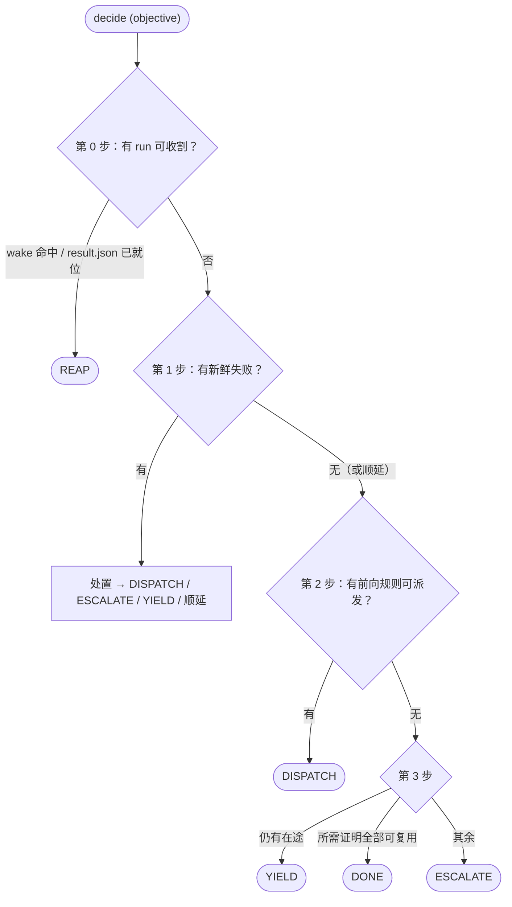

# VeriPower 架构

> 阶段门控、事件溯源的 Agent 流水线——设计原理与契约。

---

## 目录

- [术语表](#术语表)
- [1. 为什么选 VeriPower](#1-为什么选-veripower)
- [2. 系统模型](#2-系统模型)
- [3. 规则注册表与派生依赖图](#3-规则注册表与派生依赖图)
- [4. 状态模型：事件日志](#4-状态模型事件日志)
- [5. 调度决策循环](#5-调度决策循环)
- [6. 子 Agent 契约](#6-子-agent-契约)
- [7. 工作空间布局](#7-工作空间布局)

---

## 术语表

以下术语在全文中以固定含义使用，此处集中定义，链接节给出完整上下文。各阶段自身的契约（`result.json` 字段、CLI 标志、路由表）不在本文档中展开——见各自 schema / `--help` / `route.py`。

| **术语** | **说明** |
|---|---|
| **Orchestrator**（编排器） | 主会话中的 `design-flow` Agent；系统中唯一有权调用 `kernel.py`、派发 `Task()`、与用户交互的角色（§2.4）。 |
| **kernel**（内核） | `python3 framework/scripts/kernel.py`——`events.jsonl` 的唯一写者，也是唯一的决策者。它的动词就是全部状态/决策界面（§2.2）。 |
| **decide / 调度器** | `kernel.py decide`（实现在 `schedule.py`）——读取事件日志 + 磁盘，每次调用返回恰好一个动作；Orchestrator 是其薄执行器（§5）。 |
| **rule**（规则） | 一个内核调度单元，定义于 `rules.py:RULES`。八条流水线规则外加 `simulation-triage`。依赖图从规则的输入/输出选择子*派生*，不单独声明（§3）。 |
| **proof**（证明） | 产证明规则在收割时落账的 pass/fail 断言：`{name, verdict, inputs, oracle, evidence}`，内嵌于其 `outcome` 事件（§4.4）。 |
| **证明有效性** | 一个*查询*——不是存下来的标志位。一个证明*此刻*有效，当且仅当其裁决为 `pass`、落账的输入/输出指纹仍与磁盘一致、且其 oracle 此后未被 reopen。陈旧与否在每次读取时重算（§4.4）。 |
| **oracle 与 grade** | 裁决一个证明的裁判，`(ref, grade)`，`grade ∈ {tool, human, proposed}`。tool oracle 自身即权威；`proposed`（LLM 自撰）oracle 只能经人工 `pin` 棘轮升格为 `human`（§4.5）。 |
| **objective**（目标） | 一次 `decide` 调用所调度的目标：`delivery`、`repair` 或 `signoff`。它决定所需证明集（§5.1）。 |
| **disposition**（处置） | 调度器对单个*新鲜*失败的裁定：自动重建、triage 或升级——由附着诊断的可靠性把门（§5.3）。 |
| **reap**（收割） | 以 `kernel.py reap`（无裁决标志）结束一个在途 run：`cmd_reap` 读该 run 的 `result.json`，提升产物，追加 `outcome`（triage 则另追加 `diagnosis`）（§5.6）。 |
| **promote**（提升） | 将 `runs/<N>/` 下的文件逐条目硬链接合并到规范阶段目录，`cmd_reap` 在 pass 和 fail 两种路径上均执行，幂等（§7.2）。 |
| **projection**（投影） | `facts.projection` 纯粹从事件日志 + 磁盘算出的每规则状态格（`valid / stale / failed / blocked / in-flight / missing`）。取代任何存储的状态快照（§4.6）。 |

---

## 1. 为什么选 VeriPower

VeriPower 把确定性调度核心和 LLM Orchestrator 分开：一次路由失误不会污染已完成的工作，因为"发生过什么"的记录是一份 LLM 永远无法改写的只追加事件日志，而"这个结果还可信吗"每次被问到时都从这份日志对着磁盘重新计算。这个分离不是锦上添花，而是承重墙——本文档的每一项架构决策都立在它上面。

三条承诺撑起整个系统，每条在各自章节展开：

- **事件日志是唯一的持久状态。** `asic/<module>/events.jsonl` 是仅有的持久状态文件。*没有*状态快照：一个阶段是完成、陈旧、失败还是在途，都是按需从日志*派生*的——把落账的内容指纹和磁盘现状逐一比对（§4）。`kernel.py` 是日志的唯一写者，每个事件写入时都做 schema 校验，因此审计轨迹无法经由 Agent 提示词伪造。
- **有效性是查询，不是存储位。** 一个阶段的输出只在它落账的*证明*仍然成立时才被信任——输入输出未变、oracle 未被 reopen（§4.4）。改动任何上游文件，指纹对不上的证明在下一次查询时就静默失效；没有任何东西需要"记得"去标脏。新鲜与否因此由内容决定，而不是由记账决定。
- **依赖图是派生的，不是声明的。** 每条规则声明自己消费和产出的产物 glob；生产者→消费者图从这些选择子计算得出（`rules.producer_of`），因此不存在第二份会与阶段实际读写漂移脱节的 DAG 结构（§3）。

VeriPower 不是服务：没有 daemon、没有数据库、没有 HTTP——磁盘文件就是数据库。不绑供应商：skills 在 `rules.RULES[...].skill` 这个派发接缝处可替换。不是跑一次就完的 Agent：它扛得住数小时的修复风暴——阶段失败、修复重建上游生产者、下游证明跨多个 Orchestrator 轮次重新验证。

## 2. 系统模型

### 2.1 三层架构

Orchestrator Agent 做决策；`kernel.py` 和 skills 负责执行；磁盘负责持久。

```
┌────────────────────────────────────────────────────────────────────────────────────┐
│             Orchestrator Agent  ( veripower:design-flow )                          │
│  main conversation; forward dispatch / repair routing /                            │
│  escalation / user collaboration                                                   │
└──┬───────────────────────────┬────────────────────────────────┬────────────────────┘
   │ Bash                      │ Skill()                        │ Task()
   │ kernel.py CLI             │ veripower:specification        │ general-purpose
   │                           │ veripower:simulation-plan      │ (the 4 task rules +
   │                           │ veripower:rtl-design           │  simulation-triage)
   │                           │ veripower:simulation           │
   │                           │ (main-thread loaded)           │
   ▼                           ▼                                ▼
┌────────────────────┐  ┌──────────────────────────────┐  ┌───────────────────────────────┐
│ Deterministic core │  │  Main-thread skill           │  │  Stage / Debug Subagent       │
│ (Python)           │  │  (runs in Orchestrator's     │  │  (isolated context)           │
│  kernel.py:        │  │   main thread)               │  │                               │
│   10 verbs; sole   │  │                              │  │  Stage: executes rule         │
│   writer of the    │  │  specification / sim-plan /  │  │    → writes result.json       │
│   event log        │  │  rtl-design / simulation:    │  │  Debug (triage): canon. RO,   │
│  schedule.py:      │  │    self-driven fan-out /     │  │    scratch RW builder         │
│   decide → action  │  │    dialogue → result.json    │  │    → result.json (+ diag)     │
│  facts / rules /   │  │                              │  │  Must NOT call kernel.py      │
│  route / store     │  │                              │  │  or make routing calls        │
└──────────┬─────────┘  └──────────────────────────────┘  └───────────────────────────────┘
           │ reads/writes
           ▼
┌────────────────────────────────────────────────────────────────────────────────────┐
│                              asic/<module>/                                        │
│                                                                                    │
│   events.jsonl                       the ONLY durable state (append-only log)      │
│   Design/<rule>/result.json          specification / rtl-design / lint-cdc /       │
│                                      synthesis / timing-analysis                   │
│   Verification/<rule>/result.json    simulation-plan / simulation / power-analysis │
│   (status is DERIVED from events.jsonl + disk fingerprints — never stored)         │
└────────────────────────────────────────────────────────────────────────────────────┘
```

Orchestrator 的三条派发路径：

- **Bash** → `kernel.py` CLI（动词见 §4.2 / §5）。它在进程内组合其余框架脚本；Orchestrator 从不直接调用它们。
- **Skill()** → 四个主线程 skills（`specification`、`simulation-plan`、`rtl-design`、`simulation`）。
- **Task()** → 四个 task 派发的阶段子 Agent 和 `simulation-triage` 调试子 Agent。

### 2.2 内核界面

`framework/scripts/` 是一个确定性核心，拆成六个可裸导入、各司一职的模块外加 CLI。`kernel.py` 是 Orchestrator 调用的唯一入口；其余由它导入。

| 模块 | 职责 |
|---|---|
| `kernel.py` | CLI，且是 `events.jsonl` 的**唯一写者**。十个动词：`decide`、`dispatch`、`reap`、`diagnose`、`escalate`、`pin`、`reopen`、`signoff`、`status`、`consequences`。每个动词打印一个 JSON 信封。 |
| `rules.py` | 规则注册表（`RULES`）——内核调度对象的单一真相源，也是依赖图的*来源*（§3）。另有 `FORWARD_PRIORITY`、`PIPELINE_INPUTS`、`ADVISORY_ORDER`，以及派生助手 `producer_of` / `input_producers` / `input_closure` / `sort_prereqs`。依赖极轻的叶子模块。 |
| `facts.py` | 事件日志 I/O（`read_events` / `append_event`，写入即校验 schema）、内容指纹（`fingerprint`），以及建立在其上的新鲜度查询——`proof_valid`、`input_available`、`projection`，外加其中最严的 `signoff_gate` / `signed_off`（§5.5）。不持有任何可变状态；一切从日志 + 磁盘计算。 |
| `schedule.py` | 调度器：`decide(objective) → 恰好一个动作`。对 (磁盘, 日志, 参数) 纯函数；组合 `route.py` 与 `facts.signoff_gate`。持有目标→所需证明集映射与新鲜失败处置。 |
| `route.py` | 纯确定性返工目标选择——静态失败→目标映射表的**唯一居所**（`PA_CATEGORY`、`FIXED_TARGET`、`LINT_CATEGORY`、`TRIAGE_ROOT_CAUSE`）。不持有状态；原样组合进 `schedule.py` 与 `kernel.py`。 |
| `store.py` | 文件系统产物生命周期助手：派发时的 `inject_inputs`（写 `<workdir>/inputs.json`）与 `carry_self`（把作者自己上一轮的规范产物拷进新 workdir）、收割时的 `promote` 与 `_mirror_subagent_trace`。由 `kernel.py` 导入；从不直接调用。 |
| `usage.py` | 解析一份 Claude Code JSONL 转录——一个 Task 子 Agent 镜像下来的 `.subagent_traces/<rule>-<id>.output`，或一份 orchestrator 会话转录——归并成一份 token 用量明细（`parse_trace_usage`，按 message id 去重）。纯函数/只读，仅用标准库，从不抛异常。`kernel.py` 在收割时对 Task 子 Agent 镜像下来的转录调用它，填入 outcome 事件的 `cost_tokens`。 |

事件 schema 位于 `framework/references/schemas/events/<type>.schema.json`（7 份，§4.2），结果信封位于 `framework/references/schemas/envelope.schema.json`，共同构成核心的全部。

> **黑箱纪律。** Orchestrator 按文档化的命令行调用 `kernel.py`（标志经 `<verb> --help`，每个动词打印 JSON 信封），从不读框架脚本源码。遇到非零退出或 `ok:false` 信封，按文档化的失败协议处理（修正目标、升级该 `ok:false`），绝不绕过。

### 2.3 哪些阶段走主线程加载，以及流水线前的 brainstorm

`veripower:specification`、`veripower:simulation-plan`、`veripower:rtl-design`、`veripower:simulation`——只有这四条规则不通过 `Task()` 派发，而是由 Orchestrator 以 `Skill()` 在主线程中直接加载。原因很直接：`Task()` 子 Agent 既不能在中途与用户交互，也不能再派发 `Task()`，而这四条规则各需其中一项能力。

> **契约：** `Task()` 子 Agent 不准再派发 `Task()`——禁止二级派发（审计边界）。因此，需要扇出一级子 Task 的规则不可能作为 Task 子 Agent 运行；走主线程加载是保有扇出派发权同时又守住这条边界的*唯一*方式。`specification` / `rtl-design` / `simulation` 走主线程是因为需要扇出派发权；`simulation-plan` 走主线程是因为需要多轮用户对话，外加一次一级 plan-adequacy 审查派发。

每条 `Rule` 上的 `execution` 字段（`"main-thread"` 或 `"task"`）就是 Orchestrator 分支的依据——从不依赖硬编码的阶段清单。各规则的触发条件：

- **specification** — 消费已冻结、已批准的 `brainstorm.md`；内含一个扇出派发器（分解 + 围绕分区门的按 child 的 sub-Task 波次），外加其主线程 `spec` CLI 门控动词。不是因为头脑风暴对话才走主线程——那个对话已前移到流水线外的 `brainstorm` skill。
- **simulation-plan** — 与用户的多轮计划审查对话；另自派发一次一级 plan-adequacy 审查 sub-Task（Step 4 / §6.3.1）。
- **rtl-design** — 只扇出，无对话：每个 child 派一个一级子 Task，一个有界的合规门自收敛循环，一个门控性语义审查波次，末尾再加一个 finalize 子 Task。
- **simulation** — 只扇出，无对话：每一轮都是同质的（内核的 `carry_self` 在派发前就已把上一轮的 TB 携带进 workdir；若是真正的首跑则 workdir 为空——skill 从不据此分支）。Wave 1 派发 env-build child，随后跑 smoke gate、LLM conformance review-gate（每轮都重新评判，从不跳过）和 verify child（Wave 2）。

> **警告：** 如果 `Skill(veripower:lint-cdc|synthesis|timing-analysis|power-analysis)` 出现在 Orchestrator 的工具历史中，这是个 bug——那四条规则必须走 `Task()` 派发。

**流水线前的 `brainstorm` skill（不由内核派发）。** 重量级 D0–D7 需求对话在自己的独立会话中运行，是一个单独的 `brainstorm` skill——不属于上述四个主线程阶段，Orchestrator 永远不派发它。它产出流水线启动所需的已批准 `asic/<module>/brainstorm.md`（模块根目录）；不写 `result.json`，不调 `kernel.py`。`brainstorm.md` 是流水线唯一的外部输入——`rules.PIPELINE_INPUTS`——只需存在且为 `Status: approved`（Orchestrator 的会话启动门），`specification` 即可调度。

### 2.4 角色职责

| **角色** | **载体** | **职责** | **能力边界** |
|---|---|---|---|
| **Orchestrator Agent** | `design-flow` skill，主会话 | 执行每次 `decide` 返回的那一个动作；撰写按派发的 `directive`（它唯一的判断通道）；仅在用户明确意图下提议 `pin` / `reopen` / 人工 `diagnose`；升级；与用户协作。同时作为四条主线程规则的主线程执行器。 | 系统中唯一有权调用 `kernel.py`、使用 Task 工具、与用户交互的角色。不手写任何事件——每个事件都由 `kernel.py` 写入。 |
| **主线程 skill** | 四条主线程规则之一，经 `Skill()` 加载 | 在 Orchestrator 线程中自驱动工作：sub-Task 扇出（生产者规则、simulation）、多轮对话（simulation-plan）、或单次审查派发。各自写入自己的产物和 `result.json`。 | 可派发一级 sub-Task（生产者规则 / simulation）或与用户交互（simulation-plan；specification 限其两次路径交接门）。禁 `kernel.py`、禁路由。靠 SKILL.md 条文纪律约束，不靠工具门控。 |
| **阶段子 Agent** | 四条 Task 派发的规则（`lint-cdc` / `synthesis` / `timing-analysis` / `power-analysis`） | 执行单条规则：读上游 → 做工作 → 写 `result.json` → 返回 STATUS 行 | 不准调 `kernel.py`，不准做路由决策（§6.1） |
| **调试子 Agent** | `simulation-triage`，经 Task 派发 | 对仿真失败做分级（L1 日志+代码+FSDB 推理 → L2 受控实验）根因分析；其目标 run 与上游（spec/RTL/plan）在派发时经 `inputs.json` 注入（`sim_run` 指名目标 run 目录），`proof=None`，故即便上游证明失效也可派发；写出的 `result.json` 其 `stage_specific` 携带归因，由内核在收割时转成 `diagnosis`（§6.4） | canonical 只读、自身 workdir 可写；绝不编辑其它规则的 `result.json`、RTL 或测试；非幂等（重复运行重跑 L2） |
| **`kernel.py`** | Python CLI | 状态转换（以事件形式）、调度、证明推导、promote、尽力而为的转录镜像 | 持有调度逻辑但不做*判断*：它从不撰写 directive，也从不代人铸造人工诊断。 |
| **`route.py`** | 纯函数（同级脚本） | 将失败的封闭枚举字段映射为目标 / `ESCALATE` / `NEED_INPUT` | 不持有状态；对输入全域（未知枚举值落入具名 `unrouted*` ESCALATE，绝不 KeyError）。 |

### 2.5 核心设计原则

- **判断归 Orchestrator，状态与调度归内核**——确定性边界。Orchestrator 只做两类判断：为一次派发撰写什么 `directive` 文本，以及是否提议 `pin` / `reopen` / 人工 `diagnose`（均需用户明确意图）。其余一切——下一步跑什么、某个证明是否有效、某个失败路由到哪——都由 `kernel.py decide` 计算。Orchestrator 是薄执行器：调 `decide`，执行返回的那一个动作，循环。
- **决策边界 = 工具边界。** 每个调度决策都下沉到 `decide`。其可验证形式：*两次状态变更类内核调用之间没有 `decide`，就是 bug。*
- **文件即数据库。** `events.jsonl` 是持久日志；`result.json` 是阶段输出；其余一切（状态、新鲜度、在途）都是二者的纯函数。没有中间缓存，没有服务端存储。模块下的 `.fingerprint-cache.json` 是纯 mtime/size 加速缓存——从不作为事实来源。
- **压缩安全的续跑。** 因为文件即数据库、Orchestrator 在轮次之间持有*零*持久控制状态，会话中途的上下文压缩或进程崩溃都可幸存：每一轮都经 `decide` 从磁盘重新推导下一个动作。唯一驻留会话的状态是为下一次派发撰写的 `directive` 文本——可重derive，且一经传给 `dispatch` 即落盘为 `directive.md`。
- **单向通信 + 上下文隔离。** Orchestrator → 提示词 → 子 Agent → `result.json` + STATUS。没有子 Agent 发起的回调，没有子 Agent 之间的通信；子 Agent 不继承父会话历史，所有输入以显式文件路径传入。

**信任边界——proposed 与权威 oracle。** VeriPower 让 LLM 自撰的裁判（spec 意图评审、计划充分性评审、RTL 语义评审、TB refmodel）与确定性 EDA 工具 oracle 并肩运行。二者可信度并不等同，内核把这一点编码进了系统：oracle 带有 `grade`（§4.5）。`tool` 级 oracle（SpyGlass、DC、PT）自身即权威。`proposed` 级 oracle 是 LLM 在为自己的正确性背书——足以把门一次常规 *delivery* 构建，但**不足以**闭合 *signoff*。proposed oracle 获得权威（`human`）信任的唯一途径是人工 `kernel.py pin`：它记下 oracle 内容当前的指纹；只在该内容原封不动期间 grade 升为 `human`，内容一漂移或 pin 被 `reopen`，即刻跌回 `proposed`（§4.5）。因此 `pin`、`reopen` 和 `signoff` 是**问必批的判断动词（ask-gated）**：Orchestrator 只在用户明确意图下提议，且 harness 权限门在每次调用时都会向用户请示。这就是那道接缝——只有人、且必须是人，才能把 LLM 的自我评估转换为签核级信任：`pin` 按 oracle 逐个转换，`signoff` 对整个模块整体转换（§5.5）。

## 3. 规则注册表与派生依赖图

`rules.py:RULES` 是内核调度对象的单一真相源。一条 `Rule` = 一个内核调度单元。不存在单独维护的阶段 DAG：生产者→消费者图从每条规则的产物选择子*派生*。

### 3.1 `Rule` 记录

每条规则是一个 frozen dataclass：

| 字段 | 含义 |
|---|---|
| `name` / `stage` / `skill` | 身份与执行它的 `veripower:<skill>`。 |
| `execution` | `"task"` 或 `"main-thread"`——派发类别（§2.3）。 |
| `workdir_root` | 模块相对的规范目录（如 `Design/specification`）；run 落在 `<workdir_root>/runs/<N>/`。 |
| `inputs` | 规则消费的、按名分组的模块相对规范路径 *glob*。 |
| `outputs` | 规则产出的（以 workdir_root 为前缀的）模块相对 glob——依赖图的来源。 |
| `proof` | 产证明规则在收割时落账的证明名（`simulation-triage` 为 `None`）。 |
| `oracle` | `(ref, grade)`——裁判及其信任等级（§4.5）。 |
| `oracle_selector` | 对 `proposed` oracle，`pin` 所指纹的 workdir 相对 glob。 |
| `params` | 规则期望的自由参数（如 `simulation-triage` 的 `sim_run`）。 |
| `carry` | 派发时 `store.carry_self` 拷进新 workdir 的自产物 glob（§5.6/§7.2），减去 `no_carry`；对没有自我携带的规则（纯变换器）为空。 |
| `no_carry` | 从 `carry` 中排除的 glob——如必须每轮重新生成、而非携带下去的逐轮评审记录。 |

### 3.2 八条流水线规则

`FORWARD_PRIORITY` 固定多规则同时可调度时的平局顺序：`specification → simulation-plan → rtl-design → lint-cdc → synthesis → timing-analysis → simulation → power-analysis`。`simulation-triage` 是第九条规则，不在此序中——它只作为失败处置被派发（§5.3）。

| **规则** | **消费（输入生产者）** | **Skill** | **Oracle（grade）** | **规范目录** |
|---|---|---|---|---|
| specification | `brainstorm.md`（外部） | `veripower:specification`（主线程） | spec-review（proposed） | `Design/specification/` |
| simulation-plan | specification | `veripower:simulation-plan`（主线程） | plan-review（proposed） | `Verification/simulation-plan/` |
| rtl-design | specification | `veripower:rtl-design`（主线程） | semantic-review（proposed） | `Design/rtl-design/` |
| lint-cdc | rtl-design、specification（SGDC 种子） | `veripower:lint-cdc` | spyglass-ruleset（tool） | `Design/lint-cdc/` |
| synthesis | rtl-design、specification（SDC + `ppa.json`） | `veripower:synthesis` | dc-shell（tool） | `Design/synthesis/` |
| timing-analysis | synthesis | `veripower:timing-analysis` | pt-shell（tool） | `Design/timing-analysis/` |
| simulation | rtl-design、simulation-plan | `veripower:simulation`（主线程） | tb-refmodel（proposed） | `Verification/simulation/` |
| power-analysis | synthesis、simulation、simulation-plan、specification（`ppa.json`） | `veripower:power-analysis` | pt-shell（tool） | `Verification/power-analysis/` |

上表的生产者→消费者边就是 `rules.input_producers(rule)`——把每条规则的输入 glob 与所有规则的输出 glob 匹配（`producer_of`）算出。画出来即是流水线：

```
[specification] → [simulation-plan] → [rtl-design]
                                            │
                          ┌─────────────────┴──────────────────┐
                          ↓                                    ↓
                     [lint-cdc]                          [simulation]
                          │                                    │
                          ↓                                    │
                     [synthesis]                               │
                          │                                    │
                          ↓                                    │
                  [timing-analysis]                            │
                          │                                    │
                          └─────────────────┬──────────────────┘
                                            ↓
                                    [power-analysis]
```

隐式并行从这张图自然得出：`decide` 每次调用派发一条规则并再询，因此输入全部就绪的规则并行运行。流水线中段即双链并行——`{lint-cdc → synthesis → timing-analysis}` 与 `{simulation}` 并行，同时在途至多两条不同规则——由 `power-analysis` 汇合。Orchestrator 不写任何并发上限；它从派生边的有无中涌现。

### 3.3 三个图查询，三份不同职责

`rules.py` 上的派生助手从同一份选择子算出三样不同的东西，保持三者互不混淆是一条承重不变式：

- **`input_producers(rule)`** — 该规则输入 glob 的直接生产者（一跳，排除自身）。依赖图的边。
- **`input_closure(rule)`** — 上述生产者的*传递*闭包（输入闭包）。用于两处新鲜度/合法性检查：一个失败只有在其输入闭包内的每个证明当前都有效时才算"新鲜"（§5.3）；人工诊断的 `fix_owner` 必须是主体证明输入闭包内的生产者（否则 `kernel diagnose` 拒绝，§5.3）。仅产物边——`ADVISORY_ORDER` 从构造上就被排除。
- **`sort_prereqs(rule)` = `input_producers(rule) ∪ ADVISORY_ORDER[rule]`**（排序前驱）— 仅用于排序。`ADVISORY_ORDER`（`synthesis` 排在 `lint-cdc` 之后；`power-analysis` 排在 `timing-analysis` 之后）添加的是并非数据依赖的*时序*边：synthesis 并不消费 lint 的报告，但我们希望 lint 先过。`sort_prereqs` 的消费者*有且只有一处*——delivery 的不超车门（`decide` 第 2 步，§5.2）。它绝不可进入任何新鲜度或证明有效性计算，否则一条咨询性时序提示就会冒充数据依赖。

> **契约：** `ADVISORY_ORDER` / `sort_prereqs` 只影响 *delivery 下的调度顺序*。`input_producers` / `input_closure`（产物边）是证明有效性、输入可用性、失败新鲜度的唯一依据。两者永不交叉。

### 3.4 约束与 SGDC 时钟域声明

`specification` 的 `derive-constraints` 动词产出下游工具阶段读取的完整约束集：`Design/specification/constraints/<TOP>.sdc`（`synthesis` 消费）和 `<TOP>.sgdc`（`lint-cdc` 消费的种子）。两者均从已批准的 §1.4.1 时钟表和 §1.6 时钟 Relationship 块推导，因此约束是 spec 的权威投影，而非手工维护。

异步时钟关系在两种格式中的载体不同，因为两个工具接受的语法不同。SDC 使用标准的 `set_clock_groups -asynchronous` 结构。SGDC 不能：SpyGlass `vL-2016.06` 直接拒绝 `set_clock_groups`（`SGDCSTX_002 Unknown SGDC command`）。生成器改用 SGDC 原生形式——按时钟的域声明 `clock -name <c> -period <p> -edge {…} -domain <D>`：所有 `primary`/`synchronous-related` 时钟共享一个域名，每个 `async` 时钟独占一个域。这条声明的作用是把 spec 的 §1.6 Relationship 在 SGDC 中**显式化、权威化**，而不是把域划分留给工具默认行为。该行为由 `tests/eda/f1-sgdc-clock-group/` 的手动 EDA 回归实证钉定：在 `vL-2016.06` 上，一个无同步器的单拍跨域采样以规则号 `Ac_unsync01`（policy `clock-reset`，goal `cdc/cdc_verify_struct`）被标记——即 `lint-cdc` 失败类别表为该类跨域所记录的规则号。（在该版本上，名字不同的时钟本就默认归入不同域，因此这条声明的价值在于让域划分*由 spec 驱动且显式*，而非工具推断；范围界定的实测结论见该 fixture 的 README。）

## 4. 状态模型：事件日志

### 4.1 `events.jsonl` 是唯一的持久状态

`asic/<module>/` 下内核关心的一切都从一个只追加文件派生：`events.jsonl`。没有 `task.json`，没有状态快照，没有新鲜度字段。`facts.read_events` 解析它（容忍被截断的末行）；`facts.append_event` 是唯一写者，且只能经 `kernel.py` 到达。每次追加都*先*按该事件的 JSON Schema 校验再写入，因此畸形事件是硬错误，绝不会成为已写入的一行。

因为日志即状态，在途也是派生的：`facts.in_flight` = 每个没有匹配 `outcome` 的 `dispatch`（按 `(rule, run)` 键）。崩溃恢复因此是内生的——执行器死掉的 run 留下一个没有 `outcome` 的 `dispatch`，所以它仍显示在途，`decide` 会去收割它（§5.6）。

### 4.2 七类事件

`events.jsonl` 携带 **7 类事件**，各由 `framework/references/schemas/events/<type>.schema.json` 校验。`kernel.py` 是全部七类的唯一写者——不存在任何让 Agent 提示词注入原始事件的通道。

| **type** | **写入方（动词）** | **用途 / 关键字段** |
|---|---|---|
| `dispatch` | 自动（`dispatch`） | 开启一个 run：`rule`、`run`、`workdir`、`params`（含 `directive` 的路径+摘要）、`objective`、`diagnosis_refs`，以及——仅产证明规则——消费的 `inputs` 版本表（`proof.inputs` 的唯一来源）。 |
| `outcome` | 自动（`reap`） | 关闭一个 run：`verdict ∈ {pass, fail, blocked}`、产出的 `outputs` 版本表（含规范 `result.json`）、`proofs[]`、`tool_versions`、可选 `reason`（blocked 子类）、可选 `cost_tokens`（该 run Task 子 Agent 转录的仅供审计的 token 用量——主线程阶段没有此字段，且从不进入有效性判定）。 |
| `diagnosis` | triage 自动（`reap`）；人工经 `diagnose` | 一条失败归因。必填（按 `diagnosis.schema.json`）：`id`、`subject {proof, outcome_run}`、`attribution`、`evidence`、`source ∈ {triage, human}`。可选：`fix_owner`、`fix_locus`、`confidence`、`supersedes`；`provenance`（`human` 必填，由 `diagnose` 强制）。 |
| `pin` | `pin` | 把 `proposed` oracle 向 `human` 棘轮：`oracle_ref`、`content_fingerprint`（pin 时记录）、`provenance`、`reason`。 |
| `reopen` | `reopen` | 撤销一个 pin：`pin_ref`、`reason`。使 oracle 在其落账后被 reopen 的证明失效（§4.4）。 |
| `signoff` | `signoff` | 闭合签核：`provenance`、`reason`。仅在 `facts.signoff_gate` 干净时写入（§5.5）。不携带指纹，也从不被撤销——有效性由 `facts.signed_off` 实时重新推导。 |
| `escalation` | `escalate` | 记录流程把决定交给用户：`reason`、`open_question`、可选 `candidates`。 |

`dispatch` / `outcome` 是执行工作的纯副作用。triage 的 `diagnosis` 在收割时从 triage run 的 `result.json` 派生（§5.3）。另外五个动词（人工 `diagnose`、`pin`、`reopen`、`signoff`、`escalate`）承载 Orchestrator/用户的判断——但仍然经过 `kernel.py`，由它校验并（对 `diagnose`/`pin`）执行 schema 无法表达的结构性关联约束（§5.3、§4.5）。所有事件携带 UTC ISO8601 的 `ts`，写在记录首位。

### 4.3 内容指纹

新鲜度由内容比对决定，因此整个模型的原子是内容指纹。`facts.fingerprint(path)`：

- **文件** → 其字节的 `sha256:<hex>`；
- **目录** → 有序遍历的 `merkle:<hex>`（每个条目的相对路径 + 类别 + 文件哈希 / 符号链接目标）；
- **符号链接** → 按其目标*字符串*哈希，不跟随；
- **缺失 / 不可读** → 哨兵值 `UNKNOWN`。

`facts.versions_match(recorded, current)` 仅当两者都已知且相等时为真——`UNKNOWN` 与任何值都不匹配，因此缺失或不可读的产物*保守地陈旧*，绝不假新鲜。`fingerprint_cached` 只加一层 mtime/size 加速缓存；它从不是事实来源（符号链接和目录绕过缓存，以避免假新鲜命中）。

### 4.4 证明有效性是查询

产证明规则在收割时把一条 `proof` 落进其 `outcome` 事件：`{name, verdict, inputs, oracle, evidence}`。`inputs` 是该 run 消费一切的版本表（取自 `dispatch` 事件）；`outputs`（在 outcome 上）是它产出一切的版本表。证明不是存储的"有效"位——`facts.proof_valid(module, proof)` 每次调用都重算。它*此刻*有效，当且仅当**全部四个**条件成立：

1. **裁决** — 携带该证明的最新 outcome 有 `verdict == pass`。
2. **输入未变** — 每个落账的输入指纹仍与磁盘一致。
3. **oracle 未被 reopen** — 该证明 `oracle.ref` 的 `reopen` 没有出现在证明落账位置或其后。
4. **输出未变** — 每个落账的输出指纹（包括规范 `result.json` 本身）仍与磁盘一致。

推论：编辑证明触碰过的任何文件——输入、输出、或结果信封——都会在下一次查询时静默使该证明失效，并传递性地使消费它的下游证明失效。没有任何东西需要去*标记*陈旧；陈旧就是"不再有匹配的指纹"这一事实本身。`kernel.py consequences --paths <p…>` 让这一点可以事先查询：一个只读的 what-if，对每个路径报告若其内容改变、哪些当前有效的证明会翻转为无效。

**输入可用性**（`facts.input_available`）是派发时刻的对应物：消费者的某个输入 glob 可用，当且仅当它是外部的 `brainstorm.md`（只需存在），或其生产者从未运行过（真冷启动——前向调度会先运行生产者），或生产者最新 outcome 落账了匹配且仍新鲜的输出**且**该生产者的证明当前有效。生产者运行过却无一匹配（落账或磁盘上都没有）= 输入确实缺失 → 不可用（保守方向——绝不让消费者对着静默缺失的输入派发）。

### 4.5 oracle 等级与 pin

每条证明的 `oracle` 是 `(ref, grade)`。grade 由 `kernel._graded` *在收割时派生*：

- 注册 oracle 等级为 `tool` 的规则（SpyGlass / DC / PT）始终落账 `tool`——EDA 工具即权威。
- 注册等级为 `proposed` 的规则（LLM 自撰裁判）落账 `proposed`——**除非**存在一个*存活的* `pin`，其对该 `oracle_ref` 记录的 `content_fingerprint` 等于 oracle 内容*当前*的指纹，此时落账 `human`。

一个 pin **存活**，当且仅当事件序中它之后没有指名其 `oracle_ref` 的 `reopen`（按事件逐个判断，因此 `pin → reopen → pin` 正确地再次产生存活 pin）。pin 指纹的 oracle 内容是该规则的 `oracle_selector` glob（如 `simulation` 的 `tb/uvm/refmodel/*`——pin 背书的是*裁判本身*，它跨 run 存续；LLM 重新生成 refmodel 时内容指纹随之分叉，下一次收割即跌回 `proposed`）。不可读的 oracle 内容（`UNKNOWN`）永远不继承信任。

这就是信任边界（§2.5）背后的机械装置：`pin`/`reopen` 是把裁判移过 proposed↔human 界线的唯一杠杆，二者均问必批，且棘轮以内容为锚——信任无法静默地活过它所授予的那份内容。

### 4.6 投影

`facts.projection` 渲染 `kernel.py status` 动词打印的每规则状态——完全从日志 + 磁盘计算，取代任何存储快照。每条规则的格子取值：

| 格子 | 含义 |
|---|---|
| `in-flight` | 有 `dispatch` 无匹配 `outcome`。 |
| `missing` | 还没有任何 outcome。 |
| `blocked` | 最新 outcome `verdict == blocked`。 |
| `failed` | 最新 outcome `verdict == fail`。 |
| `valid` | 最新 outcome 通过且 `proof_valid` 此刻成立。 |
| `stale` | 最新 outcome 通过但 `proof_valid` 此刻不成立（脚下有输入/输出/oracle 变了）。 |

签核没有格子——它不是阶段。`kernel.py status` 把它作为一个独立的 `signed_off` 布尔值与各格子并列渲染，判定语见 §5.5：存在人工 `signoff` 事件**且**所有阶段证明当前均有效。签核的成色只等于其脚下的证明。

### 4.7 结果信封与 schema 校验

每个 `result.json` 按共享信封（`framework/references/schemas/envelope.schema.json`：`stage` / `module` / `produced_at` / `status` / `artifacts` / `stage_specific`）外加该规则的按阶段 schema `skills/<skill>/references/result.schema.json`（其 `$ref` 引用信封）校验。`kernel._derive_verdict` 在收割时运行这套校验：格式良好的 `status ∈ {pass, fail}` 即成为裁决；缺失、不可解析、非对象、status 畸形或违反 schema 的信封成为 `blocked`（子类记入 outcome 的 `reason`）。随后检查**时间完整性**：`produced_at` 早于本 run 自己的 `dispatch` 事件（与向下取整到秒的 dispatch `ts` 比对——skill 侧 finalize 打的是秒级时间戳）意味着信封是被携带进来的、而非本轮执行者所写，派生为 `blocked` / `stale_result`（`produced_at` 不可解析则为 `blocked` / `produced_at_unparseable`）；它绝不铸成裁决，因此陈旧副本无法被一次裸收割漂白进账本。`facts.validate_result` 只读，且把基础设施故障（schema 缺失/损坏）也作为违规消息返回——保守方向永远是"未证明有效"，绝不静默通过。

## 5. 调度决策循环

Orchestrator 每轮运行一个确定性步骤：

```
loop:
  a = kernel.py decide --module <M> --objective <obj> [--wake <rule>:<run>]
  execute(a)                       # a.action ∈ {DISPATCH, REAP, YIELD, DONE, ESCALATE}
  if a.action in {YIELD, DONE, ESCALATE}: end turn
```

`decide` 对 (磁盘, 日志, 参数) 是纯函数，以 JSON 对象返回恰好一个动作。Orchestrator 执行后再询；`DISPATCH` 和 `REAP` 继续循环，其余三个结束本轮。下一个 `<task-notification>` 到达时 Claude Code harness 重新进入，此时 Orchestrator 传 `--wake <rule>:<run>`（并在该轮的每次再询中重复传递）。

### 5.1 目标决定所需证明集

Orchestrator 作为会话值携带的 `objective` 决定 `decide` 向什么调度（`schedule.required_proofs`）：

- **`delivery`**（默认）— 前向构建整个 DAG（全部八个证明）。
- **`signoff`**（仅限用户明确请求）— *同样*这八个证明，但它在 `DONE` 处武装签核门（§5.5）。证明集与 `delivery` 完全相同是刻意设计：签核是让同一批证明去过更高的门槛，而不是要求更多证明。
- **`repair`** — 最新失败那一条规则的证明。当 `delivery` 下的 `decide` 返回自动重建的 `DISPATCH`（`needs_directive: true`）时，Orchestrator 切到 `repair`，把后续 `decide` 收窄到只重建能让失败证明重新验证的闭包；`repair` 返回 `DONE` 后切回 `delivery`。

### 5.2 五个动作与决策步骤

`decide` 按以下步骤行走，返回第一个触发的动作：



- **第 0 步——先收割。** 若 `--wake <rule>:<run>` 指名一个在途 run → `REAP` 之。否则，若任何在途 run 的 workdir 已有 `result.json`（已完成但未收割），按 `FORWARD_PRIORITY` 收割最早的一个。先收割再决策，保持日志与现实同步。
- **第 1 步——新鲜失败处置。** 按 `FORWARD_PRIORITY` 找最新 outcome 为 `fail` *且*该失败*新鲜*（§5.3）的规则，运行 `_disposition`。最早的新鲜失败胜出；`_defer_to_forward` 的结果落到第 2 步。
- **第 2 步——前向派发。** 计算当前不可复用的所需证明，扩展到*重建闭包*（沿不可用输入的 `input_producers` 行走，让修复先重建正确的上游），然后按 `FORWARD_PRIORITY` 派发最早的、不在途且输入可用的候选。仅在 `delivery` 下，候选还需其全部 `sort_prereqs` 证明有效才放行——不超车门（§3.3）。
- **第 3 步——收束。** 有工作在途 → `YIELD`（返回 `in_flight[]` 视图）。否则所需证明全部可复用 → `DONE`。否则 → `ESCALATE`（"无可派发规则、无在途、未完成"）。

`cmd_dispatch` 是可派发性真相的唯一来源：它在*写入时刻*复查在途前提与输入可用性，若可派发性在扫描与写入之间发生了漂移则返回 `ok:false`。签核门不在这些检查之列——签核不可派发，也就没有派发可把门。它的防绕过职责移交给 `cmd_signoff`：后者自己跑门，而不是信任先前的一次 `decide`——该动词是门的唯一界面，因此越过流程的 `kernel.py signoff` 无法铸造一个门已拒绝的签核（§5.5）。

### 5.3 新鲜失败处置与可靠性门

一个失败只有在*新鲜*期间才可采取行动（`schedule._fail_is_fresh`）：其 fail 证明必须除裁决外样样新鲜——落账的输入输出仍与磁盘一致、oracle 未被 reopen、**且**其传递 `input_closure` 内的每个证明当前均有效。闭包里有陈旧或缺失证明 = 上游仍在传播，该失败即*陈旧*，顺延给前向重验而不做路由。（此处仅用产物边——`sort_prereqs`/`ADVISORY_ORDER` 永不进入。）

对一个新鲜失败，`_disposition` 三择其一：

1. **已有诊断附着。** `_active_diagnoses` 收集 `subject` 与该失败 `(proof, outcome_run)` 匹配、未被 supersede 的全部 `diagnosis`。若最新一条**可靠** → 自动重建：`DISPATCH` 其 `fix_owner`（在 `repair` 下），并把所有新鲜失败中共享该 `fix_owner` 的每条可靠诊断的 `id` 合并进 `diagnosis_refs`（多因修复逐条引用——无一静默丢弃；实际的 directive 合并是 Orchestrator 在撰写时的职责）。若 `fix_owner` 输入不可用，顺延前向。若最新诊断**不**可靠 → `ESCALATE`，把各诊断作为候选呈给用户。
   - **可靠性门**（`_reliable`）：一条诊断可靠，当且仅当它有 `fix_owner` **且**（`source == human`，或 `confidence == high` 且其 `attribution` 不指向失败规则自己的裁判）。自指诊断（无 `fix_owner`——归因指向 oracle 一侧）永远无法自动重建：没有重建目标，所以一律升级。正是这道门拦住了低置信或怪罪裁判的猜测去静默重建上游阶段。
2. **无诊断，且失败是 `simulation`。** 失败有歧义（仿真挂掉可能是 RTL、计划或 spec）→ `DISPATCH simulation-triage`，带 `params.sim_run = <失败 run>`（若 triage 已在途则 `YIELD`）。triage 运行，在*它的*收割时内核派生诊断（见下）；下一次 `decide` 看到诊断即重入处置分支 1。
3. **无诊断，自描述失败。** 失败自带路由字段 → `route.route` 内联选出目标（无需诊断事件）。`ESCALATE`/`NEED_INPUT` → 升级；目标输入可用 → 自动重建 `DISPATCH`；否则顺延前向。

**triage 在收割时的诊断**（`kernel._derive_triage`）。`simulation-triage` 无证明；它写出的 `result.json` 其 `stage_specific` 携带 `analysis_state`、`skipped_reason`、`root_cause`、`confidence`、`advisory`。收割时：`analysis_state != "complete"` → outcome 为 `blocked` 且不产生诊断（仿真失败保持歧义；下一轮重新派发 triage）。否则内核追加一条 `diagnosis`（`source: triage`），`attribution` 取 `root_cause`，`fix_owner` 取 `route.TRIAGE_ROOT_CAUSE[root_cause]`——*除非*映射到 `ESCALATE` 哨兵（`root_cause == simulation`），此时省略 `fix_owner`（处置会将这条自指归因升级）。`confidence` 原样落账；决定它能否自动路由的是可靠性门，不是收割分支。

### 5.4 失败路由（`route.py`）

全部静态失败→目标选择住在 `route.py`——一个纯的、无状态的同级模块，组合进 `schedule.py`（自描述失败）与 `kernel.py`（triage 归因）。它是四张封闭枚举映射表的**唯一居所**；任何其他文件（SKILL.md、本文档、schema）不得复述：

- `PA_CATEGORY` — `power-analysis` tooling 失败的 `failures[0].category` → 拥有它的上游生产者。
- `FIXED_TARGET` — 总是路由到单一固定祖先的规则（`simulation-plan → specification`）。
- `LINT_CATEGORY` — `lint-cdc` 失败的类别 → 该输入的生产者（坏 SGDC 种子路由到 `specification`；坏 RTL 路由到 `rtl-design`）。
- `TRIAGE_ROOT_CAUSE` — triage 的 `root_cause` → 返工目标（`simulation → ESCALATE`）。

`route.route` 对输入全域：任何超出已知枚举的值落入具名 `unrouted*` `ESCALATE`，绝不 `KeyError`，绝不静默丢弃。确切映射与规则标识见 `framework/scripts/route.py` 和 `tests/unit/test_route.py`（穷举式行为规格）。

### 5.5 签核闭合

闭合签核是系统里最严的门（`facts.signoff_gate`）。**每一个**阶段证明都必须：

1. 当前有效（§4.4）——这本身就要求每个落账的输入与输出指纹都已知且与磁盘一致，因此没有任何携带 `UNKNOWN` 落账版本的证明能算有效，
2. oracle 等级为 `tool` 或 `human`——`proposed` oracle 阻塞签核（"pin it"），且
3. 没有带外**新增**输入：磁盘上匹配该规则输入选择器、却不在该证明落账输入集里的文件，从未被任何 run 验证过。已落账文件的改与删本就使证明失效（§4.4）；唯独"加"能逃过落账集比对，所以签核门在此对选择器重新 glob 一遍——日常 delivery/repair 路径仍用便宜的落账集比对。

该门按 `FORWARD_PRIORITY` 顺序迭代，使它返回的理由确定。不满足时按调用方分两条路浮现：`decide --objective signoff` 把它包成指名违规证明的 `ESCALATE`（典型动作是"把 proposed oracle pin 掉"——一次人工 `pin`，§2.5）；`kernel.py signoff` 把它包成 `ok:false`。这就是信任边界咬合之处：流水线可以*交付*在 LLM proposed oracle 之上，但在人把每个 proposed 裁判 pin 到 `human` 等级之前，它无法*签核*。

**签核是一个动作，不是一个阶段。** 该门只裁定*是否够格*；真正闭合签核的，是人调用 `kernel.py signoff --provenance … --reason …`——`pin`/`reopen` 之外的第三个问必批判断动词（§2.5）。它自己跑门，而不是信任先前的一次 `decide`，因为该动词是门唯一的可绕过面——无论调用方在环内还是环外，都无法铸造一个门已拒绝的签核。一个模块**已签核**，当且仅当该事件存在*且*所有阶段证明当前均有效（`facts.signed_off`）——第二个合取项是实时重新推导的，因此事后某条证明变陈旧，签核就悄无声息地随之失效。刻意没有 `unsign` 动词：`reopen` 使其证明失效（§4.4 条件 3），合取项自然落空。

在 `objective=signoff` 下，所需证明集与 `delivery` **完全相同**——签核不要求更多证明，它要求同一批证明去过更高的门槛。那道门槛就是本门，施加在 `decide` 的 `DONE` 处（§5.2 第 3 步）；没有它，这个目标就只是 `delivery` 的别名，报成功而从未过问信任边界。因此 `signoff` 下的 `DONE` 意味着"门已干净，去盖章"，由 Orchestrator 提议该动词。

### 5.6 派发、收割与 directive 通道

**派发。** `kernel.py dispatch --rule <r> --objective <o> [--directive <file|->] [--diagnosis-refs …] [--params <json>]` 复查可派发性，落账 `dispatch` 事件（分配 `run = 已有 run 数 + 1` 并创建 `runs/<N>/`），返回 `{ok, rule, run, workdir, skill, execution}`。对产证明规则，它把消费的 `inputs` 版本表快照进事件（`proof.inputs` 的唯一来源）。返回之前，dispatch 还执行两个 workdir 填充子步骤——是 promote 在收割中所处位置的派发时对偶：

- **`store.inject_inputs`** 把每个声明的输入解析为其生产者的绝对规范阶段根目录（若规则带 `sim_run` 参数，则解析为具体的目标 run 目录），并把该表写入 `<workdir>/inputs.json`。执行者在该位置直接读规范内容——只读，绝非一份暂存副本。
- **`store.carry_self`**——对 `Rule.carry` 非空的规则——把作者自己上一轮的规范产物（按 `Rule.carry`，减去 `Rule.no_carry`）拷进新 workdir，让返工或增量轮次从自己上一次的产出开始，而不是从空白开始。是拷贝（`copy2`）而非硬链接：规范内容与产出它的那次 run 共享 inode，硬链接会让作者的编辑同时腐蚀两边。在真正首跑（尚无规范内容）或规则的 `Rule.carry` 为空（纯变换器）时是空操作。

Orchestrator 按返回的 `execution` 分支：`main-thread` → `Skill(veripower:<skill>)`（同步；下一次 `decide` 即收割）；`task` → `Task(subagent_type="general-purpose", run_in_background=True, prompt=<渲染后模板>)`（异步；由后续 wake 收割）。

**directive** 是 Orchestrator 通往一次派发的唯一判断通道：按派发一份、经推理的 markdown 指令，帮目标干活——绝不是日志/倾倒槽，绝不是子 Agent 本就从规范文件读得到的数据。`dispatch` 把它写到 `<workdir>/directive.md`，并把路径+摘要记入事件的 `params`；它从不提升，也从不进入 `result.json.artifacts`。两条纪律化的用法：

- **PPA 目标 → `rtl-design` directive。** `specification` 产出 `Design/specification/ppa.json`。`synthesis` 与 `power-analysis` *直接*消费它——它是二者的声明输入（`Rule.inputs["ppa"]`），目标由它们自己从文件读取，提示词里不注入任何东西。`rtl-design` 没有 `ppa.json` 输入边，故 Orchestrator 撰写 rtl-design 的 directive 时把每个 PPA 目标的 `dim` 与数值转录进去——directive 是 rtl-design 唯一的 PPA 通道。PPA 目标就此只经文件和 directive 传递；内核不向任何提示词注入 PPA 字段。
- **triage 转发（逐字节）。** 携带 `triage_forward: true` 的自动重建，其 directive *就是* triage 的 `result.json`，逐字节转发（`--directive <triage result.json>`）——`dispatch` 复制字节，禁止 LLM 转述。多诊断合并把每个来源按诊断归属标题串接。

**收割。** `kernel.py reap --rule <r> --run <n> [--subagent-output-file <f>]` 不接受裁决标志——一切由 `cmd_reap` 派生（§4.7），包括时间完整性检查：`produced_at` 早于本 run dispatch 的 `result.json` 是被携带进来的陈旧信封，派生为 `blocked` / `stale_result`（§4.7）。它尽力镜像异步转录（§6.5），若镜像成功则解析该转录（`usage.parse_trace_usage`）算出 outcome 的 `cost_tokens`——一个仅供审计、从不进入证明有效性或 verdict 判定的 token 用量数字。它派生 `(verdict, reason, proofs, diagnosis)` 四元组，在 `pass` *与* `fail` 上（`blocked` 除外）`store.promote` 产物到规范目录，按实际 promote 集把指纹记入 outcome 的 `outputs`，追加 `outcome`，并——对完成的 triage——追加派生的 `diagnosis`。promote 幂等（§7.2），promote 中途崩溃由下一次收割修复。

**崩溃恢复折叠进循环。** 没有单独的初始化或恢复阶段：第一次 `dispatch` 创建日志；已完成但未收割的 run 由 `decide` 第 0 步接住。执行器*没写* `result.json` 就死掉的 run 仍在途，在 `YIELD` 的 `in_flight[]` 视图中以 `has_result: false` 现身；Orchestrator 确认执行器已死后，发出显式 `reap`，派生 `blocked`，为重路由解锁账本（`skills/design-flow/SKILL.md` 的 Dead-in-flight 规则）。

## 6. 子 Agent 契约

子 Agent 经 Task 工具派发，带新鲜上下文、受限提示词和按派发的 workdir。三个契约族：（1）**阶段子 Agent**——四条 Task 派发规则；（2）**主线程 skill**——四条 `Skill()` 加载规则（§2.3）；（3）**调试子 Agent**——`simulation-triage`。共享提示词模板为 `framework/references/prompts/stage-subagent.md.tpl`；其禁止行为条文就是执行机制——不使用 `allowed-tools` frontmatter。

### 6.1 阶段子 Agent

**必须：**

1. 调用 `Skill(<veripower:rule-skill>)` 并遵循其指引。
2. 在 `{workdir}/inputs.json` 为其指名的绝对位置读任何上游输入（规范内容，只读）——从不自行拼出模块相对路径，也不自行导航到另一阶段的产物。
3. 所有产物写在提示词注入的 `{workdir}` 内（即 `<workdir_root>/runs/<N>/`）。
4. 以单行 `STATUS: DONE` 或 `STATUS: BLOCKED <reason>` 结束。
   - **`STATUS: DONE`** — 写符合信封的 `result.json`，`status ∈ {pass, fail}`，`artifacts[].path` 相对 `{workdir}`；Orchestrator 的 `reap` 从中派生 pass/fail。
   - **`STATUS: BLOCKED <reason>`** — 不要求 `result.json`；缺失/损坏的 `result.json` 在收割时派生为 `blocked`。

**禁止：** 调用 `kernel.py`；再派发任何子 Agent；写 `{workdir}` 之外（包括规范目录——提升是内核的活）；碰其他模块；做任何路由决策。

### 6.2 `failure_kind` 信封义务

`synthesis`、`power-analysis`、`timing-analysis` 多一条义务：`status == "fail"` 时必填 `stage_specific.failure_kind ∈ {infra, tooling, ppa}`。`infra`（工具压根没起来）与无法路由的 `tooling` 走升级；`ppa`（超出 PPA 门限）路由到 `rtl-design`；`power-analysis` 的 `tooling` 失败还可以填 `failures[]`，其 `failures[0].category` 由 `route.py` 映射到拥有该输入的生产者（§5.4）。`failure_kind` 缺失或枚举值不对会在收割时挂在 schema 校验上，落为 `blocked`，绝不是 `fail`。

### 6.3 主线程 skill

四条 `Skill()` 加载规则共享阶段子 Agent 契约——**禁 `kernel.py`、禁路由、无 DAG 感知**——外加两项许可：可跨轮次与用户交互（`simulation-plan` 的计划循环；`specification` 的两次路径交接门），可派发一级 sub-Task。Orchestrator 经 `Skill()` 加载它们，skill 退出时恰好调用一次 `reap`；中间对话与阶段内扇出是 skill 内部临时状态，永不进入日志。

#### 6.3.1 扇出派发权

`specification` / `rtl-design` / `simulation` 扇出一级 sub-Task（生产者规则每 child 一个；`simulation` 的 env-build 与 verify child）；`simulation-plan` 自派发单次一级 plan-adequacy 审查 sub-Task。sub-Task 不得再派发（禁止二级——审计边界）。这些 sub-Task 在主线程 skill 的执行窗口内运行：不追加事件，对内核的在途记账不可见。sub-Task 可以以 `STATUS: BLOCKED` 结束（harness 层信号，区别于信封中被禁止的 `status=blocked`）；派发它的 skill 将其转化为列出失败 children 的 `result.json` `status=fail`，后续修复可只重派失败的 children。

`rtl-design` 另跑一个有界（≤2 轮）合规门自收敛循环（按确定性 `rtl check-conformance` 裁决重派失败 children），并在门干净通过后跑一个门控性语义审查波次，其提升的 `semantic-review.json` 直接决定 `status`——`{missing, wrong-behavior}` 且 `critical`/`important` 的发现使阶段以失败路由出去，交给操作者，skill 内不做自动修复。

### 6.4 调试子 Agent——`simulation-triage`

`simulation-triage` 是唯一的调试类规则，也是流水线对仿真失败的权威分级根因分析器。它在内核中是一条普通的 Task 规则：带 `params.sim_run` 派发，与任何阶段走同一条 `dispatch → reap` 路径，其 `result.json`（`stage_specific` 分析块）就是内核在收割时转成 `diagnosis` 的产物（§5.3）——归因以事件形式抵达调度器，从不走旁路文件指针。

- **输入：** Orchestrator 把 `{module, sim_run}` 作为派发参数传入；派发时内核把 `sim_run` 与每个声明的输入（`design`、`rtl`、`plan`）解析为各自的绝对规范阶段根目录，写入 `{workdir}/inputs.json`（`store.inject_inputs`）。triage 从这些注入的位置读一切——从不自行导航模块相对路径：失败仿真的 `result.json` 与完整 `runs/<sim_run>/`（UVM 日志、coverage/KDB、以及失败 test 的全层次 `<test_id>.fsdb`）、spec、RTL、simulation-plan 的 scaffold/refmodel。
- **方法（L1 → L2，够用的最廉价层级胜出）：** **L1** 在失败证据加 spec 与 refmodel 上推理，并以查询失败 run 自己的 FSDB 波形（`fsdbreport`）作事实支撑，FSDB 缺失时优雅降级为日志+代码推理。**L2**（仅当 L1 仍留不确定猜想）跑*受控实验*——真实 run 从未驱动过的选定激励、隔离微 harness、或与 UVM refmodel 语义一致的手工黄金模型——绝不编辑规范 RTL。迭代受预算约束。
- **输出：** 一份 `result.json`，其 `stage_specific` 携带路由层（`analysis_state`、`root_cause`、gating 的 `confidence`）与咨询层（`level`、波形/实验支撑的 `fix_direction`、`findings[]`、证据）。收割时内核从这些字段派生 `diagnosis`。
- **权威性——置信度门控：** `confidence` 是门控字段，不是咨询散文。只有 `high` 置信、非自指的诊断经可靠性门自动路由（§5.3）；`medium`/`low` 升级给操作者。
- **副作用：** 只写自身 workdir；绝不编辑其它规则的 `result.json`、RTL、TB、spec 或计划。非只读（L2 是建造者）且非幂等（重复即重跑 L2）；是叶子——无扇出。

### 6.5 异步子 Agent 转录镜像

异步 Task 子 Agent（四条 Task 派发规则加 `simulation-triage`）在 harness 的 `/tmp` 路径产出 JSONL 转录，Claude Code 会在会话结束时回收它。Orchestrator 的收割传入 `--subagent-output-file <output-file>`（`<task-notification>` 的 `<output-file>` 标签值）时，`store._mirror_subagent_trace` 尽力将其复制到 `<workdir>/.subagent_traces/<rule>-<agent_id>.output`，使外部分析工具能按阶段归属行为。这是纯写出的副作用，失败绝不中止收割。四个主线程 skill 同步运行，没有阶段级转录可镜像；阶段内扇出 sub-Task 不是 DAG 阶段，落在阶段级转录接口之外。`<stage>-<agent_id>.output` 命名与 `.subagent_traces/` 目录是稳定接口——改名或搬家都是破坏性变更。

## 7. 工作空间布局

每个模块的工作状态位于 `asic/<module>/`。每条规则的规范目录使用**双层结构**：一个规范视图加一个 `runs/<N>/` 工作区。

### 7.1 按模块工作空间树

```
asic/<module>/
├── events.jsonl               # 唯一持久状态（只追加，7 类事件）
├── .fingerprint-cache.json    # 纯 mtime/size 加速缓存——从不作为事实来源
├── brainstorm.md              # 流水线前外部输入（模块根；由 brainstorm skill 写出）
├── Design/
│   ├── specification/
│   │   ├── result.json                     # 规范视图（promote 之后）
│   │   ├── design.md / manifest.json / coverage.json / ppa.json / <child>.md
│   │   ├── spec-review.json                # 提升的 proposed-oracle 产物
│   │   ├── constraints/<TOP>.{sdc,sgdc}     # specification 独占；下游从这里读
│   │   └── runs/<N>/                        # 每次派发写这里；promote 合并进规范视图
│   ├── rtl-design/           { result.json + *.v / filelist.txt / README.md / semantic-review.json + runs/<N>/ }
│   ├── lint-cdc/             { result.json + 报告 / *-violations.json / scripts/{constraints.sgdc,waiver.tcl} + runs/<N>/ }
│   ├── synthesis/            { result.json + out/*_syn.{v,sdc,sdf} / reports/qor.rpt + runs/<N>/ }
│   └── timing-analysis/      { result.json + timing-report.txt / timing-actual.json + runs/<N>/ }
└── Verification/
│   ├── simulation-plan/      { result.json + verification-plan.md / scaffold-specification.json / plan-review.json + runs/<N>/ }
│   ├── simulation/           { result.json + env.sh / rtl_filelist.f / tb/uvm/* / case-results-summary.md /
│   │                           conformance-review.json + runs/<N>/（失败 test 的 <test_id>.fsdb——pass 即回收，§7.3）}
│   ├── simulation-triage/    { result.json + runs/<sim_run>/（分析；L2 时另有 experiment/）——proof=None }
│   └── power-analysis/       { result.json + reports_ptpx/*/power_hier.rpt + runs/<N>/ }
```

没有 `task.json`——状态按需从 `events.jsonl` 派生（§4）。

### 7.2 规范视图 + `runs/<N>/` + promote

子 Agent 永远写 `runs/<N>/`（`dispatch` 给出的 workdir），从不直写规范路径。run 在 `pass` 或 `fail` 完成后，`cmd_reap` 调用 `store.promote`：先在 `.promote-tmp/` 构建 `result.json` + 全部 `artifacts[]` 条目的新视图（全硬链接；产物路径经封闭性检查，绕过校验的生产者也无法链接到 `runs/<N>/` 之外），再逐条目 `rename` 进规范目录（先移除同名旧目标），最后尽力删除不在新视图中的规范旧条目。规范文件因此与最近提升的 run 共享 inode，下游规则读规范路径永远看到最新完成的内容。

> **契约：** promote 幂等。promote 中途崩溃可能留下陈旧的 `.promote-tmp/`；下一次对该阶段做 promote 的收割会重跑 `promote()`——它在开始前先清掉残留的 `.promote-tmp/`，再重建同样的硬链接（无操作），恰好落一条 `outcome`。这就是只追加日志能在 promote 中途崩溃后依然自洽的原因。

> **契约（房间出生卫生）：** run 的 workdir 出生时**不含裁决类工件**：`result.json` 与已判决的评审记录从不被播种进新房间，因此 workdir 里存在 `result.json` 当且仅当本轮执行者写了它——其时间半边由收割机械地强制（`produced_at` 早于本 run dispatch → `blocked` / `stale_result`，§4.7）。把先前**产物**带进房间（返工/增量的最小编辑基线）是内核在 dispatch 时的动作，早于 skill 运行：`store.carry_self`（§5.6）把作者自己上一轮的规范产物（按 `Rule.carry`，减去 `Rule.no_carry`）拷进新 workdir——是拷贝而非硬链接，让作者编辑时不动规范内容。每条生产者规则已判决的评审记录（`spec-review.json`、`plan-review.json`、`semantic-review.json`、`conformance-review.json`）都在各自的 `no_carry` 集合里：从不携带，每轮都重新判决，各规则统一如此——没有逐规则的例外。内核已经把产物携带进来之后，skill 内部仍要判定的是*范围*——本轮编辑触及被携带产物的哪一部分（`directive` 的 fix-scope 提示，其次是 `{failing_result}` 的字段，其次是 `{workdir}/changed-inputs.md` 的变更集，再没有则是真正首跑、什么都没被携带时的完整产物）。

### 7.3 磁盘管理

`runs/<N>/` 目录默认持久（每次派发新建一个 run，磁盘占用单调增长）；没有清理动词——签核通过后用户可手动 `rm -rf <rule>/runs/<N>/`，规范文件因硬链接而幸存。有一类产物打破默认持久：失败 test 的 `<test_id>.fsdb` 在 regress 运行中、某个 test 判为 `PASS` 的那一刻就被内联删除，使单个 run 留存的 FSDB 有界于该 run 的失败少数。这个界仅在单 run 内成立——跨多个 run 反复复现同一失败的修复风暴，会按失败 run 数累计留存 FSDB，只能靠上述手动的 run 级清理裁剪。

自携带（`store.carry_self`，§5.6/§7.2）读的是规范内容——已被 GC 过的干净产物集合，`runs/` 的父目录——从不直接读 `runs/<N-1>/`，因此本节的 `runs/` 留存策略不受它影响。
