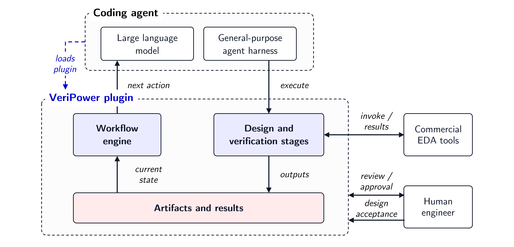
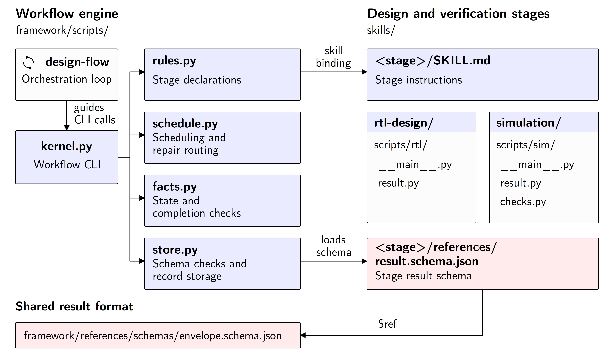

# VeriPower 架构

[English](ARCHITECTURE.md)

VeriPower 由流程引擎、阶段 skills 及与 coding agent harness 的集成组成。本文说明它们的边界、共享的数据和执行规则。安装与使用见[用户手册](docs/USER-MANUAL.zh.md)。

## 1. 系统边界

宿主 harness 提供模型、会话上下文、文件访问、命令执行和子 agent。VeriPower 提供设计与验证任务，以及协调这些任务的机制。EDA 工具作为外部程序运行，其输出文件由各阶段分析并发布。

<p align="center">
  
</p>

流程中有三种角色。

| 角色 | 职责 |
|---|---|
| 阶段执行者 | 开发产物、运行检查、解释证据，报告结论或返工建议 |
| 流程引擎 | 记录运行、判断结果有效性，依据依赖关系和未解决的失败选择工作 |
| 编排器 | 通过宿主工具执行引擎返回的动作，管理执行者的完成情况 |

编排器是遵循 `design-flow` skill 的 agent。阶段工作按声明在主会话或后台子 agent 中执行。

这样的分工将工程判断放在产生证据的阶段内，将跨阶段决策建立在统一的依赖、运行和产物版本表示上。工具权限仍由宿主控制，工程师提供需求并决定委托哪些决策。

## 2. 组件设计

引擎通过 `kernel.py` 提供 CLI。每次调用读取模块的记录和文件，执行指定操作，再返回结构化响应。编排器通过这个接口协调流程。

<p align="center">
  
</p>

| 组件 | 职责 |
|---|---|
| [rules.py](framework/scripts/rules.py) | 阶段声明，以及根据输入推导的产物依赖图 |
| [facts.py](framework/scripts/facts.py) | 只读查询，包括指纹、结果有效性、阶段状态和接受条件 |
| [schedule.py](framework/scripts/schedule.py) | 根据当前事实和未完成的返工选择下一步动作 |
| [store.py](framework/scripts/store.py) | 事件存储、schema 校验、任务交接和产物发布 |
| [kernel.py](framework/scripts/kernel.py) | 协调上述组件的 CLI 操作 |

`skills/<stage>/` 下的阶段包包含指令、脚本和结果 schema。工具调用、报告解析和阶段检查属于阶段包。公共引擎管理结果的生命周期，阶段包决定结果的技术含义。

各阶段 schema 扩展公共[结果结构](framework/references/schemas/envelope.schema.json)。公共字段标识阶段、产出时间、通过或失败结论、产物清单和阶段证据。借助这个接口，不同阶段可以使用不同的工具和检查方法，同时参与同一套流程。

`design-flow` skill 将引擎连接到宿主的执行能力，平台集成提供相应的工具调用。阶段定义和结果语义保留在公共引擎与阶段包中。

## 3. 项目数据模型

### 阶段与产物归属

一个模块目录是一次设计流程的工作区，保存原始需求、已发布的阶段产物、运行目录和事件历史。

```text
module/
├── intent/                 原始需求与随附材料
├── events.jsonl            执行与决策历史
├── Design/<stage>/         设计阶段的已发布产物
│   └── runs/<run>/          某次编号执行的工作目录
└── Verification/<stage>/   验证阶段的已发布产物
    └── runs/<run>/          某次编号执行的工作目录
```

阶段声明指定 skill、执行方式、目录根路径和输入选择规则。各发布目录归属于不同阶段。输入选择具体文件或目录树，路径确定了产物的提供阶段。使用方将这些产物作为只读输入，修改由产物所属阶段负责。

这些声明形成依赖图。例如，仿真使用 `rtl-design` 的 RTL、`simulation-plan` 的验证产物，以及 `specification` 的边界声明和需求。仿真的执行与返工依赖由这些关系确定。

注册表包含八个需要产生结论的阶段，覆盖规格到功耗分析。`simulation-triage` 是额外的诊断任务，输出诊断结果。`brainstorm` 和 `env-precheck` 在流程开始前准备需求和检查环境。[README](README.md#design-flow) 展示了完整的阶段概览。

### 运行、结果与事件

一次运行由阶段名称和执行编号标识。引擎创建工作目录，在 `dispatch.json` 中写入输入位置和返工上下文。对于产生阶段结论的任务，派发事件还记录输入指纹。可复用的产物按阶段声明带入新工作目录。

阶段 CLI 写入 `result.json`。收取时，引擎校验 schema 和时间戳，发布清单中的产物，并追加 `outcome` 事件，记录判定结果、输出指纹和阶段报告的需求判定。通过和失败的运行都会发布证据。结果文件缺失、不可读取或结果结构无效时，收取产生 `blocked` 记录，不替换已发布产物。

发布时，在阶段目录中为运行文件建立硬链接。两个路径共享文件内容，事件日志中的指纹则保留收取时的版本标识。日志只追加，引擎在写入前校验每条事件。

### 当前有效的结论

实现中将阶段结论称为 **proof**。其中的判定结果和输入指纹，与 `outcome` 中的输出指纹一起，将结论绑定到某次运行的产物。

一个阶段只有最新收取的结果能提供当前结论。通过结果保持有效，需要全部已记录的输入与输出可读取，且指纹仍然一致。后续收取的失败或受阻结果会取代先前的通过结果。若最新结果为通过，将文件恢复到记录的版本后，该结果可以恢复有效，无需再次运行。

这个规则同时覆盖依赖和阶段自身输出的变化。修改 testbench 会影响仿真及使用它的功耗分析，而 lint/CDC 结果可以保持有效。修改 RTL 会影响 RTL 设计、lint/CDC、综合和仿真。时序与功耗结果随后根据各自记录的网表及其他输入判断是否有效。

引擎在每次查询时，根据事件日志和当前文件推导阶段状态。

| 状态 | 含义 |
|---|---|
| `missing` | 尚未收取过结果 |
| `in-flight` | 已派发的运行尚无结果记录 |
| `blocked` | 最新一次收取未能建立通过或失败结论 |
| `failed` | 最新结果为失败 |
| `valid` | 最新结果为通过，且记录的版本与当前产物一致 |
| `stale` | 最新结果为通过，但记录的版本与当前产物不再一致 |

显示状态时，尚未收取的运行优先于阶段的先前结果。执行者退出并不会自动结束这条运行记录。编排器报告退出情况并收取结果，也处理结果缺失的情况。会话中断后，同一组记录仍能标识未完成的运行和可复用的结果。

### 版本记录边界

文件使用内容哈希，目录指纹覆盖目录下的路径和内容。每条阶段 proof 都包含整棵 `intent/` 目录树，包括 `brainstorm.md` 和随附材料。

版本记录覆盖声明的输入和记录的输出。Agent 额外读取的文件不会自动加入这组记录。符号链接按目标路径计算指纹，不跟随目标内容。工具和库的标识用于审计，不参与结果有效性检查。这些区别决定了引擎能根据记录识别哪些变化。

## 4. 执行与返工

引擎每次返回一个动作。编排器执行该动作，在工作完成或获得新证据后继续查询。

| 动作 | 编排器的工作 |
|---|---|
| `DISPATCH` | 请求引擎准备运行，再执行指定的阶段 skill |
| `REAP` | 确认执行者退出，通过引擎收取本次结果 |
| `YIELD` | 等待尚未结束的执行者 |
| `ESCALATE` | 根据任务授权处理报告的阻塞原因 |
| `DONE` | 结束请求的流程 |

调度器先选择可收取的结果，再处理未明确的归因、安排返工和可执行阶段，或等待正在运行的工作。引擎根据记录和当前文件推导下一步动作，编排器无需再维护一套阶段状态模型。

### 依赖规则

设计或验证阶段需要输入可用，且提供输入的阶段具有当前有效的通过结果。正在运行的上游或下游会阻止与之冲突的工作。受影响的检查重新执行前，要先处理待完成的上游返工。独立阶段可以并行运行，例如 lint/CDC 和仿真读取同一份 RTL。

注册表还声明了 lint/CDC 在综合之前、时序分析在功耗分析之前的优先顺序。当前置阶段需要重做且已被安排执行或正在运行时，这些顺序才生效。它们影响调度，产物依赖则定义结果有效性和返工范围。

### 返工路由

失败阶段可以报告 `fix_owner`。它必须是失败阶段自身，或依赖图中的上游产物提供阶段。返工范围由此与产物归属关联。Agent 确立技术原因，引擎检查建议的返工阶段是否在这个范围内。

仿真失败且未明确返工阶段时，会触发 `simulation-triage`。它调查失败运行并记录诊断。新的诊断可以显式取代先前诊断，仍然有效的诊断优先于阶段最初的归因。归属未明确或指向无关阶段时，需要先作出决定，再继续调度。

分配给同一阶段的失败会合并到一次返工运行中处理，相关结果和诊断作为上下文交给该次运行。修复后的产物发布后，引擎重新计算有效性，安排需要重跑的检查。

## 5. 工程判定与接受决定

### 阶段结论的含义

阶段通过条件由其 skill 和脚本定义。脚本检查产物结构、执行结果和数值目标，agent 根据需求评审设计选择、检查逻辑和工具发现。阶段 CLI 将最终结论及证据写入公共结果格式，引擎检查该格式及其对应的版本。

规格阶段建立需求台账，记录稳定标识、原文、判定责任和适用的数值目标。各阶段通过这些标识，将设计选择、测试点、测量和结论关联回原始要求。数值判定记录实测值和来源。

RTL 与验证使用规格中的同一套接口、时钟和复位声明。验证计划与参考模型的预期行为来自规格和独立参考材料。仿真阶段可以查看 RTL 来诊断失败，独立评审则检查激励、观测和检查逻辑能否发现违反测试点要求的行为。

台账还记录决策、外部责任和上下文。标记为 `unassignable` 的未决要求会阻止规格阶段通过，分配为 `outside` 的要求保留设计流程之外的明确责任。

### 完成与接受记录

所有必需阶段都有当前有效的通过结果，且所有已派发的运行都已收取时，流程可以完成。结束检查还要求已发布文件被阶段输出记录覆盖，并返回接受决定所需的证据。`runs/` 下的运行历史不计入这项已发布文件检查。CLI 通过 `decide --closing` 提供该检查。

任务要求记录接受决定时，`signoff` 核对结果有效性和产物记录，追加带有 `provenance` 和 `reason` 的决定。这两个字段说明决定者、授权和接受依据。保留给工程师的决定由本人作出，明确委托的决定按已有授权处理。正常完成不要求另行记录 signoff。

接受记录绑定当时的阶段证据。证据变化使结果失效时，对应的接受记录也失效。恢复相同证据可以恢复有效性，新的阶段运行则需要对其新结果重新作出接受决定。

公共接口定义见 [Framework 说明](framework/README.md)，开发指引见 [Contributing](CONTRIBUTING.md)。
