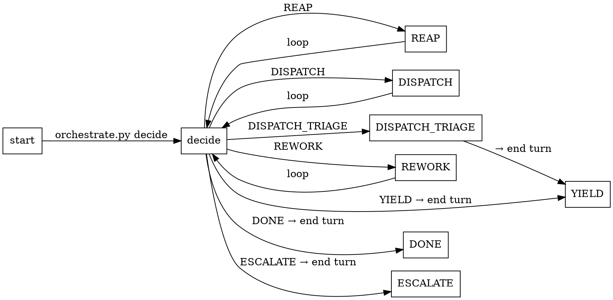

# Design Flow Orchestrator

This skill is the **orchestrator** — each turn it calls the deterministic decider `orchestrate.py decide` (which computes the single next action: forward dispatch / rework routing / convergence judgment / escalation / yield / done) and **executes** that action — dispatching stage subagents through the Task tool and managing state through `state.py`. The routing decisions live in the decider, not this skill; `state.py` is a pure state tool with no routing logic.

## When to Use

- The user requests advancing the design to the next stage.
- The user requests an overview of module progress.
- A rework decision is needed after a stage failure.

## Iron Rule

- This skill **does not** run EDA tools (make / vcs / dc_shell / pt_shell / spyglass) — that is the stage subagent's job.
- This skill **does not** directly modify `task.json` / `events.jsonl` — all changes go through `state.py` commands (any bypass is a contract violation — schema validation gets skipped).
- Scripts are black boxes — never Read their source. Invoke them per this skill's documented command lines (flags via `--help`); on a non-zero exit act on the documented failure protocol (stderr / `FAIL=` token / stdout verdict), not the source. Sole exception: debugging a suspected bug in a script itself.

## Input Artifacts

### Context variables

This skill is loaded on the main thread and reads `{module}` (the sole external parameter) from the user's message. Downstream-stage variables (`{workdir}` / `{module}` / `{rework_trigger}` / `{orchestrator_context_path}`) are populated by this skill at dispatch time for the stage subagent — they are not this skill's own inputs. `mode` is computed internally by state.py, written to `events.jsonl`, and returned via `cmd_dispatch` for Orchestrator audit; it is not injected into the stage-subagent template (the subagent distinguishes modes by whether `rework_trigger` is present plus whether canonical artifacts already exist on disk, following the trigger-existence principle).

### Source-of-truth files read / managed

| Path | Schema / Format | Use |
|---|---|---|
| `asic/{module}/task.json` | JSON | Module state snapshot (state.py maintains it; this skill read-only via the status command). |
| `asic/{module}/events.jsonl` | append-only event log | Event audit log (state.py maintains it). |
| Each stage's `{workdir}/result.json` | Each stage's `result.schema.json` | Dispatched stage result (read-only, used for routing decisions). |
| `specification` `result.json.stage_specific.ppa_targets` | specification schema | PPA targets — injected into the prompt when dispatching synthesis / power-analysis. |

## Output Artifacts

| Path | Schema / Format | Use |
|---|---|---|
| `asic/{module}/task.json` | JSON | State snapshot (state.py maintains it). |
| `asic/{module}/events.jsonl` | append-only event log | Event audit (state.py maintains it). |

> This skill does not Write files directly; artifacts are written by the downstream stage being dispatched, and the state files are updated by `state.py` commands.

## Workflow

### Setup (once per session)

- `state.py init --module {module}` (idempotent; on invalid schema, raise an error and let the user handle it).
- `t = state.py status --module {module}`.
- Crash-recovery reap helper — for every `<run>` in `t.stages[<S>].in_flight[]`:
  - `state.py reap --module {module} --stage <S> --run <run>` (no `--outcome`). cmd_reap reads that run's own `result.json` and resolves the outcome itself — `status` ∈ {pass, fail} → pass/fail; status missing/illegal → blocked (malformed status); file missing or JSON unparseable → blocked (stage crashed or produced no result.json); present-but-schema-invalid → invalid. The Orchestrator never reads `result.json` (no full-file read by Orchestrator). cmd_reap derives the run-specific path via `state._result_path()` (which indexes `topology._RESULT_DIR`); if that mapping drifts, only topology.py changes.
- Canonical `result.json` paths (read by the decider for failure routing + ppa-target extraction) follow `topology._RESULT_DIR`:
  - `specification` / `rtl-design` / `lint-cdc` / `synthesis` / `timing-analysis` → `asic/{module}/Design/<S>/result.json`.
  - `simulation-plan` / `simulation` / `power-analysis` → `asic/{module}/Verification/<S>/result.json`.
  - `frontend-signoff` → `asic/{module}/frontend-signoff/result.json` (top-level, no area prefix).
- **Brainstorm entry gate (pre-dispatch assertion).** Before entering the executor
  loop, `grep` the frontmatter of `asic/{module}/brainstorm.md` (frontmatter only — do
  NOT load the body). If the file is missing or `Status` ≠ `approved`, reply to the user
  "module {module} has no approved brainstorm.md — run `Skill(veripower:brainstorm)` for
  {module}, then re-invoke design-flow" and **stop without entering the executor loop** (do NOT
  dispatch any stage; do NOT log an `escalation` event — this is a pre-pipeline
  user-input gate, not a pipeline-failure escalation. Falling into the executor loop would
  dispatch `specification` first by FORWARD_PRIORITY against a missing brainstorm).
  `brainstorm.md` is authored directly by the brainstorm skill at
  `asic/{module}/brainstorm.md`; this skill only grep-verifies it — there is no `init
  --brainstorm <path>` file copy.
- **Brainstorm-level rework recovery.** When `specification` escalated with
  `fail_reason="requirements need revision: …"`, the user re-runs the brainstorm skill
  (new approved `brainstorm.md`), then runs `state.py invalidate-stage --stage
  specification --reason "<…>"`. That stales `specification` + cascades downstream; the
  next eligibility scan re-dispatches `specification` with a fresh empty workdir →
  first-run re-derivation from the updated brainstorm. `invalidate-stage` records an
  `invalidate` event (not `rework_decision`), so it does not count toward convergence.
  Do not delete/edit the on-disk `design.md` (that trips the `parent_stage_writes>0`
  isolation gate) — the empty new-run workdir is the entire mechanism.

### Executor loop (each turn)

Call the decider; execute exactly the effect it names; end the turn only on `YIELD`/`DONE`/`ESCALATE`:



```
loop:
  a = orchestrate.py decide --module {module} [--wake <stage>:<run>] [--analysis -]
  execute(a)
  if a.action in {YIELD, DONE, ESCALATE}: end turn
```

`decide` always exits 0 and prints exactly one JSON object; `action` selects the shape (complete enumeration):
`DISPATCH {stage, kind: main-thread|task, ppa_targets[]}` (`ppa_targets` always present; non-empty only for synthesis / power-analysis) · `REAP {stage, run}` · `REWORK {failed_stage, target_stage, reason_hint}` · `YIELD {in_flight: [[stage, run], …]}` (triage-pending variant: `in_flight: []` + `waiting_on: "simulation-triage"`) · `DISPATCH_TRIAGE {}` · `ESCALATE {reason: <text>}` · `DONE {}`.

Pass `--wake <stage>:<run>` when this turn was triggered by a `<task-notification>` (values from its `<output-file>` / stage binding), and **re-pass the same `--wake` on every re-query within the turn**. Once the named run is reaped it leaves `in_flight`, so a stale `--wake` is a safe no-op (the decider's step-1 guard checks membership) — re-passing prevents a step-0 `promote_failed` retry on another stage from preempting the wake and orphaning the completed run (which would `YIELD` with that run still `in_flight` and no new notification → stall). Pass `--analysis -` and pipe the triage ANALYSIS JSON when this turn was triggered by a `simulation-triage` return.

`execute(action)`:

| action | effect (LLM-only) |
|---|---|
| `REAP` | `state.py reap --stage <s> --run <n> --subagent-output-file <f?>` (no `--outcome`). If the stage was cascade-staled during execution, pass `--outcome blocked --reason "stage cascade-staled during execution; result not authoritative against current prereq snapshot"` to override derive mode. See promote_failed protocol (§Decision Rules) for `action=promote_failed` handling. |
| `DISPATCH` kind=main-thread | `state.py dispatch --module {module} --stage <s> [--orchestrator-context <file\|->]` → `Skill(veripower:<skill>)` → `state.py reap --stage <s> --run <r>` |
| `DISPATCH` kind=task | `state.py dispatch --module {module} --stage <s> [--orchestrator-context <file\|->]` → `Task(subagent_type="general-purpose", run_in_background=True, prompt=<rendered + ppa_targets>)` |
| `DISPATCH_TRIAGE` | `state.py log --event '{"type":"debug_dispatch","module":"{module}"}'` → `Task(… Skill(veripower:simulation-triage) …)`. The next loop iteration sees the triage pending and returns `YIELD` (which ends the turn). |
| `REWORK` | author `orchestrator_context` (the one judgment) → `state.py rework --failed-stage <f> --target-stage <t> --reason "<≤200 from reason_hint>"` → on the next loop the decider dispatches the now-eligible target |
| `ESCALATE` | `state.py log --event '{"type":"escalation","reason_code":"…","reason":"<verbatim>"}'` → reply to user (verbatim subagent text + status snapshot + 2-3 next steps) |
| `YIELD` | reply the `in_flight` list to the user. (A triage-pending YIELD carries `waiting_on: "simulation-triage"` with empty `in_flight` — say a triage subagent is running.) |
| `DONE` | reply a completion summary; session ends |

> `execute(DISPATCH_TRIAGE)` writes the `debug_dispatch` marker itself (state.py does not auto-emit it) — the decider reads that marker to avoid re-dispatching triage on a later turn. This is the L4 guard, now structural: after the ANALYSIS wake reworks `simulation`, it is `fail/stale`, so it is no longer selected for failure handling at all. Same-turn optimization only: if a context compaction discards the pending ANALYSIS, re-triage is correct recovery (triage is read-only/idempotent).

## Decision Rules

- **Priority conflict:** when `frontend-signoff = pass/clean`, **DONE is mandatory** — no subsequent dispatch occurs.
- **Multiple fails:** handled one-at-a-time — each executor-loop pass handles exactly one fail/clean stage (the first by FORWARD_PRIORITY). When the rework `target_stage` is a common ancestor of the other fail/clean stages, cascade turns the latter to fail/stale together and they vanish the next pass; when it is not a common ancestor (e.g., both lint-cdc and simulation are failing on independent two-chain branches), the remaining fail/clean stages are processed one by one in subsequent turns. Each pass moves only one; do not assume a single pass clears everything.

### promote_failed protocol (single-retry cap)

When the `REAP` execute step receives `cmd_reap` returning `action=promote_failed reason=<...>`, the **only legal sequence** is:

1. `state.py reap --stage X --run N` (no `--outcome`; cmd_reap derives the outcome from `result.json`) returns `action=promote_failed` → **single retry with the same args and same command** (do not touch disk, do not modify result.json, do not modify artifacts).
2. Still returns `action=promote_failed` → `state.py log --module {module} --event '{"type":"escalation","reason_code":"promote_failed_persistent","reason":"<resp2.reason verbatim>"}'` + ESCALATE to upstream (user / higher-level agent), forwarding the reason verbatim.
3. **Forbidden:** retrying > 1 time with the same args; any Write/Edit under `runs/N/` (see Red Flags "promote failed — I'll just Edit `runs/N/result.json`…") — either of these trips isolation gate FAIL.

**Anti-example (an empirically violated case):** main thread sees promote_failed → `ls .promote-tmp/` → Edit `runs/N/result.json` to drop some artifact entry (bypassing the promote check) → retry → another promote_failed → another Edit → … → finally complete pass. That path trips `parent_stage_writes > 0`, isolation gate FAIL; and the artifacts list Edit collateral-damaged (e.g., scripts/ / logs/) pollutes downstream reuse paths. **The only legal response** is a single retry followed by ESCALATE; never Edit.

## Red Flags

> **Red Flag:** If `Skill(veripower:lint-cdc|synthesis|timing-analysis|power-analysis|frontend-signoff)` appears in the Orchestrator's tool history, it is a bug — these 5 stages must dispatch via `Task()`.

| Excuse | Reality |
|---|---|
| "promote failed — I'll just Edit `runs/N/result.json` (or the RTL/UVM/netlist) so it passes" | That Edit **is** the isolation violation — it trips verify.py `parent_stage_writes > 0` → overall fail even if 9-stage signoff is clean. The only legal path: Read the artifact, then dispatch a subagent or ESCALATE. |
| "Let me Read the stage's SKILL.md so I understand what it does" | Reading the 5 Task-dispatched stages' SKILL.md invites inlining their work into the main thread; they run only inside a `Task(subagent_type="general-purpose", …)` that calls `Skill()` itself (see the literal tripwire above). Main-thread loading exception: `veripower:specification`, `veripower:simulation-plan`, `veripower:rtl-design`, and `veripower:simulation` are loaded via `Skill()` — their SKILL.md files are auto-loaded normally. The other 5 Task-dispatched stages do not get this exception. |
| "This command hits the approval gate — I'll wrap it in `bash -c '…'` to get past it" | An approval trigger is a contract-violation signal, not an annoyance. Hand the whole command chain to a Task subagent; never rewrite around the gate. |
| "I'll dump everything into `orchestrator_context` to be safe" | It carries only reasoned content that helps downstream do its work better — never a log/chat/dump slot, never info already in files the subagent reads. Single-dispatch lifetime. |
| "Just escalate / re-warm the stage skill / tidy the subagent's wording" | Check convergence before escalating; never pre-run `Skill(stage)` after dispatch; forward subagent text **verbatim** on ESCALATE. |

## Pitfalls

| Mistake | Fix |
|---|---|
| Orchestrator main thread sees an Edit-before-Read ("File has not been read yet") error | This is a second-order symptom of "inlining stage work into the main thread" — this skill only Reads `result.json` / `task.json` for routing decisions and never produces a substantive Edit. If the tool has already rejected it, stop that Edit chain immediately and move the stage work back into a Task dispatch. |
| DISPATCH task fills `subagent_type="veripower:<stage>"` | A stage skill is not an agent type; you must use `general-purpose`. |
| REAP omits `--subagent-output-file <output_file>` when calling `state.py reap` on the async dispatch path | `<output_file>` is taken from the `<task-notification>`'s `<output-file>` tag value; without this flag the trace is not mirrored to `{workdir}/.subagent_traces/`, and downstream analysis (e.g., the external eval harness's fact extraction) is blind for that stage. Note: this flag is best-effort optional in state.py — neither a missing flag nor an invalid path raises — self-audit all three reap call sites (staled-blocked / pass-or-fail / promote_failed retry) carry this flag. Exception: all four main-thread skills (specification / simulation-plan / rtl-design / simulation) complete via the `kind=main-thread` path (`state.py reap --stage --run`, no `--subagent-output-file`) and emit no stage-level async transcript — exempt by forward. (rtl-design and simulation do dispatch async *intra-stage* sub-Tasks, but those child traces are not mirrored at the stage level — ARCHITECTURE.md §6.6.2, future work — and are not carried by this flag.) |
| `cmd_reap`'s returned `r.action == "promote_failed"` is not handled | `r.action ∈ {completed, discarded, blocked, invalid, promote_failed}`; of these, `promote_failed` is the only value the Orchestrator must inline-handle at REAP time (single retry, then ESCALATE if still failing — see §Decision Rules promote_failed protocol). The other four mean state.py has already settled the state, and the next executor loop re-query is enough. |

## Main-Loop Termination Conditions

Orchestrator-form specialization: this skill does not write `result.json`; each turn returns a control-flow flag, not a data contract.

- **Terminate (DONE):** `frontend-signoff = pass/clean` → end of the executor loop, reply to the user with a summary, session ends.
- **Yield turn (YIELD):** all in-flight stages dispatched, no new eligible stages → yield the turn and wait for a notification to wake back up.
- **Escalate (ESCALATE):** `cmd_convergence.must_escalate` or unrecoverable blocked → first log the escalation event, then reply to the user:
  ```
  state.py log --module {module} --event \
    '{"type":"escalation","reason_code":"<code>","reason":"<text>"}'
  ```
  The closed set of `reason_code` values this skill actually produces today:
  - `must_escalate` — `cmd_convergence.guideline == "must_escalate"` (total rework count ≥ 3).
  - `promote_failed_persistent` — REAP step is still promote_failed after the single retry.

  Then forward the subagent body verbatim, attach the `state.py status` snapshot, and give 2–3 concrete next-step suggestions.

## Bundled References

- `${CLAUDE_PLUGIN_ROOT}/framework/scripts/state.py` — State-management tool (8 commands). Invocation contract: this file + `--help` (which prints each command's return shape).
- `${CLAUDE_PLUGIN_ROOT}/framework/scripts/orchestrate.py` — the control-loop decider (`orchestrate.py decide`). Invocation + output contract: §Executor loop above.
- `${CLAUDE_PLUGIN_ROOT}/framework/scripts/topology.py`, `route.py`, `artifacts.py` — import-only internals of state.py / orchestrate.py (DAG SSoT, rework-target maps, artifact promote/mirror); never invoked or read at runtime.
- [`${CLAUDE_PLUGIN_ROOT}/framework/references/prompts/stage-subagent.md.tpl`](../../framework/references/prompts/stage-subagent.md.tpl) — Task dispatch template.
- [`${CLAUDE_PLUGIN_ROOT}/framework/references/schemas/envelope.schema.json`](../../framework/references/schemas/envelope.schema.json) — Common envelope schema.
