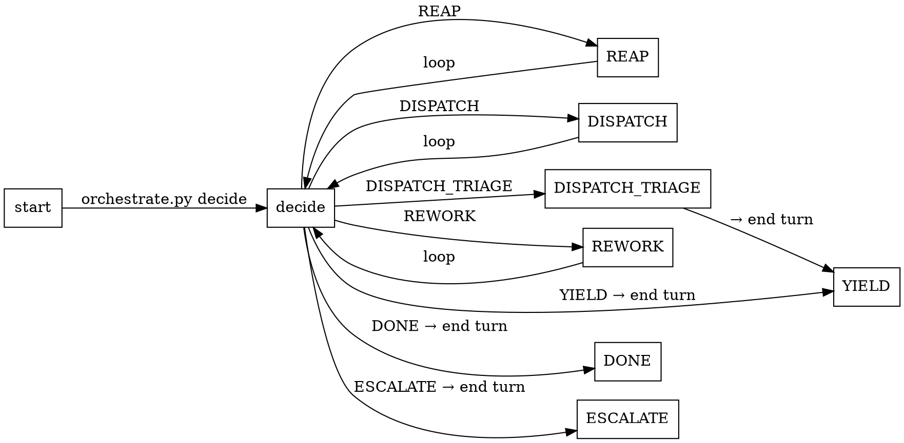

# Design Flow Orchestrator

You are the **orchestrator** — each turn you call the deterministic decider `orchestrate.py decide` (which computes the single next action: forward dispatch / rework routing / escalation / yield / done) and **execute** that action — dispatching stage subagents through the Task tool and managing state through `state.py`. The routing decisions live in the decider, not this skill; `state.py` is a pure state tool with no routing logic.

## When to Use

- The user requests advancing the design to the next stage.
- The user requests an overview of module progress.
- A rework decision is needed after a stage failure.

## Iron Rule

- Do not run EDA tools (make / vcs / dc_shell / pt_shell / spyglass) yourself — that is the stage subagent's job.
- Do not directly modify `task.json` / `events.jsonl` — all changes go through `state.py` commands (any bypass is a contract violation — schema validation gets skipped).
- **Scripts are black boxes — never Read their source.** Invoke them per this skill's documented command lines (flags via `--help`); on a non-zero exit act on the documented failure protocol (stderr / `FAIL=` token / stdout verdict), not the source. Sole exception: debugging a suspected bug in a script itself.

## Input Artifacts

### Context variables

You run on the main thread and read `{module}` (the sole external parameter) from the user's message. Downstream-stage variables (`{workdir}` / `{module}` / `{rework_trigger}` / `{orchestrator_context_path}`) are populated by you at dispatch time for the stage subagent — they are not your own inputs. `mode` is computed internally by state.py, written to `events.jsonl`, and returned via `cmd_dispatch` for Orchestrator audit; it is not injected into the stage-subagent template (the subagent distinguishes modes by whether `rework_trigger` is present plus whether canonical artifacts already exist on disk, following the trigger-existence principle).

### Source-of-truth files read / managed

| Path | Schema / Format | Use |
|---|---|---|
| `asic/{module}/task.json` | JSON | Module state snapshot (state.py maintains it; you read it only via the status command). |
| `asic/{module}/events.jsonl` | append-only event log | Event audit log (state.py maintains it). |
| `asic/{module}/brainstorm.md` (frontmatter only) | Custom markdown frontmatter | Entry-gate check: grep `Status: approved` before entering the executor loop — never load the body. |

You read no stage `result.json` yourself, for any purpose: routing inputs and `ppa_targets` are read in-process by `orchestrate.py decide` (returned inline in its action), and reap-time status is derived inside `cmd_reap`.

## Output Artifacts

| Path | Schema / Format | Use |
|---|---|---|
| `asic/{module}/task.json` | JSON | State snapshot (state.py maintains it). |
| `asic/{module}/events.jsonl` | append-only event log | Event audit (state.py maintains it). |
| dispatched target's `{workdir}/orchestrator-context.md` | free-form markdown | Per-dispatch judgment channel — authored at REWORK (`simulation` rework: forwarded triage `analysis.json` verbatim); written by `state.py dispatch`, never promoted. |

> Do not Write files directly; artifacts are written by the downstream stage being dispatched, and the state files (plus the context file above) are written by `state.py` commands.

## Workflow

### Setup (once per session)

- `state.py init --module {module}` (idempotent; on invalid schema, raise an error and let the user handle it).
- `t = state.py status --module {module}`.
- Crash-recovery reap helper — for every `<run>` in `t.stages[<S>].in_flight[]`:
  - `state.py reap --module {module} --stage <S> --run <run>` (no `--outcome`). cmd_reap reads that run's own `result.json` and resolves the outcome itself — `status` ∈ {pass, fail} → pass/fail; status missing/illegal → blocked (malformed status); file missing or JSON unparseable → blocked (stage crashed or produced no result.json); present-but-schema-invalid → invalid. The Orchestrator never reads `result.json` (no full-file read by Orchestrator). cmd_reap derives the run-specific path via `state._result_path()` (which indexes `topology._RESULT_DIR`); if that mapping drifts, only topology.py changes.
- **Brainstorm entry gate (pre-dispatch assertion).** Before entering the executor
  loop, `grep` the frontmatter of `asic/{module}/brainstorm.md` (frontmatter only — do
  NOT load the body). If the file is missing or `Status` ≠ `approved`, reply to the user
  "module {module} has no approved brainstorm.md — run `Skill(veripower:brainstorm)` for
  {module}, then re-invoke design-flow" and **stop without entering the executor loop** (do NOT
  dispatch any stage; do NOT log an `escalation` event — this is a pre-pipeline
  user-input gate, not a pipeline-failure escalation. Falling into the executor loop would
  dispatch `specification` first by FORWARD_PRIORITY against a missing brainstorm).
  `brainstorm.md` is authored directly by the brainstorm skill at
  `asic/{module}/brainstorm.md`; you only grep-verify it — there is no `init
  --brainstorm <path>` file copy.
- **Brainstorm-level rework recovery.** When `specification` escalated with
  `fail_reason="requirements need revision: …"`, the user re-runs the brainstorm skill
  (new approved `brainstorm.md`), then runs `state.py invalidate-stage --stage
  specification --reason "<…>"`. That stales `specification` + cascades downstream; the
  next eligibility scan re-dispatches `specification` with a fresh empty workdir, which yields
  first-run re-derivation from the updated brainstorm. `invalidate-stage` records an
  `invalidate` event (not `rework_decision`): a full re-derivation, not a routed rework.
  Do not delete/edit the on-disk `design.md` (a main-thread write to a canonical artifact
  breaks the orchestrator/subagent isolation) — the empty new-run workdir is the entire mechanism.

### Executor loop (each turn)

Call the decider; execute exactly the effect it names; end the turn only on `YIELD`/`DONE`/`ESCALATE`:



```text
loop:
  a = orchestrate.py decide --module {module} [--wake <stage>:<run>] [--analysis <path>]
  execute(a)
  if a.action in {YIELD, DONE, ESCALATE}: end turn
```

`decide` always exits 0 and prints exactly one JSON object; `action` selects the shape.

Pass `--wake <stage>:<run>` when this turn was triggered by a `<task-notification>` (values from its `<output-file>` / stage binding), and **re-pass the same `--wake` on every re-query within the turn**. Pass `--analysis asic/{module}/Verification/simulation-triage/analysis.json` (the triage-landed pointer file, atomically published) when this turn was triggered by a `simulation-triage` return — the decider reads that file itself; there is no message-body extraction and no stdin pipe.

`execute(action)`:

| action | effect (LLM-only) |
|---|---|
| `REAP` | `state.py reap --stage <s> --run <n> --subagent-output-file <f?>` (no `--outcome`). Derive mode settles a cascade-staled run on its own (→ `discarded`, `reason_code=stage_staled_during_run`) — do **not** pass `--outcome blocked`: the Orchestrator has no reliable pre-reap cascade-stale signal, and the override only relabels the same non-promotion as `blocked` (semantically wrong — the run is stale, not blocked). See promote_failed protocol (§Decision Rules) for `action=promote_failed` handling. |
| `DISPATCH` kind=main-thread | `state.py dispatch --module {module} --stage <s> [--orchestrator-context <file\|->]` → `Skill(veripower:<skill>)` → `state.py reap --stage <s> --run <r>` |
| `DISPATCH` kind=task | `state.py dispatch --module {module} --stage <s> [--orchestrator-context <file\|->]` → `Task(subagent_type="general-purpose", run_in_background=True, prompt=<rendered + ppa_targets>)` |
| `DISPATCH_TRIAGE` | `state.py log --event '{"type":"debug_dispatch","module":"{module}","sim_run":<sim_run>}'` → `Task(… Skill(veripower:simulation-triage) …)` with the prompt injecting only `{module}` + `sim_run:<sim_run>` — two coordinates, zero inline field assembly; triage self-reads everything else (canonical inputs plus the failed run) and lands its own `Verification/simulation-triage/runs/<sim_run>/`. The next loop iteration sees the triage pending and returns `YIELD` (which ends the turn). |
| `REWORK` | author `orchestrator_context` (the one judgment — reasoned free-form hints for the target's next `DISPATCH`) → `state.py rework --failed-stage <f> --target-stage <t> --reason "<≤200 from reason_hint>"` → on the next loop the decider dispatches the now-eligible target. **Exception — a `simulation` rework forwards, never authors:** pass `--orchestrator-context asic/{module}/Verification/simulation-triage/analysis.json` at that `DISPATCH` (`state.py` copies the file's content verbatim into the target's `orchestrator-context.md`; no LLM transcription step). |
| `ESCALATE` | `state.py log --event '{"type":"escalation","reason_code":"…","reason":"<verbatim>"}'` → reply to user (verbatim subagent text + status snapshot + 2-3 next steps) |
| `YIELD` | reply the `in_flight` list to the user. (A triage-pending YIELD carries `waiting_on: "simulation-triage"` with empty `in_flight` — say a triage subagent is running.) |
| `DONE` | reply a completion summary; session ends |

> `execute(DISPATCH_TRIAGE)` writes the `debug_dispatch` marker itself (state.py does not auto-emit it).

## Decision Rules

### promote_failed protocol (single-retry cap)

When the `REAP` execute step receives `cmd_reap` returning `action=promote_failed reason=<...>`, the **only legal sequence** is:

1. `state.py reap --stage X --run N` (no `--outcome`; cmd_reap derives the outcome from `result.json`) returns `action=promote_failed` → **single retry with the same args and same command** (do not touch disk, do not modify result.json, do not modify artifacts).
2. Still returns `action=promote_failed` → **stop**: do not retry again and do not inline-log here. The run stays in-flight carrying two `promote_failed` outcome events, so the next `decide` returns `ESCALATE` (pf ≥ 2); its `execute(ESCALATE)` step logs the single `escalation` event (`reason_code=promote_failed_persistent`, `reason` = decide's reason verbatim) and forwards to the user. `execute(ESCALATE)` is the sole home for escalation logging — emitting `state.py log` here too would double-write the event.
3. **Forbidden:** retrying > 1 time with the same args; any Write/Edit under `runs/N/` (see Red Flags "promote failed — I'll just Edit `runs/N/result.json`…") — either of these is an isolation violation (a main-thread write under `runs/N/`).

**Anti-example (an empirically violated case):** main thread sees promote_failed → `ls .promote-tmp/` → Edit `runs/N/result.json` to drop some artifact entry (bypassing the promote check) → retry → another promote_failed → another Edit → … → finally complete pass. That path is an isolation violation (the main thread must never write stage artifacts); and the artifacts list Edit collateral-damaged (e.g., scripts/ / logs/) pollutes downstream reuse paths. **The only legal response** is a single retry followed by ESCALATE; never Edit.

## Red Flags

> **Red Flag:** If `Skill(veripower:lint-cdc|synthesis|timing-analysis|power-analysis|frontend-signoff)` appears in the Orchestrator's tool history, it is a bug — these 5 stages must dispatch via `Task()`.

| Excuse | Reality |
|---|---|
| "promote failed — I'll just Edit `runs/N/result.json` (or the RTL/UVM/netlist) so it passes" | That Edit **is** the isolation violation — the main thread must never write stage artifacts; bypassing the promote check this way corrupts the canonical artifacts and the downstream reuse path even if 9-stage signoff is otherwise clean. The only legal path: Read the artifact, then dispatch a subagent or ESCALATE. |
| "Let me Read the stage's SKILL.md so I understand what it does" | Reading the 5 Task-dispatched stages' SKILL.md invites inlining their work into the main thread; they run only inside a `Task(subagent_type="general-purpose", …)` that calls `Skill()` itself (see the literal tripwire above). Main-thread loading exception: `veripower:specification`, `veripower:simulation-plan`, `veripower:rtl-design`, and `veripower:simulation` are loaded via `Skill()` — their SKILL.md files are auto-loaded normally. The other 5 Task-dispatched stages do not get this exception. |
| "This command hits the approval gate — I'll wrap it in `bash -c '…'` to get past it" | An approval trigger is a contract-violation signal, not an annoyance. Hand the whole command chain to a Task subagent; never rewrite around the gate. |
| "I'll dump everything into `orchestrator_context` to be safe" | It carries only reasoned content that helps downstream do its work better — never a log/chat/dump slot, never info already in files the subagent reads. Single-dispatch lifetime. Exception: for a `simulation` rework this field is a **forward**, not authored content — pass the triage-landed `analysis.json` path verbatim, never a hand-written summary of it. |
| "Just escalate / re-warm the stage skill / tidy the subagent's wording" | Never pre-run `Skill(stage)` after dispatch; forward subagent text **verbatim** on ESCALATE. |

## Pitfalls

| Mistake | Fix |
|---|---|
| Orchestrator main thread sees an Edit-before-Read ("File has not been read yet") error | Stop that Edit chain immediately and move the stage work back into a Task dispatch. |
| DISPATCH task fills `subagent_type="veripower:<stage>"` | A stage skill is not an agent type; you must use `general-purpose`. |
| REAP omits `--subagent-output-file <output_file>` when calling `state.py reap` on the async dispatch path | `<output_file>` is taken from the `<task-notification>`'s `<output-file>` tag value; without this flag the trace is not mirrored to `{workdir}/.subagent_traces/`, and downstream analysis (e.g., the external eval harness's fact extraction) is blind for that stage. Note: this flag is best-effort optional in state.py — neither a missing flag nor an invalid path raises — self-audit all three reap call sites (staled-blocked / pass-or-fail / promote_failed retry) carry this flag. Exception: all four main-thread skills (specification / simulation-plan / rtl-design / simulation) complete via the `kind=main-thread` path (`state.py reap --stage --run`, no `--subagent-output-file`) and emit no stage-level async transcript — exempt by forward. (rtl-design and simulation do dispatch async *intra-stage* sub-Tasks, but those child traces are not mirrored at the stage level and are not carried by this flag.) |
| `cmd_reap`'s returned `r.action == "promote_failed"` is not handled | `r.action ∈ {completed, discarded, blocked, invalid, promote_failed}`; of these, `promote_failed` is the only value the Orchestrator must inline-handle at REAP time (single retry, then ESCALATE if still failing — see §Decision Rules promote_failed protocol). The other four mean state.py has already settled the state, and the next executor loop re-query is enough. |

## Main-Loop Termination Conditions

Orchestrator-form specialization: each turn returns a control-flow flag, not a data contract.

- **Terminate (DONE):** `frontend-signoff = pass/clean` → end of the executor loop, reply to the user with a summary, session ends.
- **Yield turn (YIELD):** all in-flight stages dispatched, no new eligible stages → yield the turn and wait for a notification to wake back up.
- **Escalate (ESCALATE):** first log the escalation event, then reply to the user:
  ```bash
  state.py log --module {module} --event \
    '{"type":"escalation","reason_code":"<code>","reason":"<text>"}'
  ```
  The one `reason_code` value the Orchestrator names directly:
  - `promote_failed_persistent` — REAP step is still promote_failed after the single retry.

  Every other escalation is decider-sourced: `orchestrate.py decide` returns `action=ESCALATE` with a `reason` drawn from `route.py`'s rule / `reason_hint` (e.g. `triage_skipped`, `tooling_no_route`, `terminal_frontend_signoff`, `unrouted*`); log that string as the `reason_code` and `reason`.

  Then forward the subagent body verbatim, attach the `state.py status` snapshot, and give 2–3 concrete next-step suggestions.

## Bundled References

- `${CLAUDE_PLUGIN_ROOT}/framework/scripts/state.py` — State-management tool (7 commands). Invocation contract: this file + `--help` (which prints each command's return shape).
- `${CLAUDE_PLUGIN_ROOT}/framework/scripts/orchestrate.py` — the control-loop decider (`orchestrate.py decide`). Invocation + output contract: §Executor loop above.
- `${CLAUDE_PLUGIN_ROOT}/framework/scripts/topology.py`, `route.py`, `artifacts.py` — import-only internals of state.py / orchestrate.py (DAG SSoT, rework-target maps, artifact promote/mirror); never invoked or read at runtime.
- [`${CLAUDE_PLUGIN_ROOT}/framework/references/prompts/stage-subagent.md.tpl`](../../framework/references/prompts/stage-subagent.md.tpl) — Task dispatch template.
- [`${CLAUDE_PLUGIN_ROOT}/framework/references/schemas/envelope.schema.json`](../../framework/references/schemas/envelope.schema.json) — common envelope schema.
