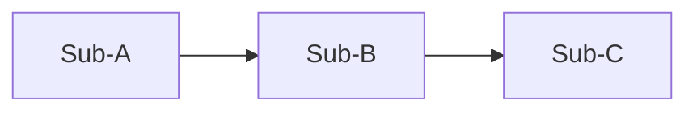

# design.md Section Template

`{workdir}/design.md` is the **design source of truth** produced by this skill: §1.1–1.6 describe the module as a whole (function, interfaces, timing, frequencies, architecture partitioning), and §1.7 points at `manifest.json`, whose `doc` field locates each child's `<child>.md`, where the per-submodule implementation detail lives. All external consumers (RTL implementation / constraint generation / verification derivation / synthesis / power / timing signoff, etc.) read from `design.md` and these child docs.

> **`design.md` self-containment principle**: all critical invariants from brainstorm (RTL formulas / interface timing / numeric parameters / implementation constraints / overlay explicit spec supplement sections) must be inlined verbatim into `design.md`. **By-reference jumps are forbidden** (such as "see brainstorm §sd_clock_divider IO Ports" / "see spec D2" / "refer to brainstorm section sd_controller_wb" / "see brainstorm §X"). The downstream skill input lists do not literally include `brainstorm.md`; by-reference = information loss, which causes false-fail under cycle-accurate `===` checks. Enforced by `check-coverage`.

## Document Position

| Section range | Responsibility |
|---|---|
| 1.1–1.6 Overview sections | Function, interfaces, timing, frequencies, architecture partitioning; 1:1 consistent with each D-dimension field in brainstorm.md; on conflict, this section is the single upper-layer authority. `constraints/<TOP>.{sdc,sgdc}` is regenerated from §1.6 by `derive-constraints`, never hand-edited. |
| 1.7 Submodule Index | A pointer to `manifest.json`, which is the child registry (`name` / `doc` / `rtl_modules` / `brainstorm_anchor`) — this section restates none of it. The per-submodule implementation detail (FIFO / arbitration / exceptions / state-machine boundaries / register side effects, etc.) lives in the child docs. |
| 2 Document control | Version, revision notes, the corresponding (frozen / approved) brainstorm.md. |

## Rendering Conventions

| Content type | Recommended format | Notes |
|----------|----------|------|
| Architecture diagrams (§1.2 / submodule `<child>.md` bodies / brainstorm D4 candidates) | mermaid code block | GitHub / VSCode preview / mkdocs all render natively; for multiple side-by-side candidates use one code block each. |
| Timing diagrams (§1.5 interface timing / brainstorm D5 scenarios) | Hand-drawn ASCII (preferred) or wavedrom | wavedrom does **not** render on GitHub — if wavedrom is used, attach an ASCII equivalent or export a PNG when reviewing the PR; otherwise stick with ASCII. |

Each timing diagram must be paired with a textual description that **maps one-to-one onto each phase of the waveform** (setup/hold, handshake meaning, typical/boundary cycles, etc.). This convention applies to both `brainstorm.md` and `design.md`.

## Overview Section Template (1.1–1.6)

```markdown
# <module_name> Design Document (design.md)

## 1. Module Overview

### 1.1 Overview
(Module description: role in the system, core problem solved, scope boundaries.)

PPA targets: see `ppa.json` (numeric target values live there only — do not restate them
in prose; synthesis / power-analysis bind to that file directly).

### 1.2 Module Structure

The child roster lives in `manifest.json` (`name` / `doc` / `rtl_modules`). Do not
restate it as a table. Narrative that is not a per-child field belongs here, plus the one thing
the manifest cannot hold — the architecture diagram: dataflow direction, which cut edges carry
backpressure, why the partition falls where it does.



### 1.3 Feature Table

The feature list lives in `features.json` (the spine `check-hints/<child>.json`
`source_feature` values and testpoints refer to). Do not restate features in prose. Narrative that is not a per-feature
field belongs here: how the features partition the module, which are out of scope.

### 1.4 Module Interface and Interconnects

#### 1.4.1 Top-Level IO

The port list lives in `top-io.json`. Narrative that is not a per-port field belongs here:
what the boundary is for, which groups exist and why.

#### 1.4.2 Inter-module Interconnects

The wire list lives in `interconnects.json` (authoritative for every
RTL-module-to-RTL-module cut edge; an N=1 module writes an empty array). Narrative about how
the children divide the datapath belongs here.

> **Inter-module Behavior Contract** (required content rule, enforced by the spec-review
> `conformance` lens, NOT a deterministic gate): when a *group* of inter-module wires is governed by
> a contract that **more than one wire / child must jointly agree on** (a shared operating-phase or
> event timeline, a sequencing, a co-assertion or mutual-exclusion among control strobes), that joint
> contract MUST be stated **once** in the `##### 1.4.2.1` companion below, NOT left implicit in one
> child's body (where sibling children and their per-child reviewers cannot see it).
> - A behavior fully captured by a single wire's own row (a plain valid/ready handshake, a
>   single-clock latency) needs no companion.
> - Form adapts to the module: a phase-sequenced datapath states an ordered operating-phase table;
>   a handshake/arbitration module states the co-assertion / mutual-exclusion rule in prose. Per-wire
>   `Timing Constraint` cells and control-bus `Encoding` symbols then reference the names declared in
>   the companion.
> - This pins the *statement* of the contract and the *resolvability* of references to it; the
>   *correctness* of the co-assertions / relative offsets / mutual-exclusion is design judgment
>   (advisory soundness + downstream RTL/sim), not pinned here.

##### 1.4.2.1 Inter-module Behavior Contract

Present **only** when §1.4.2 wires share a joint contract (see the Inter-module Behavior Contract
rule above); omit entirely otherwise. Place it here, **after** the §1.4.2 wire table and its column
notes, so the §1.4.2 wire-table parse is unaffected.

Worked example A — a **phase-sequenced datapath** states an ordered operating-phase timeline;
control buses project onto it (each `Encoding` symbol names its canonical phase(s)) and per-wire
`Timing Constraint` windows reference these phase names:

| # | Phase | Cycles | Notes (projection / co-assertion / boundary, as applicable) |
|---|-------|--------|-------------------------------------------------------------|
| 1 | LOAD    | 12 (handshake) | ctrl_phase=LOAD |
| 2 | PRELOAD | 2N−1           | ctrl_fabric=PRELOAD |
| … | …       | …              | … |

Worked example B — a **handshake / arbitration** module states the joint contract in prose (no
phase table). E.g. a TX/RX start mux:

> `start_tx_fifo` and `start_rx_fifo` are mutually exclusive (never both high). The master-bus
> outputs route to the TX variables when `start_tx_fifo` is high, to the RX variables when
> `start_rx_fifo` is high, else to `0`. Consumers of the muxed bus rely on this exclusion to decode
> the source.

### 1.5 Interface Timing Scenarios

Subdivide by **interface group**; diagrams may be hand-drawn ASCII (preferred) / wavedrom / tool-exported image (rendering and textual-description requirements per §Rendering Conventions). Each scenario row's fields are also subject to "minimum field completeness."

#### Example: a configuration-port write transaction (hand-drawn ASCII)

~~~text
        idle      setup/hold region        transaction done      idle
clk      __|‾|_|‾|_|‾|_|‾|_|‾|_|‾|_|‾|_|‾|_|‾|_
cfg_en   _________|‾‾‾‾‾‾‾‾‾‾‾‾‾|_______________
addr     _________<── ADDR ──>_______________
wdata    _________<── WDATA ─>_______________
rdy      _________|‾‾‾‾‾‾‾‾‾‾‾‾‾|_______________   (slave ready)
~~~

**Textual description (must map one-to-one onto each phase above)**
- **idle**: `cfg_en` low; whether ADDR/WDATA matter is defined by the protocol.
- **setup/hold region**: before/after the valid sampling edge, ADDR and WDATA satisfy *T_setup* / *T_hold* relative to `clk`.
- **transaction done**: when `cfg_en` and `rdy` are both high, the slave accepts this write.
- **return to idle**: after the slave drops `rdy`, the bus enters idle, ready for the next transaction.

#### Timing Scenarios Table

The scenario rows live in `timing-scenarios.json`. The waveform diagrams above and their
phase-by-phase descriptions stay here — they are the part no table could hold.

### 1.6 Clocks and Frequencies

Clock definitions live in `clocks.json` (the sole numeric + relationship source;
`constraints/<TOP>.{sdc,sgdc}` are generated from it). Do not restate periods,
frequencies or relationships in prose — same single-home rule as §1.1's PPA targets.
Narrative that is NOT a per-clock field belongs here: domain count, CDC posture,
reset scheme, release-ordering constraints.
```

## top-io.json (§1.4.1's machine half)

Authored by Wave 1; schema `references/top-io.schema.json`. A JSON array, one object per port.

| Field | Rule |
|---|---|
| `name` | Required. The netlist name **including its bit range** (`token_in[4:0]`) — emitted verbatim into `get_ports` / `abstract_port`. |
| `direction` | Required: `input` / `output` / `inout`. |
| `width` | Required **integer**. When `name` ends in `[h:l]`, `check-coverage` cross-checks it; an `[i]` index (a register-file element) makes no width claim and is skipped. |
| `clock_domain` | Required. A `clocks.json` name. Clock and reset ports carry no IO delay; each `data` port gets `set_input/output_delay` against this domain. |
| `interface_group` | Required. Groups ports into one TB agent / one vif. |
| `role` | Required: `clock` / `reset` / `data`. `derive-constraints` branches on it. |
| `owner` | **Required on an output** (schema-enforced): the manifest child that drives it, which must list the port in its frontmatter `ports`. Prefer a **leaf** child passed through the pure top; an output driven by the top-integration child's own glue (mux / reduction / constant) is discouraged but passes. Inputs carry no owner — which inputs a child reads is that child's own wave-2 decision. |
| `reset_polarity` / `reset_kind` | **Required when `role` is `reset`** (schema-enforced): `0` = active-low / `1` = active-high; `sync` / `async`. |
| `protocol` | Optional. |
| `encoding` | A **control or status** port MUST pin its bit/field-to-symbol meaning: single-bit `0:<meaning>; 1:<meaning>`; multi-bit per field `bit[h:l] <name>: <code>:<symbol>; …`. For a phase/command code write the **consumer obligation**, not just a label (e.g. `3:PV (consumer re-preloads the stationary operand, then streams)`). A raw data / clock / reset port has none. Enforced by the spec-review `conformance` lens, NOT a deterministic gate. This entry is the single source — a child names the port, never re-describes the codes. |

## interconnects.json (§1.4.2's machine half)

Authored by Wave 1; schema `references/interconnects.schema.json`. A JSON array, one object
per cut edge. An N=1 module writes `[]`.

| Field | Rule |
|---|---|
| `wire` | Required. Not unique by itself: the same net may appear once per distinct endpoint pairing. |
| `producers` / `consumers` | Required **arrays** of RTL module names. `const` marks a literal source with no owning module. `derive-ports` attributes each wire to the children whose `rtl_modules` appear here. |
| `width` | Required integer. A heterogeneous control bundle cannot state one honest width — split it into per-field wires. |
| `clock_domain` | Required. A `clocks.json` name; a phantom domain here hides a CDC path. |
| `protocol` / `timing_constraint` / `notes` | Optional. |
| `encoding` | A wire carrying an **encoded control/status value** MUST pin its bit/field-to-symbol meaning, same format and obligation rule as `top-io.json`. Producer and consumer read this one entry, so per-wire agreement is structural. Cross-**bus** consistency is not pinned here — that joint contract goes in the §1.4.2.1 companion. |

## timing-scenarios.json (§1.5's machine half)

Authored by Wave 1; schema `references/timing-scenarios.schema.json`. A JSON array, one
object per scenario. Values are free prose.

| Field | Rule |
|---|---|
| `id` | Required. One sequence is authored per id. |
| `stimulus` / `expected` / `timing_constraint` | Required and non-empty. |
| `interface_mode` / `exceptions` | Optional. |

The waveform diagram and its phase-by-phase description are **not** fields — they stay in
§1.5, per the one-to-one pairing rule in §Rendering Conventions.

## features.json (§1.3's machine half)

Authored by Wave 1; schema `references/features.schema.json`. A JSON array, one object per
feature. All fields are free prose — no script parses inside a field.

| Field | Rule |
|---|---|
| `id` | Required. What `check-hints/<child>.json` `source_feature` values and testpoints refer to. |
| `name` | Required. Short label; reaches the TB testlist and the human-read case-results summary. |
| `description` | Required. What the feature is, including any RTL formula that pins it. |
| `mode_interface` | Required. The interface group or operating mode exercised. |
| `priority` | Required free text — the vocabulary is your project's, not the schema's. |
| `happy_path` / `corner_cases` / `negative_cases` | Required and non-empty. |
| `coverage_intent` | Optional. Absent means absent. |

## clocks.json (§1.6's machine half)

Authored by Wave 1 alongside `ppa.json`; schema `references/clocks.schema.json`. A JSON
array, one object per clock:

```json
[
  { "name": "clk",    "freq_mhz": 100, "period_ns": 10.0, "relationship": "primary", "generated": false, "role": "primary clock" },
  { "name": "clk_io", "freq_mhz": 50,  "period_ns": 20.0, "relationship": "async",   "generated": false, "role": "IO-domain clock" }
]
```

| Field | Rule |
|---|---|
| `name` | Required. For a non-generated clock this is also the top-level port name `create_clock` binds to. |
| `freq_mhz` / `period_ns` | Required **numbers** (not strings). `period_ns` must equal `1000 / freq_mhz` — enforced by `check-coverage`. |
| `relationship` | Required, one of `primary` / `synchronous-related` / `async`. `async` drives `set_clock_groups -asynchronous` (SDC) and a distinct `-domain` (SGDC). **Exactly one `primary`** — it is the TB main clock; `derive-constraints` fails loud otherwise. |
| `generated` | Optional (default `false`). `true` for a divider/PLL output with no top-level port: `derive-constraints` emits **no** `create_clock` and records a `create_generated_clock`-deferred-to-RTL note in its place. |

`additionalProperties` is `false`: a mistyped key fails at write time, in front of you.

## Submodule Index Template (§1.7)

```markdown
### 1.7 Submodule Index

The child registry is `manifest.json` in this same directory — one entry per child, carrying
`name` / `doc` / `rtl_modules` / `brainstorm_anchor`.
```

Point at the manifest and write nothing else here. A restated index is four columns each of
which is verbatim a manifest field, with nothing comparing the two — and a diverged cell is
invisible until a reader trusts the wrong one.

For every module (N≥1) each child's detail lives in its own `<child>.md` (per
`child-design-template.md`), authored by wave-2 — which always dispatches one sub-Task per child
(N=1 → ×1, never an inlined submodule body in `design.md`).

## Minimum Field Completeness Gate Table

Before `design.md` is approved, the **gated** checks below must pass `check-coverage`; **(schema)** rows are enforced earlier, by the verb that first reads the sidecar. Failing any gated check disqualifies you from marking pass.

| Check | Field location | Impact of missing |
|--------|----------|----------|
| `features.json` fields `id` / `name` / `description` / `mode_interface` / `priority` / `happy_path` / `corner_cases` / `negative_cases` present and non-empty — **(schema)** | `features.json` | Enforced by `features.schema.json` at `check-coverage`. Non-empty is deliberate — a blank field is a defect, not a default. |
| `features.json` field `coverage_intent` — **(optional)** | `features.json` | Absent means absent; nothing substitutes a value for it. |
| `top-io.json` fields `name` / `direction` / `width` / `clock_domain` / `interface_group` / `role` present and correctly typed — **(schema)** | `top-io.json` | Enforced by `top-io.schema.json` at `derive-constraints`, which runs before this gate and fails loud. |
| `top-io.json`: an output declares `owner`; a `role: reset` entry declares `reset_polarity` + `reset_kind` — **(schema)** | `top-io.json` | Both are conditional requirements expressed in the schema rather than in Python. |
| `top-io.json` `width` agrees with the `[h:l]` range in `name` — **(gated)** | `top-io.json` | A same-entry disagreement between the netlist name and the declared width; enforced by `check-coverage`. An `[i]` index is skipped. |
| `timing-scenarios.json` fields `id` / `stimulus` / `expected` / `timing_constraint` present and non-empty — **(schema)** | `timing-scenarios.json` | Enforced by `timing-scenarios.schema.json` at `check-coverage`; they drive downstream sequence-body and checker authoring. |
| `timing-scenarios.json` fields `interface_mode` / `exceptions` — **(optional)** | `timing-scenarios.json` | Absent means absent; nothing substitutes a value. |
| `clocks.json` fields `name` / `freq_mhz` / `period_ns` / `relationship` present and correctly typed — **(schema)** | `clocks.json` | Enforced by `clocks.schema.json` at `derive-constraints`, which fails loud. A mistyped key is named in the error, not silently defaulted. |
| `clocks.json` declares exactly one `relationship: "primary"` — **(gated)** | `clocks.json` | Not schema-expressible; `derive-constraints` fails loud. It is the TB main clock — an ambiguous set would let a downstream reader pick arbitrarily. |
| `clocks.json` internal consistency: `period_ns` ≈ `1000 / freq_mhz` per entry — **(gated)** | `clocks.json` | A freq/period typo would propagate into every generated `create_clock`; enforced by `check-coverage`. |
| `top-io.json` `clock_domain` values ⊆ `clocks.json` `name`s — **(gated)** | `top-io.json` + `clocks.json` | A phantom domain would make `abstract_port -clock <phantom>` and break SpyGlass CDC; enforced by `check-coverage`. |
| `top-io.json` `owner` resolves to a manifest child that lists the port — **(gated)** | `top-io.json` + per-child frontmatter | An owner that is not a child, or a child that does not list the port, is an undriven / mis-declared top output; enforced by `check-coverage`. (Presence of `owner` is the schema's; the leaf-owner preference is documented guidance, not gated.) |
| `interconnects.json` fields `wire` / `producers` / `consumers` / `width` / `clock_domain` present and correctly typed — **(schema)** | `interconnects.json` | Enforced by `interconnects.schema.json` at `derive-ports`, which runs before this gate and fails loud — its output is injected into the wave-2 child prompts, so a silent empty list would be worse than a stop. Unpinned inter-module width lets body-blind fan-out children diverge (the fa_core 128b↔32b / opaque-`ctrl_bus` class). |
| `interconnects.json` `clock_domain` values ⊆ `clocks.json` `name`s — **(gated)** | `interconnects.json` + `clocks.json` | A phantom interconnect domain hides a CDC path; enforced by `check-coverage`. |
| Every `features.json` `id` referenced by ≥1 `check-hints/<child>.json` `source_feature` — **(gated)** | `features.json` + `check-hints/*.json` | Catches specified-but-unverified features; enforced by `check-coverage`. |
| `check-hints/<child>.json` fields `check_id` / `source_feature` / `implementation_detail` / `observable` / `reference_rule` present and non-empty — **(schema)** | `check-hints/*.json` | Enforced by `check-hints.schema.json` at `check-coverage`; without them no rule-based RM / scoreboard can be generated. `implementation_detail_verbatim` is guarded by token-survival instead. |
| `design.md` self-containment (no `see brainstorm` / `refer to brainstorm` / `see spec D` / cross-child links) | Whole document + each `<child>.md` | See the self-containment principle stated once above; **enforced by `check-coverage`**. |

> Derivation rules, UVM field mapping, and a complete derivation-chain example are owned by `veripower:simulation-plan`. You do not need to read them; you only need to ensure every check in this table lands in the table columns.

## Document Control

```markdown
## 2. Document Control

| Version | Date | Notes | brainstorm.md |
|------|------|------|---------------------|
| 0.1 | YYYY-MM-DD | Initial draft | approved |
```
