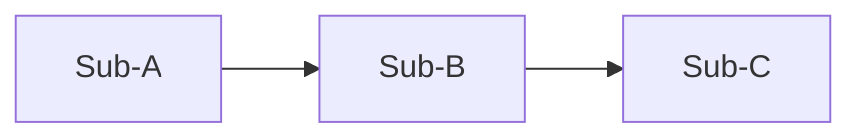

# design.md Section Template

`{workdir}/design.md` is the **design source of truth** produced by this skill: §1.1–1.6 describe the module as a whole (function, interfaces, timing, frequencies, architecture partitioning), and §1.7 points at `manifest.json`, whose `doc` field locates each child's `<child>.md`, where the per-submodule implementation detail lives. All external consumers (RTL implementation / constraint generation / verification derivation / synthesis / power / timing signoff, etc.) read from `design.md` and these child docs.

> **`design.md` self-containment principle**: all critical invariants from brainstorm (RTL formulas / interface timing / numeric parameters / implementation constraints / overlay explicit spec supplement sections) must be inlined verbatim into `design.md`. **By-reference jumps are forbidden** (such as "see brainstorm §sd_clock_divider IO Ports" / "see spec D2" / "refer to brainstorm section sd_controller_wb"). The downstream skill input lists do not literally include `brainstorm.md`; by-reference = information loss, which causes false-fail under cycle-accurate `===` checks. Judged by the spec-review faithfulness lens, not by a deterministic check — no phrasing blacklist can cover the ways a jump can be worded.

> **Single home**: every per-field fact lives in exactly one place — its sidecar. Each §1.x below
> points at its sidecar and carries only the narrative no field can hold: why the boundary is
> what it is, how the children divide the datapath, what is out of scope. Never restate a field
> value in prose or in a second table. Two hand-written homes for one fact diverge, and the
> divergence is invisible until a reader trusts the wrong one. (Brainstorm content is still
> inlined verbatim per the principle above — that is content, not fields.)

## Document Position

| Section range | Responsibility |
|---|---|
| 1.1–1.6 Overview sections | Function, interfaces, timing, frequencies, architecture partitioning. On conflict with brainstorm.md, these sections are the upper-layer authority. |
| 1.7 Submodule Index | A pointer to `manifest.json`, the child registry (`name` / `doc` / `rtl_modules` / `brainstorm_anchor`). The per-submodule implementation detail (FIFO / arbitration / exceptions / state-machine boundaries / register side effects, etc.) lives in the child docs. |
| 2 Document control | Version, revision notes, the corresponding (frozen / approved) brainstorm.md. |

## Rendering Conventions

| Content type | Recommended format | Notes |
|----------|----------|------|
| Architecture diagrams (§1.2 / submodule `<child>.md` bodies / brainstorm D4 candidates) | mermaid code block | GitHub / VSCode preview / mkdocs all render natively; for multiple side-by-side candidates use one code block each. |
| Timing diagrams (§1.5 interface timing / brainstorm D5 scenarios) | Hand-drawn ASCII (preferred) or wavedrom | wavedrom does **not** render on GitHub — if wavedrom is used, attach an ASCII equivalent or export a PNG when reviewing the PR; otherwise stick with ASCII. |

Each timing diagram must be paired with a textual description that **maps one-to-one onto each phase of the waveform** (setup/hold, handshake meaning, typical/boundary cycles, etc.). This convention applies to both `brainstorm.md` and `design.md`.

## Overview Section Template (1.1–1.6)

```markdown
# <module_name> Design Document (design.md)

## 1. Module Overview

### 1.1 Overview
(Module description: role in the system, core problem solved, scope boundaries.)

PPA targets: see `ppa.json` (synthesis / power-analysis bind to that file directly).

### 1.2 Module Structure

The child roster lives in `manifest.json`. Here: the architecture diagram the manifest cannot
hold — dataflow direction, which cut edges carry backpressure, why the partition falls where it
does.



### 1.3 Feature Table

The feature list lives in `features.json` (the spine `check-hints/<child>.json`
`source_feature` values and testpoints refer to). Here: how the features partition the module,
which are out of scope.

### 1.4 Module Interface and Interconnects

#### 1.4.1 Top-Level IO

The port list lives in `top-io.json`. Here: what the boundary is for, which groups exist and
why.

#### 1.4.2 Inter-module Interconnects

The wire list lives in `interconnects.json` (authoritative for every RTL-module-to-RTL-module
cut edge; an N=1 module writes an empty array). Here: how the children divide the datapath.

> **Inter-module Behavior Contract** (required content rule, enforced by the spec-review
> `conformance` lens, NOT a deterministic gate): when a *group* of inter-module wires is governed by
> a contract that **more than one wire / child must jointly agree on** (a shared operating-phase or
> event timeline, a sequencing, a co-assertion or mutual-exclusion among control strobes), that joint
> contract MUST be stated **once** in the `##### 1.4.2.1` companion below, NOT left implicit in one
> child's body (where sibling children and their per-child reviewers cannot see it).
> - A behavior fully captured by a single wire's own entry (a plain valid/ready handshake, a
>   single-clock latency) needs no companion.
> - Form adapts to the module: a phase-sequenced datapath states an ordered operating-phase table;
>   a handshake/arbitration module states the co-assertion / mutual-exclusion rule in prose. A wire's
>   `timing_constraint` and a control bus's `encoding` in `interconnects.json` then reference the
>   names declared in the companion.
> - This pins the *statement* of the contract and the *resolvability* of references to it; the
>   *correctness* of the co-assertions / relative offsets / mutual-exclusion is design judgment
>   (advisory soundness + downstream RTL/sim), not pinned here.

##### 1.4.2.1 Inter-module Behavior Contract

Present **only** when the `interconnects.json` wires share a joint contract (see the Inter-module
Behavior Contract rule above); omit entirely otherwise.

Worked example A — a **phase-sequenced datapath** states an ordered operating-phase timeline;
control buses project onto it (each `encoding` symbol names its canonical phase(s)) and per-wire
`timing_constraint` windows reference these phase names:

| # | Phase | Cycles | Notes (projection / co-assertion / boundary, as applicable) |
|---|-------|--------|-------------------------------------------------------------|
| 1 | LOAD    | 12 (handshake) | ctrl_phase=LOAD |
| 2 | PRELOAD | 2N−1           | ctrl_fabric=PRELOAD |
| … | …       | …              | … |

Worked example B — a **handshake / arbitration** module states the joint contract in prose (no
phase table). E.g. a TX/RX start mux:

> `start_tx_fifo` and `start_rx_fifo` are mutually exclusive (never both high). The master-bus
> outputs route to the TX variables when `start_tx_fifo` is high, to the RX variables when
> `start_rx_fifo` is high, else to `0`. Consumers of the muxed bus rely on this exclusion to decode
> the source.

### 1.5 Interface Timing Scenarios

Subdivide by **interface group**; diagrams may be hand-drawn ASCII (preferred) / wavedrom / tool-exported image (rendering and textual-description requirements per §Rendering Conventions).

#### Example: a configuration-port write transaction (hand-drawn ASCII)

~~~text
        idle      setup/hold region        transaction done      idle
clk      __|‾|_|‾|_|‾|_|‾|_|‾|_|‾|_|‾|_|‾|_|‾|_
cfg_en   _________|‾‾‾‾‾‾‾‾‾‾‾‾‾|_______________
addr     _________<── ADDR ──>_______________
wdata    _________<── WDATA ─>_______________
rdy      _________|‾‾‾‾‾‾‾‾‾‾‾‾‾|_______________   (slave ready)
~~~

**Textual description (must map one-to-one onto each phase above)**
- **idle**: `cfg_en` low; whether ADDR/WDATA matter is defined by the protocol.
- **setup/hold region**: before/after the valid sampling edge, ADDR and WDATA satisfy *T_setup* / *T_hold* relative to `clk`.
- **transaction done**: when `cfg_en` and `rdy` are both high, the slave accepts this write.
- **return to idle**: after the slave drops `rdy`, the bus enters idle, ready for the next transaction.

#### Timing Scenarios Table

One entry per interface timing scenario, next to the waveform it belongs to. Give each a
stable `SC-NNN` id — simulation-plan authors one sequence per id and refers back by it — then
say what is driven, what is observable, and the timing obligation. Prose; the shape is yours.

| ID | Interface / mode | Stimulus | Expected | Timing constraint |
|---|---|---|---|---|
| SC-001 | APB / write | Legal-address write transaction | `pready` high within 1–2 cycles, `pslverr`=0 | ≤2 cycles after `penable` |

### 1.6 Clocks and Frequencies

Clock definitions live in `clocks.json` (the sole numeric + relationship source;
`constraints/<TOP>.{sdc,sgdc}` are generated from it). Here: domain count, CDC posture, reset
scheme, release-ordering constraints.
```

## Submodule Index Template (§1.7)

```markdown
### 1.7 Submodule Index

The child registry is `manifest.json` in this same directory — one entry per child, carrying
`name` / `doc` / `rtl_modules` / `brainstorm_anchor`.
```

Point at the manifest and write nothing else here. Each child's own detail lives in its
`<child>.md`, per `child-design-template.md`.

## Where the rules live

A sidecar's own shape is its `references/*.schema.json`, field by field — read the schema, not a
summary of it; it is enforced wherever a verb reads that file. A relation *between* files is what
no schema can express, and that is `check-crossrefs`. Neither is restated here.

## Document Control

```markdown
## 2. Document Control

| Version | Date | Notes | brainstorm.md |
|------|------|------|---------------------|
| 0.1 | YYYY-MM-DD | Initial draft | approved |
```
