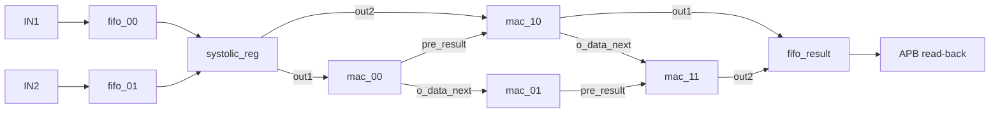
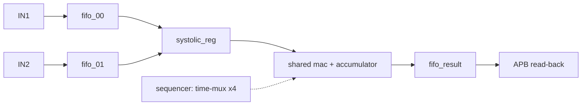

# tpu_top Design Document (design.md)

## 1. Module Overview

### 1.1 Overview

`tpu_top` is a 2×2 systolic-array integer matrix-multiply accelerator. It streams two input vectors through skew registers into a 2×2 array of multiply-accumulate (MAC) cells, with the four weights loaded — and the four results read back — over an embedded APB-style register port. A `start`/counter finite-state sequence drives one matmul pass and raises `done` when the results are available.

- **Role in system:** a self-contained compute block. Upstream agents push data words (`in1`/`in2`) and program weights via APB writes; a downstream agent reads results via APB reads. It serves a host that treats it as a memory-mapped accelerator.
- **Core problem:** compute a 2×2 · 2×2 integer matmul in a weight-stationary systolic array with deterministic, counter-driven timing.
- **Scope boundaries (excluded):** no floating point, no saturation/overflow protection (32-bit arithmetic wraps), no configurable array size (fixed 2×2), no AXI/full-APB protocol compliance (a minimal APB-style register access only), no CDC (single clock).
- **Hard constraints (from the reference design — must be reproduced exactly):** the top-level port list, signal widths, APB address map, and the counter-driven control schedule are fixed by an existing known-good RTL reference and an existing directed testbench that binds to these ports and blocks on `done`.
- **Project phase:** greenfield reproduction of a known-good reference (the generated RTL must be interface- and timing-compatible with that reference).
- **Data width:** 32-bit for data, weight, and accumulator throughout.

**Architecture decision (resource sharing vs. duplication for the MAC array):** the fully-parallel 4-MAC array (Candidate A) is adopted. It uses four physical MAC cells, weight-stationary, with results routed by the counter at `counter ∈ {2,3,4,5}` and `done` at `counter >= 5`. The folded single time-multiplexed MAC (Candidate B) is **rejected**: reusing one MAC across the four products changes the cycle-level result schedule and `done` timing, breaking the existing directed testbench's fixed sequence.

### 1.2 Module Structure

The rejected folded single time-multiplexed MAC alternative (Candidate B) is recorded here for traceability; it is not the adopted structure:

The top module `tpu_top` instantiates four MAC cells, one skew register, and three FIFOs, and implements inline the APB-style register file, the `start`/counter control FSM, the counter-routed result mux, and `done` generation.

| Submodule | RTL Module | Instances | Primary Function |
|---|---|---|---|
| mac | `mac` | `mac_00`, `mac_01`, `mac_10`, `mac_11` | Registered multiply-accumulate cell: `o_result <= (i_data * i_weight) + i_pre_result`; `o_data_next <= i_data`. Forms the 2×2 weight-stationary array. |
| systolic_reg | `systolic_reg` | `systolic_reg` (×1) | Aligns the two input streams for the diagonal wavefront: `out1` = `in1` delayed 1 cycle; `out2` = `in2` delayed 2 cycles. |
| fifo | `fifo` | `fifo_00`, `fifo_01`, `fifo_result` | 8-entry, 32-bit, pointer-based single-clock FIFO; combinational read. Two input FIFOs and one result FIFO. |
| tpu_top | `tpu_top` | top | Integration parent: instantiates all leaves; inline APB-style register file (weight load + result read-back), `start`/counter control FSM, result routing mux, `done` generation. |

### 1.3 Feature Table

The feature list lives in `features.json` (the spine child §5 `SourceFeature` rows and testpoints refer to).

### 1.4 Module Interface and Interconnects

#### 1.4.1 Top-Level IO

Interface groups: `clk_rst`, `data_in`, `ctrl`, `status`, `apb`. Binding contract: signal names, directions, and widths below are fixed and must match exactly — an existing directed testbench binds to these ports.

| Signal | Direction | Width | Clock Domain | Interface Group | Protocol | Role | ResetPolarity | ResetKind |
|--------|-----------|-------|--------------|-----------------|----------|------|---------------|-----------|
| i_clk | input | 1 | i_clk | clk_rst | - | clock | - | - |
| i_rstn | input | 1 | i_clk | clk_rst | - | reset | 0 | async |
| in1 | input | 32 | i_clk | data_in | - | data | - | - |
| in2 | input | 32 | i_clk | data_in | - | data | - | - |
| in1_en | input | 1 | i_clk | data_in | - | data | - | - |
| in2_en | input | 1 | i_clk | data_in | - | data | - | - |
| start | input | 1 | i_clk | ctrl | - | data | - | - |
| o_full | output | 3 | i_clk | status | - | data | - | - |
| o_empty | output | 3 | i_clk | status | - | data | - | - |
| done | output | 1 | i_clk | status | - | data | - | - |
| i_paddr | input | 32 | i_clk | apb | APB-style | data | - | - |
| i_psel | input | 1 | i_clk | apb | APB-style | data | - | - |
| i_pwrite | input | 1 | i_clk | apb | APB-style | data | - | - |
| i_pwdata | input | 32 | i_clk | apb | APB-style | data | - | - |
| i_penable | input | 1 | i_clk | apb | APB-style | data | - | - |
| o_prdata | output | 32 | i_clk | apb | APB-style | data | - | - |
| counter | output | 4 | i_clk | ctrl | - | data | - | - |

Notes on specific ports:
- `i_rstn`: asynchronous active-low reset (`negedge i_rstn`); applies to the MAC cells, skew registers, FIFOs, and the counter. The APB write/register-file block is clocked-only with no reset.
- `in1` / `in2`: 32-bit input data streams into `fifo_00` / `fifo_01` respectively.
- `in1_en` / `in2_en`: write enables for `fifo_00` / `fifo_01`.
- `o_full` / `o_empty`: 3-bit, ordering `{fifo_result, fifo_01, fifo_00}` = `[2],[1],[0]`.
- `done`: high when `counter >= 5`.
- `o_prdata`: APB read data — result FIFO `o_data` on read, else 0.
- `counter`: 4-bit exposed counter; the testbench leaves it unconnected.

#### 1.4.2 Inter-module Interconnects

Authoritative RTL-module-to-RTL-module wire table. Children: `fifo` (×3: `fifo_00`, `fifo_01`, `fifo_result`), `systolic_reg` (×1), `mac` (×4: `mac_00`, `mac_01`, `mac_10`, `mac_11`). All other logic (APB register file, counter FSM, result routing, `done`) is inline in the `tpu_top` parent. Each cross-module wire is declared once here. `mac_01.o_data_next` and `mac_11.o_data_next` are intentionally unconnected.

| Wire | Producer (RTL module) | Consumer (RTL module) | Protocol | Timing Constraint | Notes |
|------|-----------------------|-----------------------|----------|-------------------|-------|
| systolic_in1 | fifo | systolic_reg | combinational | same-cycle (i_clk) | `fifo_00.o_data` → `systolic_reg.in1`; input stream 1 |
| systolic_in2 | fifo | systolic_reg | combinational | same-cycle (i_clk) | `fifo_01.o_data` → `systolic_reg.in2`; input stream 2 |
| fifo_en | tpu_top | fifo | combinational | same-cycle (i_clk) | tpu_top (parent FSM) → `fifo_00.i_rd`, `fifo_01.i_rd`; `start & counter<2` |
| mac00_in | systolic_reg | mac | registered | i_clk | `systolic_reg.out1` → `mac_00.i_data`; in1 skew (1 cyc) |
| mac10_in | systolic_reg | mac | registered | i_clk | `systolic_reg.out2` → `mac_10.i_data`; in2 skew (2 cyc) |
| mac01_in | mac | mac | registered | i_clk | `mac_00.o_data_next` → `mac_01.i_data`; data forward (row 0) |
| mac11_in | mac | mac | registered | i_clk | `mac_10.o_data_next` → `mac_11.i_data`; data forward (row 1) |
| mem[0] | tpu_top | mac | registered | i_clk | tpu_top (parent regfile) → `mac_00.i_weight`; weight `W00` |
| mem[1] | tpu_top | mac | registered | i_clk | tpu_top (parent regfile) → `mac_01.i_weight`; weight `W01` |
| mem[2] | tpu_top | mac | registered | i_clk | tpu_top (parent regfile) → `mac_10.i_weight`; weight `W10` |
| mem[3] | tpu_top | mac | registered | i_clk | tpu_top (parent regfile) → `mac_11.i_weight`; weight `W11` |
| 32'h0 | const | mac | const | static | const → `mac_00.i_pre_result`, `mac_01.i_pre_result`; top-row partial-sum seed |
| mac00_out | mac | mac | registered | i_clk | `mac_00.o_result` → `mac_10.i_pre_result`; partial sum (col 0) |
| mac01_out | mac | mac | registered | i_clk | `mac_01.o_result` → `mac_11.i_pre_result`; partial sum (col 1) |
| out1 | mac | tpu_top | registered | i_clk | `mac_10.o_result` → tpu_top (parent result mux); result word A |
| out2 | mac | tpu_top | registered | i_clk | `mac_11.o_result` → tpu_top (parent result mux); result word B |
| result_fifo_i_data | tpu_top | fifo | combinational | same-cycle (i_clk) | tpu_top (parent result mux) → `fifo_result.i_data`; counter-routed |
| result_fifo_o_data | fifo | tpu_top | combinational | same-cycle (i_clk) | `fifo_result.o_data` → tpu_top (parent APB read mux); → `o_prdata` |

### 1.5 Interface Timing Scenarios

All scenarios use the single-clock, counter-driven schedule of F-05. Pass-level timeline of one compute pass: assert `start`; `counter` advances `1→2→3→4→5`; input FIFOs pop while `counter < 2`; results are pushed at `counter ∈ {2,3,4,5}` (`out1` at 2/4, `out2` at 3/5); `done` asserts at `counter >= 5`.

#### Compute-pass timeline (hand-drawn ASCII)

~~~text
cycle           |  c0  |  c1  |  c2  |  c3  |  c4  |  c5  |
i_clk            _|‾|_|‾|_|‾|_|‾|_|‾|_|‾|_|‾|_|‾|_|‾|_|‾|_
start            _|‾‾‾‾‾‾‾‾‾‾‾‾‾‾‾‾‾‾‾‾‾‾‾‾‾‾‾‾‾‾‾‾‾‾‾‾‾‾‾
counter          < 0  >< 1  >< 2  >< 3  >< 4  >< 5  >
fifo_en          _|‾‾‾‾‾‾‾‾‾‾‾‾|________________________   (start & counter<2)
result_fifo_wr   ____________|‾‾‾‾‾‾‾‾‾‾‾‾‾‾‾‾‾‾‾‾‾‾‾‾‾|   (counter in {2,3,4,5})
result route     ............< out1 >< out2 >< out1 >< out2 >  (2->out1,3->out2,4->out1,5->out2)
done             ________________________________|‾‾‾‾‾   (counter >= 5)
~~~

**Textual description (maps one-to-one onto each phase above):**
- **c0 (counter = 0):** `start` is asserted; `counter` begins at 0. `fifo_en = start & (counter < 2)` is high, so both input FIFOs (`fifo_00`, `fifo_01`) pop an element (`i_rd` high). No result write yet, `done` low.
- **c1 (counter = 1):** `counter < 2` still holds, so `fifo_en` stays high — second element popped from each input FIFO. `done` low.
- **c2 (counter = 2):** `fifo_en` drops (`counter < 2` false). `result_fifo_wr` asserts (`counter ∈ {2,3,4,5}`); `result_fifo_i_data = out1` (`= mac_10.o_result`) since `counter ∈ {2,4}`. `done` low.
- **c3 (counter = 3):** `result_fifo_wr` high; `result_fifo_i_data = out2` (`= mac_11.o_result`) since `counter ∈ {3,5}`. `done` low.
- **c4 (counter = 4):** `result_fifo_wr` high; `result_fifo_i_data = out1` (`counter ∈ {2,4}`). `done` low.
- **c5 (counter = 5):** `result_fifo_wr` high; `result_fifo_i_data = out2` (`counter ∈ {3,5}`). **`done = (counter >= 5)`** asserts. Four result words now reside in `fifo_result` for APB read-back.
- **return to idle:** deasserting `start` resets `counter` to 0 (`done` drops); the host issues four APB reads (`read_enb = i_psel & i_penable & !i_pwrite`), each returning `fifo_result.o_data` on `o_prdata` and advancing the result-FIFO read pointer.

#### Timing Scenarios Table

The scenario rows live in `timing-scenarios.json`; the waveform above and its phase-by-phase
description are the part that cannot be tabulated, and stay here.

### 1.6 Clocks and Frequencies

Clock definitions live in `clocks.json` (the sole numeric + relationship source; `constraints/tpu_top.{sdc,sgdc}` are generated from it).

Single clock domain; no CDC. Reset `i_rstn` is asynchronous, active-low (`negedge i_rstn`), applied to the MAC cells, skew registers, FIFOs, and the counter; the APB write/register-file block is clocked-only with no reset. Single reset, no release-ordering constraints.

### 1.7 Submodule Index

See `manifest.json` for the authoritative child registry. This table lists child names + brainstorm anchors as a quick reference (concrete content lives in per-child `<child>.md` files).

| child name | doc | brainstorm_anchor | role |
|------------|-----|-------------------|------|
| mac | `mac.md` | lines 44-57 | Registered MAC cell: `o_result <= (i_data * i_weight) + i_pre_result`, `o_data_next <= i_data`; instantiated 4× (`mac_00`/`mac_01`/`mac_10`/`mac_11`). |
| systolic_reg | `systolic_reg.md` | lines 59-64 | Skew aligner: `out1` = `in1` delayed 1 cycle (`delay10`); `out2` = `in2` delayed 2 cycles (`delay20`→`delay21`). |
| fifo | `fifo.md` | lines 66-80 | 8-entry 32-bit pointer-based single-clock FIFO, combinational read; instantiated 3× (`fifo_00`/`fifo_01`/`fifo_result`). |
| tpu_top | `tpu_top.md` | lines 82-160 | Top integration: instantiates all leaves; inline APB-style register file, `start`/counter FSM, result routing mux, `done` generation. |

## 2. Document Control

| Version | Date | Notes | brainstorm.md |
|------|------|------|---------------------|
| 0.1 | 2026-06-17 | Initial draft (overview §1.1–1.7 index + manifest; per-child detail authored in wave 2). | approved |
